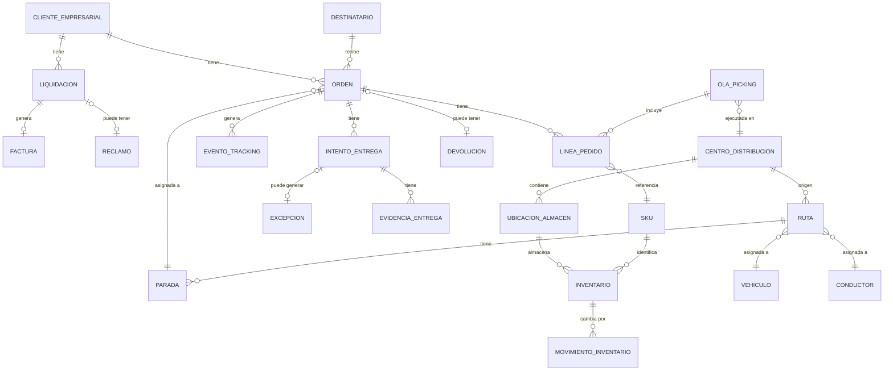

# Modelo Conceptual de Datos
## RutaExpress Fulfillment & Transporte

> **Para el comité de arquitectura** — Define **entidades de negocio** y relaciones del modelo conceptual. **Mensaje clave:** el diagrama ER agrupa comercial, almacén, transporte y finanzas alrededor de **Orden / Pedido** como entidad central del ciclo logístico.

---

## 1. Propósito

Identificar las entidades principales de datos del negocio logístico de RutaExpress y las relaciones entre ellas. Este modelo es la base para la arquitectura de datos en las fases C y D del ADM.

---

## 2. Entidades Principales y Atributos Clave

### CLIENTE EMPRESARIAL
Empresa que contrata los servicios logísticos de RutaExpress.
- ID Cliente, Nombre, RUC, Sector, Canal de integración (API/Portal/CSV)
- SLA contractual, Tarifario, Reglas de penalidad
- Contacto técnico, Contacto comercial

### DESTINATARIO
Persona natural o empresa que recibe el pedido.
- ID Destinatario, Nombre, Teléfono, Email
- Dirección validada, Coordenadas GPS, Referencias
- Historial de entregas exitosas/fallidas

### ORDEN / PEDIDO
Solicitud de entrega de uno o más productos.
- ID Orden (interno), ID Externo cliente, Fecha/Hora recepción
- Estado (recibido/validado/reservado/pickeado/despachado/en ruta/entregado/fallido/devuelto/liquidado)
- Canal de entrada, Prioridad, SLA prometido, Ventana horaria
- Tipo de servicio (estándar/express/refrigerado/alto valor)

### LÍNEA DE PEDIDO
Detalle de cada producto dentro de una orden.
- ID Línea, ID Orden, SKU, Cantidad, Peso, Volumen
- Lote, Vencimiento (para farmacéuticos/alimentos)
- Requiere control de temperatura, Requiere custodia

### SKU (Producto)
Referencia de producto en el catálogo logístico.
- ID SKU, Código cliente, Descripción, Categoría
- Peso, Dimensiones, Temperatura requerida
- Es peligroso, Es refrigerado, Es alto valor

### CENTRO DE DISTRIBUCIÓN
Almacén desde donde se preparan y despachan pedidos.
- ID Centro, Nombre, Dirección, Capacidad total
- Zonas de almacenamiento, Temperatura (seco/frío)
- WMS asociado (**APP-06** / **APP-07**), Región de cobertura

### UBICACIÓN DE ALMACÉN
Posición física de un ítem dentro del centro de distribución.
- ID Ubicación, Centro, Pasillo, Nivel, Posición
- Tipo (picking/reserva/cuarentena), Capacidad

### INVENTARIO
Stock disponible de un SKU en una ubicación.
- ID Inventario, SKU, Ubicación, Centro
- Cantidad disponible, Cantidad reservada, Cantidad en tránsito
- Lote, Vencimiento, Fecha último movimiento

### MOVIMIENTO DE INVENTARIO
Registro de cada cambio en el inventario.
- ID Movimiento, Tipo (entrada/salida/ajuste/picking/devolución)
- SKU, Cantidad, Origen, Destino, Fecha/Hora
- Usuario, Motivo, ID Orden asociada

### OLA DE PICKING
Agrupación de líneas de pedido para ejecutar en el almacén.
- ID Ola, Centro, Fecha planificada, Estado
- Criterio de agrupación, Picker asignado
- Líneas incluidas, Tiempo estimado

### VEHÍCULO
Unidad de transporte propia o tercerizada.
- ID Vehículo, Placa, Tipo (furgón/camión/moto/refrigerado)
- Capacidad kg/m³, Propio o tercerizado
- Estado (disponible/en ruta/mantenimiento)
- Dispositivo GPS asociado

### CONDUCTOR
Persona que opera el vehículo en la ruta.
- ID Conductor, Nombre, DNI, Licencia
- Vehículo asignado, Zona de operación
- Dispositivo móvil, Estado (activo/inactivo)

### RUTA
Plan de entregas asignado a un vehículo y conductor.
- ID Ruta, Fecha, Centro de distribución origen
- Vehículo, Conductor, Estado (planificada/en curso/cerrada)
- Secuencia de paradas, Distancia estimada, Tiempo estimado
- Modificada manualmente (sí/no), Motivo de modificación

### PARADA / ENTREGA
Punto específico en la ruta donde se realiza una entrega.
- ID Parada, Ruta, Orden, Destinatario
- Secuencia, Dirección, Coordenadas
- Ventana horaria prometida, Estado
- Hora llegada real, Hora entrega real

### EVENTO DE TRACKING
Registro de cada cambio de estado en el ciclo de vida del pedido.
- ID Evento, ID Orden, Tipo de evento
- Timestamp, Fuente (app/TMS/WMS/portal)
- Latitud, Longitud, Usuario/Sistema
- Sincronizado (sí/no), En orden (sí/no)

### EVIDENCIA DE ENTREGA
Prueba digital de la entrega o intento.
- ID Evidencia, ID Parada, Tipo (foto/firma/código QR)
- URL almacenamiento (**APP-16** S3), Timestamp captura
- Hash de integridad, GPS captura, Sincronizado

### EXCEPCIÓN
Registro de una entrega fallida o incidencia.
- ID Excepción, ID Parada, Tipo normalizado
- Motivo (taxonomía controlada), Descripción adicional
- Requiere reintento, Requiere devolución
- Costo estimado del reintento

### INTENTO DE ENTREGA
Cada intento (exitoso o fallido) de entregar un pedido.
- ID Intento, Orden, Número de intento
- Fecha/Hora, Resultado (exitoso/fallido)
- Motivo de fallo, Conductor, Evidencias

### DEVOLUCIÓN
Pedido que regresa al centro de distribución.
- ID Devolución, Orden, Motivo
- Fecha inicio, Fecha llegada a almacén
- Estado (en tránsito/recibida/en proceso/finalizada)
- SKUs devueltos, Estado del producto

### LIQUIDACIÓN
Cierre económico de los servicios prestados a un cliente.
- ID Liquidación, Cliente, Período
- Total entregas exitosas, Total fallidas, Total devueltas
- Monto base, Penalidades aplicadas, Bonificaciones
- Estado (borrador/observada/aprobada/facturada)

### FACTURA
Documento de cobro por servicios logísticos.
- ID Factura, Liquidación, Cliente
- Fecha emisión, Monto total, Estado
- Referencia ERP, Observaciones cliente

### RECLAMO
Disputa del cliente sobre una liquidación o entrega.
- ID Reclamo, Cliente, Tipo (entrega/facturación/SLA)
- Monto en disputa, Estado, Fecha apertura
- Evidencias aportadas, Resolución

---

## 3. Diagrama de Relaciones

Modelo conceptual entre entidades de negocio. Fuente editable: [`diagrams/modelo-datos-er.mmd`](../diagrams/modelo-datos-er.mmd). Exportar a PNG con `npm run diagrams:modelo-er`; diagramas de comité en **draw.io**.

Ver / editar diagrama Mermaid (ER)

**Cómo leer el diagrama ER**

El diagrama se organiza en **cuatro bloques** conectados por **Orden / Pedido** en el centro. Siga este recorrido al presentarlo al comité:

| Bloque | Entidades del diagrama | Qué representa en la operación |
|---|---|---|
| **Comercial** | Cliente Empresarial, Destinatario, Orden, Línea de Pedido, SKU | Quién encarga, quién recibe y qué productos van en cada pedido |
| **Almacén** | Centro de Distribución, Ubicación de Almacén, Inventario, Movimiento de Inventario, Ola de Picking | Dónde se guarda el stock, cómo se mueve y cómo se agrupa el picking |
| **Transporte** | Ruta, Parada, Vehículo, Conductor, Intento de Entrega, Evidencia de Entrega, Excepción, Evento de Tracking | Plan de reparto en campo, prueba de entrega y registro de incidencias |
| **Finanzas** | Liquidación, Factura, Reclamo, Devolución | Cierre económico del servicio, cobro al cliente y disputas |

**Cardinalidades clave (símbolos del ER):**

| Relación | Significado operativo |
|---|---|
| Cliente Empresarial **1 → N** Orden | Un cliente B2B genera muchos pedidos |
| Orden **1 → N** Línea de Pedido **N → 1** SKU | Cada pedido tiene varias líneas; cada línea apunta a un producto del catálogo |
| Orden **1 → N** Evento de Tracking | Cada cambio de estado del pedido deja un evento trazable |
| Centro **1 → N** Ruta **1 → N** Parada **N → 1** Orden | Una ruta sale de un CD, visita varias paradas; cada parada atiende un pedido |
| Intento **1 → N** Evidencia | Un intento de entrega puede tener foto, firma y otros comprobantes |
| Cliente **1 → N** Liquidación **1 → 1** Factura | Por período se liquida y se emite una factura |
| Orden **0 → 1** Devolución | Solo algunos pedidos regresan al almacén |

> **draw.io (comité):** recrear el ER con estos cuatro bloques y colores por dominio; no duplicar atributos del §2 — solo entidades y cardinalidades.

---

## 4. Volúmenes de Datos Referencia

| Entidad | Volumen Diario (Normal) | Volumen Diario (Campaña) |
|---|---|---|
| Órdenes nuevas | 68,000 | 180,000 |
| Líneas de pedido | ~200,000 | ~540,000 |
| Movimientos de inventario | 210,000 | ~600,000 |
| Eventos de tracking | 44,000 | 130,000+ |
| Intentos de entrega | 68,000 | 180,000 |
| Excepciones | ~8,500 | ~22,500 |
| Rutas generadas | 2,700 | 4,100 |

---

*Documento elaborado en el marco del Proyecto Integrador Final - Arquitectura de Soluciones Multinube - UTEC*
*Fecha: Junio 2026*
