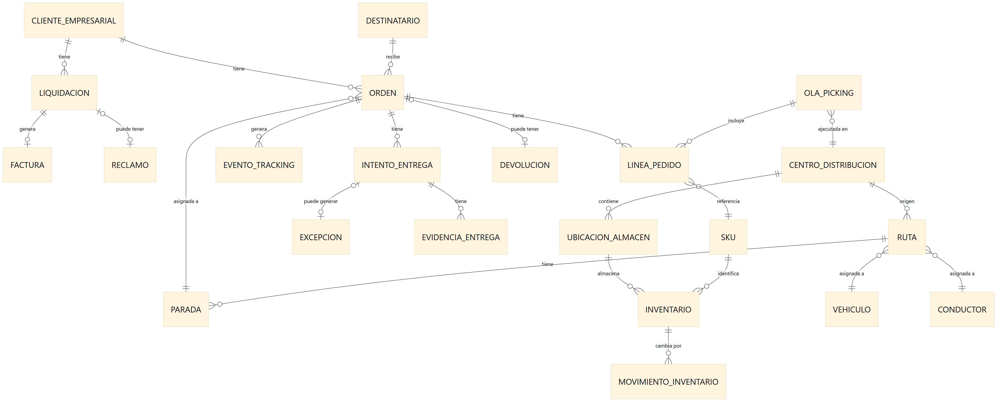
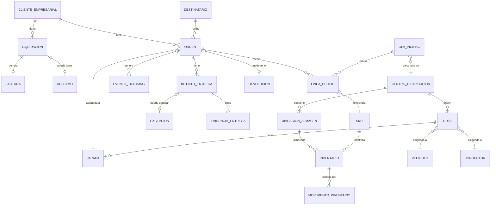
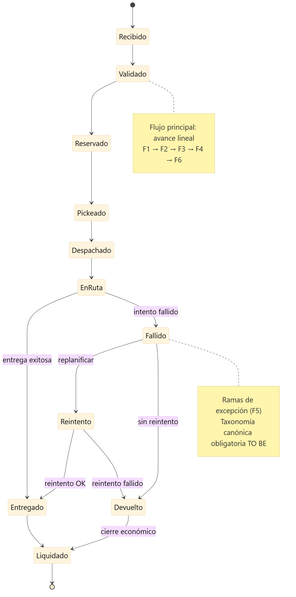
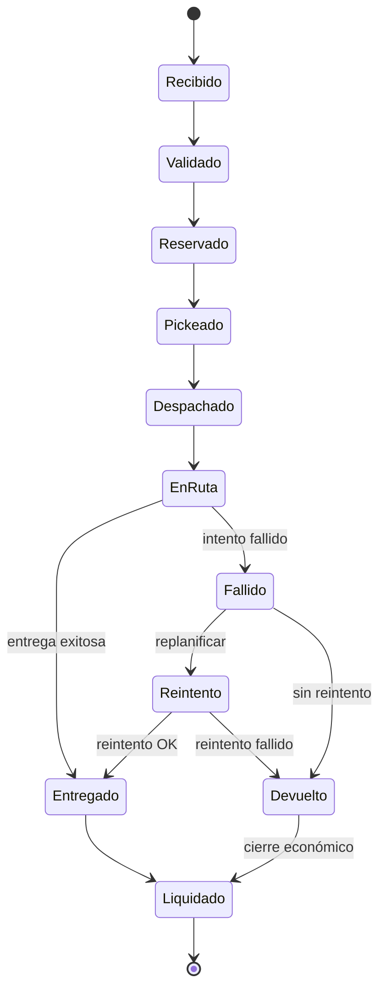

# Modelo Conceptual de Datos
## RutaExpress Fulfillment & Transporte

> **Para el comité de arquitectura** — Define **entidades de negocio**, relaciones y **sistemas maestros (SSOT)** AS IS vs TO BE. **Mensaje clave:** hoy el inventario y los estados tienen múltiples fuentes (**APP-06**, **APP-07**, **APP-25**); el modelo canónico de estados debe ser adoptado por **APP-06**, **APP-11**, **APP-15**, **APP-03**, **APP-18** y **APP-25** vía **PLT-03**.

---

## 1. Propósito

Identificar las entidades principales de datos del negocio logístico de RutaExpress y las relaciones entre ellas. Este modelo es la base para definir la arquitectura de datos, el modelo canónico y la estrategia de Single Source of Truth.

---

## 2. Entidades Principales y Atributos Clave

### CLIENTE EMPRESARIAL
Empresa que contrata los servicios logísticos de RutaExpress.
- ID Cliente, Nombre, RUC, Sector, Canal de integración (API/Portal/CSV)
- SLA contractual, Tarifario, Reglas de penalidad
- Contacto técnico, Contacto comercial

### DESTINATARIO
Persona natural o empresa que recibe el pedido.
- ID Destinatario, Nombre, Teléfono, Email
- Dirección validada, Coordenadas GPS, Referencias
- Historial de entregas exitosas/fallidas

### ORDEN / PEDIDO
Solicitud de entrega de uno o más productos.
- ID Orden (interno), ID Externo cliente, Fecha/Hora recepción
- Estado (recibido/validado/reservado/pickeado/despachado/en ruta/entregado/fallido/devuelto/liquidado)
- Canal de entrada, Prioridad, SLA prometido, Ventana horaria
- Tipo de servicio (estándar/express/refrigerado/alto valor)

### LÍNEA DE PEDIDO
Detalle de cada producto dentro de una orden.
- ID Línea, ID Orden, SKU, Cantidad, Peso, Volumen
- Lote, Vencimiento (para farmacéuticos/alimentos)
- Requiere control de temperatura, Requiere custodia

### SKU (Producto)
Referencia de producto en el catálogo logístico.
- ID SKU, Código cliente, Descripción, Categoría
- Peso, Dimensiones, Temperatura requerida
- Es peligroso, Es refrigerado, Es alto valor

### CENTRO DE DISTRIBUCIÓN
Almacén desde donde se preparan y despachan pedidos.
- ID Centro, Nombre, Dirección, Capacidad total
- Zonas de almacenamiento, Temperatura (seco/frío)
- WMS asociado (**APP-06** / **APP-07**), Región de cobertura

### UBICACIÓN DE ALMACÉN
Posición física de un ítem dentro del centro de distribución.
- ID Ubicación, Centro, Pasillo, Nivel, Posición
- Tipo (picking/reserva/cuarentena), Capacidad

### INVENTARIO
Stock disponible de un SKU en una ubicación.
- ID Inventario, SKU, Ubicación, Centro
- Cantidad disponible, Cantidad reservada, Cantidad en tránsito
- Lote, Vencimiento, Fecha último movimiento

### MOVIMIENTO DE INVENTARIO
Registro de cada cambio en el inventario.
- ID Movimiento, Tipo (entrada/salida/ajuste/picking/devolución)
- SKU, Cantidad, Origen, Destino, Fecha/Hora
- Usuario, Motivo, ID Orden asociada

### OLA DE PICKING
Agrupación de líneas de pedido para ejecutar en el almacén.
- ID Ola, Centro, Fecha planificada, Estado
- Criterio de agrupación, Picker asignado
- Líneas incluidas, Tiempo estimado

### VEHÍCULO
Unidad de transporte propia o tercerizada.
- ID Vehículo, Placa, Tipo (furgón/camión/moto/refrigerado)
- Capacidad kg/m³, Propio o tercerizado
- Estado (disponible/en ruta/mantenimiento)
- Dispositivo GPS asociado

### CONDUCTOR
Persona que opera el vehículo en la ruta.
- ID Conductor, Nombre, DNI, Licencia
- Vehículo asignado, Zona de operación
- Dispositivo móvil, Estado (activo/inactivo)

### RUTA
Plan de entregas asignado a un vehículo y conductor.
- ID Ruta, Fecha, Centro de distribución origen
- Vehículo, Conductor, Estado (planificada/en curso/cerrada)
- Secuencia de paradas, Distancia estimada, Tiempo estimado
- Modificada manualmente (sí/no), Motivo de modificación

### PARADA / ENTREGA
Punto específico en la ruta donde se realiza una entrega.
- ID Parada, Ruta, Orden, Destinatario
- Secuencia, Dirección, Coordenadas
- Ventana horaria prometida, Estado
- Hora llegada real, Hora entrega real

### EVENTO DE TRACKING
Registro de cada cambio de estado en el ciclo de vida del pedido.
- ID Evento, ID Orden, Tipo de evento
- Timestamp, Fuente (app/TMS/WMS/portal)
- Latitud, Longitud, Usuario/Sistema
- Sincronizado (sí/no), En orden (sí/no)

### EVIDENCIA DE ENTREGA
Prueba digital de la entrega o intento.
- ID Evidencia, ID Parada, Tipo (foto/firma/código QR)
- URL almacenamiento (**APP-16** S3), Timestamp captura
- Hash de integridad, GPS captura, Sincronizado

### EXCEPCIÓN
Registro de una entrega fallida o incidencia.
- ID Excepción, ID Parada, Tipo normalizado
- Motivo (taxonomía controlada), Descripción adicional
- Requiere reintento, Requiere devolución
- Costo estimado del reintento

### INTENTO DE ENTREGA
Cada intento (exitoso o fallido) de entregar un pedido.
- ID Intento, Orden, Número de intento
- Fecha/Hora, Resultado (exitoso/fallido)
- Motivo de fallo, Conductor, Evidencias

### DEVOLUCIÓN
Pedido que regresa al centro de distribución.
- ID Devolución, Orden, Motivo
- Fecha inicio, Fecha llegada a almacén
- Estado (en tránsito/recibida/en proceso/finalizada)
- SKUs devueltos, Estado del producto

### LIQUIDACIÓN
Cierre económico de los servicios prestados a un cliente.
- ID Liquidación, Cliente, Período
- Total entregas exitosas, Total fallidas, Total devueltas
- Monto base, Penalidades aplicadas, Bonificaciones
- Estado (borrador/observada/aprobada/facturada)

### FACTURA
Documento de cobro por servicios logísticos.
- ID Factura, Liquidación, Cliente
- Fecha emisión, Monto total, Estado
- Referencia ERP, Observaciones cliente

### RECLAMO
Disputa del cliente sobre una liquidación o entrega.
- ID Reclamo, Cliente, Tipo (entrega/facturación/SLA)
- Monto en disputa, Estado, Fecha apertura
- Evidencias aportadas, Resolución

---

## 3. Diagrama de Relaciones

Modelo conceptual entre entidades de negocio. Fuente editable: [`diagrams/modelo-datos-er.mmd`](../diagrams/modelo-datos-er.mmd). Exportar a draw.io o PNG con `npm run diagrams:modelo-er`.

Ver / editar diagrama Mermaid (ER)

**Agrupación lógica (lectura del diagrama):**

| Dominio | Entidades centrales | Relación clave |
|---|---|---|
| Comercial | Cliente Empresarial, Orden, Línea de Pedido, SKU | Cliente → muchas órdenes → líneas → SKU |
| Almacén | Centro de Distribución, Ubicación, Inventario, Ola de Picking | Inventario por ubicación; ola agrupa líneas |
| Transporte | Ruta, Parada, Vehículo, Conductor, Intento, Evidencia | Orden asignada a parada dentro de ruta |
| Finanzas | Liquidación, Factura, Reclamo | Cliente → liquidación → factura; reclamo opcional |

> **draw.io (PPT / comité):** recrear como diagrama ER visual usando esta estructura; no duplicar atributos — solo entidades y cardinalidades.

---

## 4. Dominios de Datos y Sistema Maestro (Single Source of Truth)

| Entidad | Sistema Maestro (AS IS) | Sistema Maestro (TO BE) |
|---|---|---|
| Orden / Pedido | **APP-02** Orquestador de Pedidos (Azure AKS) | Servicio de Gestión de Pedidos (Azure) |
| SKU / Producto | **APP-06** WMS Principal (On Premises) | Catálogo de Productos (API centralizada) |
| Inventario | **APP-06** WMS Principal | WMS Cloud + Event Store (**PLT-03**) |
| Ruta | **APP-11** TMS (Azure) | **APP-11** TMS (Azure) |
| Evento de Tracking | DynamoDB (**APP-15** backend) | Event Store unificado (**PLT-03** / Kinesis) |
| Evidencia de Entrega | **APP-16** Almacenamiento Evidencias (S3) | **APP-16** S3 — con hash de integridad |
| Excepción | **APP-15** App de Conductores + **APP-11** TMS | Servicio de Excepciones (normalizado) |
| Liquidación / Factura | **APP-25** ERP Financiero (On Premises) | **APP-25** ERP (integrado) + Servicio Liquidación (reemplaza **APP-26**) |
| Cliente Empresarial | **APP-18** Portal B2B (Trazabilidad) | Portal B2B unificado + **APP-20** CRM |
| Destinatario | Distribuido (**APP-06**+**APP-11**+**APP-15**) | Servicio de Destinatarios (centralizado) |

---

## 5. Modelo Canónico de Estados de Pedido

Estados únicos que debe compartir todo el ecosistema vía Event Store (PLT-03) en TO BE. Fuente editable: [`diagrams/modelo-estados-pedido.mmd`](../diagrams/modelo-estados-pedido.mmd). Exportar PNG: `npm run diagrams:modelo-estados`.

Ver / editar diagrama Mermaid (estados)

### Catálogo de estados

| # | Estado | Fase cadena | Descripción breve |
|---|---|---|---|
| 1 | **Recibido** | F1 | Orden ingresada por API, portal o archivo |
| 2 | **Validado** | F1 | Dirección, SKU y deduplicación OK |
| 3 | **Reservado** | F1–F2 | Inventario reservado en WMS |
| 4 | **Pickeado** | F2 | Preparación completada en almacén |
| 5 | **Despachado** | F3 | Salida de CD; manifiesto cerrado |
| 6 | **En ruta** | F4 | Conductor en camino |
| 7 | **Entregado** | F4 | Entrega exitosa con evidencia |
| 8 | **Fallido** | F5 | Intento sin entrega (excepción) |
| 9 | **Reintento** | F5 | Nueva ventana planificada |
| 10 | **Devuelto** | F5–F6 | Pedido retorna a almacén |
| 11 | **Liquidado** | F6 | Cierre económico y facturación |

### Reglas de transición

- **Flujo principal (feliz):** Recibido → Validado → Reservado → Pickeado → Despachado → En ruta → Entregado → Liquidado.
- **Excepciones (F5):** desde *En ruta* puede ir a *Fallido*; luego *Reintento* o *Devuelto*.
- **No retroceso** en el flujo principal (ej. no pasar de *Pickeado* a *Recibido*), salvo correcciones operativas auditadas en devolución.
- **Adoptores TO BE:** WMS Cloud (APP-06/07), TMS (APP-11), App de Conductores (APP-15), portales B2B (APP-03, APP-18) y ERP (APP-25) publican y consumen estos estados vía Bus de Eventos (PLT-03).

> **draw.io (PPT):** usar este diagrama de estados como slide D6; colores sugeridos — verde flujo feliz, ámbar excepciones, gris *Liquidado*.

---

## 6. Volúmenes de Datos Referencia

| Entidad | Volumen Diario (Normal) | Volumen Diario (Campaña) |
|---|---|---|
| Órdenes nuevas | 68,000 | 180,000 |
| Líneas de pedido | ~200,000 | ~540,000 |
| Movimientos de inventario | 210,000 | ~600,000 |
| Eventos de tracking | 44,000 | 130,000+ |
| Intentos de entrega | 68,000 | 180,000 |
| Excepciones | ~8,500 | ~22,500 |
| Rutas generadas | 2,700 | 4,100 |

---

*Documento elaborado en el marco del Proyecto Integrador Final - Arquitectura de Soluciones Multinube - UTEC*
*Fecha: Junio 2026*
