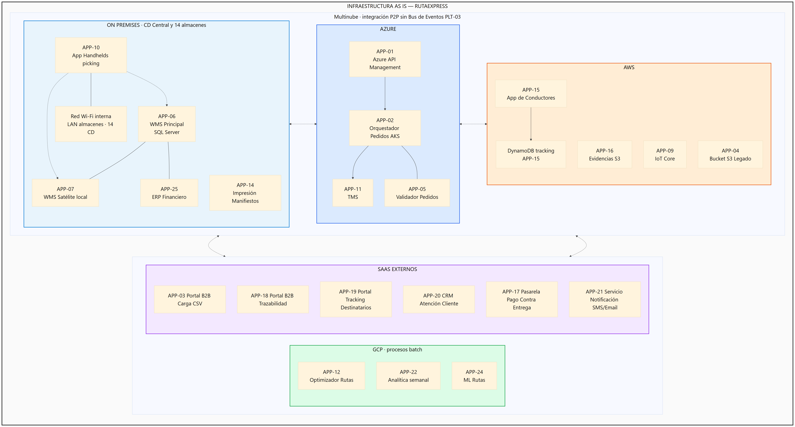
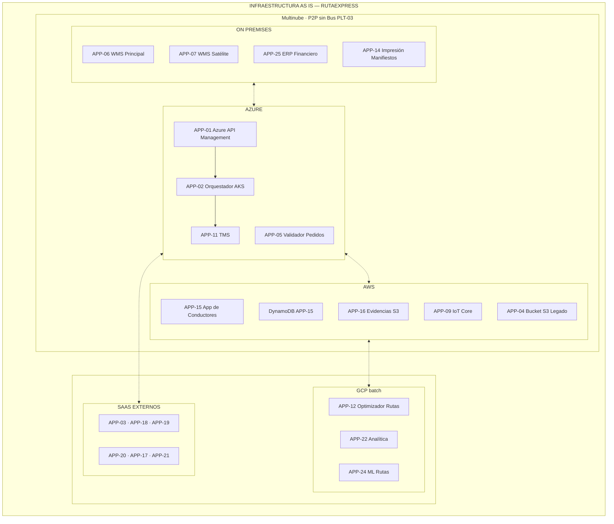
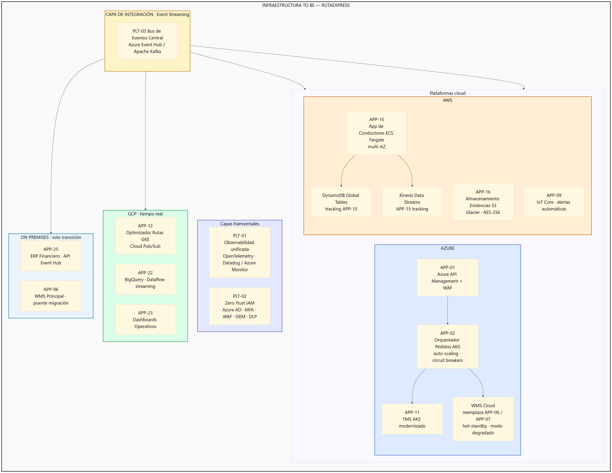
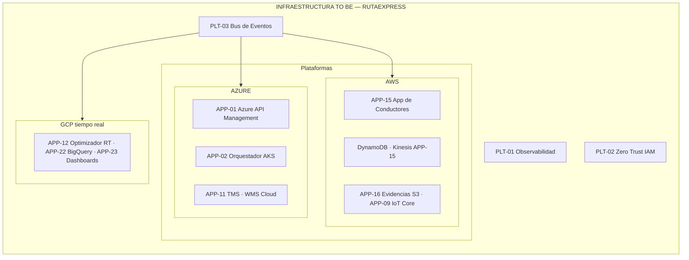

# Mapa de Infraestructura
## RutaExpress Fulfillment & Transporte

> **Para el comité de arquitectura** — Topología **multinube** AS IS y TO BE en un recuadro único (On Premises, Azure, AWS, GCP, SaaS). **Mensaje clave:** hoy las integraciones son P2P sin **PLT-03**; TO BE centraliza el bus de eventos y despliega **PLT-01** Observabilidad y **PLT-02** Zero Trust como capas transversales.

---

## 1. Propósito

Documentar la infraestructura tecnológica actual (AS IS) y objetivo (TO BE) de RutaExpress, mostrando la topología de nubes, centros de datos y redes que soportan la operación logística.

---

## 2. Infraestructura AS IS

### 2.1 Descripción General

RutaExpress opera en una arquitectura multinube real pero sin estrategia unificada. Cada sistema fue adoptando la plataforma que le convenía en su momento, generando una topología fragmentada con integraciones punto a punto y sin visibilidad centralizada.

> **Diagramas:** un recuadro único con todas las nubes. **PNG en alta resolución** (texto legible) + fuente Mermaid editable.
>
> Regenerar imágenes (requiere [Node.js](https://nodejs.org)): en la raíz del proyecto ejecutar `npm install` y luego `npm run diagrams`. Usa [@mermaid-js/mermaid-cli](https://github.com/mermaid-js/mermaid-cli) (`mmdc`) — un recuadro grande con todas las nubes, exportado a PNG 4200px (escala ×2).

*Figura 2.1 — AS IS. Fuente: [`diagrams/infra-as-is.mmd`](../diagrams/infra-as-is.mmd). Líneas punteadas = P2P sin Bus PLT-03.*

Ver / editar diagrama Mermaid (vista previa Markdown)

**Brechas AS IS (TO BE):** PLT-03 Bus de Eventos · PLT-01 Observabilidad unificada · PLT-02 IAM (parcial) · PLT-04 IaC.

> **Convención:** toda mención a aplicación o plataforma incluye su ID del catálogo (`06_Mapa_Portafolio_Aplicaciones.md`): **APP-01** … **APP-26** (negocio) · **PLT-01** … **PLT-04** (habilitadoras).

### 2.2 Problemas de Infraestructura AS IS

| Componente | Problema | Impacto |
|---|---|---|
| APP-06 WMS Principal (On Premises) | Sin capacidad de auto-scaling | Se degrada en campañas (Cyber Days: 6h caído) |
| APP-07 WMS Satélite (On Premises local) | Sincronización horaria por lotes | 4,900 movimientos en conflicto en una sola desconexión |
| Integraciones multinube | Punto a punto sin PLT-03 Bus de Eventos | Datos inconsistentes entre sistemas |
| APP-12 Optimizador de Rutas (GCP batch) | Proceso batch, no tiempo real | Rutas generadas con datos de tráfico desactualizados |
| APP-22 Plataforma de Analítica (GCP batch) | Consolidación semanal | Sin visibilidad operativa en tiempo real |
| APP-25 ERP Financiero (On Premises) | Sin integración en tiempo real | Facturación con datos del mes anterior |
| Red almacenes (conectividad APP-10 ↔ WMS) | Wi-Fi sin redundancia | APP-10 Handhelds pierde enlace con WMS; picking detenido en el CD |

---

## 3. Infraestructura TO BE

### 3.1 Principios de Diseño TO BE

- **Cloud-First**: Migrar APP-06 WMS Principal, APP-07 WMS Satélite y APP-25 ERP a cloud o integrar en tiempo real (WMS Cloud reemplaza APP-06/APP-07)
- **Auto-scaling**: Todos los servicios críticos (APP-02, APP-06→WMS Cloud, APP-11, APP-15) con escalado automático
- **Event-Driven**: PLT-03 Bus de Eventos central (Kafka/Event Hub) para integración entre nubes
- **Observabilidad**: PLT-01 Plataforma unificada de logs, métricas y trazas
- **Seguridad perimetral**: PLT-02 Zero Trust (IAM, MFA, WAF) para accesos externos y móviles
- **Redundancia multi-zona**: Servicios críticos desplegados en múltiples zonas de disponibilidad

*Figura 3.1 — TO BE. Fuente: [`diagrams/infra-to-be.mmd`](../diagrams/infra-to-be.mmd).*

Ver / editar diagrama Mermaid TO BE

---

## 4. Infraestructura de Red y Conectividad

> **Nota:** Wi-Fi interno del almacén es **conectividad** (red LAN del CD), no plataforma de aplicación. App Handhelds (APP-10) se despliega **On Premises** en dispositivos del almacén y usa esa red para hablar con el WMS.

### AS IS
| Conexión | Tipo | Problema |
|---|---|---|
| Centros de distribución ↔ APP-06 WMS Principal | LAN / WAN privada | Sin redundancia, cortes de 74 min registrados |
| APP-10 App Handhelds ↔ APP-06/APP-07 WMS | Wi-Fi interno | Sin failover, dependencia total de conectividad local |
| APP-15 App de Conductores ↔ Backend AWS | Internet móvil (4G) | Zonas sin señal → modo offline → eventos fuera de orden |
| APP-01 Azure API Management ↔ APP-12 Optimizador (GCP) | Internet público | Sin SLA de latencia garantizado |
| Azure ↔ AWS (APP-02, APP-15) | Internet público | Sin cifrado de tránsito garantizado entre nubes |

### TO BE
| Conexión | Tipo | Mejora |
|---|---|---|
| Centros de distribución ↔ WMS Cloud (reemplaza APP-06/APP-07) | SD-WAN + Link redundante | Failover automático en <30 segundos |
| APP-10 App Handhelds ↔ WMS Cloud | Wi-Fi con 4G backup | Operación continua ante fallo de Wi-Fi |
| APP-15 App de Conductores ↔ Backend AWS | 4G/5G + modo offline robusto | Sincronización cifrada garantizada |
| Azure ↔ GCP (vía PLT-03) | Azure ExpressRoute + Google Interconnect | Baja latencia, alta disponibilidad, cifrado |
| Azure ↔ AWS (vía PLT-03) | Azure ExpressRoute + AWS Direct Connect | Tráfico privado entre nubes |

---

## 5. Capacidades de Infraestructura por Plataforma

| Plataforma | Fortaleza | Uso estratégico (APP / PLT) |
|---|---|---|
| Azure | AKS, API Management, Event Hub, AD | APP-02 Orquestador, APP-11 TMS, APP-01 Azure API Management; PLT-02 IAM (AD), PLT-03 Event Hub |
| AWS | ECS, DynamoDB, S3, Kinesis, IoT Core | APP-15 App de Conductores, APP-16 Almacenamiento Evidencias (S3), APP-09 IoT Core |
| GCP | BigQuery, GKE, Pub/Sub | APP-12 Optimizador, APP-22 Analítica, APP-24 ML Rutas, APP-23 Dashboards |
| On Premises | ERP, WMS (transición) | APP-25 ERP Financiero; APP-06 WMS Principal en modo puente hasta WMS Cloud |

---

## 6. Riesgos de Infraestructura y Mitigación

| Riesgo | Probabilidad | Impacto | Mitigación TO BE |
|---|---|---|---|
| APP-06 WMS Principal degradado en campaña | Alta | Crítico | WMS Cloud (reemplaza APP-06/APP-07) con auto-scaling |
| Pérdida de conectividad en almacenes (APP-10) | Media | Alto | SD-WAN con failover 4G |
| Inconsistencia de datos entre nubes | Alta | Alto | PLT-03 Bus de Eventos con exactly-once |
| Pérdida de evidencias en APP-15 App de Conductores | Media | Alto | Cifrado local + retry robusto + MDM |
| Coste de tráfico entre nubes | Media | Medio | PrivateLink / Interconnect entre proveedores |

---

*Documento elaborado en el marco del Proyecto Integrador Final - Arquitectura de Soluciones Multinube - UTEC*
*Fecha: Junio 2026*
