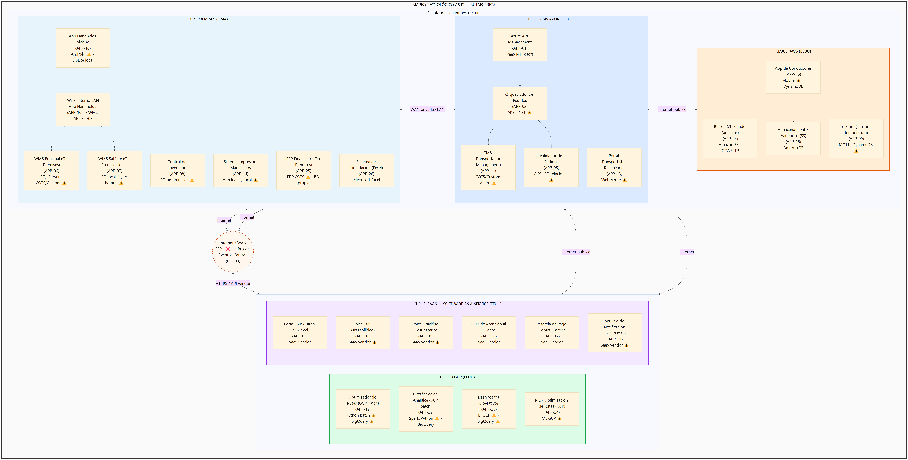

# Mapeo de Aplicaciones con Tecnología
## RutaExpress Fulfillment & Transporte

> **Para el comité de arquitectura** — Stack y bases de datos **AS IS** por aplicación y mapa visual por entorno de hosting. **Catálogo maestro** (origen, plataforma, capas): [`06_Mapa_Portafolio_Aplicaciones.md`](06_Mapa_Portafolio_Aplicaciones.md). **Convención obligatoria en todo el Hito 1:** siempre **nombre oficial + (APP-XX)** o **(PLT-XX)** juntos; nunca uno sin el otro.

---

## 1. Propósito

Complementar el catálogo del doc `06` con **atributos tecnológicos AS IS**: stack de implementación, base de datos y trazabilidad al caso (✅ confirmado vs ⚠️ suposición).

**Convenciones:**
- ✅ Dato confirmado en Caso 6a o Caso 6b
- ⚠️ Suposición técnica razonable
- **Plataforma de infraestructura** = dónde se despliega (nomenclatura unificada con doc `07` §2.2): **On Premises (Lima)**, **Cloud MS Azure (EEUU)**, **Cloud AWS (EEUU)**, **Cloud GCP (EEUU)**, **Cloud SaaS - Software as a Service (EEUU)**. **Conectividad** (Wi-Fi interno del almacén) → doc `07` §3.
- **Nomenclatura:** *Azure API Management (APP-01)* · *Plataforma de Observabilidad Unificada (PLT-01)* — siempre los dos.

---

## 2. Mapeo tecnológico AS IS

| Aplicación | Tecnología / Stack | Base de Datos | Fuente |
|---|---|---|---|
| Azure API Management (APP-01) | Azure API Management (APP-01) (PaaS) | N/A | ✅ Caso 6a F1 |
| Orquestador de Pedidos (APP-02) | ⚠️ Suposición: .NET en Azure AKS | Azure SQL Database | ✅ AKS — Caso 6b |
| Portal B2B (Carga CSV/Excel) (APP-03) | SaaS externo (vendor no especificado) | SaaS (vendor) | ✅ Caso 6a F1 |
| Bucket S3 Legado (archivos) (APP-04) | Amazon S3 | N/A | ✅ Caso 6a F1 |
| Validador de Pedidos (APP-05) | ⚠️ Suposición: .NET en Azure AKS (mismo stack que Orquestador de Pedidos (APP-02)) | Azure SQL Database | ⚠️ Inferido — deduplicación Caso 6a F1 |
| WMS Principal (On Premises) (APP-06) | ⚠️ Suposición: COTS o Custom | SQL Server | ✅ Caso 6b R1 |
| WMS Satélite (On Premises local) (APP-07) | ⚠️ Suposición: versión reducida de WMS Principal (On Premises) (APP-06) | ⚠️ Suposición: BD local | ✅ Caso 6a F2 |
| Control de Inventario (APP-08) | ⚠️ Suposición: complemento de WMS Principal (On Premises) (APP-06) | ⚠️ Suposición: BD on premises | ⚠️ Inferido — Caso 6a F2 |
| IoT Core (sensores temperatura) (APP-09) | AWS IoT Core / MQTT | ⚠️ Suposición: DynamoDB u otra BD AWS | ✅ Caso 6a F2 |
| App Handhelds (picking) (APP-10) | ⚠️ Suposición: Android nativo o similar | SQLite local (⚠️ Suposición) | ✅ Caso 6a F2 · conectividad → doc `07` |
| TMS (Transportation Management) (APP-11) | ⚠️ Suposición: COTS o Custom en Azure | Azure SQL Database | ✅ Caso 6a |
| Optimizador de Rutas (GCP batch) (APP-12) | ⚠️ Suposición: Python / optimización en GCP batch | ⚠️ Suposición: BigQuery u otra BD GCP | ✅ Caso 6a F3 |
| Portal Transportistas Tercerizados (APP-13) | ⚠️ Suposición: aplicación web en Azure | ⚠️ Suposición: BD relacional en Azure | ✅ Caso 6a F3 |
| Sistema Impresión Manifiestos (APP-14) | ⚠️ Suposición: aplicación local legacy | ⚠️ Suposición: BD local | ✅ Caso 6a F3 |
| App de Conductores (APP-15) | AWS ECS Fargate + DynamoDB | DynamoDB | ✅ Caso 6a F4 |
| Almacenamiento Evidencias (S3) (APP-16) | Amazon S3 | Amazon S3 | ✅ Caso 6a F4 |
| Pasarela de Pago Contra Entrega (APP-17) | SaaS externo | SaaS (vendor) | ✅ Caso 6a F4 |
| Portal B2B (Trazabilidad) (APP-18) | ⚠️ Suposición: aplicación web SaaS | SaaS (vendor) | ✅ Caso 6a F4 |
| Portal Tracking Destinatarios (APP-19) | ⚠️ Suposición: web/PWA SaaS | SaaS (vendor) | ⚠️ Inferido — Caso 6a F4 |
| CRM de Atención al Cliente (APP-20) | SaaS externo | SaaS (vendor) | ✅ Caso 6a F5 |
| Servicio de Notificación (SMS/Email) (APP-21) | SaaS externo | SaaS (vendor) | ⚠️ Inferido |
| Plataforma de Analítica (GCP batch) (APP-22) | ⚠️ Suposición: Python/Spark o herramienta GCP | BigQuery (⚠️ herramienta específica) | ✅ Caso 6a F6 |
| Dashboards Operativos (APP-23) | ⚠️ Suposición: herramienta BI en GCP | BigQuery (⚠️ Suposición) | ⚠️ Inferido — Caso 6a F6 |
| ML / Optimización de Rutas (GCP) (APP-24) | ⚠️ Suposición: algoritmo ML en GCP | ⚠️ Suposición: datos históricos en GCP | ✅ Caso 6b R3 |
| ERP Financiero (On Premises) (APP-25) | ⚠️ Suposición: ERP Financiero (On Premises) (APP-25) COTS | ⚠️ Suposición: BD propia del ERP Financiero (On Premises) (APP-25) | ✅ Caso 6a F6 |
| Sistema de Liquidación (Excel) (APP-26) | Microsoft Excel / hojas de cálculo | Archivos Excel locales | ✅ Caso 6a F6 |

---

## 3. Mapa visual por plataforma de infraestructura (AS IS)

Vista tipo **Arquitectura Tecnológica**: cada aplicación agrupada en su **plataforma de infraestructura** (doc `07` §2.2) con **nombre oficial (APP-XX) + stack/BD**. Comunicación global P2P vía Internet/WAN, **sin Bus de Eventos Central (PLT-03) (PLT-03) (Bus de Eventos Central (PLT-03)) (Bus de Eventos Central (PLT-03)) (Bus de Eventos Central (PLT-03))**. Detalle de red → doc `07` §3.

> Regenerar PNG: `npm run diagrams:tech-map` (o `npm run diagrams`).

*Figura 3.1 — AS IS por plataforma. Fuente: [`diagrams/tech-map-as-is.mmd`](../diagrams/tech-map-as-is.mmd).*

### 3.1 Aplicaciones por plataforma de infraestructura (AS IS)

| Plataforma de infraestructura | Aplicaciones (nombre + ID) |
|---|---|
| **On Premises (Lima)** | WMS Principal (On Premises) (APP-06), WMS Satélite (On Premises local) (APP-07), Control de Inventario (APP-08), App Handhelds (picking) (APP-10), Sistema Impresión Manifiestos (APP-14), ERP Financiero (On Premises) (APP-25), Sistema de Liquidación (Excel) (APP-26) |
| **Cloud MS Azure (EEUU)** | Azure API Management (APP-01), Orquestador de Pedidos (APP-02), Validador de Pedidos (APP-05), TMS (Transportation Management) (APP-11), Portal Transportistas Tercerizados (APP-13) |
| **Cloud AWS (EEUU)** | Bucket S3 Legado (archivos) (APP-04), IoT Core (sensores temperatura) (APP-09), App de Conductores (APP-15), Almacenamiento Evidencias (S3) (APP-16) |
| **Cloud GCP (EEUU)** | Optimizador de Rutas (GCP batch) (APP-12), Plataforma de Analítica (GCP batch) (APP-22), Dashboards Operativos (APP-23), ML / Optimización de Rutas (GCP) (APP-24) |
| **Cloud SaaS - Software as a Service (EEUU)** | Portal B2B (Carga CSV/Excel) (APP-03), Portal B2B (Trazabilidad) (APP-18), Portal Tracking Destinatarios (APP-19), CRM de Atención al Cliente (APP-20), Pasarela de Pago Contra Entrega (APP-17), Servicio de Notificación (SMS/Email) (APP-21) |

### 3.2 Comunicación global entre plataformas (AS IS)

| Origen | Destino | Medio | Patrón | Problema |
|---|---|---|---|---|
| On Premises (Lima) — WMS Principal (On Premises) (APP-06) / WMS Satélite (On Premises local) (APP-07) | Cloud MS Azure (EEUU) — Orquestador de Pedidos (APP-02), TMS (Transportation Management) (APP-11) | WAN privada / Internet | API P2P | sin Bus de Eventos Central (PLT-03) (PLT-03) (Bus de Eventos Central (PLT-03)) (Bus de Eventos Central (PLT-03)) (Bus de Eventos Central (PLT-03)) central; acoplamiento |
| Cloud MS Azure (EEUU) — Azure API Management (APP-01), Orquestador de Pedidos (APP-02) | Cloud AWS (EEUU) — App de Conductores (APP-15), Bucket S3 Legado (archivos) (APP-04) | Internet público | REST / archivos S3 | Sin cifrado tránsito garantizado |
| Cloud MS Azure (EEUU) — TMS (Transportation Management) (APP-11) | Cloud GCP (EEUU) — Optimizador de Rutas (GCP batch) (APP-12) | Internet público | Batch / export | Latencia; datos desactualizados |
| Cloud AWS (EEUU) — App de Conductores (APP-15) | Cloud SaaS - Software as a Service (EEUU) — Portal B2B (Trazabilidad) (APP-18), Servicio de Notificación (SMS/Email) (APP-21) | Internet | Webhooks / APIs vendor | Estados inconsistentes |
| On Premises (Lima) — WMS Principal (On Premises) (APP-06) | Cloud SaaS - Software as a Service (EEUU) — Portal B2B (Carga CSV/Excel) (APP-03) + Cloud AWS (EEUU) — Bucket S3 Legado (archivos) (APP-04) | Internet + S3 | CSV / SFTP legado | Canal manual sin validación |
| Cloud AWS (EEUU) — App de Conductores (APP-15) | Cloud AWS (EEUU) — backend APP-15 | 4G móvil | HTTPS | Offline frágil |
| On Premises (Lima) — App Handhelds (picking) (APP-10) | On Premises (Lima) — WMS Principal (On Premises) (APP-06) / WMS Satélite (On Premises local) (APP-07) | Wi-Fi interno LAN | Sync local | Sin redundancia (doc `07`) |
| Todas las APP | — | — | ❌ sin Bus de Eventos Central (PLT-03) (PLT-03) (Bus de Eventos Central (PLT-03)) (Bus de Eventos Central (PLT-03)) (Bus de Eventos Central (PLT-03)) | Integraciones frágiles |

> **draw.io:** una caja por **plataforma de infraestructura**; en cada caja **nombre oficial (APP-XX) + stack** (como el diagrama).

---

*Documento elaborado en el marco del Proyecto Integrador Final - Arquitectura de Soluciones Multinube - UTEC*
*Fecha: Junio 2026*
