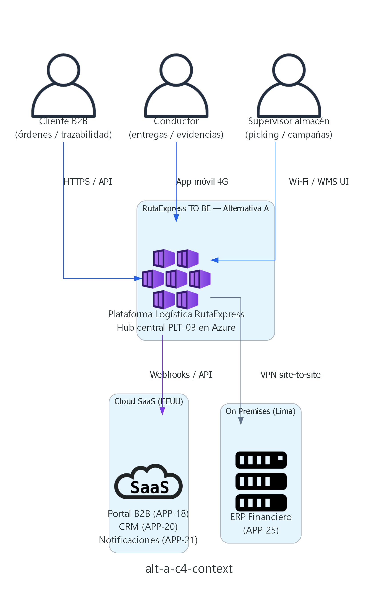
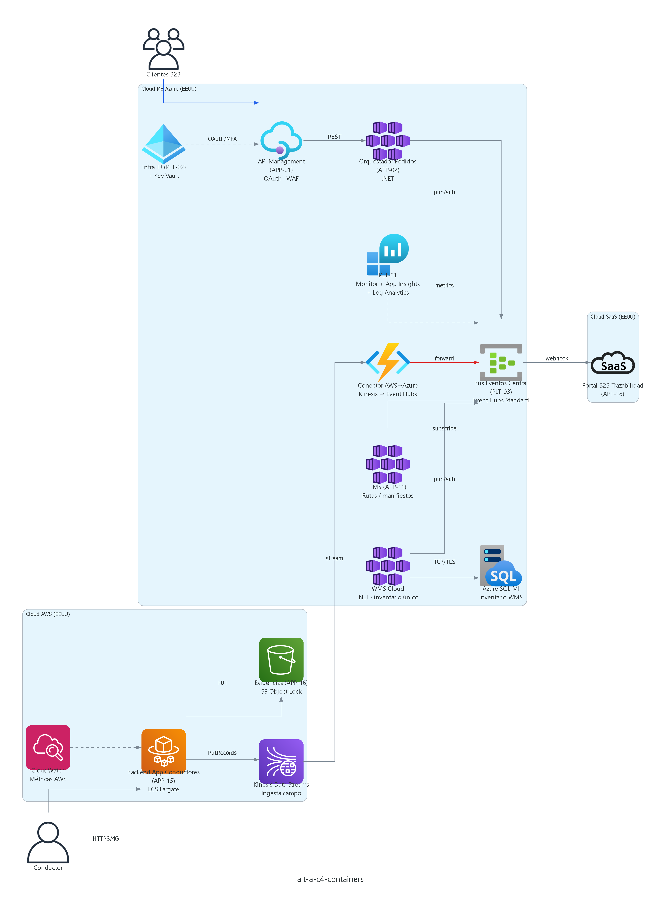
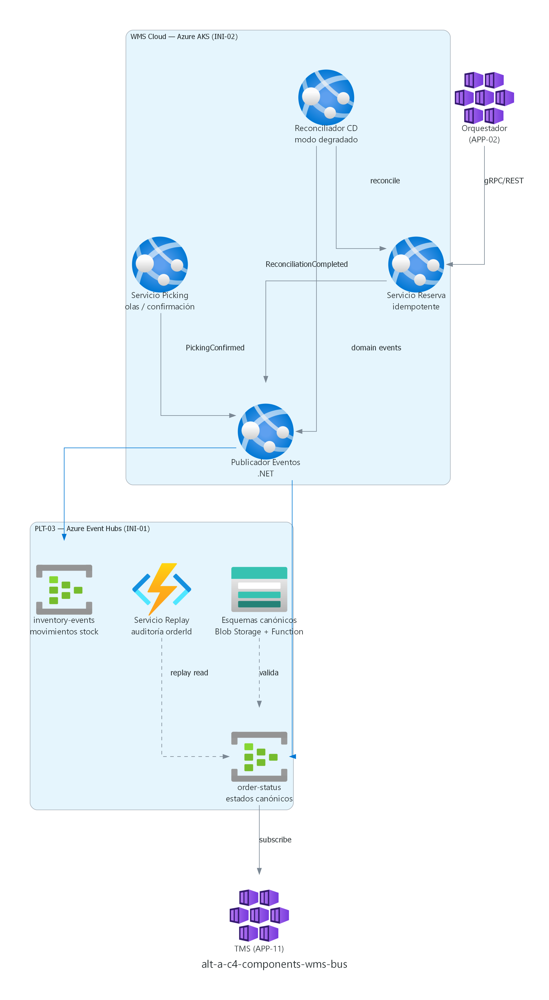
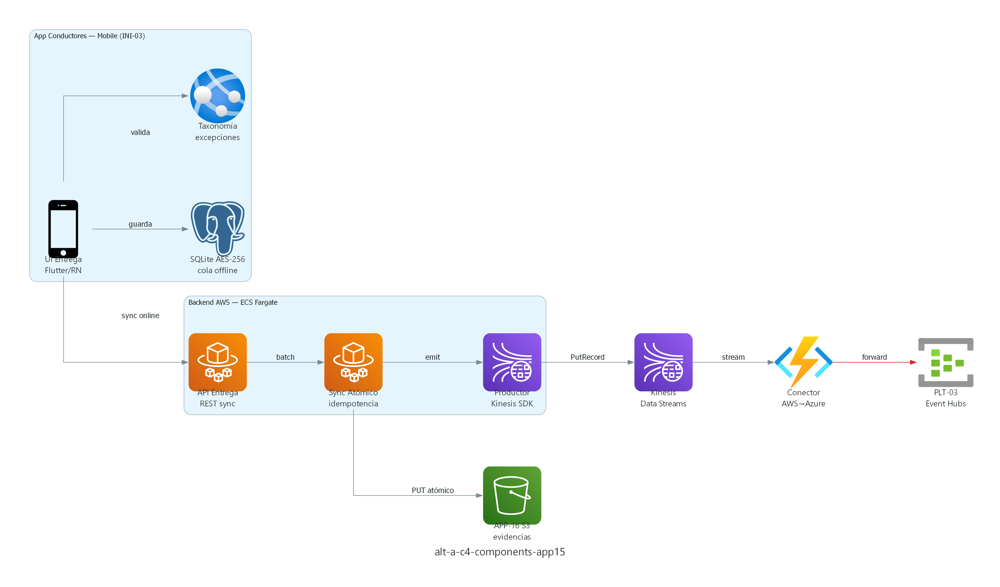

# Alternativa A — Hub Central Azure (Event-Driven)
## RutaExpress Fulfillment & Transporte — Hito 2

> **Iniciativas cubiertas:** INI-01 (PLT-03), INI-02 (WMS Cloud), INI-03 (APP-15) — selección justificada en [`01_Requerimientos_y_Criterios_Aceptacion.md` §1.1](01_Requerimientos_y_Criterios_Aceptacion.md#11-por-qué-se-eligieron-ini-01-ini-02-e-ini-03).  
> **Alineación Hito 1:** coherente con [`11_ADM_Migration_Planning.md`](../HITO%201%20-%20Arquitectura%20Empresarial/11_ADM_Migration_Planning.md) y TO BE de [`09_ADM_Fases_CadenasValor_B_C_D_ASIS_TOBE.md`](../HITO%201%20-%20Arquitectura%20Empresarial/09_ADM_Fases_CadenasValor_B_C_D_ASIS_TOBE.md).  
> **Requerimientos:** [`01_Requerimientos_y_Criterios_Aceptacion.md`](01_Requerimientos_y_Criterios_Aceptacion.md)

---

## 1. Resumen ejecutivo

La **Alternativa A** consolida la integración asíncrona en un **hub canónico único**: **Azure Event Hubs (PLT-03)** en **Cloud MS Azure (EEUU)**. Los sistemas en **Cloud AWS (EEUU)** (App de Conductores (APP-15), Almacenamiento Evidencias (APP-16)) publican eventos vía **AWS Kinesis Data Streams** y un **conector AWS→Azure** los reenvía al hub central. **WMS Cloud** y **TMS (Transportation Management) (APP-11)** operan en **Azure AKS** y consumen/producen directamente en PLT-03.

**Ventaja principal:** menor complejidad operativa, un solo modelo canónico de estados y replay centralizado — habilita INI-01 como fundacional del roadmap.

---

## 2. Lineamientos de arquitectura aplicados

| Lineamiento | Implementación en Alternativa A |
|---|---|
| **Integración** | Event-Driven Architecture (EDA); contratos canónicos versionados; anti-patrón P2P eliminado en flujos F1–F4 |
| **Seguridad** | Microsoft Entra ID (PLT-02) para productores/consumidores; Azure Key Vault; TLS 1.2+; MFA en API Management (APP-01) |
| **Observabilidad** | **PLT-01** nativo: Azure Monitor + Application Insights + Log Analytics (tablero central); Amazon CloudWatch (APP-15); exportación básica de métricas AWS→Monitor |
| **Resiliencia** | Circuit Breaker en conector Kinesis→Event Hubs; retry exponencial; cola DLQ en Event Hubs Capture |
| **Gobierno / IaC** | Terraform (PLT-04) para AKS, Event Hubs, IAM; pipelines GitOps |
| **Datos** | Inventario único en Azure SQL Managed Instance; evidencias inmutables en S3 Object Lock (APP-16) |
| **Multinube** | *Best-of-breed por carga* (Azure núcleo logístico, AWS campo) con **integración hub-and-spoke**, no malla peer-to-peer |

---

## 3. Patrones de arquitectura

| Patrón | Uso |
|---|---|
| **Hub-and-Spoke** | PLT-03 como hub; WMS Cloud, TMS, Portal B2B (APP-18) y conector AWS como spokes |
| **Event Sourcing (parcial)** | Historial de estados de pedido en Event Hubs; replay para auditoría (RF-INI01-03) |
| **CQRS** | Comandos de reserva/picking en WMS Cloud; proyecciones de lectura vía eventos a TMS y APP-18 |
| **Strangler Fig** | WMS Principal (On Premises) (APP-06) y WMS Satélite (APP-07) migrados por fases a WMS Cloud |
| **Circuit Breaker** | Conector AWS→Azure ante throttling o indisponibilidad de Event Hubs |
| **Bulkhead** | APP-15 aislado en ECS Fargate; fallos de campo no degradan WMS |
| **Saga (coreografía)** | Reserva → Picking → Manifiesto → Entrega coordinada por eventos, sin orquestador central monolítico |
| **Offline-First (móvil)** | SQLite cifrado + sync atómico en APP-15 |

---

## 3.1 Aplicaciones, plataformas y servicios eliminados o fuera de alcance

> Referencia TO BE: [`09_ADM_Fases_CadenasValor_B_C_D_ASIS_TOBE.md`](../HITO%201%20-%20Arquitectura%20Empresarial/09_ADM_Fases_CadenasValor_B_C_D_ASIS_TOBE.md) · [`06_Mapa_Portafolio_Aplicaciones.md`](../HITO%201%20-%20Arquitectura%20Empresarial/06_Mapa_Portafolio_Aplicaciones.md) §4.

### Aplicaciones AS IS que dejan de existir (impacto directo INI-01 / INI-02 / INI-03)

| Elemento AS IS | Disposición TO BE en Alternativa A | Motivo |
|---|---|---|
| **WMS Principal (On Premises) (APP-06)** | **Reemplazado** por WMS Cloud (INI-02) | Inventario único, auto-scaling campaña 3×, integración vía PLT-03 |
| **WMS Satélite (On Premises local) (APP-07)** | **Reemplazado** por WMS Cloud — modo degradado local | Elimina sync horaria y 4.900 conflictos documentados |
| **Control de Inventario (APP-08)** | **Eliminado** — sin app TO BE homóloga | Función absorbida por inventario único de WMS Cloud |
| Integraciones **P2P** APP-06 ↔ APP-11 ↔ APP-15 | **Eliminadas** | Sustituidas por publicación/consumo en **PLT-03** (INI-01) |
| App de Conductores (APP-15) — módulo offline frágil | **Reemplazado** por rediseño INI-03 | SQLite cifrado, sync atómico, taxonomía obligatoria |

### Aplicaciones TO BE no incluidas en el alcance de diseño (Hito 2)

Estas eliminaciones/reemplazos están en el roadmap Hito 1 pero **no** forman parte de los diagramas C4 de INI-01..03:

| Elemento | Disposición TO BE (Hito 1) | Cuándo |
|---|---|---|
| Bucket S3 Legado (APP-04) | Deprecar | F1 — INI-06 / canal unificado |
| Validador de Pedidos (APP-05) | Eliminar → Servicio de Validación | F1 — INI-06 |
| Sistema Impresión Manifiestos (APP-14) | Eliminar → manifiesto digital | F3 — TMS |
| Optimizador de Rutas (GCP batch) (APP-12) | Reemplazar por APP-24 tiempo real | F3 — INI-04 |
| Sistema de Liquidación Excel (APP-26) | Reemplazar por microservicio | F5 — INI-05 |

### Plataformas y nubes

| Elemento | En Alternativa A | Motivo |
|---|---|---|
| **Cloud GCP (EEUU)** en flujos INI-01..03 | **Fuera de alcance** (no eliminada del TO BE global) | APP-24 / Pub/Sub entra en **mes 18+** como consumidor de PLT-03; no requerida para bus, WMS ni APP-15 |
| **On Premises (Lima)** — WMS APP-06/07/08 | **Retirada progresiva** del path crítico | ERP (APP-25) y Handhelds (APP-10) permanecen On Premises / Wi-Fi en transición |
| Bus **Amazon EventBridge** como hub de dominio | **No incluido** | AWS limitado a **Kinesis + ECS + S3 + CloudWatch** (campo); integración al hub **Azure** |
| Bus **Google Pub/Sub** (PLT-03-GCP) | **No incluido** en fase INI-01..03 | Evita malla tri-bus; ver Alternativa B (descartada) |

### Servicios y tecnologías descartados en el diseño

| Propuesta descartada | Sustituto en Alternativa A |
|---|---|
| **Azure Event Hubs Premium** | **Event Hubs Standard** (2 TU) — nivel intermedio, menor costo |
| **Datadog / New Relic / Grafana Cloud** | **PLT-01 nativo:** Monitor + App Insights + CloudWatch |
| **Apicurio / Confluent Schema Registry** | **Azure Blob Storage** + **Azure Function** (validación esquema) |
| **Kafka / Kafka Connect autogestionado** | **Azure Event Hubs** + conector **Azure Function** |
| **OpenTelemetry comercial** (SaaS) | Correlación básica vía export CloudWatch → Log Analytics |
| **Manhattan / JDA WMS COTS** | **WMS Cloud custom** en AKS |
| **Migrar APP-15 a Azure** | Mantener **AWS ECS Fargate** + bridge a PLT-03 |
| **Integración P2P directa** WMS→TMS→APP-15 | **Hub-and-spoke** PLT-03 |
| **Alternativa B** (malla federada tri-bus) | **No implementar** — ver doc 04 |

---

## 4. Diagramas C4 (niveles 1–3)

> **Generación (Diagram as Code):** script Python [`diagrams/generate_diagrams.py`](diagrams/generate_diagrams.py) con librería **[diagrams](https://diagrams.mingrammer.com/)** (mingrammer) e íconos oficiales AWS / Azure / GCP.  
> **Requisitos:** Python 3.10+, Graphviz instalado, `pip install -r requirements-diagrams.txt`  
> **Regenerar PNG:** `npm run diagrams:hito2` o `python "HITO 2 - Requerimientos Y Diseño de Arquitectura de Solución/diagrams/generate_diagrams.py"`

> **Principio de diseño (Hito 1):** solo servicios **nativos Azure / AWS / GCP**, alcance **medio** (sin Datadog, OpenTelemetry comercial, Kafka autogestionado ni otros SaaS de observabilidad/integración).

### 4.1 Nivel 1 — Contexto



**Actores:** cliente B2B, conductor, supervisor de almacén. **Sistemas externos:** SaaS (APP-18, APP-20, APP-21), ERP Financiero (APP-25) On Premises (Lima).

### 4.2 Nivel 2 — Contenedores



| Contenedor | Plataforma | Tecnología AWS / Azure / GCP |
|---|---|---|
| Azure API Management (APP-01) | Cloud MS Azure (EEUU) | **Azure** API Management + WAF |
| Orquestador de Pedidos (APP-02) | Cloud MS Azure (EEUU) | **Azure** AKS (.NET) |
| WMS Cloud | Cloud MS Azure (EEUU) | **Azure** AKS + SQL MI (General Purpose) |
| TMS (APP-11) | Cloud MS Azure (EEUU) | **Azure** AKS |
| Bus de Eventos Central (PLT-03) | Cloud MS Azure (EEUU) | **Azure** Event Hubs **Standard** (2 TU) |
| Backend App Conductores (APP-15) | Cloud AWS (EEUU) | **AWS** ECS Fargate |
| Streaming AWS | Cloud AWS (EEUU) | **AWS** Kinesis Data Streams |
| Almacenamiento Evidencias (APP-16) | Cloud AWS (EEUU) | **AWS** S3 + Object Lock |
| Conector AWS→Azure | Cloud MS Azure (EEUU) | **Azure** Function / AKS job |
| Observabilidad (PLT-01) | Multinube | **Azure** Monitor + App Insights + Log Analytics; **AWS** CloudWatch → export a Monitor |
| IAM (PLT-02) | Cloud MS Azure (EEUU) | **Azure** Entra ID + Key Vault |

**Flujo clave:** APP-15 → Kinesis → Conector → **PLT-03** → TMS / APP-18.

### 4.3 Nivel 3 — Componentes (INI-01 + INI-02)



Componentes principales **WMS Cloud**:

- **Servicio Reserva** — idempotencia por `reservationId` (RF-INI02-01).
- **Servicio Picking** — olas y confirmación; publica `PickingConfirmed`.
- **Reconciliador CD** — modo degradado local (RF-INI02-03).
- **Publicador Eventos** — emite a tópicos `inventory-events` y `order-status`.

Componentes **PLT-03**:

- **Tópicos Event Hubs** — particionado por `orderId`.
- **Registro de esquemas** — JSON Schema en **Azure Blob Storage** + validación en **Azure Function** (RF-INI01-01); sin productos de terceros.
- **Servicio Replay** — Azure Function para auditoría (RF-INI01-03).

### 4.4 Nivel 3 — Componentes (INI-03)



- **Módulo Offline** — SQLite AES-256 (RF-INI03-01).
- **Servicio Sync Atómico** — evidencia completa o rollback (RF-INI03-02).
- **Taxonomía Excepciones** — bloqueo texto libre (RF-INI03-04).
- **Productor Kinesis** → Conector → PLT-03 (RF-INI03-03).

---

## 5. Trazabilidad requerimientos ↔ diseño

| Requerimiento | Elemento de diseño Alternativa A |
|---|---|
| RF-INI01-01 … RNF-INI01-03 | PLT-03 Event Hubs Standard + esquemas en Blob/Function + Entra ID |
| RF-INI02-01 … RNF-INI02-03 | WMS Cloud AKS/KEDA + Azure SQL MI + Terraform |
| RF-INI03-01 … RNF-INI03-03 | APP-15 offline + S3 + Kinesis→PLT-03 + MDM SaaS |

---

## 6. Architectural Decision Records (ADR)

### ADR-A-001 — Hub central único en Azure Event Hubs

| Campo | Decisión |
|---|---|
| **Estado** | Aceptado |
| **Contexto** | INI-01 requiere desacoplar APP-06/APP-11/APP-15 y estados canónicos para APP-18 |
| **Decisión** | Un solo hub **Azure Event Hubs Standard (PLT-03)** — nivel intermedio, suficiente throughput campaña 3× |
| **Consecuencias** | (+) Replay y gobierno centralizados; (−) dependencia de conector AWS→Azure |
| **Alternativas descartadas** | Event Hubs Premium (sobre-costoso); Service Bus (menor throughput); Kafka autogestionado |

### ADR-A-002 — WMS Cloud custom en Azure AKS (no COTS)

| Campo | Decisión |
|---|---|
| **Estado** | Aceptado |
| **Contexto** | INI-02: picos 3×, 14 CDs, eliminación APP-08 |
| **Decisión** | WMS custom .NET en **AKS + Azure SQL MI** con KEDA |
| **Consecuencias** | (+) Control total auto-scaling/degradado; (−) esfuerzo desarrollo 10 meses |
| **Alternativas descartadas** | Manhattan/JDA SaaS (costo licencia); lift-and-shift APP-06 |

### ADR-A-003 — Campo en AWS con bridge a hub Azure

| Campo | Decisión |
|---|---|
| **Estado** | Aceptado |
| **Contexto** | APP-15 ya planificado en AWS; evidencias en S3; INI-03 quick win |
| **Decisión** | Mantener **ECS Fargate + Kinesis**; conector dedicado a Event Hubs |
| **Consecuencias** | (+) Aprovecha inversión AWS campo; (−) latencia adicional ~1–2 s vs bus nativo |
| **Alternativas descartadas** | Migrar APP-15 a Azure (retraso 4+ meses) |

### ADR-A-004 — Modelo canónico de estados v1 en hub

| Campo | Decisión |
|---|---|
| **Estado** | Aceptado |
| **Contexto** | Disputas B2B por estados inconsistentes (HU-INI01-02) |
| **Decisión** | Esquemas canónicos en **Azure Blob Storage**; validación en Azure Function antes de publicar a Event Hubs |
| **Consecuencias** | (+) Una verdad para APP-18; (−) mapeos en cada productor legacy |

### ADR-A-005 — Observabilidad nativa PLT-01 (sin terceros)

| Campo | Decisión |
|---|---|
| **Estado** | Aceptado |
| **Contexto** | INI-07 y doc 10: prohibido Datadog/OpenTelemetry comercial; RNF SLA p95 ≤ 5 s |
| **Decisión** | **Azure Monitor + Application Insights + Log Analytics** como tablero central; **CloudWatch** en APP-15; exportación programada de métricas AWS→Log Analytics |
| **Consecuencias** | (+) Alineado Hito 1 y costo controlado; (−) correlación cross-cloud básica (suficiente alcance medio) |
| **Alternativas descartadas** | Datadog, New Relic, Grafana Cloud SaaS |

### ADR-A-006 — IaC exclusivo con Terraform (PLT-04)

| Campo | Decisión |
|---|---|
| **Estado** | Aceptado |
| **Contexto** | RNF-INI02-03; gobierno comité arquitectura |
| **Decisión** | Módulos Terraform para AKS, Event Hubs, ECS, IAM; prohibido drift manual prod |
| **Consecuencias** | (+) Auditoría y rollback; (−) curva aprendizaje equipos |

---

## 7. Vista de despliegue por plataforma

```
Cloud MS Azure (EEUU)     Cloud AWS (EEUU)           Cloud SaaS (EEUU)
─────────────────────     ──────────────────         ─────────────────
APP-01 API Management     APP-15 ECS Fargate         APP-18 Portal B2B
APP-02 Orquestador        APP-16 S3 evidencias       APP-21 Notificaciones
APP-11 TMS                Kinesis Data Streams       MDM
WMS Cloud + SQL MI        CloudWatch → export Monitor
PLT-03 Event Hubs Standard
Conector Kinesis→Hub
PLT-01 Monitor + App Insights + Log Analytics
PLT-02 Entra ID + Key Vault

On Premises (Lima)        Cloud GCP (EEUU) — futuro
─────────────────────     ─────────────────────────
APP-25 ERP Financiero     APP-24 ML Rutas (consume PLT-03 vía suscripción)
Handhelds APP-10 Wi-Fi
```

---

## 8. Riesgos y mitigaciones

| Riesgo | Mitigación |
|---|---|
| Conector AWS→Azure SPOF | Réplicas + Circuit Breaker + DLQ; health checks en PLT-01 |
| Throttling Event Hubs en campaña | Escalar TU Standard + particiones; prueba carga 3× pre Cyber Days |
| Latencia end-to-end APP-15 > 30 s | Buffering Kinesis; alertas p95; tuning batch conector |

---

*Documento elaborado en el marco del Proyecto Integrador Final - Arquitectura de Soluciones Multinube - UTEC*  
*Fecha: Julio 2026*
