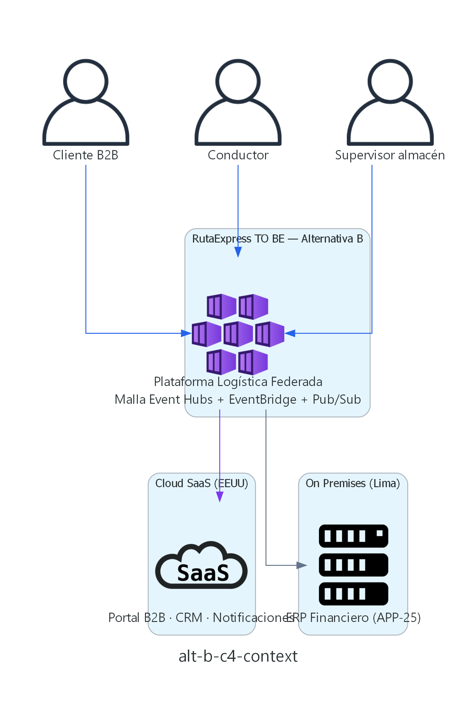
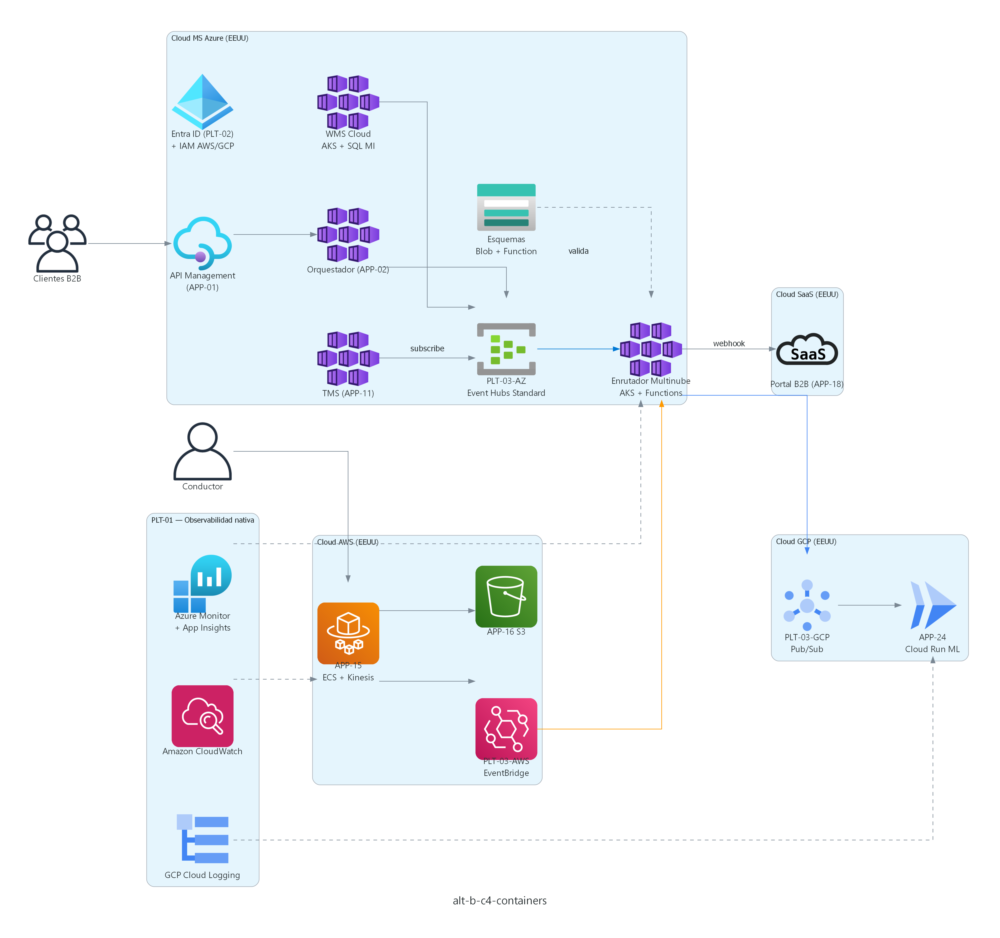
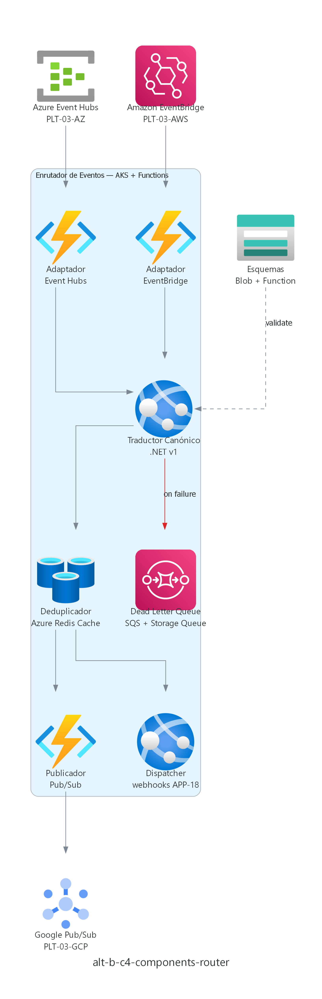
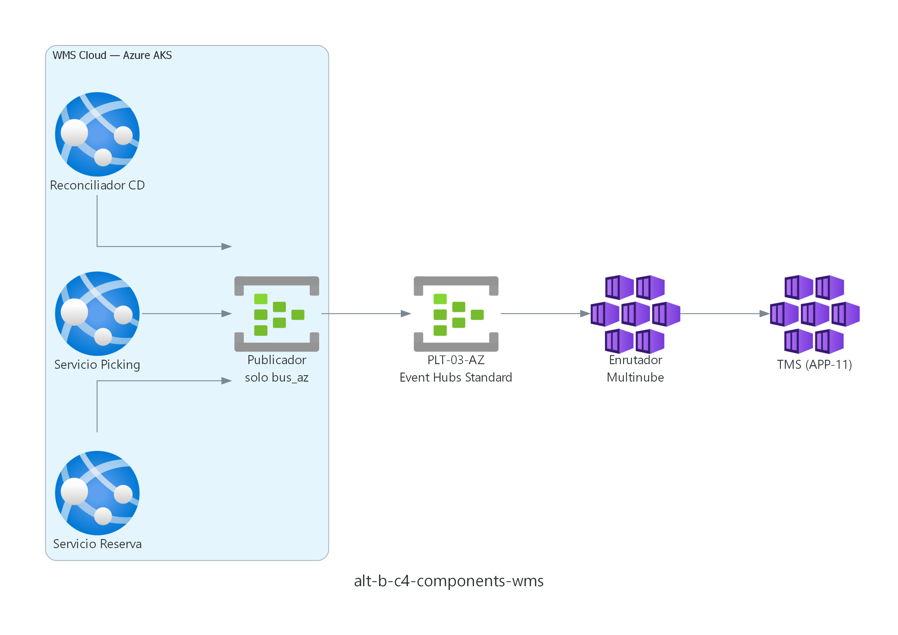

# Alternativa B — Malla Federada Multinube (Event Mesh)
## RutaExpress Fulfillment & Transporte — Hito 2

> **Iniciativas cubiertas:** INI-01 (PLT-03), INI-02 (WMS Cloud), INI-03 (APP-15).  
> **Contraste:** misma cobertura funcional que Alternativa A, distinta topología de integración.  
> **Requerimientos:** [`01_Requerimientos_y_Criterios_Aceptacion.md`](01_Requerimientos_y_Criterios_Aceptacion.md)  
> **Nota:** alternativa de contraste académico; **no se implementará** (ver doc 04).

---

## 1. Resumen ejecutivo

La **Alternativa B** implementa un **bus por nube de origen** — **Azure Event Hubs Standard**, **Amazon EventBridge** y **Google Pub/Sub** — unidos por un **Enrutador de Eventos Multinube** en **Azure AKS** con **Azure Functions** como adaptadores, traducción canónica y fan-out. Toda la observabilidad usa **PLT-01 nativo** (Azure Monitor, CloudWatch, Cloud Logging); **no** se emplean herramientas SaaS de terceros.

**Desventaja frente a A:** mayor complejidad operativa, replay distribuido, tres buses que operar, y desalineación parcial con INI-03 (Kinesis).

---

## 2. Lineamientos de arquitectura aplicados

| Lineamiento | Implementación en Alternativa B |
|---|---|
| **Integración** | Event Mesh federado; esquemas en **Azure Blob Storage** + **Azure Function**; contratos JSON versionados |
| **Seguridad** | Entra ID (PLT-02) central + IAM AWS + GCP IAM nativos; mTLS entre Functions y buses |
| **Observabilidad** | **PLT-01 nativo:** Azure Monitor + App Insights + Log Analytics; CloudWatch (AWS); Cloud Logging + Cloud Trace (GCP) |
| **Resiliencia** | DLQ nativas: **Amazon SQS**, **Azure Storage Queue**, **Pub/Sub dead-letter**; deduplicación **Azure Cache for Redis** |
| **Gobierno / IaC** | Terraform (PLT-04) multi-provider (azurerm, aws, google) |
| **Datos** | WMS Cloud (Azure SQL MI General Purpose); evidencias S3; analítica GCP vía Pub/Sub |
| **Multinube** | Simetría por nube con enrutador Azure — sin Kafka autogestionado ni conectores de terceros |

---

## 3. Patrones de arquitectura

| Patrón | Uso |
|---|---|
| **Event Mesh / Federated Bus** | PLT-03-AZ, PLT-03-AWS, PLT-03-GCP + enrutador Functions |
| **Anti-Corruption Layer** | Traductor Canónico (.NET en AKS) |
| **Event Sourcing (distribuido)** | Retención por bus; replay compuesto vía Azure Function agregador |
| **CQRS** | Igual que A en WMS Cloud |
| **Strangler Fig** | Migración WMS igual que Alternativa A |
| **Bulkhead** | Adaptadores Functions aislados por nube |
| **Saga (coreografía)** | Coordinación multi-bus con compensación en DLQ nativas |
| **Offline-First** | APP-15 mantiene **Kinesis** (INI-03 Hito 1) → EventBridge vía regla AWS nativa |

---

## 4. Diagramas C4 (niveles 1–3)

> **Generación:** [`diagrams/generate_diagrams.py`](diagrams/generate_diagrams.py) — librería **diagrams** (mingrammer). Regenerar: `npm run diagrams:hito2`

### 4.1 Nivel 1 — Contexto



Misma relación con actores externos que Alternativa A; el sistema expuesto al cliente es la **Plataforma Logística Federada**.

### 4.2 Nivel 2 — Contenedores



| Contenedor | Plataforma | Tecnología |
|---|---|---|
| Bus Azure (PLT-03-AZ) | Cloud MS Azure (EEUU) | **Azure** Event Hubs Standard |
| Bus AWS (PLT-03-AWS) | Cloud AWS (EEUU) | **Amazon** EventBridge |
| Bus GCP (PLT-03-GCP) | Cloud GCP (EEUU) | **Google** Pub/Sub |
| Enrutador Multinube | Cloud MS Azure (EEUU) | **Azure** AKS + **Azure Functions** adaptadores |
| Registro de esquemas | Cloud MS Azure (EEUU) | **Azure** Blob Storage + Function |
| WMS Cloud, TMS, Orquestador | Cloud MS Azure (EEUU) | **Azure** AKS |
| Backend APP-15 | Cloud AWS (EEUU) | **AWS** ECS Fargate + Kinesis |
| Optimización Rutas (APP-24) | Cloud GCP (EEUU) | **GCP** Cloud Run |
| Observabilidad (PLT-01) | Multinube | **Azure** Monitor + **AWS** CloudWatch + **GCP** Cloud Logging |
| IAM (PLT-02) | Multinube | Entra ID + IAM AWS + GCP IAM |

### 4.3 Nivel 3 — Enrutador de Eventos



| Componente | Responsabilidad |
|---|---|
| Adaptador Event Hubs | **Azure Function** consume PLT-03-AZ |
| Adaptador EventBridge | **Azure Function** triggered vía Event Grid / polling EventBridge |
| Traductor Canónico | Worker .NET en AKS — mapeo esquema v1 |
| Deduplicador | **Azure Cache for Redis** (Basic/Standard) — idempotencia `eventId` |
| Publicador Pub/Sub | **Azure Function** → GCP Pub/Sub (API nativa) |
| Dispatcher SaaS | Worker webhooks → APP-18 |
| Dead Letter Queue | **SQS** + **Azure Storage Queue** |

### 4.4 Nivel 3 — WMS Cloud (INI-02)



WMS Cloud publica **solo** a PLT-03-AZ; TMS consume vía enrutador para eventos cross-domain.

---

## 5. Trazabilidad requerimientos ↔ diseño

| Requerimiento | Elemento de diseño Alternativa B |
|---|---|
| RF-INI01-01 | Blob Storage + Function + tres buses + traductor |
| RF-INI01-03 | Replay agregador Azure Function multi-retención |
| RF-INI02-02 | WMS → PLT-03-AZ → enrutador → TMS |
| RF-INI03-03 | APP-15 → Kinesis → EventBridge → enrutador |
| RNF-INI01-01 | Latencia +2–4 s por salto en enrutador |

---

## 6. Architectural Decision Records (ADR)

### ADR-B-001 — Bus nativo por nube (no hub único)

| Campo | Decisión |
|---|---|
| **Estado** | Descartado para implementación |
| **Contexto** | Contraste académico Hito 2 |
| **Decisión** | Event Hubs + EventBridge + Pub/Sub con enrutador |
| **Consecuencias** | (+) SDK nativos por nube; (−) 3× operación, replay complejo |

### ADR-B-002 — Enrutador con Azure Functions (no Kafka Connect)

| Campo | Decisión |
|---|---|
| **Estado** | Propuesto solo en alternativa B |
| **Contexto** | Hito 1 prohíbe Kafka autogestionado |
| **Decisión** | AKS + **Azure Functions** + workers .NET |
| **Consecuencias** | (+) 100% PaaS Azure; (−) componente crítico adicional |

### ADR-B-003 — Esquemas en Azure Blob Storage + Function

| Campo | Decisión |
|---|---|
| **Estado** | Propuesto solo en alternativa B |
| **Contexto** | RF-INI01-01 sin Apicurio/Confluent |
| **Decisión** | Misma estrategia nativa que Alternativa A |
| **Consecuencias** | (+) Cero licencias terceros; (−) gobierno manual de versiones |

### ADR-B-004 — Deduplicación Azure Cache for Redis

| Campo | Decisión |
|---|---|
| **Estado** | Propuesto solo en alternativa B |
| **Contexto** | Fan-out multi-bus duplica eventos |
| **Decisión** | **Azure Cache for Redis** Standard C1 |
| **Consecuencias** | (+) PaaS nativo; (−) costo y operación extra vs A |

### ADR-B-005 — Observabilidad PLT-01 nativa multinube

| Campo | Decisión |
|---|---|
| **Estado** | Propuesto solo en alternativa B |
| **Contexto** | INI-07 — prohibido Datadog/SaaS observabilidad |
| **Decisión** | Monitor + CloudWatch + Cloud Logging; tablero único en Log Analytics |
| **Consecuencias** | (+) Alineado Hito 1; (−) correlación manual entre tableros |

### ADR-B-006 — APP-15 mantiene Kinesis (alineado Hito 1)

| Campo | Decisión |
|---|---|
| **Estado** | Aceptado en diseño B revisado |
| **Contexto** | INI-03 documenta Kinesis explícitamente |
| **Decisión** | Kinesis → regla EventBridge → enrutador (sin eliminar Kinesis) |
| **Consecuencias** | (+) Coherencia Hito 1; (−) un salto más que en A |

---

## 7. Vista de despliegue

```
Azure (dominio logístico)     AWS (campo)              GCP (analítica)
─────────────────────────     ─────────────            ───────────────
WMS Cloud, TMS, APP-02        APP-15 ECS + Kinesis     APP-24 Cloud Run
PLT-03-AZ Event Hubs Std      PLT-03-AWS EventBridge   PLT-03-GCP Pub/Sub
Enrutador AKS + Functions     APP-16 S3
Blob esquemas, Redis Cache
Monitor + Log Analytics       CloudWatch               Cloud Logging

         └──────── Enrutador Multinube (AKS + Functions) ────────┘
```

---

## 8. Riesgos y mitigaciones

| Riesgo | Mitigación |
|---|---|
| Enrutador SPOF | Réplicas AKS + Functions consumidoras idempotentes |
| Replay audit no unificado | Agregador Function — +2–3 meses desarrollo |
| Costo operativo 3 buses | ~USD 140K/año infra vs ~USD 55K Alternativa A |
| Complejidad vs beneficio | **No implementar** — ver recomendación doc 04 |

---

*Documento elaborado en el marco del Proyecto Integrador Final - Arquitectura de Soluciones Multinube - UTEC*  
*Fecha: Julio 2026*
