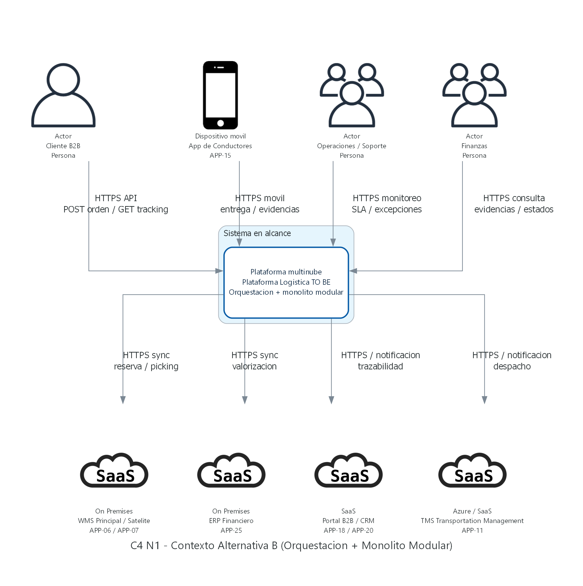
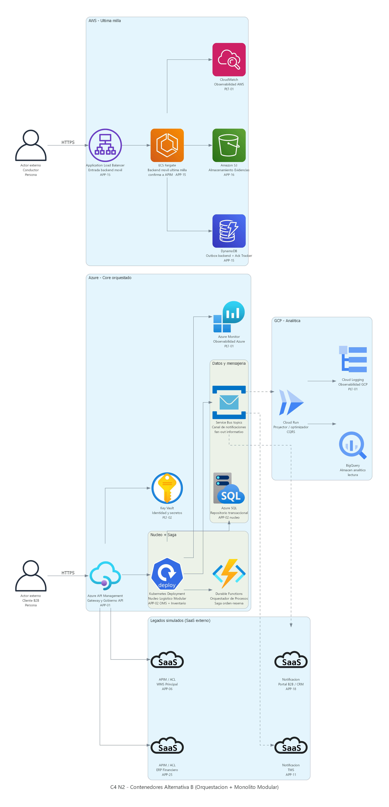
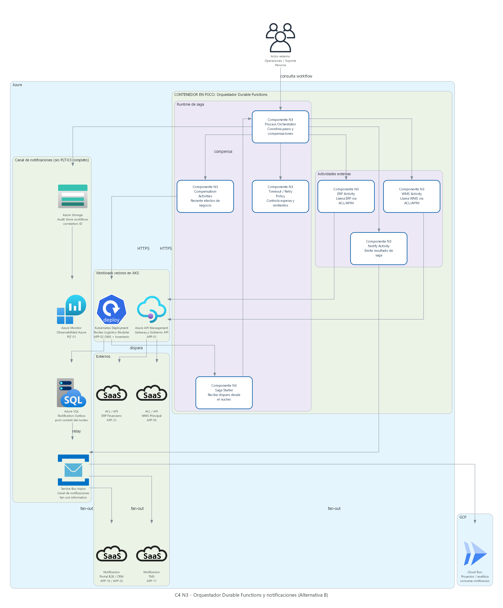
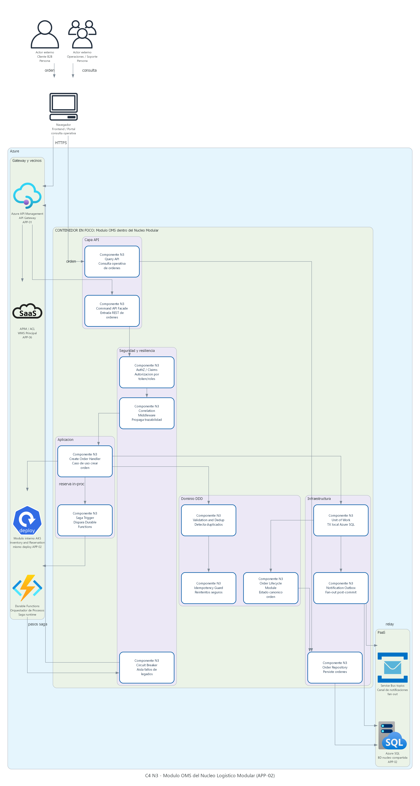
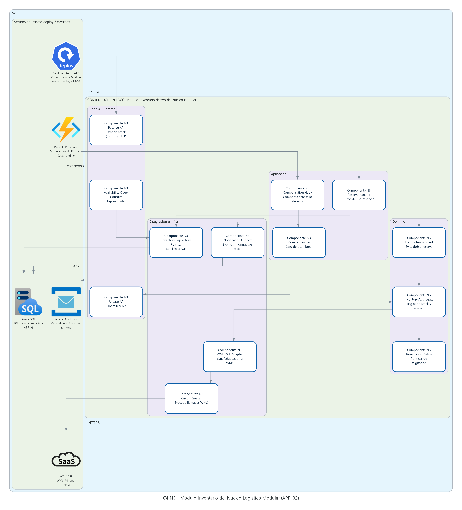
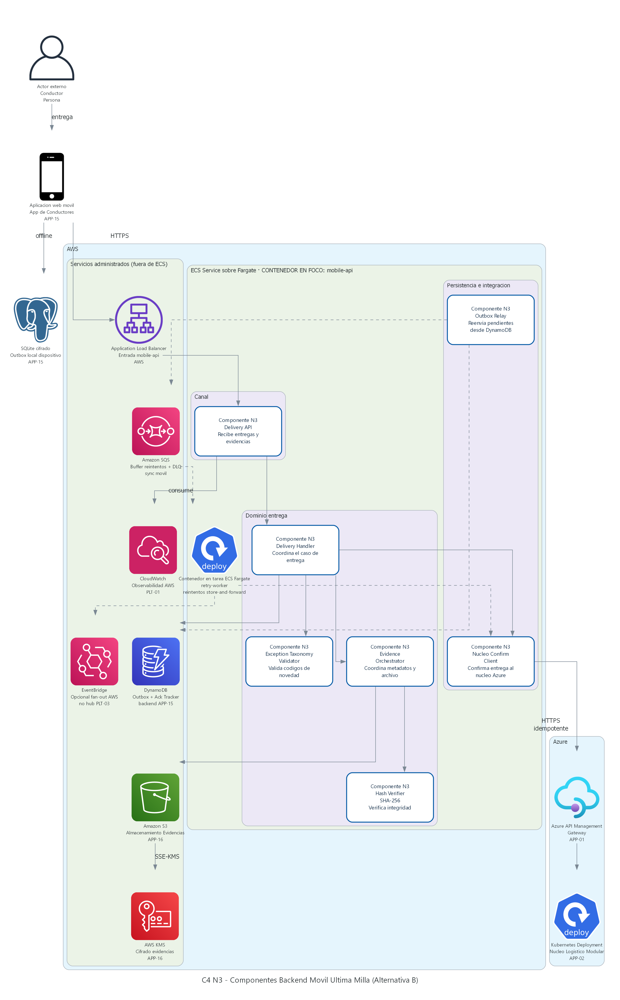

# Alternativa B - Orquestacion + Monolito Modular
## RutaExpress Fulfillment & Transporte - Hito 2

> **Modelo presentado:** orquestacion sincrona y monolito modular como estilo arquitectonico distinto a la Alternativa A.
> **Diagramas C4:** generados con `diagramas_c4/generar_diagramas_alternativa_B_c4.py` (estilo Hito 3) hacia `diagramas_c4/imagenes_alternativa_B/`.
> **Decision esperada:** contrastar un TO BE de menor complejidad operativa frente al modelo event-driven de la Alternativa A.

---

## 1. Resumen ejecutivo

La **Alternativa B** propone un estilo arquitectonico distinto al de la Alternativa A. En lugar de **microservicios** (OMS APP-02 e Inventario MS-INI01-02 separados) con Saga OMS vía HTTP y **Bus de Eventos Central (PLT-03)** — outbox → `bus-workers` → Event Hubs → Service Bus —, concentra el core de **INI-01** en un **monolito modular**: OMS centralizado / Orquestador de Pedidos (APP-02) e Inventario/Reservas conviven en un mismo despliegue AKS, con base transaccional unica (Azure SQL) y limites de modulo internos (DDD).

La coordinacion del ciclo `orden -> validacion -> reserva -> liberacion a despacho -> notificacion` se realiza con una **Saga orquestada** mediante Azure Durable Functions (o equivalente de workflow). El camino feliz de integracion es **API-first sincrono** gobernado por Azure API Management (APP-01). Los eventos existen, pero como **notificaciones de dominio** (fan-out a TMS, portal, GCP y ultima milla), no como hub canonico con outbox/`bus-workers`, DLQ y replay equivalentes a PLT-03.

AWS se conserva para App de Conductores (APP-15), store-and-forward, evidencias en S3/KMS y backend movil. GCP se conserva para optimizacion y analitica. La colocacion multinube puede parecerse a A; **la diferencia real es el estilo de coordinacion y empaquetado del core**.

**Ventaja principal:** menor cantidad de piezas moviles, consistencia fuerte en ordenes/inventario y MVP mas rapido de entender y operar.

**Riesgo principal:** el nucleo modular y el orquestador se vuelven punto critico ante picos; peor absorcion natural de degradacion WMS/ERP comparado con colas + backpressure de la Alternativa A.

---

## 2. Lineamientos de arquitectura aplicados

| Lineamiento | Implementacion en Alternativa B |
|---|---|
| **Integracion** | API-first con Azure API Management (APP-01) como camino feliz; eventos de notificacion selectivos (Service Bus topics livianos), sin Bus de Eventos Central (PLT-03) como hub canonico de consistencia. |
| **Seguridad** | Entra ID, Key Vault, OAuth/OIDC, minimo privilegio, cifrado en transito/reposo; federacion hacia AWS para app movil y evidencias. |
| **Observabilidad** | OpenTelemetry + Azure Monitor/App Insights sobre el nucleo y el workflow; correlation ID obligatorio; federacion con CloudWatch (movil) y GCP Monitoring. |
| **Resiliencia** | Circuit breaker, timeout, retry con backoff y bulkhead en el orquestador hacia WMS/ERP; throttling por cliente/SLA; store-and-forward en ultima milla. |
| **Gobierno / IaC** | Terraform, pipelines y politicas por nube; gobierno de contratos API versionados; RACI del workflow como activo critico. |
| **Datos** | Azure SQL unica para estado operacional de ordenes e inventario; DynamoDB/S3 para sync movil y evidencias; BigQuery para analitica. |
| **Multinube** | Misma especializacion de dominios que A (Azure core, AWS ultima milla, GCP analitica), pero con estilo de solucion distinto en el core. |

---

## 3. Patrones de arquitectura

| Patron | Uso en Alternativa B | Contraste con Alternativa A |
|---|---|---|
| **Modular Monolith** | APP-02 e Inventario/Reservas como modulos en un deploy; limites DDD internos. | A separa OMS e Inventario como servicios independientes. |
| **Orchestration (Saga orquestada)** | Durable Functions coordina pasos y compensaciones. | A tambien orquesta la Saga, pero desde **OMS vía HTTP** (Inventario) y APIM (WMS); no desde un workflow engine. |
| **API-First sincrono** | Camino feliz orden/reserva via REST/gRPC interno del nucleo. | A usa HTTP sincrono en el core (OMS→Inventario) y EDA/PLT-03 para fan-out downstream. |
| **Notification events (selectivo)** | Eventos de fan-out sin gobernar el estado core. | A usa EDA completa con PLT-03 (outbox → `bus-workers` → Event Hubs → Service Bus), DLQ y replay. |
| **Transactional consistency (core)** | Transacciones locales Azure SQL para orden + reserva logica. | A mantiene SQL por servicio + outbox; consistencia entre dominios vía Saga HTTP y eventos canonicos. |
| **Circuit Breaker / Bulkhead / Throttle** | Proteccion del orquestador ante WMS/ERP degradados. | A combina eso con backpressure de colas. |
| **Store-and-Forward** | APP-15 offline-first (igual necesidad de casuistica). | Equivalente en ultima milla. |
| **Anti-Corruption Layer** | Adaptadores hacia WMS Principal (On Premises) (APP-06), ERP Financiero (On Premises) (APP-25) y TMS (Transportation Management) (APP-11). | Similar intencion, distinto transporte (API vs eventos). |
| **CQRS selectivo (ligero)** | Lecturas de trazabilidad/portal pueden usar proyecciones alimentadas por notificaciones. | A lo aplica de forma mas amplia sobre el bus. |

---

## 3.1 Aplicaciones, plataformas y servicios modificados o fuera del foco

### Aplicaciones AS IS impactadas directamente

| Elemento AS IS | Disposicion TO BE en Alternativa B | Motivo |
|---|---|---|
| Orquestador de Pedidos (APP-02) | **Evoluciona a nucleo modular OMS + Inventario** | Concentra ciclo de vida, validacion, idempotencia y reservas en un solo bounded context desplegable. |
| Validador de Pedidos (APP-05) | **Absorben reglas dentro del nucleo** | Evita otro servicio; validacion es modulo interno. |
| WMS Principal / Satelite (APP-06 / APP-07) | **Integracion sincrona gobernada + ACL** | El orquestador llama/adapta WMS; throttling ante degradacion. |
| Integraciones punto a punto | **Reemplazo progresivo por APIs versionadas + notificaciones** | Cumple API-first sin convertir PLT-03 en hub de consistencia. |
| App de Conductores (APP-15) | **Fortalecida en AWS** | Offline-first, store-and-forward, acks y taxonomia de excepciones. |
| Evidencias (APP-16) | **Conservada en AWS S3/KMS** | Hash, cifrado, manifest y soporte a conciliacion. |

### Plataformas y dominios

| Dominio | En Alternativa B | Motivo |
|---|---|---|
| **Azure** | APIs, nucleo modular OMS/Inventario, orquestador de procesos, SQL, identidad y observabilidad core. | Reduce superficie distribuida del dominio critico. |
| **AWS** | Ultima milla, backend movil, evidencias y buffer de sync. | Conserva APP-15/APP-16 sin migracion forzada. |
| **GCP** | Optimizacion, analitica y modelos predictivos alimentados por notificaciones/APIs. | Mantiene especializacion analitica. |
| **On premises / SaaS** | Integracion transicional por ACL/API. | Migracion gradual sin corte brusco. |

---

## 4. Diagramas C4

> **Principio de diseno:** Contexto = alcance; Contenedores = topologia y empaquetado; Componentes = zoom por contenedor/modulo (4 diagramas N3, paralelos a Alternativa A).

### 4.1 Nivel 1 - Contexto



**Lectura:** el alcance funcional es el mismo que en A (Plataforma Logistica RutaExpress TO BE). La diferencia no esta en actores ni sistemas externos, sino en el estilo interno que se detalla desde Nivel 2.

**Actores:** cliente B2B/Retail, conductor, operacion RutaExpress y finanzas.
**Sistemas externos:** WMS Principal (On Premises) (APP-06)/APP-07, TMS (Transportation Management) (APP-11), ERP Financiero (On Premises) (APP-25), Portal B2B/CRM, canales legados y servicios de mapas/trafico.

### 4.2 Nivel 2 - Contenedores



| Contenedor | Plataforma | Tecnologia / responsabilidad |
|---|---|---|
| Gateway y Gobierno API | Azure | Azure API Management (APP-01); contratos, OAuth/OIDC, cuotas, rate limiting y APIs mock. |
| Nucleo Logistico Modular (APP-02) | Azure | AKS; modulos OMS + Inventario/Reservas + validacion/idempotencia en un deploy. |
| Orquestador de Procesos | Azure | Durable Functions; Saga orquestada, compensaciones, timeouts y reintentos de pasos. |
| Repositorio transaccional | Azure | Azure SQL; estado canonico de ordenes, reservas, outbox de notificaciones y auditoria. |
| Canal de notificaciones | Azure | Service Bus topics livianos; fan-out informativo (no hub de consistencia PLT-03). |
| Adaptador TMS / ACL WMS-ERP | Azure | Integracion sincrona o semi-sincrona con APP-11, APP-06/07 y APP-25. |
| Backend movil | AWS | ECS/Lambda; store-and-forward, acks, tracking y excepciones. |
| Repositorio sync movil | AWS | DynamoDB logico; eventos pendientes y estado offline. |
| Repositorio evidencias | AWS | S3 + KMS; fotos, firmas, hash, cifrado y retencion. |
| Optimizador dinamico | GCP | Cloud Run/GKE; trafico, capacidad, ventanas, cadena de frio, seguridad y SLA. |
| Analitica | GCP | Pub/Sub, Dataflow, BigQuery y Vertex AI. |

**Flujo clave:** Cliente -> API Management -> Nucleo Modular -> Orquestador (validar/reservar/compensar) -> ACL WMS/ERP/TMS -> notificaciones a portal/movil/GCP. Ultima milla confirma por API al nucleo tras sync store-and-forward.

### 4.3 Nivel 3 - Componentes (4 diagramas, paralelo a Alternativa A)

#### Orquestador / notificaciones (~ PLT-03 en A)



Durable Functions (Saga Starter, Process Orchestrator, compensaciones, actividades WMS/ERP) + Service Bus topics como canal de notificaciones (sin hub PLT-03 completo).

#### Modulo OMS del nucleo (~ OMS en A)



Command/Query API, AuthZ, Create Order Handler, Order Lifecycle, Unit of Work, Notification Outbox; dispara Durable Functions y reserva in-proc al modulo Inventario.

#### Modulo Inventario del nucleo (~ Inventario en A)



Reserve/Release/Availability, Inventory Aggregate, Compensation Hook, WMS ACL + Circuit Breaker; misma BD Azure SQL del nucleo.

#### Backend movil (~ movil en A)



`mobile-api` + evidencias S3/KMS + DynamoDB outbox; confirmacion al nucleo por **API idempotente via APIM** (no adaptador EventBridge → Event Hubs).

---

## 5. Trazabilidad requerimientos - diseno

| Requerimiento / iniciativa | Elemento de diseno Alternativa B |
|---|---|
| INI-01 ordenes e inventario | Nucleo modular APP-02, Azure SQL, validacion/dedup/idempotencia, reservas y conciliacion via orquestador + ACL WMS/ERP. |
| INI-02 API-first/event-driven | Azure API Management (APP-01) como eje; contratos versionados; eventos solo como notificacion/fan-out; convivencia transicional por adaptadores. |
| INI-03 ultima milla | Backend movil AWS, store-and-forward, DynamoDB, S3/KMS, acks y confirmacion API hacia el nucleo. |
| Resiliencia campana | Throttle, circuit breaker y bulkhead en orquestador; no depende de DLQ/replay de PLT-03 como mecanismo principal. |
| Observabilidad/seguridad | Correlation ID, App Insights, Entra ID, Key Vault; federacion con AWS/GCP. |

---

## 6. Architectural Decision Records (ADR)

### ADR-B-001 - Estilo Modular Monolith para el core

| Campo | Decision |
|---|---|
| Estado | Propuesto |
| Contexto | INI-01 exige OMS e inventario consistentes; A separa OMS e Inventario (microservicios) con Saga HTTP y outbox por servicio. |
| Decision | Empaquetar OMS + Inventario/Reservas + validacion como monolito modular en AKS. |
| Consecuencias | Consistencia fuerte y MVP mas simple; acoplamiento de despliegue del core. |
| Alternativas descartadas | Microservicios OMS/Inventario separados (estilo A); crear nueva APP OMS distinta de APP-02. |

### ADR-B-002 - Saga vía Durable Functions (vs OMS HTTP en A)

| Campo | Decision |
|---|---|
| Estado | Propuesto |
| Contexto | El ciclo orden-reserva-despacho necesita compensaciones ante fallas WMS/ERP. En A la Saga la orquesta OMS por HTTP/APIM; en B se busca un workflow explicito fuera del nucleo. |
| Decision | Usar Azure Durable Functions como Process Orchestrator. |
| Consecuencias | Flujo explicito y depurable; el orquestador es punto critico de capacidad. |
| Alternativas descartadas | Saga orquestada embebida en OMS (estilo A); orquestacion ad-hoc en controladores; coreografia pura por eventos sin orquestador. |

### ADR-B-003 - Eventos como notificacion, no como hub de consistencia

| Campo | Decision |
|---|---|
| Estado | Propuesto |
| Contexto | INI-02 exige API-first y desacoplamiento progresivo, pero B prioriza sincronicidad del core. |
| Decision | No implementar Bus de Eventos Central (PLT-03) completo; usar canal liviano de notificaciones. |
| Consecuencias | Menos capacidad nativa de replay/DLQ corporativo; menor complejidad inicial. |
| Alternativas descartadas | PLT-03 Azure completo (outbox → `bus-workers` → Event Hubs → Service Bus, estilo A); PLT-03 en AWS EventBridge. |

### ADR-B-004 - Ultima milla permanece en AWS con confirmacion API

| Campo | Decision |
|---|---|
| Estado | Propuesto |
| Contexto | APP-15/APP-16 ya operan en AWS; offline-first es innegociable. |
| Decision | Mantener store-and-forward en AWS y confirmar al nucleo Azure por API idempotente. |
| Consecuencias | Conserva evidencias/local sync; introduce dependencia sincrona/semi-sincrona al recuperar conectividad. |
| Alternativas descartadas | Publicar solo a un bus corporativo sin confirmacion al OMS. |

---

## 7. Vista de despliegue por plataforma

```text
Cloud MS Azure (EEUU)                 Cloud AWS (EEUU)              Cloud GCP (EEUU)
----------------------                ----------------              ----------------
Azure API Management (APP-01)         Backend movil ECS/Lambda      Pub/Sub analitico
Nucleo Modular APP-02 en AKS          DynamoDB logico               Cloud Run/GKE rutas
Orquestador Durable Functions         S3 + KMS evidencias           Dataflow
Azure SQL (estado core)               CloudWatch                    BigQuery
Service Bus (notificaciones)                                        Vertex AI
Entra ID + Key Vault
Azure Monitor + App Insights
Adaptadores ACL WMS/TMS/ERP

On premises / SaaS
------------------
WMS Principal (On Premises) (APP-06) / APP-07
TMS (Transportation Management) (APP-11)
ERP Financiero (On Premises) (APP-25)
Portal B2B / CRM
Canales legados
```

---

## 8. Riesgos y mitigaciones

| Riesgo | Mitigacion |
|---|---|
| Nucleo modular como cuello de botella en campana. | Escalado horizontal AKS, particion logica por cliente/SLA, pruebas de carga 3x. |
| Orquestador satura o acumula instancias duraderas. | Timeouts, compensaciones, limitacion de concurrencia, alertas de workflows pendientes. |
| Degradacion WMS/ERP propaga latencia sincrona. | Circuit breaker, bulkhead, cola de trabajo interna del orquestador, rechazo controlado con estado "Pendiente". |
| Menor capacidad de replay corporativo. | Auditoria transaccional + reproceso controlado por comandos idempotentes. |
| Evolucion futura a EDA implica rework. | Mantener modulos con limites claros y puertos/adaptadores listos para extraccion. |
| Perdida de datos offline. | Store-and-forward cifrado, acks y no borrado local hasta confirmacion del nucleo. |

---

## 9. Posicion frente a la recomendacion

La **Alternativa B** es viable cuando el comite prioriza time-to-MVP, simplicidad operativa y consistencia fuerte del core orden-inventario.

No se recomienda como primer TO BE de RutaExpress frente a la casuistica de Cyber Days (colas, WMS degradado, integridad multinube), donde la Alternativa A ofrece mejor absorcion de picos, desacoplamiento y trazabilidad event-driven. B permanece como contraste arquitectonico real: **cambia el estilo de solucion, no solo el proveedor del hub**.
