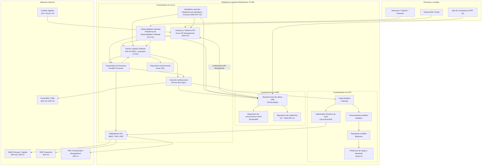

# Alternativa B - C4 Nivel 2 Contenedores

## Proposito

Diagrama de contenedores C4 para la Alternativa B. Este nivel hace zoom dentro de la Plataforma Logistica RutaExpress TO BE y muestra aplicaciones, servicios ejecutables y repositorios de datos.

> Regla aplicada: los nombres priorizan la responsabilidad del contenedor; la tecnologia cloud aparece como detalle de implementacion.

## Como leer este diagrama para el comite

Este diagrama responde a la pregunta: **como se reparte la plataforma en aplicaciones, servicios y repositorios de datos en la Alternativa B**. El cambio respecto a A no es “mover el bus a otra nube”, sino **empaquetar el core y coordinarlo por orquestacion**.

| Elemento | Como interpretarlo |
|---|---|
| Nucleo Logistico Modular | Un contenedor con OMS + Inventario; no hay microservicio de inventario separado. |
| Orquestador de Procesos | Coordina la Saga sincrona/semi-sincrona y compensaciones. |
| Canal de notificaciones | Fan-out informativo; no es Bus de Eventos Central (PLT-03) de consistencia. |
| Backend movil AWS | Offline-first; confirma al nucleo por API tras sincronizar. |
| Flechas | Preferentemente comandos/APIs en el core; notificaciones hacia consumidores. |

Flujo para explicar:

1. El cliente entra por Azure API Management (APP-01).
2. El Nucleo Modular registra/valida la orden y dispara el Orquestador.
3. El Orquestador ejecuta reserva/liberacion via modulos internos y ACL hacia WMS/ERP/TMS.
4. Al completar pasos, se publican notificaciones a portal, movil y GCP.
5. La App de Conductores opera offline; el backend AWS confirma eventos al nucleo por API idempotente.
6. No existe un hub event-driven corporativo equivalente a PLT-03 de la Alternativa A.

Mensaje clave para el comite: **la Alternativa B simplifica el core con monolito modular y orquestacion, a costa de menor desacoplamiento y menor absorcion natural de picos frente a A**.

## Contenedores principales

| Contenedor | Tecnologia | Responsabilidad |
|---|---|---|
| Gateway y Gobierno API | Azure API Management (APP-01) | Contratos, OAuth/OIDC, cuotas, rate limiting y APIs mock. |
| Nucleo Logistico Modular | Azure AKS | OMS + Inventario + validacion/idempotencia. |
| Orquestador de Procesos | Azure Durable Functions | Saga orquestada y compensaciones. |
| Canal de notificaciones | Azure Service Bus topics | Fan-out informativo a consumidores. |
| Backend movil | AWS ECS/Lambda | Store-and-forward, acks, tracking y excepciones. |
| Evidencias | AWS S3 + KMS | Integridad y retencion de firmas/fotos. |
| Optimizador / analitica | GCP | Rutas dinamicas, BigQuery y modelos. |
