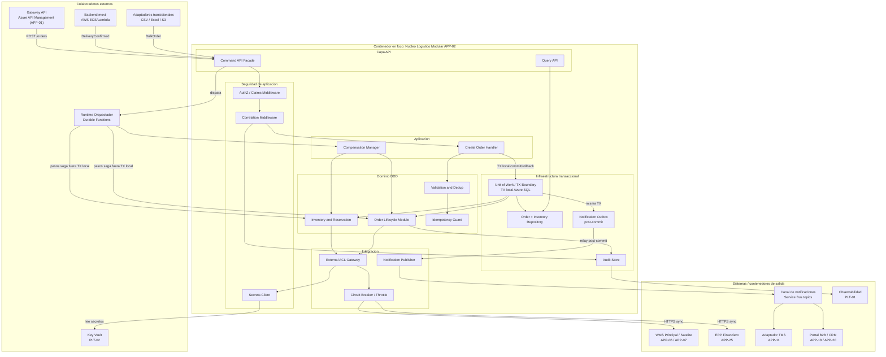

# Alternativa B - C4 Nivel 3 Componentes

## Proposito

Diagrama de componentes C4 para la Alternativa B. Este nivel hace zoom sobre un unico contenedor: **Nucleo Logistico Modular (APP-02 evolucionado)** en Azure.

> Regla aplicada: C4 Component debe descomponer un solo contenedor. API Management, Orquestador Durable Functions, Backend Movil, Key Vault (PLT-02), TMS, Portal/CRM y WMS/ERP aparecen como colaboradores o sistemas externos, no como componentes internos.

## Como leer este diagrama para el comite

Este diagrama responde a la pregunta: **como funciona internamente el Nucleo Logistico Modular**, incluyendo seguridad de aplicacion y limites transaccionales.

| Elemento | Como interpretarlo |
|---|---|
| Seguridad de aplicacion | AuthZ, Correlation y Secrets Client viven **dentro** del nucleo; Key Vault (PLT-02) queda afuera. |
| Unit of Work / TX Boundary | Frontera de transaccion **local** Azure SQL: orden + reserva logica + outbox en el mismo commit. |
| Saga orquestada | Pasos hacia WMS/ERP estan **fuera** de la TX local; fallos se compensan, no se hace 2PC. |
| Notification Outbox | Fan-out solo despues del commit; evita notificar estados no persistidos. |
| Circuit Breaker / ACL | Protege llamadas sincronas a legados sin mezclarlas con la TX del core. |

Flujo para explicar:

1. APIM o el backend movil envian un comando al Facade.
2. AuthZ y Correlation Middleware validan claims y correlation ID.
3. Create Order Handler abre Unit of Work: valida, deduplica, actualiza Order/Inventory y escribe Notification Outbox en la misma TX.
4. Al commit, el relay publica notificaciones; si falla el commit, no hay fan-out.
5. Durable Functions orquesta pasos hacia WMS/ERP **fuera** de esa TX; Compensation Manager revierte efectos de negocio.
6. Secrets Client obtiene credenciales de Key Vault para el ACL; Circuit Breaker/Throttle protege legados.
7. Audit Store conserva correlation ID para soporte.

Mensaje clave: **en B la consistencia fuerte es local al nucleo; la saga orquestada no es una transaccion distribuida unica**.

## Componentes del contenedor en foco

| Componente | Responsabilidad | Trazabilidad |
|---|---|---|
| Command API Facade / Query API | Comandos y lecturas versionadas. | INI-01 RF-01, RF-10 |
| AuthZ / Claims Middleware | Autorizacion por token/roles desde APIM. | SEG / INI-02 RF-02 |
| Secrets Client | Lectura de secretos hacia PLT-02. | SEG |
| Correlation Middleware | correlation ID obligatorio. | INI-01 RNF-05 |
| Validation and Dedup / Idempotency Guard | Validacion e idempotencia. | INI-01 RF-02 a RF-04 |
| Order Lifecycle / Inventory Reservation | Estado canonico y reservas. | INI-01 RF-05 a RF-09 |
| Unit of Work / TX Boundary | Commit/rollback local orden+stock+outbox. | Consistencia fuerte B |
| Notification Outbox | Publicacion post-commit. | INI-02 selectivo |
| Compensation Manager | Compensaciones de la saga. | INI-01 RF-08 |
| External ACL + Circuit Breaker | Integracion resiliente WMS/ERP/TMS. | INI-01 RF-12 |
| Audit Store | Auditoria y trazabilidad. | INI-01 RNF-08 |
