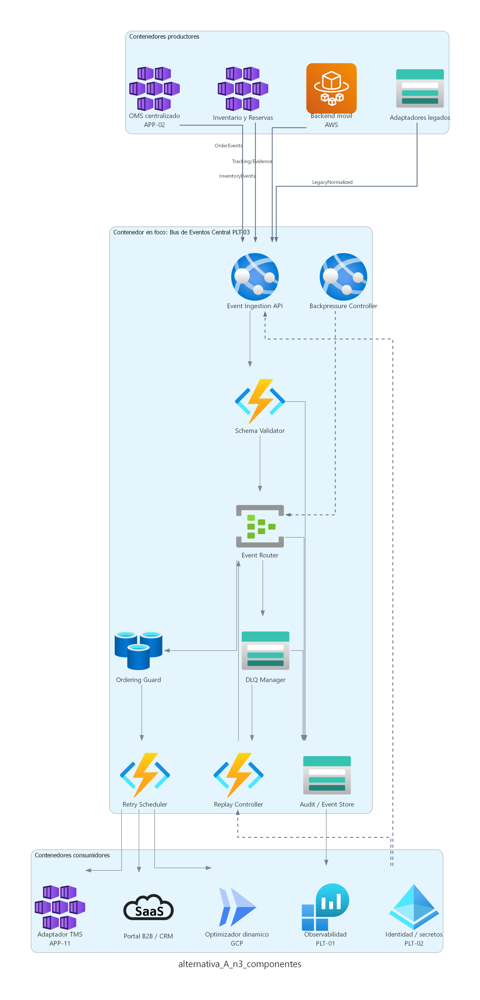

# Modelo A - Azure como hub central de integracion y gobierno

## Tesis del modelo

El Modelo A propone que Azure sea el plano principal de gobierno, integracion y operacion del TO BE de RutaExpress. En este modelo, **Orquestador de Pedidos (APP-02)** evoluciona a **OMS centralizado / Orquestador de Pedidos (APP-02)** en Azure, el gobierno de APIs se gestiona con **Azure API Management (APP-01)** y el **Bus de Eventos Central (PLT-03)** se implementa con Azure Event Hubs y Azure Service Bus.

AWS se mantiene como dominio especializado para ultima milla (**App de Conductores (APP-15)**), backend movil, operacion offline-first y evidencias (**Almacenamiento Evidencias (S3) (APP-16)**). GCP se mantiene como dominio especializado para optimizacion dinamica de rutas (**Optimizador de Rutas (GCP batch) (APP-12)** / **ML / Optimización de Rutas (GCP) (APP-24)**), analitica (**Plataforma de Analítica (GCP batch) (APP-22)**) y modelos predictivos.

Mensaje ejecutivo:

> El Modelo A reduce la complejidad de gobierno porque mantiene OMS centralizado / Orquestador de Pedidos (APP-02), Azure API Management (APP-01), Bus de Eventos Central (PLT-03), colas, Plataforma de Observabilidad Unificada (PLT-01) e identidad en un eje central, dejando AWS y GCP como dominios especializados conectados por puentes controlados.

## Alcance cubierto

| Iniciativa | Como la cubre el Modelo A |
|---|---|
| INI-01 Gestion unificada de ordenes e inventario | Orquestador de Pedidos (APP-02) evoluciona a OMS centralizado en Azure AKS; Inventario y Reservas se integran con WMS Principal (On Premises) (APP-06), WMS Satélite (On Premises local) (APP-07), TMS (Transportation Management) (APP-11) y ERP Financiero (On Premises) (APP-25) mediante APIs y eventos. |
| INI-02 Integracion API-first y event-driven | Azure API Management (APP-01) gobierna contratos; Bus de Eventos Central (PLT-03) con Event Hubs y Service Bus gestiona eventos, colas, DLQ, retry, replay y backpressure. |
| INI-03 Modernizacion de ultima milla | AWS soporta App de Conductores (APP-15), backend store-and-forward, DynamoDB logico y Almacenamiento Evidencias (S3) (APP-16) con KMS. |
| INI-04 Optimizacion dinamica de rutas | GCP ejecuta el optimizador dinamico y analitica, consumiendo eventos desde el Bus de Eventos Central (PLT-03). |
| INI-05 Observabilidad, seguridad y gobierno multinube | Azure centraliza Plataforma de Observabilidad Unificada (PLT-01), Plataforma de Identidad y Accesos (IAM) (PLT-02) y secretos, con integracion federada hacia AWS/GCP. |
| INI-06 Conciliacion financiera | OMS centralizado / Orquestador de Pedidos (APP-02), eventos, evidencias, TMS (Transportation Management) (APP-11) y ERP Financiero (On Premises) (APP-25) quedan trazados mediante correlation ID y auditoria de eventos. |

## Distribucion tecnologica

| Dominio | Rol en el Modelo A | Servicios representativos |
|---|---|---|
| Azure | Gobierno central, OMS centralizado / Orquestador de Pedidos (APP-02), Azure API Management (APP-01), Bus de Eventos Central (PLT-03), colas, observabilidad, identidad y adaptadores TMS (Transportation Management) (APP-11). | Azure API Management (APP-01), AKS, Azure SQL, Event Hubs, Service Bus, Entra ID, Key Vault, Monitor. |
| AWS | Ultima milla, backend movil, sincronizacion offline y evidencias. | ECS/Lambda, DynamoDB, S3, SQS/EventBridge, KMS, CloudWatch. |
| GCP | Optimizacion, analitica, modelos predictivos y tableros avanzados. | Cloud Run/GKE, Pub/Sub, Dataflow, BigQuery, Vertex AI. |
| On premises / SaaS | Sistemas transicionales y externos. | WMS Principal (On Premises) (APP-06) / WMS Satélite (On Premises local) (APP-07), ERP Financiero (On Premises) (APP-25), Portal B2B (Trazabilidad) (APP-18) / CRM de Atención al Cliente (APP-20), canales legados. |

## C4 Nivel 1 - Contexto

### Como leer el diagrama

Este nivel responde a la pregunta: **cual es el sistema en alcance y con quienes interactua**.

| Elemento | Interpretacion |
|---|---|
| Personas | Cliente B2B/Retail, conductor, operacion y finanzas. Representan usuarios y areas que consumen o producen informacion logistica. |
| Sistema en alcance | Plataforma Logistica RutaExpress TO BE. Es el sistema que agrupa capacidades de ordenes, inventario, despacho, ultima milla, evidencias, trazabilidad y conciliacion. |
| Sistemas externos | WMS Principal (On Premises) (APP-06), WMS Satélite (On Premises local) (APP-07), TMS (Transportation Management) (APP-11), ERP Financiero (On Premises) (APP-25), Portal B2B (Trazabilidad) (APP-18) / CRM de Atención al Cliente (APP-20), legados y servicios de mapas/trafico. |
| Flechas | Relaciones funcionales de alto nivel. En este nivel no se detallan tecnologias internas ni componentes. |

### Flujo explicado

1. El cliente crea ordenes y consulta trazabilidad.
2. El conductor ejecuta entregas y envia tracking, incidencias y evidencias.
3. Operacion supervisa pedidos, inventario, rutas, SLA y excepciones.
4. Finanzas consulta estados, evidencias y soportes de liquidacion.
5. La plataforma intercambia inventario con WMS Principal (On Premises) (APP-06), rutas con TMS (Transportation Management) (APP-11), valorizacion con ERP Financiero (On Premises) (APP-25) y trazabilidad con Portal B2B (Trazabilidad) (APP-18) / CRM de Atención al Cliente (APP-20).
6. Los canales legados se mantienen en transicion, pero su integracion pasa por mecanismos gobernados.

### Mensaje para el comite

El alcance funcional del Modelo A no es una aplicacion aislada. Es una plataforma logistica que coordina el ciclo completo de orden, inventario, despacho, entrega, evidencia y conciliacion.

## C4 Nivel 2 - Contenedores

### Como leer el diagrama

Este nivel responde a la pregunta: **como se reparte la plataforma en aplicaciones, servicios ejecutables, buses, colas y repositorios de datos**.

| Contenedor / grupo | Responsabilidad |
|---|---|
| Azure API Management (APP-01) | Expone APIs, contratos, seguridad, cuotas, rate limiting y APIs mock para MVP. |
| OMS centralizado / Orquestador de Pedidos (APP-02) | Gestiona ciclo de vida de ordenes, validacion, deduplicacion, idempotencia y estados. |
| Inventario y Reservas | Mantiene vista unificada de stock por SKU, almacen, ubicacion, lote y estado; ejecuta reservas, liberaciones y conciliaciones. |
| Azure SQL | Repositorio transaccional de OMS centralizado / Orquestador de Pedidos (APP-02), inventario, outbox, auditoria y estado operacional. |
| Bus de Eventos Central (PLT-03) — Event Hubs / Service Bus | Gestiona eventos canonicos, colas, DLQ, replay, priorizacion y backpressure. |
| Backend movil AWS (soporte App de Conductores (APP-15)) | Soporta store-and-forward, confirmaciones, reintentos, tracking y excepciones desde la app de conductores. |
| Almacenamiento Evidencias (S3) (APP-16) — S3/KMS | Conserva fotos, firmas, hashes y documentos de entrega con cifrado y auditoria. |
| Optimizador GCP (APP-12/APP-24) | Calcula rutas dinamicas usando trafico, capacidad, ventanas, cadena de frio, seguridad y SLA. |
| WMS / ERP / Portal / CRM | Sistemas externos o transicionales integrados mediante APIs/eventos y adaptadores. |

### Flujo principal del Modelo A

1. El cliente ingresa por Azure API Management (APP-01).
2. Azure API Management (APP-01) valida contrato, seguridad, cuotas y politicas antes de enviar la solicitud al OMS centralizado / Orquestador de Pedidos (APP-02).
3. El OMS centralizado / Orquestador de Pedidos (APP-02) valida la orden, aplica idempotencia, deduplicacion y registra estado en Azure SQL.
4. El servicio de Inventario y Reservas consulta y actualiza disponibilidad, reservas y liberaciones.
5. OMS centralizado / Orquestador de Pedidos (APP-02) e Inventario publican eventos canonicos al Bus de Eventos Central (PLT-03) en Azure.
6. Service Bus desacopla consumidores: TMS (Transportation Management) (APP-11), backend movil, Portal B2B (Trazabilidad) (APP-18) / CRM de Atención al Cliente (APP-20) y procesos de soporte.
7. App de Conductores (APP-15) opera con backend movil en AWS, guarda estado offline y evidencias en Almacenamiento Evidencias (S3) (APP-16).
8. El buffer movil AWS devuelve tracking, excepciones y evidencias hacia el Bus de Eventos Central (PLT-03) en Azure.
9. GCP consume eventos analiticos para optimizacion dinamica, BigQuery y prediccion.
10. Plataforma de Observabilidad Unificada (PLT-01) e identidad atraviesan los dominios con correlation ID, trazas, secretos y politicas.

### Decision arquitectonica representada

El hub operativo queda en Azure. Esto reduce puentes entre OMS centralizado / Orquestador de Pedidos (APP-02), Azure API Management (APP-01), Bus de Eventos Central (PLT-03), colas, TMS (Transportation Management) (APP-11) y observabilidad.

## C4 Nivel 3 - Componentes del Bus de Eventos Central (PLT-03) en Azure

### Como leer el diagrama

Este nivel responde a la pregunta: **como funciona internamente el contenedor critico Bus de Eventos Central (PLT-03) cuando Azure es el hub central**.

| Componente | Objetivo |
|---|---|
| Event Ingestion API | Recibe eventos canonicos desde OMS centralizado / Orquestador de Pedidos (APP-02), Inventario, backend movil y adaptadores legados. |
| Schema Validator | Valida contratos, versiones, estructura y compatibilidad de eventos. |
| Event Router | Enruta eventos por dominio, consumidor, prioridad, SLA y particion. |
| Ordering Guard | Mantiene secuencia por agregado para evitar desorden en ordenes, inventario y tracking. |
| Retry Scheduler | Aplica reintentos con backoff y jitter cuando consumidores o sistemas externos fallan. |
| DLQ Manager | Gestiona mensajes fallidos, causa de error, responsable y remediacion. |
| Replay Controller | Permite reprocesar eventos de forma auditada y controlada por rol. |
| Backpressure Controller | Reduce velocidad o prioriza trafico cuando WMS Principal (On Premises) (APP-06), ERP Financiero (On Premises) (APP-25), TMS (Transportation Management) (APP-11) o consumidores se degradan. |
| Audit / Event Store | Conserva trazabilidad, eventos relevantes y evidencias de intercambio. |

### Flujo interno del Bus de Eventos Central (PLT-03)

1. OMS centralizado / Orquestador de Pedidos (APP-02), Inventario, backend movil y adaptadores publican eventos.
2. Event Ingestion API recibe eventos y adjunta correlation ID cuando corresponde.
3. Schema Validator valida contrato, version y estructura.
4. Event Router distribuye eventos hacia topicos, particiones o colas.
5. Ordering Guard controla secuencia por agregado.
6. Retry Scheduler reintenta consumidores degradados.
7. DLQ Manager captura errores no recuperables.
8. Replay Controller permite reproceso aprobado.
9. Audit/Event Store deja evidencia del intercambio.
10. Plataforma de Observabilidad Unificada (PLT-01) consume metricas, logs y trazas para dashboards y alertas.

## Lineamientos y patrones aplicados

| Lineamiento | Aplicacion en el Modelo A |
|---|---|
| API-first | APIs gobernadas en Azure API Management (APP-01) con versionado, cuotas, seguridad y mocks. |
| Event-driven | Eventos canonicos en Bus de Eventos Central (PLT-03), con DLQ, replay, retry, backpressure e idempotencia. |
| Seguridad | Entra ID, Key Vault, KMS, minimo privilegio, cifrado en transito/reposo y secretos administrados. |
| Observabilidad | OpenTelemetry, correlation ID, logs estructurados, tableros de ordenes, inventario, colas, rutas y SLA. |
| Resiliencia | Outbox/inbox, saga, circuit breaker, retry con jitter, DLQ, replay controlado y store-and-forward movil. |
| Gobierno multinube | Azure como control principal; AWS y GCP integrados mediante puentes controlados, politicas y Plataforma IaC (PLT-04). |
| FinOps | Servicios administrados de costo intermedio, medicion por dominio y escalamiento gradual para MVP. |

## Fortalezas

| Fortaleza | Impacto |
|---|---|
| Menor dispersion del gobierno | OMS centralizado / Orquestador de Pedidos (APP-02), Azure API Management (APP-01), Bus de Eventos Central (PLT-03), colas, identidad y observabilidad quedan cercanos. |
| Mejor alineamiento con Hito 1 | Orquestador de Pedidos (APP-02) evoluciona a OMS centralizado sin crear una nueva aplicacion. |
| Menor riesgo de MVP | Azure API Management (APP-01), OMS centralizado / Orquestador de Pedidos (APP-02) y Bus de Eventos Central (PLT-03) pueden operar juntos desde el inicio. |
| Trazabilidad mas directa | Correlation ID y eventos se gestionan desde el plano central. |
| Menor complejidad de puentes | AWS y GCP se conectan al hub, pero no gobiernan el flujo principal. |

## Riesgos y mitigaciones

| Riesgo | Mitigacion |
|---|---|
| Azure se convierte en punto central critico. | Alta disponibilidad, particionamiento, multi-region segun criticidad, pruebas de carga y DR. |
| Saturacion del Bus de Eventos Central (PLT-03) en campanas. | Backpressure, particiones, colas por consumidor, limites por SLA y autoscaling. |
| Consistencia eventual entre OMS centralizado / Orquestador de Pedidos (APP-02), WMS Principal (On Premises) (APP-06) y ERP Financiero (On Premises) (APP-25). | Saga, compensaciones, auditoria de estado y conciliacion controlada. |
| Perdida de evidencias offline. | Store-and-forward cifrado, acks por evento, hash de evidencia y reintentos automaticos. |
| Complejidad multinube. | Plataforma IaC (PLT-04), politicas, secretos centralizados, observabilidad federada y ownership por dominio. |

## Decision solicitada al comite

Se solicita validar si el Modelo A puede ser aprobado como arquitectura base del primer TO BE/MVP, considerando estas condiciones:

- Orquestador de Pedidos (APP-02) evoluciona formalmente a OMS centralizado.
- Bus de Eventos Central (PLT-03) queda en Azure como hub central de eventos.
- AWS se mantiene para ultima milla (App de Conductores (APP-15)) y evidencias (Almacenamiento Evidencias (S3) (APP-16)).
- GCP se mantiene para optimizacion y analitica.
- El MVP debe incluir idempotencia, DLQ, replay, backpressure, correlation ID y observabilidad desde el inicio.

## Cierre ejecutivo

El Modelo A es la alternativa con menor friccion para el primer TO BE porque concentra el gobierno donde viven OMS centralizado / Orquestador de Pedidos (APP-02), Azure API Management (APP-01) y TMS (Transportation Management) (APP-11), conserva las capacidades moviles en AWS y usa GCP para optimizacion sin convertirlo en plano de gobierno operativo.
