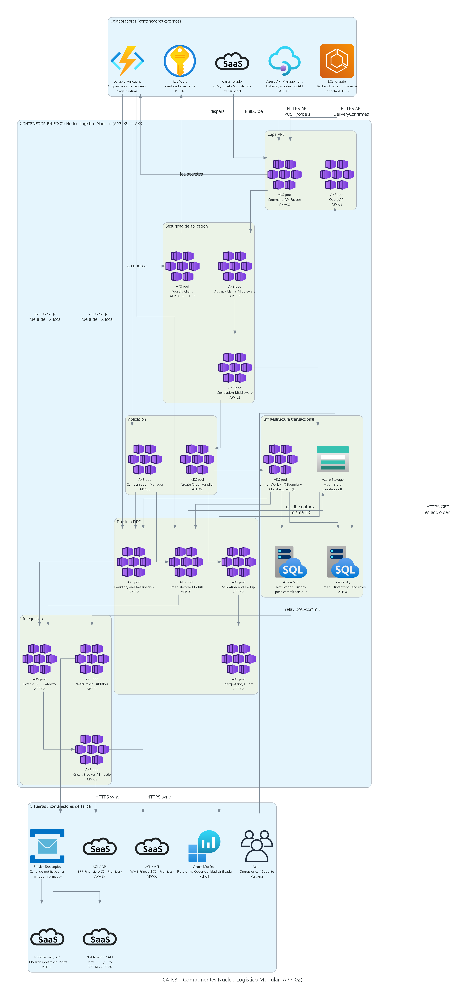

# Modelo B - Orquestacion + Monolito Modular

## Tesis del modelo

El Modelo B propone un **estilo arquitectonico distinto** al Modelo A. En lugar de microservicios coreografiados por un Bus de Eventos Central (PLT-03), concentra OMS e Inventario en un **monolito modular** (APP-02 evolucionado) y coordina el ciclo orden-reserva-despacho con una **Saga orquestada** (Azure Durable Functions).

El camino feliz es **API-first sincrono** con Azure API Management (APP-01). Los eventos existen solo como **notificaciones de dominio** para fan-out a TMS, portal, ultima milla y GCP. AWS conserva App de Conductores (APP-15), store-and-forward y evidencias. GCP conserva optimizacion y analitica.

Mensaje ejecutivo:

> El Modelo B no cambia de nube el hub de eventos: cambia el estilo de solucion. Gana simplicidad y consistencia fuerte en el core; cede desacoplamiento y absorcion natural de picos frente al Modelo A.

## Alcance cubierto

| Iniciativa | Como la cubre el Modelo B |
|---|---|
| INI-01 Gestion unificada de ordenes e inventario | Nucleo modular APP-02 (OMS + Inventario) en AKS con Azure SQL y validacion/idempotencia internas. |
| INI-02 Integracion API-first y event-driven | Azure API Management (APP-01) gobierna APIs; eventos selectivos como notificacion (sin PLT-03 completo). |
| INI-03 Modernizacion de ultima milla | AWS concentra backend movil, store-and-forward, DynamoDB y S3/KMS; confirma al nucleo por API idempotente. |

## Distribucion tecnologica

| Dominio | Rol en el Modelo B | Servicios representativos |
|---|---|---|
| Azure | APIs, nucleo modular, orquestador, SQL, identidad y observabilidad core. | Azure API Management (APP-01), AKS, Durable Functions, Azure SQL, Service Bus topics, Entra ID, Key Vault, Monitor. |
| AWS | Ultima milla, sync offline y evidencias. | ECS/Lambda, DynamoDB, S3, KMS, CloudWatch. |
| GCP | Optimizacion, analitica y prediccion. | Cloud Run/GKE, Pub/Sub, Dataflow, BigQuery, Vertex AI. |
| On premises / SaaS | Sistemas transicionales via ACL/API. | WMS APP-06/07, ERP APP-25, TMS APP-11, Portal/CRM, legados. |

## C4 Nivel 1 - Contexto

### Como leer el diagrama

Este nivel responde a la pregunta: **cual es el sistema en alcance y con quienes interactua**.

| Elemento | Interpretacion |
|---|---|
| Personas | Cliente B2B/Retail, conductor, operacion y finanzas. |
| Sistema en alcance | Plataforma Logistica RutaExpress TO BE bajo orquestacion + monolito modular. |
| Sistemas externos | WMS, TMS, ERP, Portal/CRM, legados y mapas/trafico. |
| Flechas | Relaciones funcionales. El estilo interno se ve en Nivel 2. |

### Flujo explicado

1. El cliente crea ordenes y consulta trazabilidad.
2. El conductor ejecuta entregas y envia tracking, incidencias y evidencias.
3. Operacion supervisa pedidos, inventario, rutas, SLA y excepciones.
4. Finanzas consulta estados, evidencias y soportes de liquidacion.
5. La plataforma intercambia inventario, rutas, valorizacion y trazabilidad con WMS, TMS, ERP y portal/CRM.
6. La diferencia del modelo aparece en el empaquetado y la coordinacion interna, no en el alcance.

### Mensaje para el comite

El alcance funcional del Modelo B es equivalente al del Modelo A, pero su decision estructural cambia el estilo: orquestacion + modular monolith frente a EDA + microservicios.

## C4 Nivel 2 - Contenedores

### Como leer el diagrama

Este nivel responde a la pregunta: **como se reparte la plataforma cuando el core es un monolito modular orquestado**.

| Contenedor / grupo | Responsabilidad |
|---|---|
| Azure API Management (APP-01) | APIs, contratos, seguridad, cuotas, rate limiting y mocks. |
| Nucleo Logistico Modular APP-02 | OMS + Inventario + validacion/idempotencia en un deploy. |
| Orquestador de Procesos | Durable Functions; Saga, timeouts y compensaciones. |
| Azure SQL | Estado transaccional unico del core. |
| Canal de notificaciones | Fan-out informativo (no hub de consistencia PLT-03). |
| Adaptadores ACL | Integracion hacia WMS, TMS y ERP con circuit breaker/throttle. |
| Backend movil AWS | Store-and-forward, tracking, acks y excepciones. |
| Evidencias AWS S3/KMS | Fotos, firmas, hashes y retencion. |
| GCP optimizacion/analitica | Consume notificaciones/APIs para rutas y analitica. |

### Flujo principal del Modelo B

1. El cliente ingresa por Azure API Management (APP-01).
2. El Nucleo Modular valida, deduplica y registra la orden.
3. El Orquestador ejecuta reserva/liberacion y llama ACL hacia WMS/ERP/TMS.
4. Si un paso falla, Compensation Manager revierte efectos parciales.
5. Se publican notificaciones a portal, movil y GCP.
6. La app offline sincroniza en AWS y confirma al nucleo por API idempotente.
7. No hay Bus de Eventos Central (PLT-03) como eje de consistencia.

### Decision arquitectonica representada

El centro de gravedad es el nucleo transaccional orquestado. Los eventos no gobiernan el estado core.

## C4 Nivel 3 - Componentes del Nucleo Logistico Modular

### Como leer el diagrama

Este nivel responde a la pregunta: **como funciona internamente el Nucleo Logistico Modular**.

| Componente | Objetivo |
|---|---|
| Command API Facade | Recibe comandos versionados e idempotentes. |
| Validation and Dedup | Valida datos y evita duplicados. |
| Order Lifecycle | Estado canonico de la orden. |
| Inventory and Reservation | Stock, reserva, liberacion y conciliacion logica. |
| Compensation Manager | Compensa reservas/estados ante fallas. |
| External ACL Gateway | Circuit breaker/throttle hacia WMS/ERP/TMS. |
| Notification Publisher | Emite notificaciones informativas. |
| Audit Store | Correlation ID y auditoria. |

### Flujo interno del nucleo

1. APIM o backend movil envian un comando al Facade.
2. Validation and Dedup rechaza invalidos/duplicados.
3. Order e Inventory actualizan estado en la misma unidad de despliegue/BD.
4. Durable Functions orquesta pasos y dispara compensaciones.
5. ACL protege integraciones externas.
6. Notification Publisher informa a consumidores sin ser source of truth.
7. Audit Store habilita soporte y conciliacion.

## Lineamientos y patrones aplicados

| Lineamiento | Aplicacion en el Modelo B |
|---|---|
| API-first | Azure API Management (APP-01) gobierna contratos y mocks. |
| Orquestacion | Saga orquestada con Durable Functions. |
| Modular Monolith | OMS + Inventario en un deploy con limites DDD. |
| Eventos selectivos | Notificaciones de fan-out, no EDA completa. |
| Seguridad | Entra ID/Key Vault + federacion AWS. |
| Observabilidad | OpenTelemetry, App Insights y correlation ID. |
| Resiliencia | Circuit breaker, bulkhead, throttle y store-and-forward movil. |
| FinOps | Menos mensajeria corporativa; concentracion de compute en Azure core. |

## Fortalezas

| Fortaleza | Impacto |
|---|---|
| Menor complejidad inicial | Menos buses, consumers y contratos de eventos. |
| Consistencia fuerte en el core | Orden y reserva en la misma BD/deploy. |
| Debugging mas directo | Workflow explicito frente a coreografia. |
| MVP mas rapido | Flujo orden-reserva demostrable con APIs mock. |
| Ultima milla intacta | Conserva AWS para offline y evidencias. |

## Riesgos y mitigaciones

| Riesgo | Mitigacion |
|---|---|
| Nucleo/orquestador como cuello de botella. | Escalado AKS, limites de concurrencia, pruebas 3x. |
| Propagacion de latencia sincrona a WMS/ERP. | Circuit breaker, bulkhead, estados pendientes y throttle por SLA. |
| Menor capacidad de replay/DLQ corporativo. | Auditoria + reproceso por comandos idempotentes. |
| Rework si luego se adopta EDA. | Puertos/adaptadores y limites de modulo claros. |
| Perdida offline. | Store-and-forward cifrado y acks antes de borrar local. |

## Decision solicitada al comite

Se solicita validar el Modelo B como **alternativa de contraste** bajo estas condiciones:

- Se acepta orquestacion + monolito modular como estilo distinto a EDA.
- Se acepta cobertura parcial de INI-02 (API-first fuerte, eventos selectivos).
- Se reconoce menor resiliencia natural ante Cyber Days vs Modelo A.
- Se mantiene AWS para ultima milla y GCP para analitica.
- Se usa B para evaluar trade-off simplicidad vs desacoplamiento, no como baseline por defecto.

## Cierre ejecutivo

El Modelo B es tecnicamente viable y acelera el MVP del core orden-inventario, pero no es la mejor respuesta a la casuistica de campanas e integridad multinube de RutaExpress. Sirve como alternativa real de estilo; el Modelo A permanece preferible para el primer TO BE.
