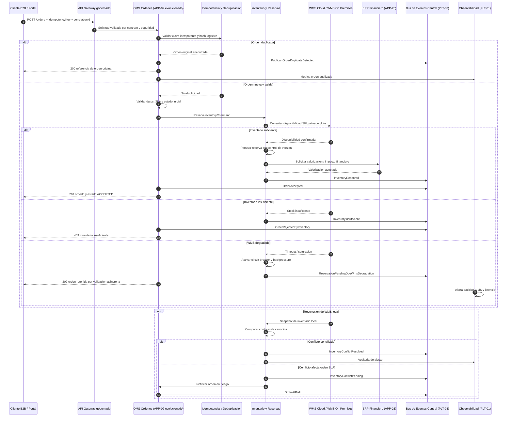

# Secuencia INI-01 - Ordenes, inventario y conciliacion

## Trazabilidad

- RF cubiertos: RF-01 a RF-12 de INI-01.
- Historias cubiertas: `HU-INI01-RF01` a `HU-INI01-RF12`.
- Escenarios clave: orden valida, pedido duplicado, reserva de inventario, inventario insuficiente, degradacion de WMS y conciliacion de inventario.

## Diagrama Mermaid

## Patrones aplicados

- DDD y microservicios por dominio de orden e inventario.
- API Gateway, contratos versionados, idempotency key y deduplicacion por hash.
- Saga orden-inventario-valorizacion con eventos de compensacion.
- Outbox, circuit breaker, backpressure, DLQ y retry con backoff.
- Correlation ID end-to-end y auditoria funcional.
