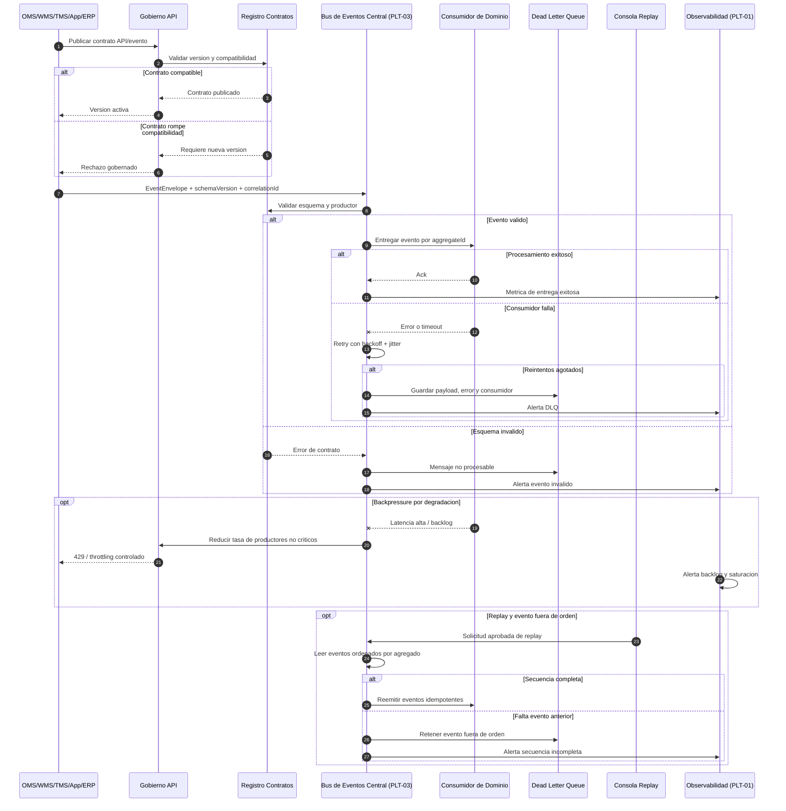

# Secuencia INI-02 - API-first, eventos y resiliencia

## Trazabilidad

- RF cubiertos: RF-01 a RF-12 de INI-02.
- Historias cubiertas: `HU-INI02-RF01` a `HU-INI02-RF12`.
- Escenarios clave: contrato API, publicacion de evento, validacion de esquema, DLQ, backpressure, replay y evento fuera de orden.

## Diagrama Mermaid

## Patrones aplicados

- API-first con OpenAPI/AsyncAPI y versionamiento.
- Event-Driven Architecture con envelopes canonicos.
- Outbox/Inbox, idempotencia, retry con backoff, backpressure y DLQ.
- Replay controlado, orden por agregado y auditoria.
