# Secuencia INI-03 - Ultima milla, evidencias y excepciones

## Trazabilidad

- RF cubiertos: RF-01 a RF-13 de INI-03.
- Historias cubiertas: `HU-INI03-RF01` a `HU-INI03-RF13`.
- Escenarios clave: entrega offline, sincronizacion store-and-forward, evidencia corrupta, excepcion de ultima milla, cambio de dispositivo y tracking retrasado.

## Diagrama Mermaid

```mermaid
sequenceDiagram
    autonumber
    participant Driver as App de Conductores (APP-15)
    participant Local as Outbox local cifrado
    participant Sync as Sincronizacion Movil
    participant Evid as Evidencias y Excepciones
    participant S3 as Almacenamiento Evidencias S3 (APP-16)
    participant TMS as TMS (APP-11)
    participant BUS as Bus de Eventos Central (PLT-03)
    participant Portal as Portal B2B / CRM
    participant OBS as Observabilidad (PLT-01)

    Driver->>Local: Registrar entrega, tracking y evidencia
    alt Sin conectividad
        Local->>Local: Cifrar y encolar eventos
        Driver-->>Driver: Operar con manifiesto local
    else Con conectividad
        Driver->>Sync: Enviar evento inmediato
    end

    Driver->>Sync: Recupera red y envia lote store-and-forward
    Sync->>Sync: Validar idempotencia, secuencia y correlationId
    alt Secuencia valida
        Sync->>Evid: Entrega/evidencia/tracking aceptado
        Evid->>S3: Guardar evidencia y validar hash
        alt Hash correcto
            S3-->>Evid: URI y checksum confirmado
            Evid->>BUS: EvidenceAccepted / DeliveryUpdated
            BUS->>TMS: Actualizar entrega/ruta
            BUS->>Portal: Estado consistente para cliente y CRM
            Sync-->>Driver: Ack por evento
        else Evidencia corrupta
            S3--xEvid: Hash no coincide
            Evid->>BUS: EvidenceCorrupted
            Evid->>OBS: Alerta y remediacion
            Sync-->>Driver: Reenviar evidencia
        end
    else Falta evento anterior
        Sync->>Local: Solicitar reenvio de secuencia incompleta
        Sync->>OBS: Alerta evento fuera de secuencia
    end

    opt Excepcion de ultima milla
        Driver->>Evid: DeliveryFailed + motivo + evidencia
        Evid->>Evid: Validar taxonomia y motivo obligatorio
        alt Motivo valido
            Evid->>BUS: LastMileExceptionRaised
            BUS->>TMS: Reasignar, reintentar o devolver
            BUS->>Portal: Publicar estado consistente
        else Falta motivo obligatorio
            Evid-->>Driver: Rechazo funcional
            Evid->>OBS: Auditoria de rechazo
        end
    end

    opt Cambio de dispositivo
        Driver->>Sync: Solicitar restauracion de ruta
        Sync->>Sync: Validar conductor, dispositivo y eventos aceptados
        Sync-->>Driver: Manifiesto y pendientes recuperados
    end

    opt Tracking retrasado
        Driver->>Sync: Enviar tracking con timestamp original
        Sync->>OBS: Detectar retraso mayor a 20 minutos
        Sync->>BUS: TrackingDelayed
    end
```

## Patrones aplicados

- Offline-first, store-and-forward e idempotencia por evento.
- Outbox local cifrado, acks por evento y retry con backoff.
- Event-Driven Architecture para estado de entrega, evidencias y excepciones.
- Auditoria, hash de integridad, correlation ID y observabilidad end-to-end.
