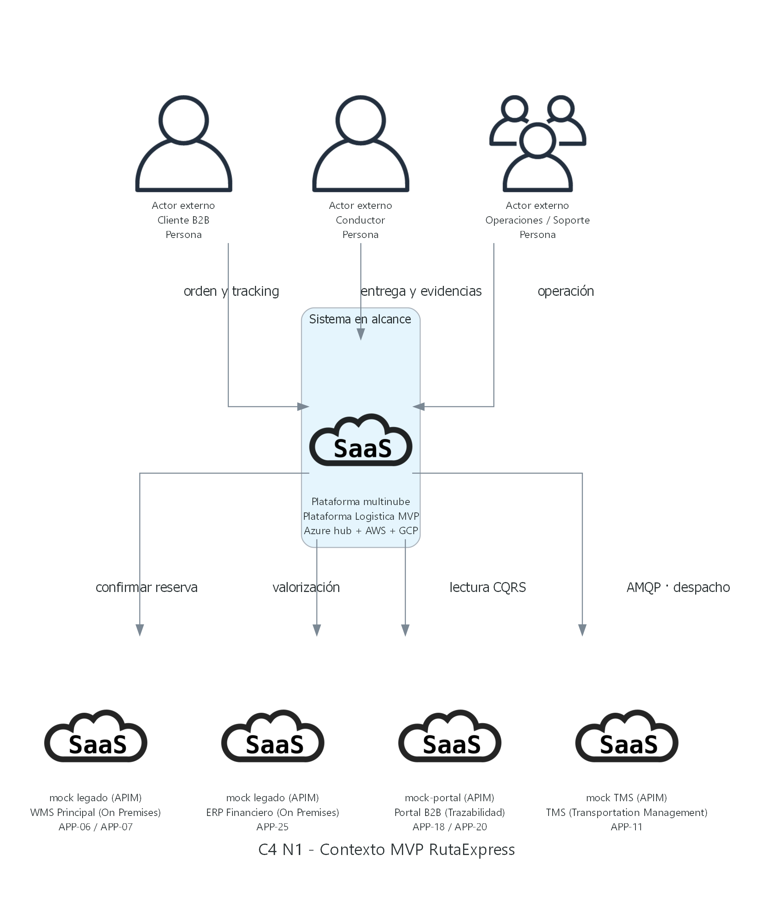

# C4 Model — MVP multinube RutaExpress

## 0. Propósito y alcance

Este documento explica la arquitectura del MVP de RutaExpress con el modelo C4:

- **Nivel 1 — Contexto:** personas y sistemas que interactúan.
- **Nivel 2 — Contenedores:** aplicaciones, workloads y servicios administrados distribuidos en Azure, AWS y GCP.
- **Nivel 3 — Componentes:** módulos lógicos dentro de un contenedor seleccionado.

La lectura está pensada para dos públicos:

- **Comité:** puede revisar §0, §2, §3.1, §3.3 y las imágenes de §4.
- **Equipo técnico:** debe revisar además protocolos, estados de implementación y decisiones arquitectónicas.

> **Corte de verificación:** 16 de julio de 2026. El documento diferencia explícitamente lo desplegado de lo parcial y de lo objetivo.

### 0.1 Documentos relacionados

- [Guion de exposición C4 — PPT 6a a 13](03b_Guion_Exposicion_C4_PPT_6a_13.md)
- [Dossier del MVP](02_Dossier_MVP_Alternativa_A.md)
- [IaC, costos y despliegue](04_IaC_Costos_Despliegue.md)
- [Catálogo de servicios por nube](05_Servicios_por_Nube_MVP.md)
- [Preguntas para el comité](06_Preguntas_Argumentos_Comite.md)

Las imágenes se generan desde:

`diagramas_c4/generar_diagramas_mvp_c4.py`

Todos los niveles usan Python `diagrams`, con iconos Azure y AWS para runtimes y servicios administrados. No se editan manualmente. Para regenerarlas:

```powershell
python "diagramas_c4/generar_diagramas_mvp_c4.py"
```

### 0.2 Convención del entregable — C4 enriquecido

Este entregable usa los niveles C4 como estructura de abstracción, pero **no utiliza una notación C4 pura**. Se agregan datos de despliegue, servicios cloud, protocolos y estado de implementación porque el comité debe evaluar una arquitectura multinube ejecutable.

| Nivel | Base C4 | Información agregada | Clasificación |
|---|---|---|---|
| N1 — Contexto | Personas, sistema en alcance y sistemas externos. | Proveedores cloud, protocolos y ubicación física de los mocks. | **Contexto C4 enriquecido**; no es N1 puro. |
| N2 — Contenedores | Unidades ejecutables y almacenes de datos. | Fronteras Azure/AWS/GCP, AKS, iconos Docker, ECS Fargate, PaaS y estado de integraciones. | **Diagrama híbrido de contenedores y despliegue**; no es N2 puro. |
| N3 — Componentes | Módulos internos de un contenedor seleccionado. | Runtime AKS/ECS, PaaS externos, protocolos y estado implementado/objetivo. | **Diagrama híbrido de componentes y runtime**; no es N3 puro. |

En N2, un **contenedor C4** sigue significando una aplicación ejecutable o almacén de datos. El icono Docker solo informa cómo se empaqueta el workload; no redefine el concepto C4. Una vista de despliegue pura mostraría por separado `AKS → Deployment → Pod → contenedor Docker`.

Texto breve para la presentación:

> "Usamos C4 como estructura de lectura, enriquecida con información de despliegue multinube. N1 incorpora protocolos y mocks; N2 combina contenedores lógicos con infraestructura cloud; y N3 combina componentes internos con su runtime. Por eso los diagramas son híbridos y no C4 puros."

### 0.3 Leyenda de estado

| Estado | Significado |
|---|---|
| **Implementado** | Existe código o configuración y el tramo se usa en el MVP. |
| **Parcial** | Existe infraestructura, endpoint o stub, pero no está completo de extremo a extremo. |
| **Objetivo** | Diseño previsto; aún no está cableado en el MVP. |
| **Mock** | Simulación controlada de un sistema externo o legado. |

En los PNG:

- **Flecha sólida:** comunicación implementada.
- **Flecha discontinua:** integración parcial u objetivo.
- **Caja de componente C4:** módulo lógico interno; fondo claro, borde azul y texto oscuro.
- **Icono AKS/ECS:** runtime de despliegue; no representa cada componente interno.
- **Icono oficial cloud:** servicio PaaS o recurso administrado.

### 0.4 Taxonomía usada

| Prefijo | Representa | Ejemplo |
|---|---|---|
| `INI` | Iniciativa de negocio | INI-01 Fulfillment |
| `APP` | Aplicación o capacidad de solución | APP-02 Orquestador de Pedidos |
| `PLT` | Plataforma transversal | PLT-03 Bus de Eventos Central |
| `MS` | Microservicio desplegable | MS-INI01-02 Inventario y Reservas |
| Servicio cloud | Tecnología administrada | Azure SQL, Event Hubs, DynamoDB |

Una aplicación puede contener uno o varios microservicios. Una plataforma ofrece capacidades compartidas. Un servicio cloud es la tecnología que soporta esos elementos, no un dominio de negocio.

#### Nomenclatura estable de workloads

Se usa **un solo nombre** por unidad desplegable. El nombre coincide con el artefacto de código o de despliegue; la responsabilidad se describe aparte, no como alias.

| Nombre canónico | Qué es | No usar como sinónimo |
|---|---|---|
| `bus-workers` | Deployment AKS de PLT-03 que lee outbox SQL y publica en Event Hubs | Publicador Outbox, Bus Workers |
| `retry-worker` | Segundo contenedor de la tarea ECS Fargate; puente SQS → EventBridge | SQS Bridge Worker, Retry Worker |
| `mobile-api` | Código/API del Backend móvil APP-15 | — |
| Backend móvil — APP-15 | Contenedor C4 / servicio ECS que ejecuta `mobile-api` | backend movil ultima milla |
| BFF del MVP | Deployment AKS Backend for Frontend | Demo Comité BFF |
| Adaptador AWS→Azure | Azure Function objetivo del puente EventBridge → Event Hubs | adaptador (sin más) |
| OMS — APP-02 | Orquestador de Pedidos | — |
| Inventario — MS-INI01-02 | Microservicio de reservas | — |

### 0.5 Protocolos

| Comunicación | Protocolo |
|---|---|
| Navegador o app → gateway público | API REST con JSON sobre HTTPS |
| APIM → OMS dentro de Azure | API REST con JSON sobre HTTP |
| OMS → Inventario dentro de AKS | API REST con JSON sobre HTTP |
| OMS → APIM para invocar el WMS mock | API REST con JSON sobre HTTPS |
| Publicación o consumo en Azure | AMQP 1.0 sobre TLS |
| Aplicación → Azure SQL | TDS sobre TLS |
| Aplicación → Redis | RESP sobre TLS |
| Workload → servicio AWS | AWS SDK que invoca la API HTTPS del servicio |
| Workload → servicio GCP | Cliente oficial de Google que invoca la API HTTPS del servicio |
| Módulos dentro del mismo proceso | Llamada en proceso |

Estas expresiones describen una sola pila, no alternativas. Por ejemplo, `API REST con JSON sobre HTTPS` significa: estilo REST, payload JSON y transporte HTTP cifrado con TLS. Del mismo modo, el AWS SDK es el cliente usado por el código para invocar una única API HTTPS del servicio AWS.

**TDS sobre TLS** significa *Tabular Data Stream* cifrado con TLS. TDS es el protocolo que utiliza el driver de Microsoft SQL Server/Azure SQL para ejecutar consultas y recibir resultados; no es una API REST. En el PNG N2 se abrevia como **TDS cifrado** para que la flecha sea legible.

Los PNG muestran el protocolo únicamente cuando aporta una decisión arquitectónica: entrada pública, cruce entre nubes, mensajería asíncrona o conexión especializada. Las tablas de flujos conservan el protocolo exacto de todos los pasos. Las llamadas entre componentes del mismo contenedor no son tráfico entre pods.

### 0.6 Conceptos del modelo C4

C4 explica responsabilidades y relaciones. Los límites cloud, clústeres, pods y tasks se muestran para dar contexto operativo, pero:

- un **contenedor C4** es una unidad ejecutable o almacén de datos;
- un **Kubernetes Deployment** administra las réplicas de un servicio en AKS;
- un **pod** es una instancia creada por ese Deployment;
- un **ECS Service** administra tasks sobre AWS Fargate;
- un **componente N3** es un módulo lógico dentro del contenedor.

Por eso una caja N3 no equivale a un pod.

### 0.7 Patrones arquitectónicos aplicados

Los patrones se documentan aparte porque explican decisiones de diseño, no los niveles del modelo C4.

#### Patrones estructurales

Definen la organización principal de la solución:

| Patrón | Aplicación en RutaExpress | Estado |
|---|---|---|
| Microservicios | OMS, Inventario, bus-workers y backend móvil como unidades desplegables separadas. | Implementado |
| Domain-Driven Design | Dominios Orden, Inventario y Entrega con responsabilidades propias. | Implementado a nivel de diseño y código |
| Event-Driven Architecture | Outbox y publicación canónica en Event Hubs. | Implementado en el tramo de órdenes |
| CQRS | Azure SQL para operación y BigQuery para lectura de tracking. | Objetivo; infraestructura GCP parcial |
| Saga | OMS coordina Inventario y WMS, con liberación compensatoria. | Implementado en el flujo HTTP |
| Resiliencia distribuida | Reintentos, DLQ, replay y backpressure. | Parcial; varias capacidades son objetivo |

#### Patrones de soporte

Refuerzan los patrones estructurales frente a problemas concretos:

| Patrón | Problema que resuelve | Aplicación |
|---|---|---|
| Outbox | Evita perder la intención de publicar después de persistir. | Azure SQL, DynamoDB objetivo y SQLite local. |
| Idempotencia | Evita repetir una operación por reintentos. | OMS e Inventario. |
| Deduplicación | Detecta la misma orden aunque cambie la clave de idempotencia. | Dedup Engine del OMS. |
| Store-and-forward | Conserva operaciones cuando no hay conectividad. | Outbox SQLite del dispositivo. |
| ACK | Confirma recepción o procesamiento según el contrato. | Mensajería y sincronización móvil. |
| DLQ y replay | Aísla y recupera mensajes fallidos. | Service Bus; replay gobernado como objetivo. |
| Circuit Breaker | Evita propagar fallos repetidos de un sistema externo. | Llamadas del OMS al WMS. |
| Backpressure | Ajusta consumo ante acumulación de mensajes. | Diseño objetivo del consumidor Service Bus. |
| Observabilidad correlacionada | Permite seguir una operación entre componentes y nubes. | Correlation ID, logs y métricas. |

#### Aplicación del patrón Outbox

El patrón outbox evita perder la intención de publicar un evento cuando también se modifica una entidad de negocio.

En el MVP se distinguen:

1. **Outbox de órdenes en Azure SQL:** el worker publica registros pendientes a Event Hubs.
2. **Outbox backend en DynamoDB:** diseño para entregas recibidas por AWS.
3. **Outbox local SQLite:** store-and-forward del dispositivo cuando no hay conectividad.

La versión actual del outbox de órdenes debe considerarse **básica**: la atomicidad completa entre escritura de negocio y escritura de outbox debe verificarse o reforzarse con una transacción SQL.

#### Aplicación del ACK

Un ACK confirma recepción o procesamiento según el contrato. No significa automáticamente que toda la cadena multinube terminó.

- En mensajería, `PeekLock + Complete` evita borrar antes de procesar.
- En última milla, el dispositivo debería eliminar su pendiente solo después de un ACK durable.
- El ACK actual del backend móvil es parcial; la persistencia completa en DynamoDB/S3 sigue pendiente.

---

## 1. Cómo leer el documento

La lectura recomendada es:

1. Identificar personas y sistemas en **N1**.
2. Seguir el recorrido entre Azure, AWS y GCP en **N2**.
3. Abrir solo el contenedor que se quiere explicar en **N3**.
4. Confirmar en cada tabla si el tramo está implementado, parcial o es objetivo.

Correspondencia con el PPT:

| PPT | Contenido |
|---|---|
| 6 | Contexto N1 |
| 7–8 | Distribución multinube y contenedores N2 |
| 9–10 | Componentes del OMS |
| 11 | Componentes de Inventario |
| 12 | Componentes del Bus |
| 13 | Componentes del Backend Móvil |

---

## 2. Nivel 1 — Diagrama de Contexto

### 2.1 Pregunta que responde

> ¿Quién usa la plataforma y con qué sistemas externos intercambia información?



### 2.2 Lectura guiada

1. **Cliente B2B** crea órdenes y consulta tracking.
2. **Conductor** registra entregas y evidencias.
3. **Operaciones / Soporte** supervisa el flujo y atiende excepciones.
4. La **Plataforma Logística MVP** coordina capacidades en Azure, AWS y GCP.
5. WMS, ERP, Portal B2B y TMS aparecen como contratos externos.
6. En el MVP esos legados se simulan mediante mocks o consumidores controlados.

### 2.3 Catálogo de actores y sistemas

| Elemento | Tipo C4 | Responsabilidad en el MVP |
|---|---|---|
| Cliente B2B | Persona | Alta de órdenes y consulta de estado. |
| Conductor | Persona | Entrega, novedad y evidencia. |
| Operaciones / Soporte | Persona | Supervisión, diagnóstico y recuperación. |
| Plataforma Logística MVP | Sistema en alcance | Orquestación, inventario, eventos, última milla y tracking. |
| WMS Principal APP-06 | Sistema externo simulado | Confirma o rechaza la operación física. |
| ERP Financiero APP-25 | Sistema externo simulado | Contrato futuro de valorización/conciliación. |
| Portal B2B APP-18/20 | Sistema externo simulado | Contrato de consulta de tracking. |
| TMS APP-11 | Sistema externo simulado | Consumidor objetivo de despacho/manifiesto. |

### 2.4 Qué no muestra N1

N1 no muestra microservicios, bases de datos, colas, pods ni detalles de implementación. Es una vista de negocio y relaciones externas.

---

## 3. Nivel 2 — Diagrama de Contenedores

### 3.1 Pregunta que responde

> ¿Qué unidades ejecutables y servicios administrados forman el MVP y cómo se distribuyen entre las tres nubes?

La figura se presenta únicamente en **formato vertical** para facilitar su inclusión y lectura en la diapositiva.

La responsabilidad estable se escribe dentro de cada contenedor. Las flechas solo se rotulan cuando representan el flujo principal, una integración objetivo o un cruce donde el protocolo resulta relevante. El detalle completo de cada paso queda en §3.4.


### 3.2 Lectura por nube

#### Azure — hub operativo

Azure concentra la entrada, la coordinación transaccional y el bus central:

| Elemento | Tipo C4 | Despliegue o tecnología | Responsabilidad | Estado |
|---|---|---|---|---|
| Frontend Web del MVP | Contenedor C4 cliente | Aplicación de página única en el navegador | Interfaz para comité y operaciones. | Implementado |
| Azure API Management APP-01 | Contenedor C4 administrado | Azure API Management | Entrada, enrutamiento y mocks. | Implementado |
| BFF del MVP | Contenedor C4 | Imagen Docker en un Kubernetes Deployment de AKS | Adapta la interfaz a las APIs del MVP. | Implementado |
| OMS APP-02 | Contenedor C4 | Imagen Docker en un Kubernetes Deployment de AKS | Alta de orden, idempotencia, Saga y consulta operativa. | Implementado |
| Inventario MS-INI01-02 | Contenedor C4 | Imagen Docker en un Kubernetes Deployment de AKS | Reserva y liberación de inventario. | Implementado |
| bus-workers — PLT-03 | Contenedor C4 | Imagen Docker en un Kubernetes Deployment de AKS | Lee registros outbox pendientes y los publica como eventos en Event Hubs. | Implementado |
| Azure SQL | Contenedor de datos C4 | Azure SQL administrado | Órdenes, inventario y outbox. | Implementado |
| Event Hubs PLT-03 | Servicio administrado externo a AKS | Azure Event Hubs | Stream canónico. | Implementado |
| Service Bus PLT-03 | Servicio administrado externo a AKS | Azure Service Bus | Colas, PeekLock y DLQ. | Objetivo; recurso provisionado |
| Azure Storage | Servicio administrado externo a AKS | Azure Storage | Evidencia y auditoría de eventos. | Parcial |
| Key Vault PLT-02 | Servicio administrado externo a AKS | Azure Key Vault | Secretos y llaves. | Parcial |
| Adaptador AWS→Azure | Contenedor serverless objetivo | Azure Function | Recibe desde EventBridge, normaliza el contrato y publica en Event Hubs. | Objetivo; no provisionado |
| Azure Monitor PLT-01 | Servicio administrado externo a AKS | Azure Monitor | Métricas y logs. | Parcial |

El clúster AKS es compartido. BFF, OMS, Inventario y bus-workers son deployments distintos; no son cuatro clústeres.

Azure Monitor, CloudWatch y Cloud Logging pertenecen respectivamente a Azure, AWS y GCP; por eso aparecen dentro de la frontera de su nube. En conjunto soportan la capacidad lógica **Plataforma de Observabilidad Unificada (PLT-01)**, pero no forman un único contenedor ni comparten despliegue.

**BFF** significa *Backend for Frontend*. El nombre oficial usado aquí es **BFF del MVP**. Es un backend dedicado a la interfaz web: recibe solicitudes del navegador, adapta respuestas y llama a APIM o al backend móvil. No reemplaza a APIM; APIM sigue siendo el gateway y punto de aplicación de políticas.

El icono Docker se conserva porque esta vista N2 es **híbrida**, no C4 pura: informa que BFF, OMS, Inventario y bus-workers se empaquetan como imágenes de contenedor. Cada imagen se despliega mediante un Kubernetes Deployment dentro del mismo AKS. El icono no significa que "contenedor C4" sea sinónimo de "contenedor Docker".

En el PNG actualizado existe una sola flecha **BFF → APIM**, rotulada `HTTPS`. Las flechas **APIM → OMS** y **OMS → APIM** no son duplicadas: la primera entrega órdenes al OMS; la segunda permite que la Saga invoque el WMS mock mediante APIM. También se consolidaron las conexiones OMS → SQL e Inventario → SQL para evitar líneas repetidas.

#### AWS — última milla

| Elemento | Tipo | Responsabilidad | Estado |
|---|---|---|---|
| Application Load Balancer | PaaS de entrada | Expone el backend móvil. | Implementado |
| Backend móvil — APP-15 | ECS Service sobre AWS Fargate | Recibe entrega y evidencia (`mobile-api`). | Parcial |
| `retry-worker` | Segundo contenedor de la misma tarea Fargate | Consume todos los eventos de SQS, los publica en EventBridge y reintenta si falla. | Stub/objetivo |
| DynamoDB | PaaS de datos | Outbox y seguimiento de ACK. | Parcial |
| S3 | PaaS de almacenamiento | Evidencias. | Parcial |
| KMS | PaaS de seguridad | Cifrado de evidencias. | Infraestructura |
| SQS | PaaS de mensajería | Buffer y DLQ del puente. | Objetivo; recurso provisionado |
| EventBridge | PaaS de integración | Inicio del puente hacia Azure. | Objetivo; sin target funcional |
| CloudWatch | PaaS de observabilidad | Logs y métricas AWS. | Parcial |

#### GCP — lectura CQRS

| Elemento | Tipo | Responsabilidad | Estado |
|---|---|---|---|
| Cloud Run | Contenedor serverless | Proyector de eventos hacia lectura CQRS. | Objetivo; recurso provisionado |
| Tracking Query API | Contenedor serverless en Cloud Run | Recibe consultas de tracking desde APIM. | Objetivo |
| BigQuery | PaaS analítico | Modelo de lectura de tracking. | Objetivo; recurso provisionado |
| Secret Manager | PaaS de seguridad | Secretos del workload. | Infraestructura |
| Cloud Logging | PaaS de observabilidad | Logs del proyector. | Infraestructura |

La proyección Event Hubs → Cloud Run → BigQuery no debe presentarse como flujo completo. Cloud Run requiere un mecanismo compatible de activación/ingesta; un consumidor AMQP permanente con escalado a cero no está resuelto en el MVP.

### 3.3 Mocks y sistemas externos

Los mocks no cambian la identidad del sistema legado:

| Nivel | Representación |
|---|---|
| N1 | WMS, ERP, Portal y TMS se muestran como sistemas externos. |
| N2 | Se indica qué contrato consume el MVP. |
| N3 APIM | Se explica la configuración que simula respuestas. |

Estado actual:

- **WMS:** ruta mock en APIM.
- **Portal B2B:** respuesta mock/estática; no consulta BigQuery.
- **ERP:** contrato simulado o fuera del happy path.
- **TMS:** consumidor objetivo de mensajería; no debe describirse simultáneamente como mock APIM activo.

### 3.4 Flujos end-to-end

#### Flujo A — Alta de orden y reserva

Este es el flujo operativo actual:

| Paso | De → A | Descripción | Protocolo | Estado |
|---|---|---|---|---|
| 1 | Cliente → Frontend → BFF | El cliente completa la orden y el BFF adapta la solicitud de la interfaz. | API REST con JSON sobre HTTPS | Implementado |
| 2 | BFF → APIM | El BFF entrega la orden al gateway central. | API REST con JSON sobre HTTPS | Implementado |
| 3 | APIM → OMS | APIM enruta la creación de la orden al Orquestador. | API REST con JSON sobre HTTP | Implementado |
| 4 | OMS → Azure SQL | El OMS guarda la orden y su registro outbox. | TDS sobre TLS | Implementado |
| 5 | OMS → Inventario Reserve API | La Saga solicita reservar el stock requerido. | API REST con JSON sobre HTTP | Implementado |
| 6 | Inventario → Azure SQL | Inventario persiste posiciones, reservas y outbox. | TDS sobre TLS | Implementado |
| 7 | OMS → APIM → WMS mock | La Saga solicita la confirmación física simulada del WMS. | API REST con JSON sobre HTTPS | Mock implementado |
| 8 | bus-workers → Azure SQL (tabla outbox) | El publicador consulta los eventos pendientes guardados junto con la transacción de la orden. | TDS sobre TLS | Implementado para órdenes |
| 9 | bus-workers → Azure Event Hubs | El publicador envía el evento canónico al servicio administrado de streaming. | AMQP 1.0 sobre TLS | Implementado para órdenes |

**Azure SQL outbox** no es un servicio diferente: es una tabla dentro de la misma base Azure SQL. El OMS guarda la orden y un registro de evento pendiente en una sola transacción. Después, **bus-workers** —código propio ejecutado en AKS— inicia una consulta a esa tabla y publica los registros pendientes. Por eso la flecha de comunicación correcta es `bus-workers → Azure SQL`, no al revés.

**Azure Event Hubs** es el servicio administrado que recibe y distribuye los eventos. Las comunicaciones quedan así: `OMS → Azure SQL` para escribir la orden y el outbox; `bus-workers → Azure SQL` para consultar pendientes; y `bus-workers → Event Hubs` para publicarlos.

> **No confundir:** **Bus de Eventos Central (PLT-03)** es el nombre de la capacidad arquitectónica completa; **Azure Service Bus** es solamente uno de sus servicios administrados. El publicador `bus-workers` pertenece a PLT-03, pero no pertenece a Azure Service Bus ni se ejecuta dentro de él. En el MVP publica en **Event Hubs**; la entrega posterior mediante **Service Bus** permanece como objetivo.

Diseño objetivo:

`Event Hubs → Schema Validator → Service Bus → Queue Consumer de Inventario`

Ese tramo aparece discontinuo porque no está cableado. La reserva actual no entra por Service Bus.

Compensación:

Si el WMS falla después de reservar, la Saga solicita `ReleaseInventory` por HTTP al microservicio de Inventario.

#### Flujo B — Entrega offline y evidencia

| Paso | De → A | Descripción | Protocolo | Estado |
|---|---|---|---|---|
| 1 | Conductor → App | El conductor registra la entrega, novedad y evidencia. | Interacción local | Implementado en demo |
| 2 | App → SQLite local | La app conserva el pendiente cuando no existe conectividad. | API local de SQLite | Diseño parcial |
| 3 | App → BFF | Al recuperar conectividad, la app sincroniza la entrega. | API REST con JSON sobre HTTPS | Implementado |
| 4 | BFF → ALB | El BFF remite la operación al punto de entrada de AWS. | API REST con JSON sobre HTTP | Implementado |
| 5 | ALB → Backend móvil | El balanceador entrega la solicitud a la task Fargate. | HTTP | Implementado |
| 6 | Backend → DynamoDB, S3 y KMS | El backend registra estado, guarda evidencia y aplica cifrado. | AWS SDK que invoca las APIs HTTPS | Lógica parcial |
| 7 | Backend/Outbox Relay → SQS | El diseño coloca `DeliveryCompleted` en una cola duradera para absorber fallos y reintentos. | AWS SDK que invoca la API HTTPS de SQS | Objetivo |
| 8 | `retry-worker` → EventBridge | El worker consume cada mensaje de SQS y publica el evento para su enrutamiento. | AWS SDK que invoca la API HTTPS de EventBridge | Objetivo |
| 9 | EventBridge → Adaptador AWS→Azure | EventBridge invoca el componente responsable del cruce de nube. | API REST con JSON sobre HTTPS | Objetivo |
| 10 | Adaptador AWS→Azure → Event Hubs | La función normaliza y publica el evento canónico en Azure. | AMQP 1.0 sobre TLS | Objetivo |

No se publica el mismo evento directamente en SQS y EventBridge. La secuencia objetivo es `backend/outbox → SQS → `retry-worker` → EventBridge → Adaptador AWS→Azure → Event Hubs`. **Todos los eventos pasan por SQS**: la cola no se reserva para fallos. SQS aporta almacenamiento temporal duradero, absorción de picos, reintentos y DLQ; EventBridge aporta enrutamiento. El mensaje contiene el evento `DeliveryCompleted` y metadatos de la evidencia —identificador, hash y referencia—, mientras que la foto o firma binaria permanece en S3.

El contenedor **`retry-worker`** traslada mensajes desde SQS hacia EventBridge. Si la publicación falla, no elimina el mensaje; SQS lo vuelve a hacer visible y, tras el máximo de intentos, lo envía a la DLQ. No es una Lambda: Terraform lo define como un segundo contenedor Node.js dentro de la misma tarea ECS Fargate que `mobile-api`. Su código actual es un stub.

El **Adaptador AWS→Azure** queda decidido como una **Azure Function objetivo**. EventBridge la invocará por HTTPS; la función validará y normalizará el evento al contrato canónico y lo publicará en Event Hubs mediante AMQP 1.0 sobre TLS. Todavía no está provisionada ni implementada.

#### Flujo C — Consulta de tracking CQRS

| Paso | De → A | Descripción | Protocolo | Estado |
|---|---|---|---|---|
| 1 | Event Hubs → Proyector | El mecanismo de ingesta entrega eventos al proyector CQRS. | Adaptador pendiente | Objetivo |
| 2 | Proyector → BigQuery | El proyector transforma y guarda el modelo de lectura. | API de BigQuery sobre HTTPS | Objetivo |
| 3 | Cliente B2B → Frontend → BFF | El usuario solicita el estado de su orden desde la interfaz web. | API REST con JSON sobre HTTPS | Implementado |
| 4 | BFF → APIM | El BFF envía la consulta al endpoint de tracking. | API REST con JSON sobre HTTPS | Implementado |
| 5 | APIM → mock-portal | APIM devuelve actualmente una respuesta simulada de tracking. | Política mock de APIM | Mock implementado |
| 6 | APIM → Tracking Query API | En el diseño objetivo, APIM enviará la consulta al backend de lectura en GCP. | API REST con JSON sobre HTTPS | Objetivo |
| 7 | Tracking Query API → BigQuery | El backend consultará la proyección analítica y devolverá el estado. | API de BigQuery sobre HTTPS | Objetivo |

La respuesta actual del portal es simulada. La infraestructura GCP prepara el patrón CQRS, pero la proyección y la lectura real no están cerradas.

#### Flujo D — DLQ y recuperación

| Paso | De → A | Descripción | Protocolo | Estado |
|---|---|---|---|---|
| 1 | Operaciones → Frontend/BFF | El operador inicia el escenario E5 mediante `POST /api/ops/dlq`. | API REST con JSON sobre HTTPS | Implementado en la demo |
| 2 | BFF del MVP → Service Bus `q-inventory` | El BFF (demo E5 / `dlq-demo.js`) actúa como productor de prueba y publica un evento `OrderCreated`. | AMQP 1.0 sobre TLS mediante Azure Service Bus SDK | Implementado |
| 3 | BFF del MVP ↔ Service Bus | El mismo código simula un consumidor fallido: recibe con PeekLock y abandona el mensaje repetidamente. | AMQP 1.0 sobre TLS mediante Azure Service Bus SDK | Implementado |
| 4 | `q-inventory` → subcola DLQ | Al superar `max_delivery_count = 10`, Service Bus mueve internamente el mensaje a `$deadletterqueue`. | Operación interna de Service Bus | Demostrable |
| 5 | BFF del MVP → DLQ | El BFF consulta la subcola, confirma el mensaje y devuelve el resultado a la interfaz de Operaciones. | AMQP 1.0 sobre TLS mediante Azure Service Bus SDK | Implementado |
| 6 | Replay Controller → `q-inventory` | El diseño permitiría corregir y republicar el mensaje con auditoría. | AMQP 1.0 sobre TLS | Objetivo; no implementado |

La **DLQ no es un contenedor ni un servicio independiente**: es la subcola `$deadletterqueue` de `q-inventory` dentro de Azure Service Bus, por eso comparte su icono. El productor de prueba tampoco es un despliegue adicional: es el **BFF del MVP** ejecutando `lib/dlq-demo.js`. **Operaciones** inicia y observa la prueba; **Replay Controller** es objetivo; la demo actual indica remediación manual en Portal (`Peek → Resubmit`).

La demo valida la capacidad nativa de Service Bus para mover y consultar mensajes en DLQ; no prueba Schema Validator, Dispatcher ni un Replay Controller completo.

### 3.5 Resumen del recorrido

```text
Cliente → Frontend → BFF → APIM → OMS → Inventario HTTP → SQL
                                  └→ WMS mock
                                  └→ Azure SQL: escribe orden + outbox
bus-workers → Azure SQL: consulta outbox pendiente
bus-workers → Event Hubs: publica evento

Conductor → App → BFF → ALB → Backend AWS
                              ├→ DynamoDB
                              ├→ S3
                              └→ SQS → puente objetivo → Event Hubs

Event Hubs → proyector objetivo → BigQuery → lectura CQRS objetivo
```

---

## 4. Nivel 3 — Diagramas de Componentes

### 4.0 Convenciones comunes

N3 abre un solo contenedor y muestra sus responsabilidades internas.

1. La frontera celeste grande identifica el **contenedor en foco**.
2. En Azure, el contenedor en foco es un **Kubernetes Deployment en AKS**. El Deployment administra sus pods como réplicas; no son alternativas de modelado.
3. En AWS, el contenedor en foco es un **ECS Service sobre AWS Fargate**, que administra sus tasks.
4. El runtime **AKS** o **ECS** queda declarado en el título del contenedor en foco; no se deja un icono suelto que abra huecos vacíos.
5. Las cajas de componente son módulos lógicos internos: fondo claro, borde azul y texto oscuro para contraste de lectura. Conservan la convención C4 de distinguir código propio frente a personas, workloads vecinos y PaaS.
6. Cada caja indica `Componente N3`, nombre y responsabilidad; no representa un pod, proceso ni servicio cloud independiente.
7. SQL, Event Hubs, Service Bus, DynamoDB, S3 y otros PaaS quedan fuera del contenedor.
8. Personas y otros workloads quedan como vecinos externos.
9. Flechas sólidas indican tramos implementados; discontinuas, parcial u objetivo.
10. Las etiquetas de flecha son mínimas y quedan junto a su trazo. Solo se rotulan acciones o protocolos que aportan decisión: entrada pública, cruce entre nubes, mensajería asíncrona, mocks o tramos objetivo. Las llamadas internas del mismo proceso no llevan texto.
11. Cuando hay varias zonas Azure —contenedor en foco, vecinos AKS y PaaS—, quedan **dentro de una sola frontera `Azure`**. Lo mismo aplica a AWS y GCP. No debe interpretarse como tres nubes Azure distintas.

Las vistas con PNG son:

| Sección | Contenedor en foco | PPT |
|---|---|---|
| §4.1 | `bus-workers` PLT-03 | 12 |
| §4.2 | OMS APP-02 | 10 |
| §4.3 | Backend móvil | 13 |
| §4.4 | Inventario MS-INI01-02 | 11 |

APIM y Proyector CQRS se documentan como vistas textuales porque no tienen PNG N3 en la presentación.

### 4.1 Vista A — Bus de Eventos Central PLT-03


#### Propósito

Explica la diferencia entre el código de `bus-workers` y los servicios administrados que forman la plataforma de eventos.

#### Contenedor en foco

`bus-workers` se despliega como un **Kubernetes Deployment** en el clúster AKS compartido. AKS crea y reemplaza los pods que ejecutan ese Deployment.

| Componente | Responsabilidad | Estado |
|---|---|---|
| Outbox Poller | Lee registros pendientes de Azure SQL. | Implementado |
| Event Hubs Publisher | Publica el evento canónico. | Implementado |
| Schema Validator | Validaría versión y contrato. | Objetivo |
| Service Bus Dispatcher | Enrutará eventos válidos a colas. | Objetivo |
| Replay Controller | Permitirá replay controlado y auditado. | Objetivo |
| Backpressure Controller | Ajustará concurrencia según profundidad de cola. | Objetivo |

#### Recorrido

| Paso | De → A | Descripción | Protocolo | Estado |
|---|---|---|---|---|
| 1 | OMS o Inventario → Azure SQL | El productor escribe estado y registro outbox en la misma transacción. | TDS sobre TLS | Implementado |
| 2 | Outbox Poller → Azure SQL | `bus-workers` consulta los pendientes y los entrega al Event Hubs Publisher. | TDS sobre TLS | Implementado |
| 3 | Event Hubs Publisher → Event Hubs | Publica el evento canónico al stream central. | AMQP 1.0 sobre TLS | Implementado |
| 4 | Event Hubs → Service Bus | Objetivo: Schema Validator valida el contrato y Service Bus Dispatcher enruta a colas de Inventario o TMS. | AMQP 1.0 sobre TLS | Objetivo |
| 5 | BFF → Service Bus | Demo E5: el BFF publica, abandona y confirma mensajes en la DLQ; Replay Controller es el remediador objetivo. | HTTPS + AMQP 1.0 sobre TLS | Demo / objetivo |

#### Aclaración para comité

PLT-03 no es un único proceso. La capacidad completa combina:

- código desplegado en `bus-workers`;
- Event Hubs como stream;
- Service Bus como cola/DLQ;
- almacenamiento y observabilidad como PaaS externos.

En el MVP, el tramo confirmado es: el OMS escribe el outbox en Azure SQL; `bus-workers` consulta esa tabla y luego publica el evento en Event Hubs.

### 4.2 Vista B — Orquestador de Pedidos APP-02


#### Propósito

Explica cómo el OMS recibe una orden, controla duplicados, coordina la Saga, persiste estado y publica eventos.

#### Componentes lógicos

| Zona | Componentes | Responsabilidad |
|---|---|---|
| API | Order API, Query API | Escritura y consulta operativa. |
| Aplicación | Create Order Handler, Saga Orchestrator | Caso de uso y coordinación. |
| Dominio DDD | Order Aggregate, State Machine, Dedup Engine, Idempotency Guard | Reglas, estados y control de duplicados. |
| Integración | Inventory Client | Reserva/liberación HTTP. |
| Infraestructura | Order Repository, Outbox Repository, Event Publisher | SQL y publicación a Event Hubs. |
| Resiliencia | Circuit Breaker, Correlation Middleware | Protección y trazabilidad. |

Estos nombres expresan responsabilidades arquitectónicas. No implican necesariamente una clase, proceso o pod independiente por cada caja.

#### Qué significan las cajas principales

- **Order API:** componente de entrada que recibe comandos REST para crear órdenes.
- **Query API:** componente de lectura operativa para consultar órdenes guardadas en Azure SQL; no es el tracking CQRS de GCP.
- **Saga Orchestrator:** componente de aplicación que coordina reserva, confirmación WMS y compensación.
- **Create Order Handler:** ejecuta el caso de uso y llama a dominio, persistencia y Saga.
- **Order Aggregate:** concentra reglas e invariantes del dominio Orden.
- **Repositories:** adaptan los componentes internos a Azure SQL.

Solo aparecen como cajas de componente porque pertenecen al código interno del OMS. APIM, Inventario, Azure SQL y Event Hubs se dibujan fuera del contenedor con su icono correspondiente porque son vecinos o servicios administrados.

#### Recorrido

Lectura rápida: entrada → dominio → persistencia + outbox → Saga externa → evento.

| Paso | De → A | Descripción | Protocolo | Estado |
|---|---|---|---|---|
| 1 | Cliente B2B → Order API | Llega vía Frontend, BFF y APIM. Correlation Middleware conserva el ID. | API REST sobre HTTPS/HTTP | Implementado |
| 2 | Order API → Create Order Handler | Arranca el caso de uso. | Llamada en proceso | Implementado |
| 3 | Create Order Handler → Order Aggregate | Antes aplica Dedup Engine e Idempotency Guard; el aggregate ejecuta reglas y State Machine cambia el estado. | Llamada en proceso | Implementado |
| 4 | Order Repository → Azure SQL | Persiste la orden; Outbox Repository guarda el evento pendiente en la misma transacción. | TDS sobre TLS | Implementado |
| 5 | Saga Orchestrator → Inventario | Coordina la reserva vía Inventory Client hacia Reserve API. | API REST sobre HTTP | Implementado |
| 6 | Saga Orchestrator → APIM → WMS mock | Circuit Breaker protege la llamada; APIM responde con la ruta `mock-wms` (no hay WMS real). | API REST sobre HTTPS | Mock implementado |
| 7 | Event Publisher → Event Hubs | Publica el evento canónico (vía outbox / `bus-workers`). | AMQP 1.0 sobre TLS | Implementado |

#### Decisión clave

La integración OMS → Inventario usa HTTP en el MVP. Service Bus es el diseño objetivo para desacoplar la reserva, no el camino operativo actual.

### 4.3 Vista C — Backend Móvil de Última Milla


#### Propósito

Explica la recepción de entregas y evidencias en AWS y el diseño store-and-forward hacia Azure.

#### Componentes lógicos

| Zona | Componentes | Responsabilidad | Estado |
|---|---|---|---|
| Canal | Delivery API | Recibe entrega/evidencia. | Implementado básico |
| Dominio | Delivery Handler | Coordina el caso de uso. | Parcial |
| Dominio | Exception Taxonomy Validator | Valida códigos de novedad. | Parcial |
| Dominio | Evidence Orchestrator | Coordina metadatos y archivo. | Parcial |
| Dominio | Hash Verifier SHA-256 | Verificación de integridad. | Parcial |
| Persistencia | Outbox Relay | Lee pendientes de DynamoDB. | Objetivo |
| Contenedor asociado | `retry-worker` | Consume todos los mensajes de SQS, publica en EventBridge y reintenta los fallidos. | Stub/objetivo |

El `retry-worker` no es un componente interno del proceso `mobile-api`: es un segundo contenedor Node.js dentro de la misma tarea ECS Fargate. La vista lo separa para no confundir procesos ejecutables.

#### Recorrido

| Paso | De → A | Descripción | Protocolo | Estado |
|---|---|---|---|---|
| 1 | Conductor → Delivery API | App registra entrega; si no hay red usa SQLite local y luego sincroniza vía BFF y ALB. | HTTPS / HTTP | Demo / parcial |
| 2 | Delivery API → Delivery Handler | Dominio valida novedad (Exception Taxonomy Validator), evidencia (Evidence Orchestrator) e integridad (Hash Verifier SHA-256). | Llamada en proceso | Parcial |
| 3 | Delivery Handler → DynamoDB | Persiste estado; Evidence Orchestrator guarda el archivo en S3 con cifrado KMS. | AWS SDK HTTPS | Parcial |
| 4 | Outbox Relay → EventBridge | Objetivo: encola en SQS; `retry-worker` consume y publica en EventBridge. | AWS SDK HTTPS | Objetivo |
| 5 | Adaptador AWS→Azure → Event Hubs | EventBridge invoca el adaptador; se publica el evento canónico en Azure. | HTTPS + AMQP | Objetivo |

#### Limitación explícita

La infraestructura AWS existe, pero persistencia durable, evidencia completa, bridge worker y puente multinube no deben presentarse como una cadena productiva terminada.

### 4.4 Vista D — Inventario y Reservas MS-INI01-02


#### Propósito

Explica el dominio nuevo de reservas. No representa al WMS APP-06 ni al sistema legado APP-08.

#### Componentes lógicos

| Zona | Componentes | Responsabilidad |
|---|---|---|
| API | Reserve API, Release API, Availability Query API | Contratos HTTP del dominio. |
| Aplicación | Reserve Handler, Release Handler | Casos de uso de reserva/liberación. |
| Dominio DDD | Inventory Aggregate, Reservation Policy | Reglas de stock y reserva. |
| Infraestructura | Reservation Repository, Position Repository, Outbox Repository, Event Publisher | Persistencia y eventos. |
| Resiliencia | Idempotency Guard, Optimistic Lock | Reintentos y concurrencia. |
| Objetivo | Queue Consumer | Consume comandos desde Service Bus. |
| Objetivo | Backpressure Controller | Regula concurrencia del consumidor. |

#### Recorrido actual

| Paso | De → A | Descripción | Protocolo | Estado |
|---|---|---|---|---|
| 1 | OMS → Reserve API | La Saga solicita reservar stock por HTTP. | API REST sobre HTTP | Implementado |
| 2 | Reserve API → Reserve Handler | Arranca el caso; Idempotency Guard evita doble aplicación. | Llamada en proceso | Implementado |
| 3 | Reserve Handler → Inventory Aggregate | Aplica invariantes; Reservation Policy decide la reserva. | Llamada en proceso | Implementado |
| 4 | Repositories → Azure SQL | Position Repository y Reservation Repository leen/escriben stock y reserva; Outbox Repository registra el evento. | TDS sobre TLS | Implementado |
| 5 | Event Publisher → Event Hubs | Publica el resultado de inventario. | AMQP 1.0 sobre TLS | Parcial |

Compensación: mismo camino con **Release API** y **Release Handler**.

#### Recorrido objetivo

| Paso | De → A | Descripción | Protocolo | Estado |
|---|---|---|---|---|
| 1 | Service Bus → Queue Consumer | El comando llega por cola; Backpressure Controller regula concurrencia. | AMQP 1.0 sobre TLS | Objetivo |
| 2 | Queue Consumer → Reserve Handler | El dominio procesa el comando y publica el resultado en Event Hubs. | Llamada en proceso | Objetivo |

El consumidor Service Bus aparece discontinuo porque aún no es el trigger operativo.

### 4.5 Vista E — API Management y mocks

APIM es el gateway de entrada y el punto de simulación de contratos legados.

| Configuración | Función | Estado |
|---|---|---|
| Ruta de órdenes | Enruta al OMS. | Implementado |
| Ruta mock WMS | Simula confirmación o fallo. | Implementado |
| Ruta mock portal | Devuelve tracking simulado. | Implementado |
| Políticas de seguridad avanzadas | JWT, rate limit y CORS según diseño. | Verificar/no afirmar como completas |
| Consulta real a BigQuery | Backend de lectura CQRS. | Objetivo |

Una policy de APIM es configuración del gateway, no un microservicio. Por eso esta vista textual no se equipara a un N3 de código de aplicación.

### 4.6 Vista F — Proyector CQRS en GCP

La vista objetivo separa escritura operativa y lectura:

```text
Event Hubs → adaptador/ingesta → Cloud Run → BigQuery → API de lectura → Portal
```

| Componente conceptual | Función | Estado |
|---|---|---|
| Event Consumer | Recibe eventos desde Azure. | Objetivo |
| Ingestion Adapter | Adapta el contrato para Cloud Run. | Objetivo |
| Schema Mapper | Convierte contrato canónico a modelo analítico. | Objetivo |
| Idempotency Guard | Evita aplicar dos veces el mismo evento. | Objetivo |
| BigQuery Writer | Inserta o actualiza el modelo de lectura. | Objetivo |
| Tracking Query API | Expone consultas al portal. | Objetivo |

Cloud Run y BigQuery pueden estar provisionados, pero eso no prueba la proyección end-to-end. Debe definirse un mecanismo de ingesta compatible con Cloud Run y su estrategia de escalado.

### 4.7 Aclaraciones frecuentes

| Pregunta | Respuesta corta |
|---|---|
| ¿Cada componente N3 es un pod? | No. Es un módulo lógico dentro del mismo contenedor. |
| ¿Por qué aparece AKS/ECS una sola vez? | Identifica el runtime del contenedor en foco. |
| ¿PaaS pertenece al pod? | No. El workload lo consume como servicio externo. |
| ¿Inventario usa HTTP o Service Bus? | HTTP en el MVP; Service Bus es objetivo. |
| ¿EventBridge publica directamente en Event Hubs? | No. El diseño objetivo usa un Adaptador AWS→Azure: recibe HTTPS, normaliza el contrato y publica en Event Hubs. |
| ¿APIM consulta BigQuery hoy? | No; la respuesta de tracking es mock/parcial. |
| ¿DLQ demuestra el bus completo? | No. Demuestra la capacidad nativa de Service Bus. |
| ¿Por qué no hay N4? | El código queda fuera del alcance de este entregable C4. |

Para preguntas ampliadas, usar [06_Preguntas_Argumentos_Comite.md](06_Preguntas_Argumentos_Comite.md).

---

## 5. Matriz consolidada de implementación

Esta tabla es la fuente de verdad para no confundir infraestructura con integración funcional.

| Capacidad | Recurso provisionado | Código/configuración | Integración E2E | Clasificación |
|---|---:|---:|---:|---|
| Entrada APIM → OMS | Sí | Sí | Sí | Implementado |
| OMS → Inventario por HTTP | Sí | Sí | Sí | Implementado |
| OMS → WMS mock | Sí | Sí | Sí | Mock implementado |
| Outbox órdenes → Event Hubs | Sí | Sí | Sí, con limitación de atomicidad | Implementado con limitación |
| Event Hubs → Service Bus | Sí | No | No | Objetivo |
| Service Bus → Inventario | Sí | Diseño | No | Objetivo |
| DLQ nativa Service Bus | Sí | Prueba controlada | Parcial | Parcial |
| Replay Controller | Sí en diagrama | Diseño | No | Objetivo |
| Backend móvil AWS | Sí | API básica | Parcial | Parcial |
| DynamoDB/S3/KMS para evidencia | Sí | Parcial | No completo | Parcial |
| SQS/EventBridge → Azure | Parcial | Stub | No | Objetivo |
| Cloud Run → BigQuery | Sí | Pendiente | No | Objetivo |
| Portal → BigQuery | Parcial | Mock | No | Objetivo |

---

## 6. Decisiones arquitectónicas

### 6.1 Azure como hub

Centraliza entrada, transacciones y eventos para reducir coordinación distribuida en el MVP.

### 6.2 AWS para última milla

ECS Fargate, DynamoDB, S3 y SQS permiten escalar el dominio móvil sin crear otro clúster Kubernetes.

### 6.3 GCP para lectura analítica

BigQuery soporta el modelo de lectura CQRS. La integración se mantiene separada del core transaccional.

### 6.4 Event Hubs y Service Bus no son equivalentes

- Event Hubs: stream de alto volumen y múltiples lectores.
- Service Bus: comandos/colas con PeekLock, reintentos y DLQ.

El diseño usa ambos porque resuelven problemas distintos, aunque el encadenamiento completo sea objetivo.

### 6.5 SQL compartida con aislamiento lógico

El MVP reduce costo operativo usando una plataforma SQL común. Cada dominio debe mantener tablas/esquemas y permisos separados para evitar acoplamiento.

### 6.6 Mocks antes de integrar legados

Los mocks permiten validar contratos, Saga y observabilidad sin depender de WMS, ERP o TMS reales. No sustituyen una prueba de integración productiva.

### 6.7 Estado objetivo visible

Los elementos futuros se mantienen en los diagramas con líneas discontinuas para explicar evolución, pero nunca deben presentarse como implementados.

---

## 7. Fuentes y mantenimiento

### 7.1 Fuente de verdad visual

El punto único de generación es:

`diagramas_c4/generar_diagramas_mvp_c4.py`

La fuente de todos los niveles es el generador Python basado en `diagrams`. Los nombres PNG se mantienen estables:

- `mvp_c4_n1_contexto_v4.png`
- `mvp_c4_n2_contenedores_v20.png`
- `mvp_c4_n3_oms_componentes.png`
- `mvp_c4_n3_inventario_componentes.png`
- `mvp_c4_n3_plt03_componentes.png`
- `mvp_c4_n3_mobile_componentes.png`

### 7.2 Regla de actualización

Cuando cambie una integración:

1. actualizar el código o IaC;
2. actualizar el generador Python;
3. regenerar PNG;
4. actualizar la matriz de §5;
5. actualizar el guion `03b`;
6. verificar protocolos y estado de flechas.

### 7.3 Contenido retirado por redundancia

La versión anterior repetía:

- catálogos N1 y N2;
- cada vista N3 dos veces;
- explicaciones de outbox, ACK y mocks;
- mapas de flechas equivalentes;
- un segundo resumen completo por servicio;
- Mermaid N1/N2 que podía divergir de los PNG.

Se conserva una sola fuente por tema. El catálogo cloud detallado vive en `05`, el guion oral en `03b` y las preguntas ampliadas en `06`.

---

## 8. Resumen ejecutivo

El MVP demuestra un hub operativo en Azure, una API de última milla en AWS y prepara una lectura CQRS en GCP.

El flujo confirmado es:

```text
APIM → OMS → Inventario por HTTP → WMS mock
              └→ Azure SQL/outbox → bus-workers → Event Hubs
```

AWS y GCP validan despliegue e infraestructura, pero varias integraciones permanecen parciales u objetivo. El valor arquitectónico está en hacer explícitos esos límites, mantener contratos claros y mostrar una evolución verificable sin confundir diseño futuro con funcionalidad ya terminada.
