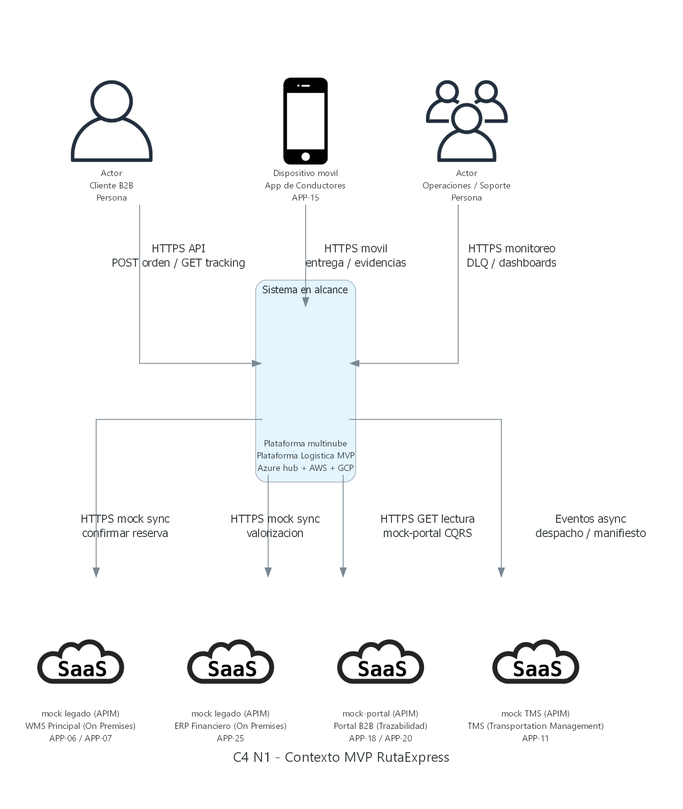
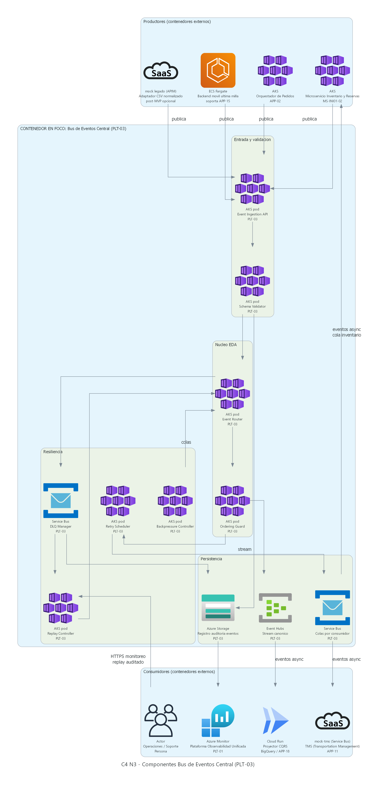
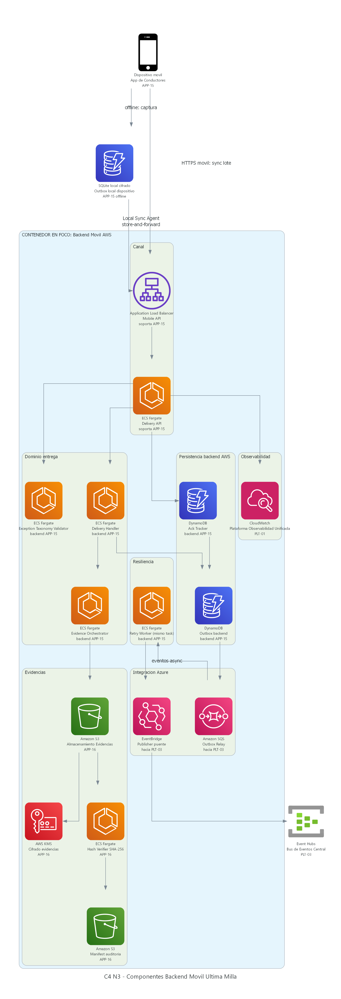
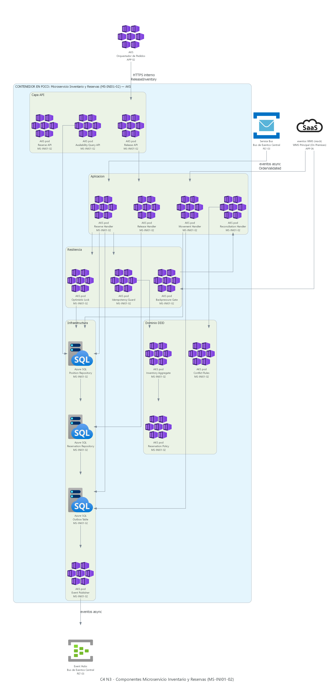
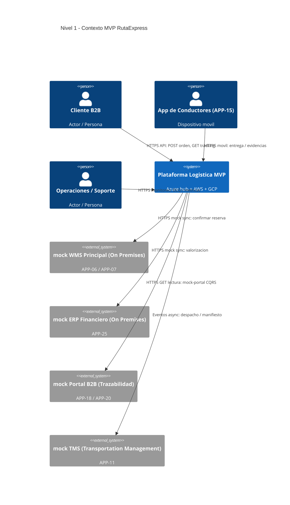
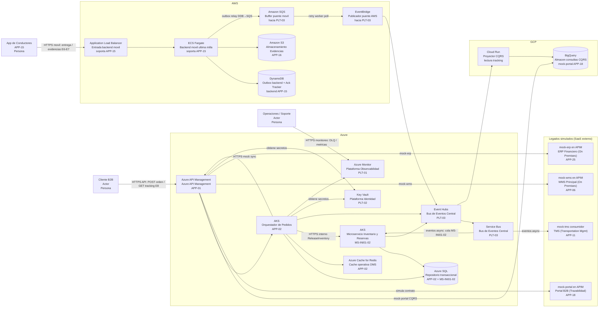

# C4 Model — MVP Hub central Azure
## RutaExpress Fulfillment & Transporte

> **Este es el documento más importante del Hito 3.** Explica qué es el C4 Model, cómo leerlo en este proyecto y presenta los tres niveles con detalle de componentes — incluyendo vistas tipo **cuadro físico** para el nivel 3. **Guía detallada de todos los diagramas N3 → §4.0.**

**Imágenes generadas:** ejecutar `python diagramas_c4/generar_diagramas_mvp_c4.py` → salida en `diagramas_c4/imagenes/`.

> **Convención obligatoria (regla de oro):** en textos, tablas y diagramas de este documento cada identificador va **siempre** con su nombre oficial. Catálogo APP/PLT → `HITO 1 - .../06_Mapa_Portafolio_Aplicaciones.md`. **Término técnico en inglés o sigla:** la primera vez en cada sección va con el significado breve entre paréntesis — p. ej. **jitter** (espera aleatoria entre reintentos), **ACK** (acuse de recibo), **outbox** (cola de salida de eventos), **DLQ** (cola de mensajes fallidos). Glosario completo: §1.4 y [`00_INDICE_COMITE.md`](00_INDICE_COMITE.md) §Glosario breve.

### 0.1 Iniciativas (INI), aplicaciones (APP), plataformas (PLT), microservicios (MS) y servicios en la nube

En este documento no se usan abreviaturas informales («apps», «ML» sin nombre de aplicación, «MS inventario»). Cada identificador va con su **nombre oficial** completo.

Al leer los diagramas y flujos conviven **cuatro familias de ID** de negocio/arquitectura, más una quinta capa de **servicios en la nube** del proveedor:

| Prefijo | Significado | Ejemplo en este MVP | ¿Es una aplicación del portafolio? |
|---|---|---|---|
| **INI-XX** | **Iniciativa** del roadmap Hito 1 (bloque de capacidades de negocio). Agrupa cambios sobre varias aplicaciones, plataformas y microservicios. | **INI-01**, **INI-02**, **INI-03** en alcance MVP | **No** — una iniciativa **no** es una aplicación |
| **APP-XX** | **Aplicación** del catálogo empresarial (26 aplicaciones: APP-01 … APP-26). Unidad reconocida por negocio y gobierno de TI. | **Orquestador de Pedidos (APP-02)**, **App de Conductores (APP-15)** | **Sí** |
| **PLT-XX** | **Plataforma** transversal habilitadora (observabilidad, identidad, bus de eventos, infraestructura como código). | **Bus de Eventos Central (PLT-03)** | Es plataforma, no aplicación de negocio |
| **MS-INIxx-yy** | **Microservicio** de una iniciativa. El prefijo **MS** abrevia solo el tipo *microservicio* en el ID; el nombre completo es obligatorio en el texto. | **Microservicio Inventario y Reservas (MS-INI01-02)** | **No** — ID **MS-INI01-02**, no **APP-XX** |

#### Diferencias: aplicación vs microservicio vs plataforma vs servicio en la nube

| Concepto | Qué representa | ¿Se despliega? | Relación con los demás |
|---|---|---|---|
| **Aplicación (APP-XX)** | Capacidad de negocio del portafolio Hito 1 (qué hace RutaExpress para el usuario o la operación). | Sí — como uno o más **contenedores** (workloads) en AKS, ECS, SaaS, etc. | Una aplicación **puede** implementarse con uno o varios microservicios, pero conserva **un solo ID APP**. Ej.: **Orquestador de Pedidos (APP-02)** corre en AKS. |
| **Microservicio (MS-INIxx-yy)** | Unidad técnica **acotada por dominio** (un bounded context — límite de dominio), desplegable de forma independiente. Nace de una **iniciativa** cuando no existe aplicación en el catálogo. | Sí — típicamente un contenedor en **AKS** (Kubernetes administrado) o **ECS Fargate** (contenedores sin administrar servidores). | **No** agrupa varias aplicaciones APP dentro. **No** es un catálogo de APP-XX. Usa **servicios en la nube** (Azure SQL, Event Hubs, DynamoDB) como dependencias. |
| **Plataforma (PLT-XX)** | Capacidad compartida por muchas aplicaciones (bus, identidad, observabilidad). | Sí — como servicios administrados multinube. | Las aplicaciones y microservicios **publican/consumen** la plataforma; no la contienen. |
| **Servicio en la nube** | Recurso del proveedor (Azure, AWS, GCP): **AKS**, **Azure SQL**, **Event Hubs**, **Amazon S3**, **BigQuery**. | Lo provisiona Terraform (**Plataforma IaC (PLT-04)**). | Es **infraestructura** donde corren aplicaciones y microservicios; **no** es una aplicación del portafolio ni un microservicio de negocio. |

**¿De qué se compone un microservicio?** Un microservicio —por ejemplo **Microservicio Inventario y Reservas (MS-INI01-02)**— es **una** unidad desplegable (imagen de contenedor en **AKS**), con **componentes internos** de software (API, repositorio, publicador de eventos — nivel 3 C4). Se apoya en **servicios en la nube** (Azure SQL, **Bus de Eventos Central (PLT-03)** vía Event Hubs). **No** está formado por varias aplicaciones APP-XX; convive con **Orquestador de Pedidos (APP-02)** como otro workload en el mismo cluster, pero cada uno con responsabilidad de dominio distinta.

**Aplicación y microservicio no son lo mismo:** **Orquestador de Pedidos (APP-02)** es una **aplicación** del catálogo (dominio Orden; evoluciona a OMS centralizado). **Microservicio Inventario y Reservas (MS-INI01-02)** es un **microservicio** creado porque **INI-01** necesita dominio de inventario sin reutilizar **Control de Inventario (APP-08)** legado. No equivale a **Control de Inventario (APP-08)** (legado) ni sustituye al **WMS Principal (On Premises) (APP-06)** (en MVP se simula con mock).

---

El **C4 Model** (Simon Brown) documenta arquitectura de software en **cuatro niveles de zoom**, de lo abstracto a lo concreto. Solo usamos **tres niveles** en este proyecto (el nivel 4 — código — no aplica aún porque no hay implementación).

| Nivel | Nombre | Pregunta que responde | Audiencia |
|:---:|---|---|---|
| **1** | **Contexto** | ¿Quién usa el sistema y con qué sistemas externos se conecta? | Negocio, comité, gerencia |
| **2** | **Contenedores** | ¿Qué aplicaciones/servicios/data stores componen la solución y en qué nube corren? | Arquitectos, líderes técnicos |
| **3** | **Componentes** | ¿Qué piezas internas tiene **un** contenedor elegido? | Desarrollo, operaciones, seguridad |

> **Nivel 4 (código):** clases, interfaces y archivos fuente — **no documentado** en Hito 3 (no hay implementación desplegada). El Nivel 3 muestra **módulos lógicos** (Order API, Saga Orchestrator…), no un pod de Kubernetes por caja. En el MVP, los componentes N3 de APP-02, MS-INI01-02, PLT-03 y backend móvil viven en **uno o pocos contenedores desplegables**; ver nota en **§4.0**.

### Reglas que seguimos (importante para el comité)

1. **Un diagrama de componentes = un solo contenedor en foco.** Los demás aparecen como cajas externas o sistemas de soporte.
2. **No mezclar niveles** en una misma figura (error común: poner AKS y DynamoDB como “componentes” del mismo diagrama).
3. **Cada caja tiene nombre + tecnología + responsabilidad** en una línea.
4. **Las flechas llevan significado:** HTTP, evento, comando, lectura, publicación. Ver **§1.1 Glosario de integraciones** antes de leer cualquier figura.
5. **Etiqueta de cada caja (PNG y Mermaid):** tres líneas — **(1)** nombre del **servicio cloud** o tecnología; **(2)** nombre **oficial** (aplicación, microservicio o plataforma); **(3)** **identificador** (`APP-XX`, `MS-INIxx-yy`, `PLT-XX`) o rol si es infraestructura compartida (p. ej. `Azure SQL` → datos de `APP-02` + `MS-INI01-02`).
6. **Términos técnicos:** siglas y palabras en inglés llevan entre paréntesis un significado corto en español la **primera vez** que aparecen en cada sección — ver glosarios §1.1–§1.3.

### 1.1 Glosario de integraciones (flechas del diagrama)

En los diagramas C4 del MVP aparecen **cinco tipos de conexión**. No son intercambiables: cada flecha indica **protocolo**, **dirección** y **quién inicia** la interacción.

| Etiqueta en diagrama | Qué es | Protocolo | Dirección | Quién inicia | Ejemplo concreto en el MVP |
|---|---|---|---|---|---|
| **HTTPS API** | Canal **síncrono** del cliente B2B hacia el hub | REST sobre TLS | Cliente → **Azure API Management (APP-01)** | Cliente B2B / script de demo | `POST /api/v1/orders` (alta de orden). El cliente **espera** respuesta HTTP 201/4xx en la misma llamada. |
| **HTTPS móvil** | Canal **síncrono** de **App de Conductores (APP-15)** hacia AWS | REST sobre TLS | Conductor → **Backend móvil** (ALB + Fargate) | **App de Conductores (APP-15)** | `POST /deliveries/{id}/complete`, subida de metadatos de evidencia. Respuesta inmediata; si no hay red, se guarda en outbox local. |
| **HTTPS monitoreo** | Canal **síncrono** de operaciones hacia dashboards y herramientas | REST / portal web TLS | Operaciones → Plataforma MVP | Equipo de soporte | Consulta DLQ, replay auditado, métricas OpenTelemetry. No participa en el flujo de negocio de órdenes. |
| **HTTPS mock sync** | Llamada **síncrona** del hub hacia un **legado simulado** en **Azure API Management (APP-01)** | REST sobre TLS | Orquestador de Pedidos (APP-02) / Saga → **mock-wms** o **mock-erp** en **Azure API Management (APP-01)** | Orquestador de Pedidos (APP-02) | Saga confirma reserva: `POST /mock/wms/v1/reservations/confirm`. Respuesta 200/503/timeout configurable. **No** es el WMS real on premises. |
| **HTTPS GET lectura** | Consulta **solo lectura** (patrón **CQRS**) | REST GET sobre TLS | Cliente → **mock-portal** en **Azure API Management (APP-01)** | Cliente B2B | `GET /mock/portal/v1/tracking/{orderId}`. Lee proyección en BigQuery; **no** escribe en Azure SQL ni crea órdenes. |
| **Eventos async** | Integración **asíncrona** vía bus de mensajes | Event Hubs + Service Bus (AMQP) | Productor → **Bus de Eventos Central (PLT-03)** → consumidor | Orquestador de Pedidos (APP-02), Microservicio Inventario y Reservas (MS-INI01-02), backend móvil | `OrderCreated`, `DeliveryCompleted` publicados a Event Hubs; **mock-tms** (simula **TMS (Transportation Management) (APP-11)**) y proyector GCP **consumen** sin bloquear al emisor. |

**Sobre del evento canónico (MVP):** los brokers **no propagan** trazas solos. Cada payload lleva un envelope mínimo: `event_id`, `correlation_id` (y opcionalmente `traceparent` W3C), `schema_version`, `occurred_at`, `aggregate_id` y `sequence` por agregado. Los workers y el **Correlation Middleware** en APP-02 lo reenvían en cada salto (HTTP → outbox → Event Hubs → SQS → EventBridge).

**Diferencias clave (lo que suele confundir):**

| Pregunta | Respuesta |
|---|---|
| ¿**HTTPS API** y **HTTPS mock sync** son lo mismo? | **No.** HTTPS API es la **entrada** del cliente al hub. HTTPS mock sync es una **salida** del hub hacia sistemas legados **simulados** (WMS/ERP). |
| ¿El **portal mock** recibe eventos directamente? | **No en el diagrama de contexto.** El portal expone **HTTPS GET lectura**. Los eventos alimentan BigQuery vía proyector GCP; el portal **consulta** esa proyección, no escucha el bus. |
| ¿**HTTPS móvil** usa el bus de eventos? | **Indirectamente.** **App de Conductores (APP-15)** habla REST al backend AWS; el backend **después** publica eventos al bus (SQS → EventBridge → Event Hubs). En Nivel 1 se simplifica: conductor → plataforma. |
| ¿**API** vs **eventos**? | **API (HTTPS):** pregunta-respuesta inmediata, acoplamiento temporal (quien llama espera). **Eventos:** el emisor publica y sigue; el consumidor procesa cuando puede (desacoplamiento). |

> **Regla práctica:** si la flecha sale de un **Person** (cliente, conductor, operaciones) → es **HTTPS**. Si sale del **MVP hacia un mock legado** con Saga → **HTTPS mock sync** o **HTTPS GET lectura**. Si conecta **contenedores internos** o el **Bus de Eventos Central (PLT-03)** → **eventos async**.

### 1.2 Glosario de patrones — Outbox (patrón *Transactional Outbox*)

En varios diagramas y flujos aparece la palabra **outbox**. No es un producto de nube: es un **patrón de diseño** para publicar eventos **sin perderlos** ni crear inconsistencias entre la base de datos y el **Bus de Eventos Central (PLT-03)**.

**Idea en una frase:** primero se guarda el dato de negocio **y** el evento pendiente en la **misma transacción** (operación atómica en base de datos); después un **worker** (proceso en segundo plano) lee esa cola y publica al bus. Si la publicación falla, el evento **sigue en la outbox** (cola de salida) y se reintenta.

#### Problema que resuelve

Sin outbox puede ocurrir:

1. Se guarda la orden en **Azure SQL** ✅  
2. Se intenta publicar `OrderValidated` a **Event Hubs** ❌ (falla red o timeout)  
3. Resultado: hay orden en la base, pero ningún consumidor se enteró → estados inconsistentes entre nubes.

Con outbox:

1. Se guardan orden **y** fila en tabla `outbox` en **una sola transacción** ✅  
2. Un worker lee `outbox` y publica a **Event Hubs** / **Service Bus** ✅ (si falla, reintenta)  
3. Se marca el registro como enviado cuando el bus confirma recepción.

#### Analogía

Como un **sobre en la bandeja de salida** del mostrador: la venta queda registrada y el sobre (evento) espera al mensajero (worker). Si el mensajero no pudo salir, el sobre **no desaparece** — se reintenta en el siguiente ciclo.

#### Los tres outbox del MVP (no confundirlos)

| Outbox | Dónde vive | Tecnología | Quién lo usa | Cuándo actúa |
|---|---|---|---|---|
| **Outbox local (dispositivo)** | Teléfono del conductor | Almacenamiento local cifrado (SQLite) | **App de Conductores (APP-15)** | **Sin red:** firma, foto y evento quedan en el móvil hasta poder sincronizar (INI-03 RF-02, RF-03). |
| **Outbox transaccional (hub Azure)** | Misma base que la orden/reserva | Tabla `outbox` en **Azure SQL** | **Orquestador de Pedidos (APP-02)** y **Microservicio Inventario y Reservas (MS-INI01-02)** | Tras crear orden o reserva: evento pendiente hasta publicarse en **Bus de Eventos Central (PLT-03)**. |
| **Outbox backend (AWS)** | Backend móvil en la nube | **DynamoDB** | Backend que soporta **App de Conductores (APP-15)** | El móvil **ya** llegó a AWS; el servidor guarda el evento y reintenta el **puente hacia Azure** si falla. |

> **Aclaración:** «Sin red» **no** escribe directo en DynamoDB ni en S3. Sin conectividad solo existe el **outbox local** en el dispositivo. DynamoDB y S3 intervienen en la **Fase 2** del Flujo B (§3.3), cuando hay red hacia AWS.

#### Flujo resumido — orden en Azure (outbox transaccional)

```text
1. Orquestador de Pedidos (APP-02) guarda orden en Azure SQL
2. En la misma transacción escribe en outbox: "publicar OrderValidated"
3. Worker lee outbox → publica a Event Hubs (PLT-03)
4. Marca el registro outbox como enviado
```

#### Flujo resumido — entrega offline (tres capas)

```text
Fase 1 — sin red:     APP-15 → outbox LOCAL (dispositivo)
Fase 2 — red a AWS:   APP-15 → ECS Fargate → DynamoDB outbox + S3 (APP-16)
Fase 3 — puente:      DynamoDB → SQS → EventBridge → Event Hubs (PLT-03)
```

#### Relación con otros patrones del MVP

| Patrón | Cómo se relaciona con outbox |
|---|---|
| **Store-and-forward** (guardar y reenviar — INI-03) | El outbox **local** del móvil es la implementación offline del conductor. |
| **EDA** (arquitectura orientada a eventos) | El outbox garantiza que los eventos salgan al **Bus de Eventos Central (PLT-03)** de forma fiable. |
| **Saga** (secuencia de pasos compensables — INI-01) | Los pasos de compensación (p. ej. `ReleaseInventory`) también pueden dispararse vía eventos publicados desde outbox. |
| **Resiliencia** (INI-02) | Complementa **DLQ** (cola de mensajes fallidos), **retry** (reintento) y **replay** (reprocesamiento auditado): el mensaje no se pierde **antes** de llegar al bus. |

### 1.3 Glosario de patrones — ACK (acuse de recibo)

**ACK** (*acknowledgment* — acuse de recibo) es la **confirmación explícita** de que el receptor **recibió, entendió y persistió** el mensaje o la evidencia. No basta con que el paquete viajó por la red: el emisor necesita saber que el destino **guardó** el dato de forma segura.

**Idea en una frase:** el backend le dice a **App de Conductores (APP-15)**: «ya guardé tu entrega; puedes borrar tu copia local».

#### Por qué importa en RutaExpress

El caso documenta **1.200 firmas/evidencias perdidas** cuando la aplicación borraba datos locales **antes** de que el servidor confirmara la recepción. El **Ack Tracker** (registro de acuses) en **DynamoDB** y el requerimiento **INI-03 RF-04** corrigen eso.

#### Flujo con ACK en última milla (INI-03)

```text
1. Conductor registra entrega sin red → outbox LOCAL en el dispositivo
2. Al reconectar, APP-15 envía lote al backend (ECS Fargate en AWS)
3. Backend persiste en DynamoDB + S3 (APP-16) y responde ACK al móvil
4. Solo tras ACK: APP-15 borra la copia local cifrada
```

| Paso | Sin ACK (frágil) | Con ACK (diseño MVP) |
|---|---|---|
| Conductor completa entrega offline | Datos solo en el teléfono | Datos en outbox local cifrado |
| Reconexión | La app asume éxito y borra local | La app **espera** respuesta del backend |
| Backend cae a mitad de sync | Se pierde evidencia | La copia local **permanece** hasta nuevo intento |
| Backend confirma | — | ACK → borrado local seguro |

**Limitación conocida (reinstalación):** si el conductor **desinstala o reinstala** la app, el outbox local cifrado **se pierde** (el almacenamiento no sobrevive al reinstall del SO). Mitigaciones MVP: (1) **sync oportunista** en cuanto hay red; (2) **UI de pendientes** que bloquea cierre con entregas sin ACK; (3) en producción, políticas **MDM** que impiden desinstalar con cola local no vacía.

#### ACK en el bus de mensajes (PLT-03)

En **Azure Service Bus** (colas del **Bus de Eventos Central (PLT-03)**) el consumidor también envía ACK al terminar de procesar un mensaje (operación `complete`). Si no lo hace, el mensaje **vuelve a la cola** para reintento — mismo concepto a nivel de mensajería asíncrona.

#### No confundir ACK con…

| Término | Significado | Diferencia con ACK |
|---|---|---|
| **HTTP 200/201** | Código de respuesta exitosa de una API | Puede incluir un ACK en el cuerpo, pero no siempre garantiza persistencia durable |
| **Outbox** (§1.2) | Cola donde el evento espera **antes** de publicarse al bus | El ACK confirma recepción **después** de que el destino guardó |
| **DLQ** (cola de mensajes fallidos) | Mensajes que **fallaron** tras varios reintentos | No es confirmación — es destino de error |

#### Relación con store-and-forward y outbox

| Capa | Rol del ACK |
|---|---|
| **Outbox local** (dispositivo) | El conductor ve «pendiente de sync» hasta recibir ACK del backend AWS |
| **Outbox backend** (DynamoDB) | El puente hacia Azure puede reintentar; el móvil ya recibió ACK de AWS |
| **Service Bus** (PLT-03) | Cada consumidor ACK al procesar; si falla, DLQ o retry |

### 1.4 Glosario rápido — términos técnicos frecuentes

| Término | Significado breve |
|---|---|
| **backoff** | Espera creciente entre reintentos |
| **backpressure** | Reducir velocidad de ingesta cuando un sistema downstream está degradado |
| **circuit breaker** | Corte automático de llamadas a un sistema que falla repetidamente |
| **cold start** | Demora al activar una función serverless tras inactividad |
| **CQRS** | Separar escritura transaccional y lectura analítica |
| **dedup** | Deduplicación — detectar y evitar duplicados |
| **fan-out** | Un evento entregado a varios consumidores |
| **idempotencia** | Misma petición repetida sin efectos duplicados |
| **jitter** | Espera aleatoria entre reintentos para no saturar el sistema |
| **payload** | Cuerpo o contenido de un mensaje |
| **polling** | Consulta periódica de una cola hasta que haya mensajes |
| **replay** | Reprocesamiento auditado de mensajes desde DLQ |
| **Saga** | Secuencia coordinada de pasos con compensación si algo falla |
| **store-and-forward** | Guardar en el dispositivo y reenviar cuando hay red |
| **throttling** | Limitación de velocidad de procesamiento o llamadas |
| **throughput** | Volumen de mensajes u operaciones por unidad de tiempo |
| **TTL** | Tiempo de vida de un dato en caché antes de expirar |

> Glosario ampliado del paquete: [`00_INDICE_COMITE.md`](00_INDICE_COMITE.md) §Glosario breve.

### Por qué C4 y no solo un diagrama de nube

Un diagrama de infraestructura muestra *dónde* corre cada servicio. C4 muestra *por qué* existe cada pieza y *cómo* colaboran en el negocio. Para RutaExpress — multinube, event-driven, con legados — C4 evita que el comité vea “tres nubes” sin entender el flujo orden → entrega.

---

## 2. Nivel 1 — Diagrama de Contexto

### 2.1 Descripción

El **sistema en alcance** es la **Plataforma Logística MVP RutaExpress** (hub central Azure). Todo lo demás es actor o sistema externo.



#### Cómo leer este diagrama (Nivel 1 — Contexto)

Este diagrama responde: **¿quién interactúa con el MVP y qué sistemas externos se simulan?** No muestra contenedores ni nubes; solo el **perímetro**.

| Paso | Qué mirar | Significado |
|:---:|---|---|
| 1 | Caja central **Plataforma Logística MVP** | Todo lo desplegado en Azure + AWS + GCP del prototipo (detalle en Nivel 2). |
| 2 | Flecha **HTTPS API** (Cliente → MVP) | **Vía principal de alta de órdenes:** `POST /api/v1/orders` vía **Azure API Management (APP-01)** → **Orquestador de Pedidos (APP-02)**. En la misma puerta, `GET mock-portal` consulta tracking (solo lectura). |
| 3 | Flecha **HTTPS móvil** (Conductor → MVP) | **App de Conductores (APP-15)** habla REST con el **backend móvil en AWS** (entregas, excepciones, evidencias). |
| 4 | Flecha **HTTPS monitoreo** (Operaciones → MVP) | Soporte revisa DLQ, replay y dashboards; no es flujo transaccional. |
| 5 | Flechas hacia **WMS / ERP** (**HTTPS mock sync**) | El hub **llama** APIs simuladas en **Azure API Management (APP-01)** como si fueran **WMS Principal (On Premises) (APP-06)** y **ERP Financiero (On Premises) (APP-25)** on premises. Respuesta síncrona en la Saga. |
| 6 | Flecha hacia **Portal** (**HTTPS GET lectura**) | Solo **consulta** de estado de pedido vía `mock-portal`; lectura CQRS, sin alta de órdenes. |
| 7 | Flecha hacia **TMS** (**Eventos async**) | El mock **TMS (Transportation Management) (APP-11)** **no recibe** `POST /orders` ni crea órdenes. Solo **consume eventos** de despacho/manifiesto desde el **Bus de Eventos Central (PLT-03)** cuando la orden **ya existe** (tras reserva en Flujo A o entrega en Flujo B). La alta sigue siendo el paso 2 (Cliente → APIM → OMS). |

**Qué NO muestra este nivel:** Azure SQL, Event Hubs, DynamoDB, BigQuery. Eso aparece en el Nivel 2.

#### Catálogo — cada figurita del PNG (Nivel 1)

| Línea 2 — nombre en el PNG | Tipo | Qué es / qué hace | Flecha principal |
|---|---|---|---|
| **Cliente B2B** | Actor | Empresa retail que crea órdenes y consulta tracking en la demo | → MVP: `HTTPS API` |
| **App de Conductores** | Actor (APP-15) | Conductor en campo: entregas, evidencias, modo offline | → MVP: `HTTPS móvil` |
| **Operaciones / Soporte** | Actor | Equipo interno: DLQ, replay, dashboards — no crea órdenes | → MVP: `HTTPS monitoreo` |
| **Plataforma Logística MVP** | Sistema | **Todo** lo desplegado: hub Azure + backend AWS + proyector GCP | Caja central |
| **WMS Principal (On Premises)** | Externo mock (APP-06/07) | Simula almacén legado; el MVP **llama** para confirmar reserva (Saga) | MVP → externo: `HTTPS mock sync` |
| **ERP Financiero (On Premises)** | Externo mock (APP-25) | Simula valorización financiera (demo opcional) | MVP → externo: `HTTPS mock sync` |
| **Portal B2B (Trazabilidad)** | Externo mock (APP-18/20) | Simula portal de tracking; **solo lectura** CQRS | MVP → externo: `HTTPS GET lectura` |
| **TMS (Transportation Management)** | Externo mock (APP-11) | Simula TMS; **no** crea órdenes — consume eventos de despacho | MVP → externo: `Eventos async` |

> **Físicamente:** WMS, ERP y portal son **rutas en APP-01**; TMS es **consumidor de cola** en PLT-03. En N1 se dibujan como cajas externas de negocio.

### 2.2 Elementos

| Elemento | Tipo | Descripción |
|---|---|---|
| Cliente B2B / Retail | Persona | **Alta de órdenes:** `POST /api/v1/orders` vía **Azure API Management (APP-01)**. **Consulta tracking:** `mock-portal` en **Azure API Management (APP-01)** (simula **Portal B2B (Trazabilidad) (APP-18)**; solo lectura CQRS) |
| Conductor | Persona | Ejecuta entregas con **App de Conductores (APP-15)** (simulada en MVP) |
| Operaciones / Soporte | Persona | Monitorea DLQ, replay, tracking |
| Plataforma Logística MVP | **Sistema** | Azure hub + AWS móvil + GCP analítica |
| WMS Principal (On Premises) (APP-06) / WMS Satélite (On Premises local) (APP-07) (mock) | Sistema externo | Simula **WMS Principal (On Premises) (APP-06)** y **WMS Satélite (On Premises local) (APP-07)** |
| ERP Financiero (On Premises) (APP-25) (mock) | Sistema externo | Simula ERP Financiero (On Premises) (APP-25) |
| Portal B2B (Trazabilidad) (APP-18) / CRM de Atención al Cliente (APP-20) (mock) | Sistema externo | `mock-portal` en **Azure API Management (APP-01)**: **solo consulta** tracking (CQRS); no alta de órdenes en MVP |
| TMS (Transportation Management) (APP-11) (mock) | Sistema externo | Simula **TMS (Transportation Management) (APP-11)**. **No** es entrada de órdenes: suscriptor **eventos async** (despacho/manifiesto) vía **Service Bus (PLT-03)**; la orden se crea solo por `POST /api/v1/orders` (paso 2 arriba). |

### 2.3 Mensaje para exposición

> “El MVP no reemplaza todavía el WMS Principal (On Premises) (APP-06) real ni el ERP Financiero (On Premises) (APP-25); los simula con contratos API. El valor de la demo es probar OMS centralizado / Orquestador de Pedidos (APP-02), Bus de Eventos Central (PLT-03), última milla offline y trazabilidad entre tres nubes. **Liquidación automática (INI-06)** queda fuera del alcance; el **registro de auditoría de eventos** (quién publicó/consumió qué y cuándo — requisito E5) y el **hash SHA-256 de evidencias (APP-16)** son la base probatoria para conciliación futura.”

---

## 3. Nivel 2 — Diagrama de Contenedores

### 3.1 Descripción

Zoom dentro de la **Plataforma Logística MVP**: cada caja del diagrama muestra **servicio cloud + nombre oficial + identificador** (regla §1, punto 5). Los componentes internos de software (nivel 3) heredan el ID del contenedor padre.


#### Cómo leer este diagrama (Nivel 2 — Contenedores)

El Nivel 2 muestra **cinco caminos** principales más los **legados simulados** como cajas **SaaS externas** (cluster «Legados simulados»). El **Flujo C (consulta tracking, escenario E8)** es la flecha **Azure API Management (APP-01) → BigQuery** — **no** pasa por **AKS (Orquestador de Pedidos (APP-02))** ni por **Azure SQL**.

#### ¿Dónde van los mocks? Nivel 1 vs Nivel 2 vs Nivel 3

En el MVP los mocks **no** son sistemas on premises reales ni SaaS desplegados aparte: son **rutas OpenAPI y políticas dentro de Azure API Management (APP-01)** (WMS, ERP, portal) o un **consumidor** sobre **Service Bus** (TMS). En C4 se dibujan en **distintos niveles** según el zoom:

| Nivel C4 | Qué muestra de los mocks | Ejemplo en la figura |
|---|---|---|
| **Nivel 1 — Contexto** | Vista **negocio**: legados como sistemas **externos** al MVP | Flechas MVP → mock WMS / ERP / Portal / TMS |
| **Nivel 2 — Contenedores** | Vista **integración**: mismos legados como cajas **SaaS externas** + tipo de flecha (HTTPS mock sync, HTTPS GET lectura, eventos async) | Cluster «Legados simulados»; OMS → APIM → mock-wms; Service Bus → mock-tms |
| **Nivel 3 — Componentes** | Vista **implementación**: componente concreto dentro de un contenedor | **Saga Orchestrator** → **WMS Principal (On Premises)** mock en diagrama OMS (APP-02); consumidor TMS en diagrama PLT-03 |

> **Implementación física:** `mock-wms`, `mock-erp` y `mock-portal` son endpoints en **APP-01**; `mock-tms` es suscriptor de cola en **PLT-03**. Las cajas externas del Nivel 2 representan el **contrato** que simulan (APP-06, APP-25, APP-18, APP-11), no un despliegue aparte.

| Camino | Flechas en el diagrama | Flujo §3.3 | Escenario demo |
|---|---|---|---|
| **Alta de orden** | Cliente → APIM → AKS (Orquestador) → SQL / Event Hubs | Flujo A | E1–E3 |
| **Saga → legado WMS** | AKS (Orquestador) → APIM → **mock-wms** (SaaS externo APP-06) | Flujo A pasos 7–9 | **E4** |
| **Valorización ERP** | AKS (Orquestador) → APIM → **mock-erp** (SaaS externo APP-25) | Opcional demo | — |
| **Entrega offline** | Conductor → ALB → ECS → DynamoDB / S3 → puente → Event Hubs | Flujo B | E6–E7 |
| **Despacho TMS** | Service Bus → **mock-tms** (SaaS externo APP-11) | Flujo B paso 8 | — |
| **Consulta tracking (CQRS)** | Cliente → APIM → **BigQuery** + APIM → mock-portal (APP-18) | **Flujo C** | **E8** |
| **Escritura analítica (alimenta C)** | Event Hubs → Cloud Run → BigQuery | Flujos A + B (eventos previos) | — |
| **DLQ y replay (E5)** | Schema Validator → DLQ (§4.1 N3); Operaciones → Replay Controller (§4.1 N3); Operaciones → Azure Monitor (N2) | **Flujo D** | **E5** |

> **CQRS** (*Command Query Responsibility Segregation* — separar escritura y lectura): las **órdenes se escriben** en **Azure SQL** vía **Orquestador de Pedidos (APP-02)**; el **tracking se lee** desde **BigQuery** vía `mock-portal` en **Azure API Management (APP-01)**. Cloud Run proyecta eventos del bus hacia BigQuery; el cliente **no** interroga el OMS transaccional.

> **DLQ y replay (Flujo D):** en **N2** no se dibuja el camino interno «mensaje inválido → DLQ» — ocurre **dentro** del contenedor **Bus de Eventos Central (PLT-03)**. El zoom está en **§4.1** (DLQ Manager, Replay Controller). En **N2** sí aparece **Operaciones → Azure Monitor** (consulta métricas/DLQ); el **replay** disparado por operaciones se ve en **§4.1** (flecha Operaciones → Replay Controller).

> **Convención de lectura:** cada caja = **servicio cloud** · **nombre oficial** · **ID** (`APP` / `MS` / `PLT`) · flecha = tipo de integración (HTTPS API, HTTPS GET lectura, HTTPS móvil, eventos async). Catálogo detallado → §3.2 y flujos → §3.3.

#### Catálogo — cada caja del PNG (Nivel 2)

*Actores*

| Línea 2 | ID | Qué hace | Flecha hacia el MVP |
|---|---|---|---|
| **Cliente B2B** | Persona | Alta de órdenes y consulta tracking | `HTTPS API` → APIM |
| **App de Conductores** | APP-15 | Entregas offline/online, evidencias | `HTTPS móvil` → ALB |
| **Operaciones / Soporte** | Persona | Monitoreo DLQ, métricas, replay | `HTTPS monitoreo` → Azure Monitor |

*Cluster Azure — Hub operativo*

| Línea 2 | ID | Qué hace | Zoom N3 |
|---|---|---|---|
| **Azure API Management** | APP-01 | Puerta única REST; mocks de legados | §4.0.5 |
| **Orquestador de Pedidos** | APP-02 | OMS: orden, dedup, Saga, outbox | §4.0.2 |
| **Microservicio Inventario y Reservas** | MS-INI01-02 | Reserva/liberación de stock | §4.0.4 |
| **Repositorio transaccional** | APP-02 + MS | Azure SQL: órdenes, reservas, outbox | — (datos) |
| **Bus de Eventos Central** (Event Hubs) | PLT-03 | Stream canónico de eventos | §4.0.1 |
| **Bus de Eventos Central** (Service Bus) | PLT-03 | Colas por consumidor + DLQ | §4.0.1 |
| **Cache operativa OMS** | APP-02 | Redis: dedup, catálogos, TTL | — (caché) |
| **Plataforma Identidad y Accesos** | PLT-02 | Key Vault: secretos, connection strings | — (secretos) |

*Cluster AWS — Última milla*

| Línea 2 | ID | Qué hace | Zoom N3 |
|---|---|---|---|
| **Entrada backend móvil** | soporta APP-15 | ALB: TLS y balanceo hacia Fargate | §4.0.3 |
| **Backend móvil última milla** | soporta APP-15 | ECS Fargate: API + handlers + Retry Worker | §4.0.3 |
| **Outbox backend + Ack Tracker** | backend APP-15 | DynamoDB: cola hacia Azure + registro de ACKs | §4.0.3 |
| **Almacenamiento Evidencias** | APP-16 | S3: fotos, firmas, manifiesto | §4.0.3 |
| **Buffer puente móvil** | hacia PLT-03 | SQS: absorbe picos antes del puente | §4.0.3 |
| **Publicador puente AWS** | hacia PLT-03 | EventBridge: publica hacia Event Hubs Azure | §4.0.3 |

*Cluster GCP — Analítica CQRS*

| Línea 2 | ID | Qué hace | Zoom N3 |
|---|---|---|---|
| **Proyector CQRS** | lectura tracking | Cloud Run: eventos → filas BigQuery | §4.0.6 |
| **Almacén consultas CQRS** | mock-portal APP-18 | BigQuery: lectura tracking (E8) | — (datos) |

*Cluster Observabilidad*

| Línea 2 | ID | Qué hace |
|---|---|---|
| **Plataforma Observabilidad Unificada** | PLT-01 | Azure Monitor, CloudWatch, Cloud Logging — métricas y trazas |

*Cluster Legados simulados (SaaS externo en el PNG)*

| Línea 2 | ID | Qué simula | Cómo se integra |
|---|---|---|---|
| **WMS Principal (On Premises)** | APP-06 | WMS on premises | OMS → APIM → mock-wms (`HTTPS mock sync`) |
| **ERP Financiero (On Premises)** | APP-25 | ERP financiero | OMS → APIM → mock-erp (opcional) |
| **Portal B2B (Trazabilidad)** | APP-18 | Portal cliente | APIM mock-portal → BigQuery (`HTTPS GET lectura`) |
| **TMS (Transportation Mgmt)** | APP-11 | TMS despacho | Service Bus → mock-tms (`eventos async`) |

#### ¿Cómo saber qué cajas tienen cosas **dentro** (Nivel 3)?

En C4 **no todas** las cajas del Nivel 2 son iguales. Hay **tres tipos**:

| Tipo en el diagrama N2 | Qué es | ¿Tiene zoom Nivel 3 en este MVP? | Cómo reconocerlo |
|---|---|:---:|---|
| **Contenedor de aplicación** | Ejecuta **lógica de negocio** desplegable (código, APIs, workers) | **Sí** — si hay diagrama en §4 | Nombre de **aplicación**, **microservicio** o **plataforma** con responsabilidad de proceso (no solo almacenar datos) |
| **Contenedor sin N3 dedicado** | Ejecuta lógica, pero en el MVP se **simplifica como mock** | **§4.5–§4.6** (texto) | Aparece en N2; columna «Nivel 3» apunta a vista mock |
| **Servicio de datos o infraestructura** | Almacén, cola administrada, balanceador, caché, secretos | **No** | Nombre del **proveedor** (Azure SQL, DynamoDB, Redis, ALB, Key Vault…) — **persistencia o red**, no código de dominio |

**Regla práctica:** si la caja es **donde corre tu código** (pods en AKS, tareas en ECS Fargate, funciones del bus) → **puede** tener Nivel 3. Si la caja es **donde se guarda o enruta** (SQL, S3, Event Hubs como servicio administrado) → en este proyecto **se queda en N2**; no abrimos componentes internos del producto de nube.

**Contenedores con zoom Nivel 3 completo (§4.1–§4.4 — PNG):**

| Caja en N2 | Contenedor lógico | ID | Diagrama N3 | Qué hay dentro (resumen) |
|---|---|---|---|---|
| **AKS — Orquestador** | **Orquestador de Pedidos (APP-02)** | APP-02 | **§4.2 Vista B** (PNG) | Order API, Saga Orchestrator, Dedup Engine, Outbox Table, Event Publisher… |
| **AKS — Inventario** | **Microservicio Inventario y Reservas (MS-INI01-02)** | MS-INI01-02 | **§4.4 Vista D** (PNG) | Reserve API, dominio reserva, outbox, conciliación… |
| **ECS Fargate** (+ ALB) | Backend móvil última milla | soporta APP-15 | **§4.3 Vista C** (PNG) | Delivery Handler, Outbox backend, Evidence, puente a Azure… |
| **Event Hubs + Service Bus** (+ workers) | **Bus de Eventos Central (PLT-03)** | PLT-03 | **§4.1 Vista A** (PNG) | Ingestion, Schema Validator, DLQ, Replay… |

**Contenedores simplificados en el MVP — zoom en texto (§4.5–§4.6) o dentro de otro N3:**

| Caja en N2 | ¿Merece zoom en TO BE? | Decisión en el MVP | Observación **mock / simplificación** |
|---|---|---|---|
| **Azure API Management (APP-01)** | **Sí** — gobierno API, políticas, enrutamiento y simulación de legados | **§4.5 Vista E** (texto) | **No** se despliegan **WMS Principal (APP-06)**, **ERP (APP-25)** ni **Portal B2B (APP-18)** reales: los **mocks son rutas OpenAPI + políticas XML** dentro del mismo **APP-01** (sin microservicio aparte ni VPN on premises). Facilita la demo sin migrar legado. |
| **Cloud Run** (proyector CQRS) | **Sí** — en producción habría proyector con reglas, dedup y varias tablas | **§4.6 Vista F** (texto) | **Proyector mínimo mock:** un solo handler que mapea eventos del bus → filas en **BigQuery** para `mock-portal`. Sin dominio analítico completo; basta para demostrar **CQRS** (escritura en Azure SQL, lectura en BigQuery). |

> **Regla para el comité:** si una caja del N2 **simula** un sistema legado o **proyecta lectura** sin ser el core transaccional, en el MVP se documenta con **vista mock en texto** (§4.5–§4.6) en lugar de un PNG de dominio DDD — el esfuerzo de implementación se concentra en **APP-02**, **MS-INI01-02**, **PLT-03** y backend móvil (§4.1–§4.4). El **Retry Worker** del backend móvil **no** es caja aparte en N2: vive **dentro del mismo task ECS Fargate** (§4.3).

**Cajas que no son contenedores de aplicación (solo infraestructura en N2):**

Azure SQL, Redis, DynamoDB, S3, BigQuery, SQS, EventBridge, Key Vault, Azure Monitor / CloudWatch / Cloud Logging, y las cajas **SaaS externas** del cluster «Legados simulados» (contrato simulado, no código interno del MVP). **Pub/Sub (GCP)** no participa en el camino activo del MVP — ver nota en §3.2.

> **Un AKS, dos contenedores:** en el cluster **AKS** corren **dos** workloads distintos — **Orquestador de Pedidos (APP-02)** y **Microservicio Inventario y Reservas (MS-INI01-02)** — por eso hay **dos cajas** en N2 con el mismo servicio cloud «AKS» pero IDs diferentes. Cada uno tiene su propio Nivel 3: §4.2 (APP-02) y §4.4 (MS-INI01-02).

### 3.2 Catálogo — servicio cloud → contenedor → qué es → para qué sirve

| Servicio en el diagrama | Nube | Contenedor / aplicación que corre ahí | Nivel 3 (§4) | Qué es el servicio cloud (resumen) | Para qué sirve en el MVP |
|---|---|---|---|---|---|
| **Azure API Management** | Azure | **Azure API Management (APP-01)** + mocks legados | **§4.5** (mock) | **API Gateway** PaaS de Azure: publica APIs REST, aplica OAuth/JWT, cuotas y políticas XML, enruta a backends y puede **simular respuestas** sin microservicio aparte. | Puerta de entrada única: OAuth, cuotas, `POST /api/v1/orders`, `GET mock-portal`, endpoints `mock-wms` / `mock-erp` / `mock-tms`. **Legados simulados en políticas APIM**, no sistemas aparte. |
| **AKS — Orquestador** | Azure | **Orquestador de Pedidos (APP-02)** | **§4.2** | **Azure Kubernetes Service**: plataforma administrada que ejecuta y orquesta **contenedores Docker** (despliegue, escalado, red interna, health checks). | Aplicación del catálogo (evoluciona a OMS): orden, idempotencia, Saga. |
| **AKS — Inventario** | Azure | **Microservicio Inventario y Reservas (MS-INI01-02)** | **§4.4** | Mismo servicio **AKS** (cluster compartido); aquí corre un **segundo contenedor** de negocio, aislado del Orquestador. | Microservicio de **INI-01**; ID **MS-INI01-02** sin **APP-XX**. Reserva, liberación y eventos de stock. |
| **Azure SQL** | Azure | Repositorio transaccional (**APP-02** + **MS-INI01-02**) | — | Base de datos **relacional administrada** (SQL Server en la nube): transacciones ACID, backups automáticos, réplicas y alta disponibilidad. | Fuente de verdad: órdenes, reservas, tabla **outbox**, historial de estados. |
| **Azure Cache for Redis** | Azure | Caché del **Orquestador de Pedidos (APP-02)** | — | Caché **en memoria** administrada compatible con Redis: lecturas de baja latencia, TTL y estructuras clave-valor sin golpear la BD. | Ventana de deduplicación, catálogos SLA, lecturas rápidas sin golpear SQL. |
| **Event Hubs** | Azure | **Bus de Eventos Central (PLT-03)** — stream | **§4.1** | **Streaming de eventos** de alto volumen: ingesta masiva en tiempo real, particiones y retención; los consumidores leen el flujo. | Ingesta de eventos canónicos (`OrderCreated`, `DeliveryCompleted`, …) en alto volumen. |
| **Service Bus** | Azure | **Bus de Eventos Central (PLT-03)** — colas/DLQ | **§4.1** | **Mensajería empresarial** administrada (colas, topics, suscripciones): entrega garantizada, reintentos, **DLQ** y desacoplamiento productor–consumidor. | Entrega por consumidor, reintentos, DLQ, replay auditado. |
| **Key Vault** | Azure | **Plataforma de Identidad y Accesos (IAM) (PLT-02)** (secretos) | — | Almacén seguro de **secretos, claves y certificados**; acceso por identidades gestionadas, rotación y auditoría — sin credenciales en código. | Claves API, connection strings del puente AWS→Azure; nada en código. |
| **Application Load Balancer** | AWS | Entrada HTTPS del backend móvil | — | Balanceador de carga **L7** de AWS: termina TLS, distribuye tráfico HTTP/HTTPS entre targets y ejecuta health checks. | Balanceo TLS hacia **ECS Fargate** (soporte **App de Conductores (APP-15)**). |
| **ECS Fargate** | AWS | Backend móvil última milla (API + handlers + Retry Worker) | **§4.3** | Ejecución **serverless de contenedores** en AWS: defines imagen, CPU y memoria; ECS orquesta tasks sin administrar servidores. | API REST de entrega, excepciones tipificadas, orquestación de evidencias y **reintento SQS en el mismo task**. |
| **DynamoDB** | AWS | Outbox backend + Ack Tracker | — | Base de datos **NoSQL** administrada (clave-valor/documento): escalado automático, baja latencia y consistencia configurable. | Cola **en AWS** tras sincronizar el móvil; reintentos hacia Azure si el puente falla. |
| **Amazon S3** | AWS | **Almacenamiento Evidencias (S3) (APP-16)** | — | **Almacenamiento de objetos** administrado: archivos (fotos, PDFs), alta durabilidad, versionado y cifrado en reposo. | Fotos, firmas, manifiesto; hash SHA-256 + cifrado KMS. |
| **Amazon SQS** | AWS | Buffer del puente móvil | — | **Cola de mensajes** administrada: buffer asíncrono entre componentes, absorbe picos y entrega at-least-once. | Desacopla picos de **App de Conductores (APP-15)** del hub Azure. |
| **EventBridge** | AWS | Publicador hacia Azure | — | **Bus de eventos** serverless de AWS: enruta eventos entre servicios AWS, reglas por patrón y destinos externos (incl. integración cross-cloud). | Enruta eventos móviles al **Event Hubs** (integración multinube). |
| **Pub/Sub** | GCP | *(no desplegado en MVP v1)* | — | Mensajería **asíncrona administrada** de GCP: topics y suscripciones. | **TO BE / opcional:** patrón nativo GCP si el proyector migrara a pull Pub/Sub. **MVP:** **Event Hubs → Cloud Run** directo (§4.6); sin flecha activa en N2. |
| **Cloud Run** | GCP | Proyector CQRS | **§4.6** (mock) | Plataforma **serverless** para contenedores HTTP: escala a cero, pago por invocación; ideal para handlers ligeros sin cluster. | Handler mínimo: eventos → filas BigQuery para `mock-portal`. **No** es el motor analítico de producción. |
| **BigQuery** | GCP | Almacén de consultas CQRS | — | **Almacén de datos analítico** serverless: consultas SQL sobre datasets masivos, separado del transaccional (patrón CQRS lectura). | Tablas de lectura para `mock-portal` — sin consultar SQL transaccional. |
| **Azure Monitor** / **CloudWatch** / **Cloud Logging** | Multinube | **Plataforma de Observabilidad Unificada (PLT-01)** (parcial) | — | Servicios de **observabilidad** de cada nube: métricas, logs, alertas y (parcialmente) trazas distribuidas de apps e infraestructura. | Trazas/métricas con **correlation-id** end-to-end. |
| **mock-wms** (caja SaaS externa) | Simulado en **APP-01** | **WMS Principal (On Premises) (APP-06)** | — | **No es un servicio cloud**: contrato **simulado** en APIM que imita un WMS on premises (respuestas HTTP configurables). | Saga confirma reserva — **HTTPS mock sync** desde OMS vía APIM (Flujo A, **E4**). |
| **mock-erp** (caja SaaS externa) | Simulado en **APP-01** | **ERP Financiero (On Premises) (APP-25)** | — | **No es un servicio cloud**: contrato **simulado** en APIM que imita un ERP on premises. | Valorización async — **HTTPS mock sync** (demo opcional). |
| **mock-portal** (caja SaaS externa) | Simulado en **APP-01** + lectura **BigQuery** | **Portal B2B (Trazabilidad) (APP-18)** | — | **No es un servicio cloud**: endpoint **simulado** en APIM; los datos de lectura vienen de **BigQuery** (CQRS). | Tracking **HTTPS GET lectura** — CQRS (Flujo C, E8). |
| **mock-tms** (caja SaaS externa) | Consumidor en **PLT-03** | **TMS (Transportation Management) (APP-11)** | — (consumidor en §4.1) | **No es un servicio cloud**: **consumidor simulado** en Service Bus que imita un TMS externo suscrito a eventos de despacho. | Recibe despacho — **eventos async** desde Service Bus (Flujo B). |

### 3.3 Ejemplos de flujo (cómo se usa el Nivel 2 en la demo)

Cada ejemplo recorre **servicios del diagrama** en orden, incluidas las cajas **SaaS externas** del cluster «Legados simulados».

---

#### Flujo A — Alta de orden y reserva (iniciativa **INI-01**, escenarios E1–E3)

**Actor:** Cliente B2B con Postman. Recorre el dominio **Orquestador de Pedidos (APP-02)** y el microservicio **Microservicio Inventario y Reservas (MS-INI01-02)** (ambos en AKS; solo **Orquestador de Pedidos (APP-02)** tiene ID de catálogo APP-XX).

```text
1. Cliente
      │  HTTPS API
      ▼
2. Azure API Management          ← APP-01: valida token, rate limit, enruta POST /api/v1/orders
      │  REST interno
      ▼
3. AKS (Orquestador)             ← APP-02: dedup + idempotency-key + persiste orden
      ├──────────────► Azure SQL  ← fila orden + fila outbox (misma transacción)
      ├──────────────► Azure Cache for Redis  ← marca hash logístico en ventana temporal
      │
      │  worker lee outbox
      ▼
4. Event Hubs                    ← PLT-03: publica OrderValidated
      ▼
5. Service Bus                   ← entrega OrderValidated a cola de MS-INI01-02 (eventos async)
      │  eventos async
      ▼
6. AKS (Inventario)              ← MS-INI01-02: Reserve Handler consume cola, reserva stock, SQL + outbox
      ├──────────────► Azure SQL
      └──────────────► Event Hubs  ← InventoryReserved

7. AKS (Orquestador)             ← APP-02 Saga Orchestrator: tras reserva OK, confirma en WMS simulado
      │  HTTPS mock sync
      ▼
8. Azure API Management (APP-01) ← enruta a política mock-wms
      │  mock-wms
      ▼
9. mock-wms (SaaS externo)       ← simula WMS Principal (APP-06); respuesta 200 / 503 / timeout (**E4**)
```

**Qué demuestra:** orden no duplicada (Redis + idempotencia), reserva consistente (SQL), eventos desacoplados (Event Hubs → Service Bus → **MS-INI01-02**), confirmación WMS **síncrona en la Saga** (pasos 7–9). La compensación `ReleaseInventory` (mock-wms 503) va por **HTTPS interno** OMS → MS-INI01-02.

> **Flechas en N2 (ambas explícitas en el PNG):**
> - `Service Bus → AKS Inventario` — reserva async (pasos 5–6).
> - `AKS Orquestador → APIM → mock-wms` — **HTTPS mock sync** de la Saga (pasos 7–9); **no** sale del Inventario, sale del **Orquestador de Pedidos (APP-02)**.

---

#### Flujo B — Entrega offline y evidencia (iniciativa **INI-03**, escenarios E6–E7)

**Actor:** Conductor sin red 4G en zona de entrega; luego recupera conectividad hacia AWS (no necesariamente hacia Azure). Materializa las aplicaciones **App de Conductores (APP-15)** y **Almacenamiento Evidencias (S3) (APP-16)**.

> **Aclaración importante:** «Sin red» **no** significa escribir directo en DynamoDB ni en S3. Sin conectividad, todo queda en el **dispositivo** (outbox local cifrado). DynamoDB y S3 solo intervienen cuando la aplicación **ya puede** hablar con el backend AWS (ALB → ECS Fargate). «Sin red al hub» se refiere a que el **puente AWS → Azure** puede fallar aunque AWS haya recibido la entrega.

**Fase 1 — Sin conectividad (solo dispositivo)**

```text
1. App de Conductores (APP-15)
      │  captura firma, foto, GPS, timestamp
      ▼
2. Outbox local cifrado (dispositivo)   ← SQLite / almacenamiento local (INI-03 RF-02)
      │  evento + evidencia quedan PENDING en el teléfono
      ▼
3. UI confirma al conductor              ← puede cerrar la app; datos persisten localmente
```

**Fase 2 — Recupera red hacia AWS (sincronización store-and-forward)**

```text
4. App de Conductores (APP-15)
      │  HTTPS móvil (lote ordenado de eventos pendientes)
      ▼
5. Application Load Balancer → ECS Fargate   ← POST /deliveries/{id}/complete (+ evidencias)
      ├──────────────► DynamoDB              ← outbox **del backend**: evento PENDING hacia Azure
      └──────────────► Amazon S3             ← **Almacenamiento Evidencias (S3) (APP-16)**: foto/firma + hash
      │
      │  backend responde ACK al móvil
      ▼
6. App de Conductores (APP-15)             ← borra copia local **solo** tras confirmación (INI-03 RF-04)
```

**Fase 3 — Puente hacia Azure (puede fallar aunque Fase 2 haya terminado)**

```text
7. Outbox Relay (mismo task ECS)          ← lee filas PENDING en DynamoDB; **no** escribe SQS en el Handler
      │  publica mensaje
      ▼
8. Amazon SQS → Retry Worker (poll) → EventBridge   ← buffer + reintento con jitter (espera aleatoria entre reintentos)
      │  eventos async (puente multinube)
      ▼
9. Event Hubs (Azure)                        ← DeliveryCompleted entra al PLT-03
      ├──────────────► Service Bus           ← mock TMS (APP-11), otros consumidores
      └──────────────► Cloud Run → BigQuery  ← actualiza proyección CQRS
```

**Qué demuestra:** sin red el conductor **no pierde** la entrega (outbox **local** cifrado); al reconectar con AWS, el backend persiste en **DynamoDB** y **S3** y confirma al móvil; el hub Azure se entera **después** vía puente, sin que **App de Conductores (APP-15)** hable directo con Event Hubs.

| Capa | Dónde vive | Cuándo se usa |
|---|---|---|
| **Outbox local (dispositivo)** | Teléfono del conductor, cifrado | Sin conectividad — RF-02, RF-03 |
| **Outbox backend (DynamoDB)** | AWS, tras recibir el lote del móvil | Red hacia AWS OK, puente a Azure pendiente o en retry |
| **Evidencias (S3)** | AWS | Cuando el móvil sube el lote a ECS (no en modo 100 % offline) |
| **Puente (SQS → EventBridge → Event Hubs)** | AWS → Azure | Cuando hay conectividad multinube hacia el hub |

---

#### Flujo C — Consulta de tracking (CQRS, escenario E8)

**Actor:** Cliente B2B consulta estado del pedido.

```text
1. Cliente
      │  HTTPS GET lectura
      ▼
2. Azure API Management          ← mock-portal (simula Portal B2B Trazabilidad APP-18)
      │  consulta SQL analítico (no transaccional)
      ▼
3. BigQuery                      ← fila proyectada por Cloud Run desde eventos previos
```

**Qué demuestra:** la lectura **no** interroga **Azure SQL** ni bloquea **AKS (Orquestador)**. El estado visible al cliente viene de la **proyección** alimentada por **Flujo A** y **Flujo B**.

---

#### Flujo D — Mensaje inválido y recuperación (iniciativa **INI-02**, escenario E5)

Valida patrones de resiliencia del **Bus de Eventos Central (PLT-03)** (plataforma, no aplicación de negocio aislada).

```text
1. AKS (Orquestador o Inventario) publica evento mal formado
      ▼
2. Event Hubs → Service Bus          ← visible en N2 (misma caja PLT-03)
      ▼
3. Schema Validator → DLQ Manager    ← DENTRO de PLT-03 — zoom §4.1 N3 (no flecha aparte en N2)
      │  mensaje a cola de fallidos con payload y causa
      ▼
4. Operaciones / Soporte
      ├─ HTTPS monitoreo ──► Azure Monitor (PLT-01)   ← flecha en N2: consulta DLQ / métricas
      └─ HTTPS monitoreo ──► Replay Controller (PLT-03)  ← flecha en §4.1 N3: replay auditado
            ▼
5. Replay Controller → Event Router  ← reprocesa tras corregir contrato (§4.1)
```

| Paso | ¿Dónde se ve en C4? | Qué mirar |
|---|---|---|
| 1–2 | **N2** | Publicación normal OMS/Inventario → Event Hubs → Service Bus |
| 3 (DLQ) | **N3 §4.1** | Schema Validator rechaza → DLQ Manager (Service Bus DLQ) |
| 4 (consulta) | **N1 y N2** | Operaciones → MVP / Azure Monitor — **HTTPS monitoreo** |
| 4–5 (replay) | **N3 §4.1** | Operaciones → Replay Controller → Router |

**Qué demuestra:** resiliencia del **Bus de Eventos Central (PLT-03)** — no se pierden mensajes en campaña (caso Cyber Days). El **DLQ no es un contenedor aparte en N2**: es componente interno del bus (§4.1).

---

### 3.4 Mapa rápido flechas del diagrama

| Flecha en el diagrama | Significado |
|---|---|
| Cliente → **Azure API Management** | **HTTPS API** — una sola puerta (**APP-01**): `POST` órdenes hacia AKS; `GET mock-portal` consulta **BigQuery** (CQRS, E8) |
| **Azure API Management** → **BigQuery** | `mock-portal` en APP-01 consulta la **proyección CQRS** (Flujo C / E8) |
| **AKS (Orquestador)** → **Azure API Management** → **mock-wms** | **HTTPS mock sync** — Saga confirma reserva con **WMS Principal (APP-06)** simulado |
| **AKS (Orquestador)** → **Azure API Management** → **mock-erp** | **HTTPS mock sync** — valorización **ERP Financiero (APP-25)** simulado |
| **Azure API Management** → **mock-portal** (SaaS externo) | Simula contrato **Portal B2B (Trazabilidad) (APP-18)**; datos desde BigQuery |
| **Service Bus** → **AKS (Inventario)** | **Eventos async** — cola **MS-INI01-02** recibe `OrderValidated` (Flujo A pasos 5–6) |
| **Service Bus** → **mock-tms** (SaaS externo) | **Eventos async** — despacho / manifiesto **TMS (APP-11)** simulado |
| **AKS (Orquestador)** → **AKS (Inventario)** | **HTTPS interno** — solo `ReleaseInventory` (compensación Saga si mock-wms falla) |
| Conductor → **ALB** → **ECS Fargate** | HTTPS móvil — entregas y evidencias |
| **AKS** ↔ **Azure SQL** | Lectura/escritura transaccional + outbox |
| **AKS** → **Event Hubs** | Publicación de eventos tras commit |
| **Event Hubs** → **Service Bus** | Enrutamiento a colas por consumidor |
| **ECS Fargate** → **SQS** → **EventBridge** → **Event Hubs** | Puente multinube AWS→Azure |
| **Event Hubs** → **Cloud Run** → **BigQuery** | Proyección **CQRS** (escritura analítica — alimenta el Flujo C) |
| **Operaciones** → **Azure Monitor (PLT-01)** | **HTTPS monitoreo** — consulta DLQ, métricas, alertas (Flujo D paso 4) |
| **Schema Validator → DLQ** (dentro PLT-03) | Solo en **§4.1 N3** — mensaje inválido a cola de fallidos (Flujo D paso 3) |
| **Operaciones → Replay Controller** (dentro PLT-03) | Solo en **§4.1 N3** — replay auditado tras corregir contrato (Flujo D pasos 4–5) |

### 3.5 Catálogo de contenedores (referencia C4)

> Detalle por **contenedor lógico** (nombre de negocio + ID). Los contenedores con **APP-XX** son aplicaciones del portafolio; **MS-INI01-02** es microservicio de **INI-01** sin ID APP-XX; **PLT-03** es plataforma. Ver §0.1.

| Contenedor | Nube | Tecnología | Responsabilidad |
|---|---|---|---|
| Azure API Management (APP-01) y Mocks | Azure | API Management | Entrada única, OAuth, rate limit; mocks **WMS Principal (On Premises) (APP-06)**, **ERP Financiero (On Premises) (APP-25)**, **Portal B2B (Trazabilidad) (APP-18)**, **TMS (Transportation Management) (APP-11)** |
| Orquestador de Pedidos (APP-02) — OMS centralizado | Azure | AKS + .NET/Node | Evolución **Orquestador de Pedidos (APP-02)**: orden, idempotencia, dedup, estado canónico |
| Microservicio Inventario y Reservas (MS-INI01-02) | Azure | AKS | Disponibilidad, reserva, liberación, conciliación — microservicio **INI-01** con ID **MS-INI01-02** (sin **APP-XX**; distinto de **Control de Inventario (APP-08)**) |
| Repositorio transaccional | Azure | Azure SQL | Órdenes, inventario, outbox, historial estados |
| Bus de Eventos Central (PLT-03) | Azure | Event Hubs + Service Bus | Ingesta, streaming, colas, DLQ, replay |
| Caché operativa | Azure | Redis | SLA, catálogos, ventana deduplicación |
| Backend móvil | AWS | ECS Fargate | Store-and-forward, sync, API entrega, retry SQS (mismo task) |
| Estado móvil / outbox backend | AWS | DynamoDB | Eventos recibidos del móvil pendientes de puente a Azure; registro de acks |
| Evidencias | AWS | S3 + KMS | Fotos, firmas, hash SHA-256 — **Almacenamiento Evidencias (S3) (APP-16)** |
| Puente móvil | AWS | SQS + EventBridge | Buffer hacia Azure Event Hubs |
| Consumidor analítico | GCP | Cloud Run | Proyección eventos a BigQuery |
| Almacén consultas | GCP | BigQuery | Modelo lectura CQRS tracking/SLA |
| Observabilidad | Multinube | OpenTelemetry + Monitor/CloudWatch/Logging | Correlation ID end-to-end (envelope en §1.1) |
| Identidad y secretos | Azure/AWS/GCP | Entra ID, Key Vault, IAM, Secret Manager | **Plataforma de Identidad y Accesos (IAM) (PLT-02)** federado |

### 3.6 Vista resumen (una línea)

```text
Cliente → Azure API Management → AKS (Orquestador) → Azure SQL / Event Hubs → Service Bus
         │                              │
         │                              └── HTTPS mock sync → APIM → mock-wms (APP-06) / mock-erp (APP-25)
                                      ↓
                    AKS (Inventario) ←┘
Conductor → [outbox local] → ALB → ECS Fargate → DynamoDB / S3 → SQS → EventBridge → Event Hubs
Service Bus → mock-tms (APP-11)
Event Hubs → Cloud Run → BigQuery ← Azure API Management (GET mock-portal, E8 CQRS) → mock-portal (APP-18)
```

---

## 4. Nivel 3 — Diagramas de Componentes (detalle tipo cuadro)

En el nivel 3 hacemos **zoom en un contenedor**. Presentamos **cuatro vistas con PNG** (workloads transaccionales del MVP — §4.1–§4.4) y **dos vistas en texto** para componentes **simplificados como mock** en el MVP (§4.5–§4.6), con el estilo de **arquitectura física por zonas**.

---

### 4.0 Guía detallada — cómo leer los diagramas de Nivel 3

Esta sección es la **guía maestra** del Nivel 3 para el comité. Incluye **seis explicaciones detalladas** — una por diagrama — en **§4.0.1 a §4.0.6**, más el **banco de respuestas** **§4.0.7**. Las secciones **§4.1 a §4.6** conservan tablas técnicas y referencia formal; **empiece por §4.0** (o §2–§3 para N1/N2) para entender cada PNG antes del detalle.

**Lectura rápida para defensa:** §2.1 (N1) → §3.1 catálogo (N2) → §4.0.2 (OMS) → §4.0.1 (bus) → §4.0.4 (inventario) → §4.0.3 (móvil) → §4.0.7 (FAQ).

Cada vista profundiza **un solo contenedor** del Nivel 2; las cajas **fuera del recuadro en foco** son **vecinos** (otros contenedores o actores), no componentes internos.

> **Catálogo por diagrama:** en cada vista formal **§4.1 a §4.6** hay una subsección **«Catálogo detallado — qué hace cada elemento del diagrama»** con tabla por servicio vecino y componente interno (qué hace, protocolo, escenario).

#### ¿Qué es el Nivel 3 en este MVP?

| Concepto | Significado en el paquete Hito 3 |
|---|---|
| **Un diagrama N3** | Zoom **dentro** de un contenedor N2 (un workload desplegable) |
| **Caja «CONTENEDOR EN FOCO»** | Donde vive el **código** del dominio — APIs, handlers, repositorios, outbox |
| **Cajas externas (arriba/abajo/lados)** | Contenedores **vecinos** con los que se integra — APIM, Event Hubs, OMS, SQL, conductor |
| **Zonas internas** | Agrupación lógica (API, Dominio DDD, Aplicación, Infraestructura…) — no son servicios cloud distintos |
| **PNG vs texto** | PNG = dominio transaccional completo; texto = mock o proyector mínimo (§4.5–§4.6) |

#### ¿Qué significa «AKS pod» o «ECS Fargate» en la línea 1 de una caja N3?

| Pregunta | Respuesta |
|---|---|
| ¿Cada caja N3 es un pod o contenedor distinto? | **No** en el MVP. Son **módulos lógicos** dentro del **mismo despliegue** (un contenedor Docker por workload). |
| ¿Entonces es Nivel 4? | **No.** Nivel 4 serían clases (`OrderController`, `SqlRepository`…). Nivel 3 = responsabilidades de software. |
| ¿Cuántos despliegues reales hay? | **AKS:** APP-02 + MS-INI01-02 + workers PLT-03 (≥3 imágenes). **AWS:** 1 task ECS Fargate. **GCP:** 1 servicio Cloud Run. |
| ¿Las flechas internas son HTTP entre pods? | **No.** Son llamadas **dentro del mismo proceso/servicio** (o al datastore vecino). |

#### Catálogo de las seis vistas

| Vista | Contenedor en foco | ID | Formato | Iniciativa | Flujo §3.3 |
|---|---|---|---|---|---|
| **§4.1 A** | **Bus de Eventos Central (PLT-03)** | PLT-03 | PNG | INI-02 | A, B, D |
| **§4.2 B** | **Orquestador de Pedidos (APP-02)** | APP-02 | PNG | INI-01 | A |
| **§4.3 C** | Backend móvil última milla | soporta APP-15 | PNG | INI-03 | B |
| **§4.4 D** | **Microservicio Inventario y Reservas (MS-INI01-02)** | MS-INI01-02 | PNG | INI-01 | A |
| **§4.5 E** | **Azure API Management (APP-01)** + mocks | APP-01 | Texto | INI-02 | A, C |
| **§4.6 F** | Proyector CQRS | Cloud Run GCP | Texto | INI-02 / CQRS | C |

**Archivos PNG** (carpeta `diagramas_c4/imagenes/`):

| PNG | Vista |
|---|---|
| `mvp_c4_n3_plt03_componentes.png` | §4.1 — Bus |
| `mvp_c4_n3_oms_componentes.png` | §4.2 — OMS |
| `mvp_c4_n3_mobile_componentes.png` | §4.3 — Móvil |
| `mvp_c4_n3_inventario_componentes.png` | §4.4 — Inventario |

#### Convenciones visuales (todas las figuras N3)

1. **Tres líneas por caja:** (1) servicio cloud del proveedor; (2) nombre oficial; (3) ID `APP` / `MS` / `PLT` o rol.
2. **Cluster «CONTENEDOR EN FOCO»:** borde grueso en el PNG — solo ahí hay componentes de software del dominio.
3. **Flechas entrantes** desde fuera = integración con vecinos; **flechas internas** = llamadas entre componentes del mismo pod/task.
4. **Tipos de flecha** (misma regla que §1.1):
   - **HTTPS API / HTTPS mock sync / HTTPS móvil / HTTPS monitoreo** — síncrono, espera respuesta.
   - **Eventos async** — publicación o consumo vía **Bus de Eventos Central (PLT-03)** (Event Hubs / Service Bus).
5. **Un AKS, dos contenedores:** §4.2 (APP-02) y §4.4 (MS-INI01-02) son **diagramas separados** del mismo cluster Azure AKS.

#### Cómo se relacionan entre sí (mapa de vecinos)

```text
                    ┌── APP-01 (§4.5) ── mock-wms / mock-portal
                    │
Cliente B2B ────────┤
                    │
                    ▼
              ┌─────────────┐     HTTPS interno          ┌──────────────────┐
              │  APP-02     │ ─── ReleaseInventory ────► │  MS-INI01-02     │
              │  (§4.2)     │                            │  (§4.4)          │
              └──────┬──────┘                            └────────┬─────────┘
                     │ publica / Saga                            │ publica / consume
                     ▼                                             ▼
              ┌─────────────────────────────────────────────────────────────┐
              │           PLT-03 Bus de Eventos Central (§4.1)               │
              │  Event Hubs ◄──► Service Bus ◄──► DLQ / Replay               │
              └──────┬──────────────────────┬──────────────────┬────────────┘
                     │                      │                  │
         cola inventario              mock-tms          puente AWS / GCP
                     │                      │                  │
                     ▼                      ▼                  ▼
              MS-INI01-02 (§4.4)      APP-11 simulado   §4.3 móvil ──► §4.6 BQ
```

**Lectura clave:** la reserva de stock **happy path** no va APP-02 → MS-INI01-02 por HTTPS; va **PLT-03 (Service Bus) → MS-INI01-02** (§4.1 + §4.4). El HTTPS OMS → Inventario es **solo** `ReleaseInventory` (compensación).

#### Recorrido por flujo de demo (qué diagrama abrir primero)

| Si el comité pregunta… | Diagrama | Guía detallada |
|---|---|---|
| ¿Cómo entra la orden y no se duplica? | **§4.2 OMS** | **§4.0.2** |
| ¿Cómo se reserva inventario? | **§4.4 + §4.1** | **§4.0.4** y **§4.0.1** |
| ¿Cómo confirma el WMS sin on premises? | **§4.2 + §4.5** | **§4.0.2** y **§4.0.5** |
| ¿Cómo funciona el bus y el DLQ? | **§4.1 Bus** | **§4.0.1** |
| ¿Cómo entrega offline el conductor? | **§4.3 Móvil** | **§4.0.3** |
| ¿Cómo consulto tracking sin golpear SQL? | **§4.6 + §4.5** | **§4.0.6** y **§4.0.5** |

---

#### 4.0.1 Diagrama N3 — **Bus de Eventos Central (PLT-03)**

**Archivo:** `mvp_c4_n3_plt03_componentes.png` · **Vista formal:** [§4.1](#41-vista-a--contenedor-bus-de-eventos-central-plt-03-en-azure) · **Iniciativa:** INI-02 · **Flujos:** A, B, D · **¿Se implementa?** **Sí** — Event Hubs + Service Bus + workers en AKS.



**Qué es este diagrama**  
Zoom **dentro** del recuadro **CONTENEDOR EN FOCO: Bus de Eventos Central (PLT-03)**. En N2 solo ves «Event Hubs» y «Service Bus»; aquí se abre el **código** que valida, enruta, reintenta y entrega mensajes.

**Regla de nombres:** línea 2 del PNG = nombre oficial del componente.

---

**Catálogo — qué hace cada caja**

*Productores (arriba del recuadro — vecinos)*

| Línea 2 | ID | Qué hace | Flecha |
|---|---|---|---|
| **Orquestador de Pedidos** | APP-02 | Publica `OrderValidated`, compensaciones, etc. | `publica` → Ingestion API |
| **Microservicio Inventario y Reservas** | MS-INI01-02 | Publica `InventoryReserved`; también **consume** cola | `publica` → Ingestion API |
| **Backend móvil última milla** | soporta APP-15 | Publica `DeliveryCompleted` tras puente AWS | `publica` → Ingestion API |
| **Adaptador CSV normalizado** | post-MVP | Carga masiva legado simulado — **no** en E1–E8 | `publica` (opcional) |

*Dentro del recuadro — por zona*

| Zona | Línea 2 | Qué hace | Si falla… |
|---|---|---|---|
| Entrada y validación | **Event Ingestion API** | Puerta única HTTP/SDK; normaliza sobre del evento | Nadie publica al hub |
| Entrada y validación | **Schema Validator** | Valida contrato AsyncAPI; rechaza JSON inválido | Mensaje → DLQ (E5) |
| Núcleo EDA | **Event Router** | Enruta por tipo (`order.*`, `inventory.*`, `delivery.*`) | Eventos mal dirigidos |
| Núcleo EDA | **Ordering Guard** | Orden por `order_id` en misma partición | Estados incoherentes |
| Persistencia | **Stream canónico** (Event Hubs) | Copia alto volumen; alimenta GCP y replay | Sin CQRS ni auditoría masiva |
| Persistencia | **Colas por consumidor** (Service Bus) | Colas con ACK: inventario, TMS mock | Inventario no reserva |
| Persistencia | **Registro auditoría eventos** (Azure Storage) | Bitácora de rechazos y movimientos DLQ | Sin evidencia forense |
| Resiliencia | **Retry Scheduler** | Backoff (espera creciente) + jitter (espera aleatoria) antes de entregar a SB | Pérdida prematura o saturación |
| Resiliencia | **DLQ Manager** | Aísla mensajes agotados (caso 240k Cyber Days) | Pérdida silenciosa |
| Resiliencia | **Replay Controller** | Reprocesa DLQ con auditoría (E5) | Solo reproceso manual peligroso |
| Resiliencia | **Backpressure Controller** | Ralentiza ingesta si WMS mock degradado (E4) | Colapso del OMS |

*Consumidores (abajo del recuadro — vecinos)*

| Línea 2 | ID | Qué hace | Flecha |
|---|---|---|---|
| **TMS (Transportation Management)** | APP-11 | Simula manifiesto/despacho | SB → `eventos async` |
| **Proyector CQRS** | BigQuery / APP-18 | Proyecta eventos a BigQuery (E8) | EH → `eventos async` |
| **Plataforma Observabilidad Unificada** | PLT-01 | Métricas y logs del bus | Auditoría ← Registro |
| **Operaciones / Soporte** | Persona | Dispara replay auditado | `HTTPS monitoreo` → Replay |

---

**Recorrido del diagrama — seguir las flechas**

| Paso | De → A | Qué ocurre |
|:---:|---|---|
| 1 | Productores → **Event Ingestion API** | Varios sistemas publican sin conocer consumidores (EDA). |
| 2 | Ingestion → **Schema Validator** | JSON válido sigue; inválido → DLQ + auditoría. |
| 3 | Validator → **Event Router** → **Ordering Guard** | Enrutamiento + secuencia por agregado. |
| 4 | Ordering Guard → **Stream canónico** | Copia en Event Hubs (analítica, GCP). |
| 5 | Ordering Guard → **Retry Scheduler** → **Colas por consumidor** | Entrega por consumidor con reintentos. |
| 6 | Colas → **Microservicio Inventario** / **mock-tms** | Reserva async (Flujo A 5–6) o despacho TMS. |
| 7 | **DLQ Manager** → **Replay Controller** → Router | Recuperación auditada (Flujo D, E5). |
| 8 | **Backpressure Controller** → Router | Ralentiza si downstream degradado (E4). |
| 9 | **Registro auditoría** → **Azure Monitor** | Trazabilidad de rechazos y DLQ. |

**Preguntas típicas del comité**

| Pregunta | Respuesta corta |
|---|---|
| ¿El bus reemplaza la Saga al WMS? | **No.** Saga es síncrona (APP-02 §4.0.2); el bus **desacopla** inventario, móvil, TMS y GCP. |
| ¿Dónde está el DLQ en N2? | Dentro de PLT-03; el zoom es este diagrama. Operaciones consulta métricas en PLT-01. |
| ¿Por qué Event Hubs **y** Service Bus? | Hubs = stream/replay/CQRS; Service Bus = colas con ACK por consumidor. |

**Zonas internas del recuadro**

| Zona en el PNG | Qué mirar | Para qué sirve |
|---|---|---|
| Entrada y validación | Ingestion API, Schema Validator | Puerta única de eventos al hub |
| Núcleo EDA | Router, Ordering Guard | Enrutamiento y secuencia |
| Resiliencia | Retry, DLQ, Replay, Backpressure | INI-02 — patrón **Resiliencia** del MVP |
| Persistencia | Event Hubs, Service Bus, Registro auditoría | Stream + colas + trazabilidad |

**Mensaje para el comité:** el bus **complementa** las APIs síncronas (Saga→mock-wms); **no las reemplaza**. Desacopla inventario, TMS, móvil y GCP.

**Enlace N2:** la flecha `Service Bus → AKS Inventario` y `Service Bus → mock-tms` del diagrama de contenedores **nacen aquí**, en los dispatchers de salida.

---

#### 4.0.2 Diagrama N3 — **Orquestador de Pedidos (APP-02)**

**Archivo:** `mvp_c4_n3_oms_componentes.png` · **Vista formal:** [§4.2](#42-vista-b--contenedor-oms-centralizado--orquestador-de-pedidos-app-02--dominio-orden-en-azure-aks) · **Iniciativa:** INI-01 · **Flujo:** A · **¿Se implementa?** **Sí** — workload en AKS (aplicación del catálogo).


**Qué es este diagrama**  
Zoom **dentro** del recuadro **CONTENEDOR EN FOCO: Orquestador de Pedidos (APP-02) — AKS**. Todo lo que está **dentro** del borde grueso es software **implementado** en pods AKS (mismo despliegue del OMS). Lo de **fuera** son actores o servicios vecinos.

**Regla de nombres (igual que en el PNG)**  
Cada caja tiene **tres líneas**: (1) servicio cloud o tipo; (2) **nombre del componente** — usar este en la lectura; (3) ID `APP-02`, `APP-01`, `MS-INI01-02`, `PLT-03`, etc.

---

**Catálogo — qué hace cada caja (nombre exacto del diagrama)**

*Fuera del recuadro (vecinos)*

| Línea 1 (servicio) | **Línea 2 — nombre en el PNG** | Línea 3 (ID) | Qué hace en este diagrama | ¿Implementado MVP? |
|---|---|---|---|---|
| Azure API Management | **Azure API Management** | APP-01 | Puerta de entrada del cliente B2B: reenvía `POST /api/v1/orders` hacia **Order API** | Sí (APIM + políticas mock) |
| mock WMS (APIM) | **WMS Principal (On Premises)** | APP-06 | Simula el WMS legado: la **Saga Orchestrator** le pide confirmación física (200 / 503 / timeout) | Sí (política mock en APIM) |
| Actor | **Operaciones / Soporte** | Persona | Soporte interno: consulta estado de orden vía **Query API** (no es el tracking del portal E8) | Actor (no es software) |
| AKS | **Microservicio Inventario y Reservas** | MS-INI01-02 | Recibe **solo** `ReleaseInventory` cuando la Saga compensa; la reserva happy path va por el bus (§4.0.4) | Sí (otro pod AKS — zoom en §4.4) |
| Event Hubs | **Bus de Eventos Central** | PLT-03 | Recibe eventos publicados tras el commit SQL (p. ej. `OrderValidated`) | Sí (Event Hubs — zoom en §4.1) |

*Dentro del recuadro — por zona del PNG*

| Zona en el PNG | Línea 1 | **Línea 2 — nombre** | Qué hace | ¿Implementado? |
|---|---|---|---|---|
| Capa API | AKS pod | **Order API** | REST de escritura: recibe la orden, valida JWT e `Idempotency-Key`, delega al handler | Sí |
| Capa API | AKS pod | **Query API** | REST de lectura operativa: `GET` estado de orden en SQL para soporte | Sí |
| Dominio DDD | AKS pod | **Order Aggregate** | Raíz DDD: invariantes de negocio (SKU, dirección, SLA) | Sí |
| Dominio DDD | AKS pod | **State Machine** | Transiciones de estado: `CREATED` → `VALIDATED` → `ON_HOLD` → … | Sí |
| Dominio DDD | AKS pod | **Dedup Engine** | Hash logístico para detectar duplicados aunque cambie la `Idempotency-Key` (E2) | Sí |
| Dominio DDD | AKS pod | **Idempotency Guard** | Si repite la misma `Idempotency-Key`, devuelve la respuesta ya guardada (E1) | Sí |
| Aplicacion | AKS pod | **Create Order Handler** | Caso de uso «crear orden»: orquesta dedup, persistencia, outbox y Saga | Sí |
| Aplicacion | AKS pod | **Saga Orchestrator** | Coordina confirmación WMS síncrona y compensación; **no** es una TX distribuida única | Sí |
| Infraestructura | Azure SQL | **Order Repository** | Tablas transaccionales de la orden en Azure SQL | Sí |
| Infraestructura | Azure SQL | **Outbox Table** | Misma transacción SQL: fila de evento pendiente de publicar (patrón outbox §1.2) | Sí |
| Infraestructura | AKS pod | **Event Publisher** | Lee **Outbox Table** y publica a **Bus de Eventos Central** tras commit OK | Sí |
| Integracion | AKS pod | **Inventory Client** | Cliente HTTP hacia **Microservicio Inventario y Reservas** solo para `ReleaseInventory` | Sí |
| Resiliencia | AKS pod | **Circuit Breaker** | Protege llamadas a **WMS Principal (On Premises)** mock tras N fallos 503 (E4) | Sí |
| Resiliencia | AKS pod | **Correlation Middleware** | Propaga `correlation_id` en logs y eventos (trazas PLT-01) | Sí |

> **Tracking del cliente (E8):** no pasa por **Query API**. Va **mock-portal (APP-01) → BigQuery** (Flujo C, §4.0.6). **Query API** es solo para **Operaciones / Soporte**.

---

**Recorrido del diagrama — seguir las flechas en este orden**

*Rama principal — alta de orden (Flujo A, E1–E4)*

| Paso | Flecha en el PNG | De → A | Qué ocurre |
|:---:|---|---|---|
| 1 | `HTTPS API` `POST /api/v1/orders` | **Azure API Management** → **Order API** | Entra la orden del cliente B2B con cabeceras de seguridad e idempotencia. |
| 2 | (interna) | **Order API** → **Correlation Middleware** | Se asigna/propaga `correlation_id` para trazabilidad end-to-end. |
| 3 | (interna) | **Correlation Middleware** → **Create Order Handler** | Arranca el caso de uso de creación. |
| 4 | (interna) | **Create Order Handler** → **Order Aggregate** | Se aplican reglas de dominio sobre la orden nueva. |
| 5 | (interna) | **Create Order Handler** → **Dedup Engine** → **Idempotency Guard** | Anti-duplicados: hash logístico (E2) + clave de idempotencia (E1). |
| 6 | (interna) | **Order Aggregate** → **State Machine** → **Order Repository** | Persistencia del estado canónico en **Azure SQL** (`CREATED` → `VALIDATED` → …). |
| 7 | (interna) | **Create Order Handler** → **Outbox Table** → **Event Publisher** | En la misma TX: fila outbox + orden; el publisher envía solo si el commit fue exitoso. |
| 8 | `eventos async` | **Event Publisher** → **Bus de Eventos Central** | Publica p. ej. `OrderValidated` hacia Event Hubs (desde ahí Service Bus → inventario, §4.0.1). |
| 9 | (interna) | **Create Order Handler** → **Saga Orchestrator** | La Saga continúa los pasos que exigen respuesta síncrona o compensación. |
| 10 | `HTTPS mock sync` | **Saga Orchestrator** → **WMS Principal (On Premises)** | Confirmación física simulada en almacén (Flujo A pasos 7–9). Si 503 → compensación. |
| 11 | (interna) | **WMS Principal (On Premises)** → **Circuit Breaker** | El breaker registra fallos y evita saturar el OMS si el mock está degradado (E4). |
| 12 | `HTTPS interno` `ReleaseInventory` | **Saga Orchestrator** → **Inventory Client** → **Microservicio Inventario y Reservas** | **Solo compensación** si el WMS mock falla. La reserva happy path **no** usa esta flecha (va por el bus). |

*Rama aparte — consulta operativa (no es Flujo C / E8)*

| Paso | Flecha en el PNG | De → A | Qué ocurre |
|:---:|---|---|---|
| A | `HTTPS GET lectura` `ops / estado orden` | **Operaciones / Soporte** → **Query API** | Soporte consulta estado en SQL sin pasar por BigQuery. |
| B | (interna) | **Query API** → **Order Repository** | Lectura ligera sobre las mismas tablas transaccionales. |

---

**Zonas internas del recuadro (nombres del PNG)**

| Zona en el PNG | Componentes (línea 2) | Patrón MVP |
|---|---|---|
| Capa API | Order API, Query API | API REST |
| Dominio DDD | Order Aggregate, State Machine, Dedup Engine, Idempotency Guard | **DDD** |
| Aplicacion | Create Order Handler, Saga Orchestrator | **Saga** |
| Infraestructura | Order Repository, Outbox Table, Event Publisher | **Outbox** + **EDA** |
| Integracion | Inventory Client | Solo compensación HTTPS |
| Resiliencia | Circuit Breaker, Correlation Middleware | E4 + trazas |

**Mensaje para el comité:** una orden entra por **Order API**, se valida y persiste una sola vez (**Dedup Engine**, **Idempotency Guard**), se notifica al hub por **Outbox Table** + **Event Publisher**, y la **Saga Orchestrator** confirma el WMS mock de forma síncrona — sin una transacción distribuida única.

**Preguntas típicas del comité**

| Pregunta | Respuesta corta |
|---|---|
| ¿Query API es el tracking del cliente (E8)? | **No.** E8 = mock-portal → BigQuery. Query API = soporte interno. |
| ¿Por qué dos rutas al inventario (bus y HTTPS)? | Bus = reserva happy path. HTTPS = **solo** `ReleaseInventory` en compensación. |
| ¿Cada caja es un pod? | **No.** Módulos lógicos en **un despliegue** APP-02 (ver §4.0). |

**Enlace N2:** caja **Orquestador de Pedidos (APP-02)**; flechas hacia Azure SQL, Event Hubs, APIM (mock WMS) y MS-INI01-02.

---

#### 4.0.3 Diagrama N3 — **Backend Móvil Última Milla (AWS)**

**Archivo:** `mvp_c4_n3_mobile_componentes.png` · **Vista formal:** [§4.3](#43-vista-c--contenedor-backend-móvil-última-milla-en-aws) · **Iniciativa:** INI-03 · **Flujo:** B · **¿Se implementa?** **Sí** — un servicio **ECS Fargate** en AWS (soporta **App de Conductores (APP-15)**).



**Qué es este diagrama**  
Zoom **dentro** del **backend móvil en AWS**. La **App de Conductores (APP-15)** no publica eventos directo a Azure: habla **HTTPS móvil** con este backend, y el backend **traduce** a eventos y evidencias.

**Decisión MVP:** un solo **task ECS Fargate** — todos los componentes internos comparten el **mismo contenedor** (sin Lambda aparte).

**Regla de nombres:** línea 2 del PNG = nombre oficial.

---

**Catálogo — qué hace cada caja**

*Fuera del recuadro (vecinos)*

| Línea 2 | ID / rol | Qué hace |
|---|---|---|
| **App de Conductores** | APP-15 | Captura entregas; sincroniza lotes; borra local tras ACK |
| **Outbox local dispositivo** | APP-15 offline | SQLite cifrado en el **teléfono** — no es AWS |
| **Almacenamiento Evidencias** | APP-16 | S3: fotos y firmas |
| **Outbox backend** / **Ack Tracker** | DynamoDB | Cola hacia Azure + registro de ACKs al móvil |
| **Outbox Relay** / **Publisher puente** | SQS + EventBridge | Buffer y publicación multinube |
| **Bus de Eventos Central** | PLT-03 | Destino final en Azure |
| **Plataforma Observabilidad Unificada** | PLT-01 | CloudWatch: trazas del backend |

*Dentro del recuadro — por zona*

| Zona | Línea 2 | Qué hace | Escenario |
|---|---|---|---|
| Canal | **Mobile API** (ALB) | Termina TLS; balancea HTTPS del móvil | Entrada campo |
| Canal | **Delivery API** | REST: recibe lotes store-and-forward; responde ACK | E6, RF-03 |
| Dominio entrega | **Delivery Handler** | Procesa entrega: valida, escribe outbox, orquesta evidencias | E6 |
| Dominio entrega | **Exception Taxonomy Validator** | Solo excepciones de lista cerrada (no texto libre) | RF-06, RF-07 |
| Dominio entrega | **Evidence Orchestrator** | Coordina subida S3 + hash antes de cerrar entrega | E7 |
| Evidencias | **Hash Verifier SHA-256** | Verifica integridad del archivo | E7 |
| Evidencias | **Manifest auditoria** | JSON de auditoría en S3 | Conciliación futura |
| Evidencias | **Cifrado evidencias** (KMS) | Claves de cifrado administradas | Seguridad APP-16 |
| Persistencia backend AWS | **Outbox backend** | Filas PENDING hacia Azure en DynamoDB | Outbox §1.2 |
| Persistencia backend AWS | **Ack Tracker** | Qué `event_id` ya recibió ACK del backend | RF-04 |
| Integración Azure | **Outbox Relay** (SQS) | Lee DynamoDB PENDING → publica a SQS | Desacople |
| Integración Azure | **Publisher puente** (EventBridge) | Envía eventos hacia Event Hubs | Puente multinube |
| Resiliencia | **Retry Worker (mismo task)** | Poll (consulta periódica) SQS con jitter (espera aleatoria entre reintentos); reintenta puente | INI-03 |
| Observabilidad | **Plataforma Observabilidad Unificada** | Sidecar/colector hacia CloudWatch | PLT-01 |

*En el dispositivo (arriba del recuadro, no es AWS)*

| Componente | Qué hace |
|---|---|
| **Local Sync Agent** | Detecta red y envía lote acumulado del outbox local |

---

**Recorrido del diagrama — tres fases (tabla de flechas)**

| Paso | Fase | De → A | Qué ocurre |
|:---:|---|---|---|
| 1 | Offline | Conductor → **Outbox local** | Captura sin red (RF-02). |
| 2 | Offline | UI confirma al conductor | Datos persisten en el móvil. |
| 3 | Sync | **Local Sync Agent** / Conductor → **Mobile API** → **Delivery API** | Lote `HTTPS móvil`. |
| 4 | Sync | **Delivery API** → **Delivery Handler** → **Exception Taxonomy Validator** | Validación de negocio. |
| 5 | Sync | **Delivery Handler** → **Outbox backend** (DynamoDB) | Evento PENDING hacia Azure. |
| 6 | Sync | **Delivery Handler** → **Evidence Orchestrator** → S3 + **Hash Verifier** + **Manifest** | Evidencias E7. |
| 7 | Sync | **Delivery API** → **Ack Tracker** → móvil | ACK; el teléfono borra local (RF-04). |
| 8 | Puente | **Outbox backend** → **Outbox Relay** → **Retry Worker** | Relay no lo hace el Handler directo. |
| 9 | Puente | **Retry Worker** → **Publisher puente** → **Bus de Eventos Central** | Puente multinube. |

**Preguntas típicas del comité**

| Pregunta | Respuesta corta |
|---|---|
| ¿El móvil publica a Event Hubs? | **No.** REST al backend AWS; el backend publica después. |
| ¿Qué pasa si falla el puente a Azure? | El evento queda en **Outbox backend**; Retry Worker reintenta. El conductor **ya** recibió ACK. |
| ¿Dónde está el modo offline? | En el **teléfono** (outbox local), no en DynamoDB. |

**Zonas internas**

| Zona | Qué demuestra al comité |
|---|---|
| Canal | ALB + Delivery API — única entrada HTTPS del móvil |
| Dominio entrega | Handlers de negocio INI-03 |
| Evidencias | S3 + hash — **Almacenamiento Evidencias (APP-16)** |
| Integración Azure | SQS Relay + EventBridge — multinube async |
| Resiliencia | Retry Worker en el mismo ECS + Ack Tracker |

**Mensaje para el comité:** «Sin red, todo en el teléfono; con red, AWS confirma al conductor; Azure se entera **después** por el puente.»

**Enlace N2:** caja **ECS Fargate** + ALB; flechas a DynamoDB, S3, SQS, Event Hubs.

---

#### 4.0.4 Diagrama N3 — **Microservicio Inventario y Reservas (MS-INI01-02)**

**Archivo:** `mvp_c4_n3_inventario_componentes.png` · **Vista formal:** [§4.4](#44-vista-d--contenedor-microservicio-inventario-y-reservas-ms-ini01-02-en-azure-aks) · **Iniciativa:** INI-01 · **Flujo:** A · **¿Se implementa?** **Sí** — segundo workload en el mismo AKS que APP-02 (ID **MS-INI01-02**, **no** APP-XX).



**Qué es este diagrama**  
Zoom **dentro** del recuadro **CONTENEDOR EN FOCO: Microservicio Inventario y Reservas (MS-INI01-02) — AKS**. Dominio **Inventario** — reservas, liberaciones, conciliación. **No** es **Control de Inventario (APP-08)** legado ni **WMS Principal (APP-06)**.

**Regla de nombres:** línea 2 del PNG = nombre oficial.

---

**Catálogo — qué hace cada caja**

*Fuera del recuadro (vecinos)*

| Línea 2 | ID | Qué hace | Protocolo |
|---|---|---|---|
| **Orquestador de Pedidos** | APP-02 | Llama **Release API** solo en compensación Saga | `HTTPS interno` |
| **Bus de Eventos Central** (Service Bus) | PLT-03 | Entrega `OrderValidated` al Reserve Handler | `eventos async` |
| **Bus de Eventos Central** (Event Hubs) | PLT-03 | Recibe `InventoryReserved` / `InventoryInsufficient` | `eventos async` |
| **WMS Principal (On Premises)** | APP-06 (eventos mock) | Alimenta **Movement Handler** con movimientos simulados | `eventos async` |

*Dentro del recuadro — por zona*

| Zona | Línea 2 | Qué hace | Escenario |
|---|---|---|---|
| Capa API | **Reserve API** | HTTP alternativo para reserva manual/pruebas | F-INV-01 |
| Capa API | **Release API** | Expone `ReleaseInventory` — compensación Saga | E3, E4 |
| Capa API | **Availability Query API** | Consulta stock por SKU, almacén, lote | RF-06 |
| Dominio DDD | **Inventory Aggregate** | Invariantes de cantidad y estado | RF-06…RF-09 |
| Dominio DDD | **Reservation Policy** | No reservar sin disponibilidad; lotes y bloqueos | RF-06 |
| Dominio DDD | **Conflict Rules** | Resolución WMS local vs canónico | RF-09 |
| Aplicacion | **Reserve Handler** | **Trigger principal:** consume `OrderValidated` del bus | Flujo A 5–6 |
| Aplicacion | **Release Handler** | Libera reservas; publica compensación | E3, E4 |
| Aplicacion | **Movement Handler** | Movimientos auditables de stock | F-INV-02 |
| Aplicacion | **Reconciliation Handler** | Conciliación snapshots WMS | F-INV-03 |
| Infraestructura | **Position Repository** | Tabla `inventory_position` | SQL |
| Infraestructura | **Reservation Repository** | Tabla `inventory_reservation` | SQL |
| Infraestructura | **Outbox Table** | Evento en misma TX SQL | Outbox §1.2 |
| Infraestructura | **Event Publisher** | Publica outbox → Event Hubs | EDA |
| Resiliencia | **Idempotency Guard** | Evita doble reserva por reintento del bus | Idempotencia |
| Resiliencia | **Optimistic Lock** | Versión en `inventory_position` (Cyber Days) | RNF |
| Resiliencia | **Backpressure Gate** | Pausa si WMS degradado | E4 |

---

**Recorrido del diagrama — seguir las flechas**

| Paso | Flecha | De → A | Qué ocurre |
|:---:|---|---|---|
| 1 | `eventos async` `OrderValidated` | **Colas por consumidor** → **Reserve Handler** | Happy path de reserva (Flujo A 5–6). |
| 2 | (interna) | Reserve → **Idempotency Guard** → **Inventory Aggregate** → **Reservation Policy** | Reglas de dominio RF-06…RF-09. |
| 3 | (interna) | Reserve → **Position Repository** + **Reservation Repository** + **Optimistic Lock** | Persistencia con control de versión. |
| 4 | (interna) | Reserve → **Outbox Table** → **Event Publisher** → **Stream canónico** | `InventoryReserved` o rechazo. |
| 5 | `HTTPS interno` | **Orquestador** → **Release API** → **Release Handler** | Solo compensación si mock-wms falla. |
| 6 | `eventos async` | **WMS Principal** → **Movement Handler** | Movimientos auditables F-INV-02. |
| 7 | (interna) | WMS → **Backpressure Gate** → **Reconciliation Handler** → **Conflict Rules** | Conciliación F-INV-03. |
| 8 | (consulta) | **Availability Query API** → **Position Repository** | Lectura de disponibilidad. |

**Preguntas típicas del comité**

| Pregunta | Respuesta corta |
|---|---|
| ¿El OMS reserva inventario por HTTPS? | **No** en happy path. Va **Service Bus → Reserve Handler**. HTTPS solo `ReleaseInventory`. |
| ¿Es el WMS legado? | **No.** Es dominio nuevo MS-INI01-02; el WMS real se **simula** en la Saga (APP-02). |
| ¿Comparte base de datos con el OMS? | Misma **instancia** Azure SQL, **esquemas separados** en MVP (sin joins cross-esquema). |

**Zonas internas**

| Zona | Componentes (línea 2) |
|---|---|
| API | Reserve API, Release API, Availability Query API |
| Dominio DDD | Inventory Aggregate, Reservation Policy, Conflict Rules |
| Aplicacion | Reserve / Release / Movement / Reconciliation Handlers |
| Infraestructura | Position + Reservation Repository, Outbox Table, Event Publisher |
| Resiliencia | Idempotency Guard, Optimistic Lock, Backpressure Gate |

**Mensaje para el comité:** inventario es un **microservicio hermano** del OMS en el mismo cluster AKS, pero con **ID propio MS-INI01-02**. La reserva **entra por el bus**, no por HTTPS desde el OMS.

**Enlace N2:** caja **AKS — Inventario**; flecha `Service Bus → Inventario` + SQL + Event Hubs.

---

#### 4.0.5 Vista N3 — **Azure API Management (APP-01) + mocks**

**Formato:** texto (sin PNG) · **Vista formal:** [§4.5](#45-vista-e--contenedor-azure-api-management-app-01--gateway-y-mocks-de-legado) · **Iniciativa:** INI-02 · **Flujos:** A, C · **¿Se implementa?** **Sí** — gateway real + **mocks** OpenAPI/políticas XML (no legados on premises).

**Qué es esta vista**  
Zoom **dentro** de **Azure API Management (APP-01)**. En el MVP **no** se despliegan WMS, ERP ni portal reales: las rutas `mock-wms`, `mock-erp`, `mock-portal` son **políticas dentro del mismo APP-01**.

> **No hay PNG:** los «componentes» son **políticas XML y rutas OpenAPI**, no pods AKS.

---

**Catálogo — cada elemento (políticas y backends)**

| Elemento / ruta | Qué hace | Quién lo usa | Protocolo | Escenario |
|---|---|---|---|---|
| **Políticas globales** | JWT/OAuth, rate limit, CORS, inyección `correlation-id` | Todas las peticiones | HTTPS | INI-02 gobierno API |
| **`POST /api/v1/orders`** | Enruta escritura al **Orquestador de Pedidos** en AKS | Cliente B2B | `HTTPS API` | E1, E2 |
| **`mock-wms`** | Simula APP-06: respuesta 200 / 503 / timeout configurable | **Saga Orchestrator** vía APIM | `HTTPS mock sync` | E3, E4 |
| **`mock-erp`** | Simula APP-25: valorización async | OMS (opcional) | `HTTPS mock sync` | Demo opcional |
| **`mock-portal` + GET tracking** | Simula APP-18: consulta estado en **BigQuery** | Cliente B2B | `HTTPS GET lectura` | E8 — CQRS |
| **Circuit breaker policy (mock-wms)** | Mantiene 503 prolongado tras N fallos | Saga → mock-wms | `HTTPS mock sync` | E4 |
| **Backend real AKS APP-02** | Destino de `POST /orders` tras validación APIM | APIM interno | REST interno | Flujo A |
| **Backend BigQuery** | Destino de lectura del mock-portal | Policy APIM | SQL analítico | Flujo C |
| **OpenAPI + Terraform** | Contratos en `apis/mock/`; despliegue IaC | Equipo DevOps | IaC | PLT-04 |

**Backends vecinos (fuera de APP-01)**

| Línea 2 | ID | Rol en esta vista |
|---|---|---|
| **Orquestador de Pedidos** | APP-02 | Backend real de escritura |
| **Almacén consultas CQRS** | BigQuery / APP-18 | Fuente de lectura del portal mock |

---

**Recorrido por ruta (tabla de flechas)**

| Paso | Ruta | De → A | Qué demuestra |
|:---:|---|---|---|
| 1 | Alta orden | Cliente → Políticas globales → `POST /orders` → APP-02 | Única escritura transaccional |
| 2 | Saga WMS | APP-02 → APIM → `mock-wms` | Confirmación síncrona simulada |
| 3 | ERP opcional | APP-02 → APIM → `mock-erp` | Valorización async |
| 4 | Tracking | Cliente → `mock-portal` → BigQuery | CQRS — **no** golpea SQL ni OMS |

**Preguntas típicas del comité**

| Pregunta | Respuesta corta |
|---|---|
| ¿Los mocks son sistemas aparte? | **No.** Son **políticas en el mismo APP-01** (sin VPN on premises). |
| ¿El portal escribe órdenes? | **No.** Solo `GET` sobre BigQuery. Las órdenes se crean con `POST /orders`. |
| ¿mock-tms está aquí? | **No.** TMS mock es **consumidor de Service Bus** (§4.0.1). |

**Zonas internas (configuración, no pods)**

| Zona | Contenido |
|---|---|
| Entrada global | OAuth/JWT, cuotas, CORS |
| Backend real | Enrutamiento a AKS APP-02 |
| Mocks síncronos | Políticas return-xml / circuit breaker |
| Mock lectura | `mock-portal` → BigQuery |
| IaC | OpenAPI en `apis/mock/` + Terraform (doc `04` §5) |

**Mensaje para el comité:** APP-01 es **puerta única** y **simulador de legados** a la vez — sin VPN al CD en la demo.

**Enlace N2:** caja **Azure API Management**; cluster «Legados simulados» representa los **contratos** que mock-wms/erp/portal simulan.

---

#### 4.0.6 Vista N3 — **Proyector CQRS (Cloud Run, GCP)**

**Formato:** texto (sin PNG) · **Vista formal:** [§4.6](#46-vista-f--contenedor-proyector-cqrs-en-cloud-run-gcp) · **Iniciativa:** INI-02 / CQRS · **Flujo:** C · **¿Se implementa?** **Sí** — handler mínimo en Cloud Run (proyector **simplificado** para el MVP).

**Qué es esta vista**  
Zoom **dentro** del consumidor **GCP** que alimenta **BigQuery** para lecturas. Separa **escritura** (Azure SQL vía OMS) de **consulta** (BigQuery vía `mock-portal`).

> **Decisión MVP:** proyector **mínimo** — un handler que mapea eventos fijos → filas BigQuery. Sin Pub/Sub activo en v1.

---

**Catálogo — qué hace cada elemento**

*Vecinos*

| Línea 2 | ID | Qué hace | Protocolo |
|---|---|---|---|
| **Bus de Eventos Central** | PLT-03 | Entrega lotes de eventos al suscriptor | `eventos async` |
| **Almacén consultas CQRS** | BigQuery / APP-18 | Tablas `tracking_projection`, `sla_projection` | SQL analítico |
| **Azure API Management** (mock-portal) | APP-01 | `GET /mock/portal/v1/tracking/{id}` sobre BigQuery | `HTTPS GET lectura` |

*Dentro de Cloud Run (componentes lógicos)*

| Componente | Qué hace | Detalle MVP | Escenario |
|---|---|---|---|
| **HTTP / Event trigger** | Arranca Cloud Run (min instances = 0) | Escala a cero fuera de demo | FinOps |
| **Event Subscriber** | Lee mensajes/lotes del bus | Handler único; sin cola propia GCP | Flujo C |
| **Schema mapper (ligero)** | Valida campos mínimos del JSON | No replica Schema Validator completo de PLT-03 | Calidad |
| **Projection mapper** | JSON evento → fila de proyección | Mapping fijo en código | CQRS |
| **BigQuery writer** | `INSERT` / `MERGE` idempotente por `order_id` | Evita duplicar filas al reprocesar | E8 |
| **Dead letter local (log)** | Eventos no mapeables → Cloud Logging | En producción iría a DLQ dedicada | Observabilidad |

---

**Recorrido del diagrama — seguir las flechas**

| Paso | De → A | Qué ocurre |
|:---:|---|---|
| 1 | **Stream canónico** → **Event Subscriber** | Llegan `OrderCreated`, `DeliveryCompleted`, etc. |
| 2 | Subscriber → **Schema mapper** | Rechaza payload corrupto (log). |
| 3 | Schema mapper → **Projection mapper** | Traduce a fila `tracking_projection`. |
| 4 | Mapper → **BigQuery writer** | Persiste en BigQuery (escritura analítica). |
| 5 | Cliente → **mock-portal** (APP-01) → **BigQuery** | Lectura E8 — **sin** consultar OMS ni SQL transaccional. |

**Preguntas típicas del comité**

| Pregunta | Respuesta corta |
|---|---|
| ¿Por qué no leer directo de Azure SQL? | **CQRS:** la lectura masiva no bloquea el transaccional. |
| ¿Pub/Sub en GCP? | **No en MVP v1.** Camino activo: Event Hubs → Cloud Run → BigQuery. |
| ¿Es el motor analítico de producción? | **No.** Es proyector mínimo para demostrar E8. |

**Mensaje para el comité:** demuestra **CQRS** sin motor analítico completo — basta para escenario **E8** (consulta tracking).

**Enlace N2:** caja **Cloud Run** + **BigQuery**; flecha APIM → BigQuery en Flujo C.

---

#### 4.0.7 Banco de respuestas — preguntas frecuentes (todos los diagramas)

| Pregunta del comité | Dónde mirar | Respuesta en una línea |
|---|---|---|
| ¿Qué es cada caja del contexto (N1)? | §2.1 catálogo | Actores + MVP + legados **simulados** como externos de negocio. |
| ¿Qué caja tiene zoom interno (N2)? | §3.1 tabla «¿Cómo saber…?» | Solo workloads con código: APP-02, MS-INI01-02, PLT-03, backend móvil, APP-01 y Cloud Run (texto). |
| ¿SQL/Redis/S3 son componentes N3? | §4.0 «Qué no tiene N3» | **No** — son servicios administrados del proveedor. |
| ¿Cada caja N3 es un microservicio? | §4.0 tabla AKS pod | **No** — módulos lógicos; pocos contenedores desplegables. |
| ¿Cómo entra la orden? | §4.0.2 pasos 1–8 | Cliente → APIM → Order API → SQL + outbox → bus. |
| ¿Cómo se reserva stock? | §4.0.4 paso 1 | Service Bus → Reserve Handler (no HTTPS desde OMS). |
| ¿Cómo confirma el WMS? | §4.0.2 paso 10 + §4.0.5 | Saga → mock-wms en APIM (síncrono). |
| ¿Cómo funciona offline el conductor? | §4.0.3 pasos 1–2 | Outbox **en el teléfono**; DynamoDB solo con red a AWS. |
| ¿Cómo consulto tracking (E8)? | §4.0.6 paso 5 | mock-portal → BigQuery; eventos previos vía Cloud Run. |
| ¿Qué pasa si un evento es inválido? | §4.0.1 paso 2 | Schema Validator → DLQ; replay auditado (E5). |
| ¿Por qué multinube? | §3.3 Flujos A–C | Azure transaccional, AWS última milla, GCP lectura CQRS. |
| ¿Dónde está INI-01/02/03? | §4.0 catálogo vistas | INI-01: §4.0.2+4.0.4; INI-02: §4.0.1+4.0.5+4.0.6; INI-03: §4.0.3. |

#### Qué **no** tiene diagrama N3 propio (y por qué)

| Caja N2 | Motivo |
|---|---|
| Azure SQL, Redis, DynamoDB, S3, BigQuery | Persistencia administrada del proveedor — sin código de dominio propio |
| ALB, Key Vault | Infraestructura de red o secretos (lectura iniciada por workloads, no al revés) |
| Azure Monitor (PLT-01) | Observabilidad transversal — actor Operaciones en N1/N2 |

#### Orden sugerido para presentar al comité (10 min — Nivel 3)

1. **§4.0.1–§4.0.2** (2 min) — Bus + OMS: «cómo entra la orden y sale el evento».  
2. **§4.0.4 + §4.0.1** (2 min) — Inventario: «reserva por cola, no por HTTPS».  
3. **§4.0.3** (2 min) — Móvil: «offline primero, puente después».  
4. **§4.0.1** (2 min) — DLQ/replay si preguntan resiliencia (Flujo D).  
5. **§4.0.5 + §4.0.6** (2 min) — Mocks y CQRS si preguntan legado o portal.

---

### 4.1 Vista A — Contenedor: **Bus de Eventos Central (PLT-03)** en Azure

> **Guía de lectura paso a paso:** §4.0.1

**Contenedor en foco:** Bus de Eventos Central (PLT-03) (Event Hubs + Service Bus + workers en AKS).


#### Cómo leer este diagrama (Nivel 3 — Bus de Eventos Central)

Zoom **dentro de un solo contenedor**: el **Bus de Eventos Central (PLT-03)**. Las cajas de arriba y abajo son **contenedores externos** (productores y consumidores).

| Flujo | De → A | Tipo | Qué demuestra |
|---|---|---|---|
| 1 | **Orquestador de Pedidos (APP-02)** / **Microservicio Inventario y Reservas (MS-INI01-02)** / Backend móvil → Ingestion API | Eventos async (entrada) | Varios productores publican al mismo bus sin conocer consumidores. |
| 2 | Ingestion → Schema Validator | Validación interna | Rechaza mensajes fuera de contrato AsyncAPI (INI-02). |
| 3 | Router → Ordering Guard → Event Hubs | Eventos async (stream) | Stream canónico con partición por agregado (orden, entrega). |
| 4 | Router → Retry → Service Bus | Eventos async (colas) | Entrega por consumidor con reintento y DLQ. |
| 5 | DLQ → Replay Controller → Router | Comando interno | Recuperación auditada tras fallos (caso Cyber Days). **Operaciones** dispara replay vía **HTTPS monitoreo** (Flujo D). |
| 6 | Service Bus → **Microservicio Inventario y Reservas (MS-INI01-02)** | Eventos async (salida) | Cola dedicada: `OrderValidated` → Reserve Handler (Flujo A pasos 5–6). |
| 7 | Service Bus → mock **TMS (Transportation Management) (APP-11)** | Eventos async (salida) | **TMS (Transportation Management) (APP-11)** recibe despachos y actualiza manifiesto simulado. |
| 8 | Event Hubs → Proyector GCP | Eventos async (salida) | Alimenta BigQuery para CQRS. |

**Mensaje para el comité:** el bus **no reemplaza** las APIs síncronas de la Saga (confirmación WMS); **complementa** desacoplando notificaciones, tracking analítico y última milla.

#### Zonas del cuadro

| Zona | Componentes | Función |
|---|---|---|
| **Entrada** | Event Ingestion API, Schema Validator | Recibir y validar contratos AsyncAPI, correlation ID, idempotency key |
| **Núcleo EDA** | Event Router, Ordering Guard, Partition Manager | Enrutar por dominio/SLA; secuencia por agregado (orden, entrega) |
| **Resiliencia** | Retry Scheduler, DLQ Manager, Replay Controller, Backpressure Controller | Patrones INI-02: reintento, cola fallidos, replay auditado, protección mock de WMS Principal (On Premises) (APP-06) |
| **Persistencia eventos** | Event Hubs (stream), Service Bus (colas), Registro de auditoría (SQL/Storage) | Trazabilidad e historial de intercambio (replay auditado E5) |
| **Salida** | Subscription Dispatchers | Entrega a Microservicio Inventario y Reservas (MS-INI01-02), mock de TMS (Transportation Management) (APP-11), puente AWS, GCP |

#### Por qué cada componente interno

| Componente | Por qué existe | Si se quitara… |
|---|---|---|
| Schema Validator | INI-02 RF-04: eventos fuera de contrato rompieron tracking en AS IS | Datos corruptos en consumidores |
| Ordering Guard | Eventos móviles llegan fuera de orden (caso **App de Conductores (APP-15)**) | Estados de pedido incoherentes |
| DLQ Manager | 240k mensajes en cola Cyber Days sin remediación | Pérdida silenciosa de eventos |
| Replay Controller | Auditoría y recuperación controlada | Reprocesos manuales peligrosos |
| Backpressure Controller | mock de WMS Principal (On Premises) (APP-06) degradado no debe tumbar OMS centralizado / Orquestador de Pedidos (APP-02) | Efecto dominó en campaña |

#### Catálogo detallado — qué hace cada elemento del diagrama

**Servicios y actores fuera del contenedor (vecinos)**

| Elemento | Servicio cloud / tipo | Qué hace en este diagrama | Protocolo |
|---|---|---|---|
| **Orquestador de Pedidos (APP-02)** | AKS pod | Publica eventos de dominio orden (`OrderValidated`, `ReservationConfirmed`, compensaciones) tras commit en SQL | Eventos async → Ingestion API |
| **Microservicio Inventario (MS-INI01-02)** | AKS pod | Publica `InventoryReserved` / `InventoryInsufficient`; **consume** cola `OrderValidated` desde Service Bus | Publica y consume |
| **Backend móvil AWS** | ECS Fargate | Publica `DeliveryCompleted`, excepciones y evidencias tras el puente SQS→EventBridge | Eventos async → Ingestion API |
| **Adaptador CSV (post-MVP)** | Mock en APIM | Normalizaría cargas masivas de legado; **no** participa en E1–E8 | Eventos async (opcional) |
| **mock-tms (APP-11)** | Consumidor lógico | Recibe eventos de despacho por cola Service Bus y simula actualización de manifiesto TMS | Eventos async desde SB |
| **Proyector CQRS (Cloud Run)** | Cloud Run GCP | Lee el stream Event Hubs y proyecta filas en BigQuery para tracking (E8) | Eventos async desde EH |
| **Azure Monitor (PLT-01)** | Log Analytics | Recibe métricas y registros de auditoría del bus y DLQ para operaciones | Telemetría |
| **Operaciones / Soporte** | Persona | Dispara replay auditado desde DLQ vía consola/API de monitoreo (E5) | HTTPS monitoreo |

**Componentes internos del Bus (PLT-03)**

| Componente | Dónde corre | Qué hace | Resultado si falla |
|---|---|---|---|
| **Event Ingestion API** | AKS pod | Punta de entrada HTTP/SDK para todos los productores; normaliza envelope (correlation-id, versión schema) | Productores no pueden publicar |
| **Schema Validator** | AKS pod | Valida payload contra contrato **AsyncAPI**; rechaza campos faltantes o tipos incorrectos | Mensaje a DLQ (E5) |
| **Event Router** | AKS pod | Enruta por tipo de evento y dominio (`order.*`, `inventory.*`, `delivery.*`) hacia stream o cola | Eventos mal enrutados o perdidos |
| **Ordering Guard** | AKS pod | Garantiza orden por agregado (`order_id`) en la misma partición — crítico para entregas móviles fuera de secuencia | Estados incoherentes en consumidores |
| **Retry Scheduler** | AKS pod | Aplica reintentos con backoff (espera creciente) + jitter (espera aleatoria entre reintentos) antes de entregar a Service Bus | Saturación o pérdida prematura |
| **Event Hubs (stream canónico)** | Servicio Azure | Copia de alto volumen para analítica, replay histórico y proyector GCP | Sin stream no hay CQRS ni auditoría masiva |
| **Service Bus (colas)** | Servicio Azure | Colas **por consumidor** con ACK; entrega `OrderValidated` a inventario, despacho a mock-tms | Inventario no reserva; TMS no notificado |
| **DLQ Manager** | Lógica en SB | Aísla mensajes que agotaron reintentos con causa y payload intacto (caso 240k Cyber Days) | Pérdida silenciosa de eventos |
| **Replay Controller** | AKS pod | Reprocesa mensajes desde DLQ con rol autorizado y registro de auditoría (E5) | Solo reproceso manual peligroso |
| **Backpressure Controller** | AKS pod | Reduce velocidad de ingesta cuando mock-WMS o consumidores están degradados (E4) | Colapso del OMS en campaña |
| **Registro auditoría eventos** | Azure Storage | Persiste rechazos de schema y movimientos DLQ para trazabilidad forense | Sin evidencia para conciliación |

---

### 4.2 Vista B — Contenedor: **OMS centralizado / Orquestador de Pedidos (APP-02) + Dominio Orden** en Azure AKS

> **Guía de lectura paso a paso:** §4.0.2

**Contenedor en foco:** OMS centralizado / Orquestador de Pedidos (APP-02) (evolución **Orquestador de Pedidos (APP-02)**).


#### Cómo leer este diagrama (Nivel 3 — OMS)

Zoom dentro del recuadro **CONTENEDOR EN FOCO: Orquestador de Pedidos (APP-02) — AKS**. Los nombres de las tablas siguen **la línea 2 de cada caja del PNG** (ver catálogo completo en **§4.0.2**).

| Paso | Flecha en el PNG | De → A | Qué demuestra |
|:---:|---|---|---|
| 1 | `HTTPS API` `POST /api/v1/orders` | **Azure API Management** → **Order API** | Alta de orden del cliente B2B (E1). |
| 2 | (interna) | **Order API** → **Correlation Middleware** → **Create Order Handler** | Trazas + inicio del caso de uso. |
| 3 | (interna) | **Create Order Handler** → **Dedup Engine** → **Idempotency Guard** | Anti-duplicados: hash + `Idempotency-Key` (E1, E2). |
| 4 | (interna) | **Create Order Handler** → **Order Aggregate** → **State Machine** → **Order Repository** | Persistencia del estado en Azure SQL. |
| 5 | (interna) | **Create Order Handler** → **Outbox Table** → **Event Publisher** | Patrón outbox: evento solo si commit SQL OK. |
| 6 | `eventos async` | **Event Publisher** → **Bus de Eventos Central** | `OrderValidated` hacia el hub (reserva async en §4.1). |
| 7 | (interna) | **Create Order Handler** → **Saga Orchestrator** | Coordinación de pasos síncronos y compensación. |
| 8 | `HTTPS mock sync` | **Saga Orchestrator** → **WMS Principal (On Premises)** | Confirmación WMS simulada (E3/E4). |
| 9 | (interna) | **WMS Principal (On Premises)** → **Circuit Breaker** | Resiliencia ante mock degradado (E4). |
| 10 | `HTTPS interno` `ReleaseInventory` | **Saga Orchestrator** → **Inventory Client** → **Microservicio Inventario y Reservas** | Solo compensación; reserva happy path por bus. |
| A | `HTTPS GET lectura` | **Operaciones / Soporte** → **Query API** → **Order Repository** | Lectura operativa — **no** es tracking portal (E8). |

**Mensaje para el comité:** aquí viven **Dedup Engine**, **Idempotency Guard** y **Saga Orchestrator** — el corazón de INI-01.

#### Zonas del cuadro (nombres exactos del PNG)

| Zona | Componentes (línea 2) | Función |
|---|---|---|
| **Capa API** | Order API, Query API | Entrada REST escritura y lectura operativa |
| **Dominio (DDD)** | Order Aggregate, State Machine, Dedup Engine, Idempotency Guard | Reglas RF-01 a RF-05 INI-01 |
| **Aplicacion** | Create Order Handler, Saga Orchestrator | Casos de uso y coordinación Saga |
| **Infraestructura** | Order Repository, Outbox Table, Event Publisher | Azure SQL + publicación confiable |
| **Integracion** | Inventory Client | HTTP solo para `ReleaseInventory` |
| **Resiliencia** | Circuit Breaker, Correlation Middleware | Protección mock WMS + trazas |

#### Catálogo detallado — qué hace cada elemento del diagrama

> **Misma nomenclatura que §4.0.2.** Línea 2 del PNG = nombre oficial del componente.

**Servicios y actores fuera del recuadro (vecinos)**

| Línea 2 (nombre PNG) | ID | Qué hace en este diagrama | Protocolo |
|---|---|---|---|
| **Azure API Management** | APP-01 | Entrada `POST /api/v1/orders` → **Order API** | `HTTPS API` |
| **WMS Principal (On Premises)** | APP-06 | Mock en APIM: confirmación física 200/503/timeout | `HTTPS mock sync` |
| **Operaciones / Soporte** | Persona | Consulta estado vía **Query API** (distinto de E8) | `HTTPS GET lectura` |
| **Microservicio Inventario y Reservas** | MS-INI01-02 | Solo `ReleaseInventory` en compensación Saga | `HTTPS interno` |
| **Bus de Eventos Central** | PLT-03 | Destino de eventos tras **Outbox Table** | `eventos async` |

**Componentes internos del OMS (APP-02)**

| Línea 2 (nombre PNG) | Zona | Qué hace | Escenario / RF |
|---|---|---|---|
| **Order API** | Capa API | REST escritura; valida JWT e `Idempotency-Key` | E1 |
| **Query API** | Capa API | REST lectura operativa sobre **Order Repository** | Soporte |
| **Correlation Middleware** | Resiliencia | Propaga `correlation_id` (PLT-01) | Todos |
| **Create Order Handler** | Aplicacion | Orquesta crear orden: dedup, SQL, outbox, Saga | E1, E2 |
| **Order Aggregate** | Dominio DDD | Invariantes de negocio de la orden | RF-01…RF-05 |
| **State Machine** | Dominio DDD | Transiciones de estado de la orden | Saga |
| **Dedup Engine** | Dominio DDD | Hash logístico; ventana temporal anti-duplicados | E2 — RF-03 |
| **Idempotency Guard** | Dominio DDD | Respuesta cacheada si repite `Idempotency-Key` | E1 |
| **Saga Orchestrator** | Aplicacion | WMS síncrono + compensación inventario | E3, E4 |
| **Order Repository** | Infraestructura | Persistencia transaccional (Azure SQL) | Transaccional |
| **Outbox Table** | Infraestructura | Evento pendiente en la misma TX SQL | Outbox §1.2 |
| **Event Publisher** | Infraestructura | Publica outbox → **Bus de Eventos Central** | EDA |
| **Inventory Client** | Integracion | Cliente HTTP `ReleaseInventory` → MS-INI01-02 | E3, E4 |
| **Circuit Breaker** | Resiliencia | Corta llamadas al mock WMS tras N fallos | E4 |

---

### 4.3 Vista C — Contenedor: **Backend Móvil Última Milla** en AWS

> **Guía de lectura paso a paso:** §4.0.3

**Contenedor en foco:** Backend móvil (soporte **App de Conductores (APP-15)**).

> **Decisión MVP:** un solo servicio **ECS Fargate** (contenedores sin administrar servidores). Todos los componentes internos (Delivery Handler, Evidence, **Retry Worker**) corren en el **mismo task** (tarea de contenedor). El **Retry Worker** hace **polling (consulta periódica) de SQS con jitter (espera aleatoria entre reintentos)** y publica al puente EventBridge → Event Hubs — cumple INI-03 (reintento del puente) sin desplegar **Lambda** (función serverless) aparte.


#### Cómo leer este diagrama (Nivel 3 — Backend móvil)

Zoom dentro del **backend móvil en AWS** (soporte a **App de Conductores (APP-15)**). **Bus de Eventos Central (PLT-03)** (Event Hubs) aparece como **destino** del puente.

| Flujo | De → A | Tipo | Qué demuestra |
|---|---|---|---|
| 0 | Conductor captura entrega sin red | Solo dispositivo | Firma/foto/GPS en **outbox local cifrado** (INI-03 RF-02); UI confirma al conductor. |
| 1 | **App de Conductores (APP-15)** → ALB → Delivery API | HTTPS móvil | Al recuperar red: envía lote store-and-forward (INI-03 RF-03). |
| 2 | Delivery Handler → Outbox (DynamoDB) | Escritura en AWS | Backend persiste evento; queda PENDING si el **puente a Azure** aún no publicó. |
| 3 | Evidence → S3 + Hash Verifier | HTTPS / SDK | Evidencia con integridad (caso 1.200 firmas perdidas). |
| 4 | Outbox → SQS Relay → EventBridge → Event Hubs | Eventos async | Sincronización al hub Azure cuando hay conectividad multinube. |
| 5 | Delivery API → **App de Conductores (APP-15)** (ACK) | HTTPS móvil | El móvil borra copia local **solo** tras confirmación del backend (INI-03 RF-04). |
| 6 | Retry Worker (mismo task ECS) → SQS | Reintento interno | Polling (consulta periódica) con jitter (espera aleatoria) ante picos o throttling (limitación de velocidad) del puente a Azure. |

**Mensaje para el comité:** **App de Conductores (APP-15)** **no habla directo** con Event Hubs; usa REST al backend AWS, y el backend **traduce** a eventos — por eso en Nivel 1 la flecha del conductor dice **HTTPS móvil**, no “eventos”.

#### Zonas del cuadro

| Zona | Componentes | Función |
|---|---|---|
| **Canal** | Mobile API (ALB + Fargate) | HTTPS desde **App de Conductores (APP-15)** |
| **Offline (dispositivo)** | Local Sync Agent, outbox cifrado en teléfono, Encryption Service | Store-and-forward — sin red, el lote queda en el móvil hasta sync (E6; caso: firmas perdidas) |
| **Dominio entrega** | Delivery Handler, Exception Taxonomy Validator, Evidence Orchestrator | INI-03 RF-01, RF-06, RF-07 |
| **Evidencias** | S3 Upload Service, Hash Verifier, Manifest Writer | SHA-256, KMS, **Almacenamiento Evidencias (S3) (APP-16)** |
| **Integración** | SQS Outbox Relay, EventBridge Publisher | Puente asíncrono hacia Azure |
| **Resiliencia** | Retry Worker (mismo task ECS), Ack Tracker | Acks por evento; polling SQS con jitter (espera aleatoria entre reintentos) y reintento del puente a Azure |
| **Observabilidad** | OTel Collector sidecar | Trazas a X-Ray / federación |

#### Por qué cada componente interno

| Componente | Por qué existe |
|---|---|
| Outbox Table (DynamoDB) | Outbox **del backend** en AWS: recibe el lote del móvil y reintenta el puente a Azure si falla |
| Ack Tracker (DynamoDB) | Registra qué eventos ya confirmó el backend al móvil (INI-03 RF-04) |
| Exception Taxonomy Validator | Texto libre impedía **ML / Optimización de Rutas (GCP) (APP-24)** y conciliación (F5) |
| Hash Verifier | Evidencias corruptas generaron disputas financieras |
| SQS Outbox Relay | Desacopla pico móvil del hub Azure |
| Retry Worker (mismo task ECS) | INI-03: polling SQS con jitter (espera aleatoria entre reintentos) y reintento del puente; un solo despliegue Fargate |

#### Catálogo detallado — qué hace cada elemento del diagrama

**Servicios y actores fuera del contenedor (vecinos)**

| Elemento | Servicio cloud / tipo | Qué hace en este diagrama | Protocolo |
|---|---|---|---|
| **App de Conductores (APP-15)** | Dispositivo móvil | Captura entregas offline; sincroniza lotes cuando hay red; borra copia local solo tras ACK | HTTPS móvil / outbox local |
| **Outbox local cifrado** | SQLite en teléfono | Persiste firma, foto, GPS y evento mientras no hay conectividad (store-and-forward) | Almacenamiento local |
| **Amazon S3 (APP-16)** | S3 + KMS | Almacena evidencias inmutables (fotos, firmas) con cifrado y manifiesto de auditoría | SDK AWS |
| **Event Hubs (PLT-03)** | Event Hubs Azure | Destino final de eventos de entrega y excepción tras el puente multinube | Eventos async |
| **CloudWatch (PLT-01)** | CloudWatch | Trazas, métricas y logs del backend móvil federados con OTel | Telemetría |

**Componentes internos del backend móvil AWS**

| Componente | Zona | Qué hace | Escenario / RF |
|---|---|---|---|
| **Application Load Balancer** | Canal | Termina TLS; distribuye tráfico HTTPS del móvil hacia ECS; health checks | Entrada campo |
| **Delivery API** | Canal | API REST que recibe lotes store-and-forward del conductor; responde ACK por evento | E6 — RF-03 |
| **Delivery Handler** | Dominio entrega | Procesa cada entrega del lote: valida estado, escribe outbox backend, orquesta evidencias | E6 |
| **Exception Taxonomy Validator** | Dominio entrega | Rechaza excepciones fuera de lista cerrada (no texto libre); normaliza códigos INI-03 | RF-06, RF-07 |
| **Evidence Orchestrator** | Dominio entrega | Coordina subida a S3, cálculo de hash y registro de manifiesto antes de marcar entrega completa | E7 |
| **Hash Verifier SHA-256** | Evidencias | Verifica integridad de archivo antes de aceptar evidencia; rechaza hash inválido | E7 — APP-16 |
| **Almacenamiento Evidencias (S3)** | Evidencias | Bucket con SSE-KMS para fotos y firmas; lifecycle 90 días en MVP | APP-16 |
| **Manifest auditoria (S3)** | Evidencias | JSON con hash, timestamp y metadatos para conciliación futura (INI-06 TO BE) | Auditoría |
| **AWS KMS** | Evidencias | Claves de cifrado de evidencias; rotación administrada | Seguridad |
| **Outbox backend (DynamoDB)** | Persistencia | Cola de eventos PENDING hacia Azure; sobrevive a caídas del puente | Outbox §1.2 |
| **Ack Tracker (DynamoDB)** | Persistencia | Registra qué `event_id` ya recibió ACK del backend al móvil | RF-04 — E6 |
| **Outbox Relay** | Integración | Lee filas PENDING en DynamoDB y las publica a SQS (no lo hace el Handler directamente) | Desacople |
| **Amazon SQS** | Integración | Buffer entre relay y Retry Worker; absorbe picos del móvil | Resiliencia |
| **Retry Worker** | Resiliencia | Mismo task ECS: polling SQS con jitter (espera aleatoria entre reintentos) y publica a EventBridge hacia Azure | Puente multinube |
| **EventBridge Publisher** | Integración | Reglas de publicación hacia Event Hubs (connection string en Key Vault) | Puente Azure |
| **Local Sync Agent** | Offline | En el dispositivo: envía lote acumulado en outbox local cuando detecta red | RF-02 |

---

### 4.4 Vista D — Contenedor: **Microservicio Inventario y Reservas (MS-INI01-02)** en Azure AKS

> **Guía de lectura paso a paso:** §4.0.4

**Contenedor en foco:** **Microservicio Inventario y Reservas (MS-INI01-02)** — workload en **AKS**, dominio Inventario de **INI-01**.


#### Dónde aparece MS-INI01-02 en los otros niveles

| Nivel | Cómo se ve |
|---|---|
| **N2** | Caja **AKS — Inventario** (MS-INI01-02) → SQL, Event Hubs |
| **N3 OMS (§4.2)** | Caja **externa**: *Inventory Client* del OMS llama a este microservicio (HTTPS interno) |
| **N3 Bus (§4.1)** | **Productor** de eventos (`InventoryReserved`, etc.) hacia **PLT-03** |
| **Flujo A (§3.3)** | Pasos 5–6: Service Bus entrega comando → AKS Inventario reserva → publica evento |

#### Cómo leer este contenedor (Nivel 3 — Inventario)

Zoom **dentro de MS-INI01-02**. **Orquestador de Pedidos (APP-02)** y **Bus de Eventos Central (PLT-03)** quedan **fuera** como vecinos.

| Flujo | De → A | Tipo | Qué demuestra |
|---|---|---|---|
| 1 | **Service Bus** → Reserve Handler | Eventos async | `OrderValidated` desde cola PLT-03 (Flujo A pasos 5–6). |
| 1b | **Orquestador de Pedidos (APP-02)** → Release API | HTTPS interno | `ReleaseInventory` — compensación Saga si mock-wms falla. |
| 2 | Reserve Handler → Availability Service | Lógica dominio | Consulta posiciones por SKU, almacén, lote (F-INV-01). |
| 3 | Reserve Handler → Reservation Repository → **Azure SQL** | Persistencia | Tablas `inventory_position`, `inventory_reservation`; control optimista de versión. |
| 4 | Reserve Handler → Outbox → Event Publisher → **Event Hubs** | Eventos async | `InventoryReserved` o `InventoryInsufficient` — patrón outbox (§1.2). |
| 5 | Evento WMS / movimiento → Movement Handler | Eventos async (entrada) | Registro auditable de movimientos (F-INV-02). |
| 6 | Reconciler → Conflict Repository | Lógica dominio | Conciliación WMS local vs canónico (F-INV-03); backpressure (frenado de ingesta) si WMS degradado. |
| 7 | Fallo stock o WMS → **Orquestador de Pedidos (APP-02)** | HTTPS / evento compensación | `ReleaseInventory` si Saga falla en mock-wms (Flujo A, E3). |

**Mensaje para el comité:** inventario **no** es **Control de Inventario (APP-08)** legado ni **WMS Principal (APP-06)** — es el **dominio de reservas** nuevo de INI-01, desplegado como microservicio hermano del OMS en el mismo **AKS**.

#### Zonas del cuadro (componentes internos)

| Zona | Componentes | Función |
|---|---|---|
| **API** | Reserve API, Release API, Availability Query API | Contratos hacia **Orquestador de Pedidos (APP-02)** y consultas de disponibilidad |
| **Dominio (DDD)** | Inventory Aggregate, Reservation Policy, Conflict Rules | Reglas RF-06 a RF-09 INI-01; cantidades, lotes, estados de stock |
| **Aplicación** | Reserve Handler, Release Handler, Movement Handler, Reconciliation Handler | Casos de uso F-INV-01, F-INV-02, F-INV-03 |
| **Infraestructura** | Reservation Repository, Position Repository, Outbox Table, Event Publisher | Persistencia en **Azure SQL** compartida + publicación fiable a **PLT-03** |
| **Integración** | WMS Event Adapter (futuro / mock en MVP), ERP Valuation Client (opcional) | En MVP la confirmación física va por Saga del OMS → mock-wms; inventario reserva stock lógico |
| **Resiliencia** | Idempotency Guard, Optimistic Lock, Backpressure Gate | Picos Cyber Days; WMS on premises degradado |

#### Por qué cada componente interno

| Componente | Por qué existe |
|---|---|
| Availability Service | RF-06: no reservar sin consultar disponibilidad real por SKU/almacén/lote |
| Reservation Repository | Fuente de verdad de reservas (`inventory_reservation`) separada del dominio Orden |
| Outbox Table | Misma transacción SQL + evento `InventoryReserved` sin perder mensajes (§1.2) |
| Reconciliation Handler | RF-09/RF-12: inventario fragmentado entre WMS y ERP en el caso AS IS |
| Backpressure Gate | Protege mock/real **WMS Principal (APP-06)** cuando está caído 6 h (Cyber Days) |

#### Catálogo detallado — qué hace cada elemento del diagrama

**Servicios y actores fuera del contenedor (vecinos)**

| Elemento | Servicio cloud / tipo | Qué hace en este diagrama | Protocolo |
|---|---|---|---|
| **Service Bus (PLT-03)** | Service Bus | Entrega mensaje `OrderValidated` al Reserve Handler — **trigger principal** de reserva | Eventos async |
| **Orquestador de Pedidos (APP-02)** | AKS pod vecino | Llama Release API solo en compensación Saga (`ReleaseInventory`) | HTTPS interno |
| **Event Hubs (PLT-03)** | Event Hubs | Recibe `InventoryReserved`, `InventoryInsufficient` publicados tras outbox | Eventos async |
| **eventos WMS (mock)** | Simulado | Alimenta Movement Handler con movimientos de stock simulados (F-INV-02) | Eventos async |

**Componentes internos del microservicio Inventario (MS-INI01-02)**

| Componente | Capa | Qué hace | Escenario / RF |
|---|---|---|---|
| **Reserve API** | API | Contrato HTTP alternativo para reserva manual o pruebas; en MVP el trigger principal es el handler por bus | F-INV-01 |
| **Release API** | API | Expone `ReleaseInventory` invocado por OMS en compensación Saga | E3, E4 |
| **Availability Query API** | API | Consulta stock disponible por SKU, almacén, lote y estado | RF-06 |
| **Reserve Handler** | Aplicación | Consume `OrderValidated`; ejecuta reserva o rechazo; escribe SQL y outbox | E3 — Flujo A pasos 5–6 |
| **Release Handler** | Aplicación | Libera cantidades reservadas y publica evento de compensación | E3, E4 |
| **Movement Handler** | Aplicación | Registra movimientos auditables de stock (entrada/salida/ajuste) | F-INV-02 |
| **Reconciliation Handler** | Aplicación | Compara snapshot WMS local vs canónico; aplica Conflict Rules | F-INV-03 |
| **Inventory Aggregate** | Dominio DDD | Raíz de agregado inventario; invariantes de cantidad y estado | RF-06…RF-09 |
| **Reservation Policy** | Dominio DDD | Reglas: no reservar sin disponibilidad, respetar lotes y estados bloqueados | RF-06 |
| **Conflict Rules** | Dominio DDD | Define resolución cuando WMS local y canónico difieren | RF-09 |
| **Position Repository** | Infraestructura | CRUD sobre `inventory_position` (stock por SKU/ubicación) | SQL |
| **Reservation Repository** | Infraestructura | CRUD sobre `inventory_reservation` ligadas a `order_id` | SQL |
| **Outbox Table** | Infraestructura | Misma transacción SQL + evento pendiente (`InventoryReserved`, etc.) | Outbox §1.2 |
| **Event Publisher** | Infraestructura | Publica eventos de inventario a Event Hubs tras leer outbox | EDA |
| **Idempotency Guard** | Resiliencia | Evita doble reserva si el mismo comando llega dos veces por el bus | Idempotencia |
| **Optimistic Lock** | Resiliencia | Control de versión en `inventory_position` ante picos concurrentes (Cyber Days) | RNF |
| **Backpressure Gate** | Resiliencia | Pausa consumo o ralentiza reservas si WMS mock/real está degradado | E4 |

---

Tablas principales en **Azure SQL** (compartidas con **Orquestador de Pedidos (APP-02)** en el mismo cluster, esquemas separados):

| Tabla | Propósito |
|---|---|
| `inventory_position` | Stock por SKU, almacén, ubicación, lote y estado (`available_qty`, `reserved_qty`, `blocked_qty`, versión optimista) |
| `inventory_reservation` | Reservas ligadas a `order_id`, cantidad, SLA, `correlation_id` |
| `inventory_conflict` | Diferencias WMS local vs canónico; estado y regla de resolución |
| `inventory_event_log` | Movimientos auditables (F-INV-02) |
| `outbox` | Cola local SQL: `InventoryReserved`, `InventoryInsufficient`, compensaciones |

**Trade-off MVP — SQL compartida:** una sola instancia Azure SQL con **esquemas y logins separados** (sin joins cross-esquema; integración solo por PLT-03 o HTTPS `ReleaseInventory`). **Plan de salida TO BE:** instancias independientes u elastic pool con aislamiento de recursos; los repositorios ya están desacoplados por dominio.

Funcionalidades del microservicio en el MVP:

| Código | Funcionalidad | Entrada | Salida |
|---|---|---|---|
| F-INV-01 | Consultar disponibilidad y reservar | `ReserveInventoryCommand` | `InventoryReserved` o `InventoryInsufficient` |
| F-INV-02 | Registrar movimientos auditables | Evento WMS/OMS | Movimiento persistido + evento canónico |
| F-INV-03 | Conciliar conflictos | Snapshot WMS local/central | `InventoryConflictResolved` o bloqueo operativo |

#### Relación con Orquestador de Pedidos (APP-02) — mismo AKS, dos contenedores

```text
AKS (cluster)
├── Pod(s) Orquestador de Pedidos (APP-02)     ← §4.2
└── Pod(s) Microservicio Inventario (MS-INI01-02)  ← §4.4
         ▲                              ▲
         │ Service Bus (reserva)        │ HTTPS interno (solo ReleaseInventory)
         └──────── PLT-03 §4.1 ─────────┘ Inventory Client desde APP-02 §4.2
```

---

### 4.5 Vista E — Contenedor: **Azure API Management (APP-01)** — gateway y **mocks de legado**

> **Guía de lectura paso a paso:** §4.0.5

**Contenedor en foco:** **Azure API Management (APP-01)** — aplicación del catálogo INI-02; en el MVP concentra **entrada real** y **simulación de legados**.

> **Decisión MVP:** los sistemas **WMS Principal (On Premises) (APP-06)**, **ERP Financiero (On Premises) (APP-25)**, **Portal B2B (Trazabilidad) (APP-18)** y parte del contrato **TMS (Transportation Management) (APP-11)** **no se despliegan**. Se **implementan como mocks** (OpenAPI importado + políticas XML en el mismo **APP-01**) para demostrar contratos y resiliencia **sin VPN ni on premises** en la demo académica.

#### Cómo leer este contenedor (Nivel 3 — APP-01)

Zoom **dentro de APP-01**. **Orquestador de Pedidos (APP-02)** en AKS y **BigQuery** quedan **fuera** como backends enrutados.

| Flujo | De → A | Tipo | Qué demuestra |
|---|---|---|---|
| 1 | Cliente B2B → Global policies → `POST /api/v1/orders` | HTTPS API | OAuth/JWT, rate limit, `Idempotency-Key` hacia **APP-02**. |
| 2 | **Orquestador de Pedidos (APP-02)** → `mock-wms` | HTTPS mock sync | Saga confirma reserva; política devuelve 200 / 503 / timeout (E4). |
| 3 | **Orquestador de Pedidos (APP-02)** → `mock-erp` | HTTPS mock sync | Valorización async (202 Accepted) — demo opcional. |
| 4 | Cliente → `mock-portal` → **BigQuery** | HTTPS GET lectura | **CQRS:** portal mock lee proyección; **no** escribe en SQL (Flujo C, E8). |
| 5 | **Service Bus** → consumidor `mock-tms` | Eventos async | Manifiesto simulado — **no** es ruta HTTP de APP-01; se documenta en §4.1. |

#### Zonas del cuadro (componentes internos — configuración APIM)

| Zona | Componentes | Función en el MVP |
|---|---|---|
| **Entrada global** | JWT validate, Rate limit, CORS, Correlation-ID | Gobierno API-first INI-02 en un solo punto |
| **Backend real** | Route `POST /api/v1/orders` → AKS **APP-02** | Única escritura transaccional de órdenes |
| **Mocks síncronos** | `mock-wms`, `mock-erp` (políticas return/mock + circuit breaker) | Sustituyen legados on premises en la Saga |
| **Mock lectura** | `mock-portal` + policy/set-header hacia consulta BigQuery | Sustituye **Portal B2B (APP-18)** solo para tracking |
| **Operación** | OpenAPI en repo `apis/mock/` + Terraform `azurerm_api_management_api` | IaC versionado — ver `04_IaC_Costos_Despliegue.md` §5 |

**Mensaje para el comité:** **APP-01 sí tiene zoom N3**, pero el contenido interno son **políticas y rutas mock**, no un dominio DDD con pods. Por eso va en **texto** (§4.5) y no en un PNG de microservicio.

#### Catálogo detallado — qué hace cada elemento (políticas y rutas)

**Servicios vecinos (backends enrutados)**

| Elemento | Tipo | Qué hace | Protocolo |
|---|---|---|---|
| **AKS — Orquestador de Pedidos (APP-02)** | Backend real | Recibe órdenes validadas para persistencia y Saga | HTTPS API desde APIM |
| **BigQuery** | Almacén GCP | Fuente de lectura para `mock-portal` (proyección CQRS) | Consulta desde policy APIM |

**Componentes internos de APP-01 (configuración, no pods)**

| Componente / ruta | Qué hace | Comportamiento en demo | Escenario |
|---|---|---|---|
| **Políticas globales** | JWT/OAuth, rate limit por suscripción, inyección de `correlation-id`, CORS | Toda petición pasa por aquí antes de enrutar | INI-02 gobierno API |
| **`POST /api/v1/orders`** | Enruta escritura de órdenes al OMS en AKS; reenvía `Idempotency-Key` | Única entrada de alta de orden en MVP | E1, E2 |
| **`mock-wms`** | Política return-xml/mock: simula APP-06 on premises | Configurable 200 / 503 / timeout; activa circuit breaker en OMS | E4 |
| **`mock-erp`** | Simula APP-25 valorización financiera | Responde 202 Accepted async (demo opcional) | Integración legado |
| **`mock-portal` + `GET .../tracking/{id}`** | Simula APP-18 portal B2B | Policy consulta BigQuery; **no** escribe en Azure SQL | E8 — CQRS |
| **Circuit breaker policy (mock-wms)** | Cuenta fallos y devuelve 503 prolongado | Demuestra resiliencia sin WMS real | E4 |
| **OpenAPI + Terraform** | Contratos versionados en repo `apis/mock/`; despliegue IaC | Garantiza reproducibilidad de mocks en cada ambiente | PLT-04 |

---

### 4.6 Vista F — Contenedor: **Proyector CQRS** en **Cloud Run** (GCP)

> **Guía de lectura paso a paso:** §4.0.6

**Contenedor en foco:** servicio en **Cloud Run** que consume eventos del **Bus de Eventos Central (PLT-03)** y escribe la **proyección de lectura** en **BigQuery**.

> **Decisión MVP:** en producción el proyector tendría varios handlers, deduplicación analítica y tablas de agregados. En el MVP se implementa como **proyector mínimo mock**: **un handler** que traduce `OrderCreated`, `DeliveryCompleted`, etc. → filas en tablas `tracking_projection` / `sla_projection` en **BigQuery**. Basta para que `mock-portal` en **APP-01** responda `GET /mock/portal/v1/tracking/{id}` sin consultar **Azure SQL**.

#### Cómo leer este contenedor (Nivel 3 — Cloud Run)

| Flujo | De → A | Tipo | Qué demuestra |
|---|---|---|---|
| 1 | **Event Hubs** (vía puente o suscripción) → Event Subscriber | Eventos async | Mismo bus que alimenta TMS mock y backend móvil. |
| 2 | Subscriber → Schema mapper | Validación ligera | Rechaza payload fuera de contrato (sin replicar PLT-03 completo). |
| 3 | Mapper → BigQuery Insert | Escritura analítica | **CQRS:** separa lectura de la escritura transaccional en Azure. |
| 4 | **Azure API Management (APP-01)** `mock-portal` → **BigQuery** | HTTPS GET lectura | Cliente consulta tracking desde proyección (Flujo C). |

#### Componentes internos (MVP simplificado)

| Componente | Rol | ¿Mock? |
|---|---|:---:|
| HTTP/Event trigger | Arranque Cloud Run (min instances = 0) | No — servicio real en GCP |
| Event Subscriber | Lee lote de eventos | Sí — lógica mínima, sin cola propia |
| Projection mapper | JSON evento → fila BQ | Sí — mapping fijo en código, sin motor de reglas |
| BigQuery writer | `INSERT` / merge idempotente por `order_id` | No — tabla real en sandbox BQ |

**Mensaje para el comité:** **Cloud Run sí merece zoom conceptual**, pero en el MVP es **deliberadamente simple** para no duplicar la complejidad del bus (§4.1) ni del OMS (§4.2).

#### Catálogo detallado — qué hace cada elemento del proyector

**Servicios vecinos**

| Elemento | Servicio cloud | Qué hace | Protocolo |
|---|---|---|---|
| **Event Hubs (PLT-03)** | Event Hubs Azure | Entrega lotes de eventos canónicos al suscriptor en Cloud Run | Eventos async (push/pull según implementación) |
| **BigQuery** | BigQuery GCP | Almacena tablas `tracking_projection` / `sla_projection` para lecturas | SQL analítico |
| **Azure API Management — mock-portal** | APIM | Ejecuta `GET` de tracking contra BigQuery sin pasar por OMS | HTTPS GET lectura |

**Componentes internos (Cloud Run — MVP mínimo)**

| Componente | Qué hace | Detalle de implementación MVP | Escenario |
|---|---|---|---|
| **HTTP / Event trigger** | Arranca instancia Cloud Run (min=0) al recibir lote de eventos | Escala a cero fuera de demo para ahorrar costo | FinOps |
| **Event Subscriber** | Lee mensajes del bus (vía puente desde Event Hubs) | Un solo handler; sin cola propia en GCP (sin Pub/Sub v1) | Flujo C |
| **Projection mapper** | Transforma JSON de evento (`order_id`, estado, timestamp, versión) en fila de proyección | Mapping fijo en código; sin motor de reglas | CQRS |
| **Schema mapper (ligero)** | Valida campos mínimos antes de escribir; descarta payload corrupto | No replica Schema Validator completo de PLT-03 | Calidad datos |
| **BigQuery writer** | `INSERT` o `MERGE` idempotente por `order_id` | Evita duplicar filas si el evento se reprocesa | E8 |
| **Dead letter local (log)** | Registra eventos no mapeables en Cloud Logging | En producción iría a DLQ; en MVP basta log | Observabilidad |

---

## 5. Tabla resumen — servicio por servicio (las tres nubes)

| Servicio cloud | Nivel C4 | Contenedor | Justificación de negocio |
|---|---|---|---|
| Azure API Management (APP-01) | 2–3 | API Gateway + mocks | Entrada única; legados **simulados** en APIM (§4.5) |
| AKS | 2–3 | **Orquestador de Pedidos (APP-02)**, **Microservicio Inventario y Reservas (MS-INI01-02)**, workers **Bus de Eventos Central (PLT-03)** | Cluster AKS: aplicación **Orquestador de Pedidos (APP-02)** + microservicio **Microservicio Inventario y Reservas (MS-INI01-02)** (este último sin ID APP-XX) |
| Azure SQL | 2–3 | Repositorio transaccional | Saga, outbox, estados fuertes |
| Event Hubs | 2–3 | Bus de Eventos Central (PLT-03) | Hub eventos campaña 180k |
| Service Bus | 2–3 | Bus de Eventos Central (PLT-03) | DLQ y colas por consumidor |
| Redis | 2–3 | OMS centralizado / Orquestador de Pedidos (APP-02) | Dedup/SLA en memoria |
| ECS Fargate | 2–3 | Backend móvil | Siempre activo para conductores |
| DynamoDB | 2–3 | Backend móvil | Outbox backend y acks tras sincronización desde el móvil |
| S3 + KMS | 2–3 | Evidencias | Costo/escala evidencias |
| SQS/EventBridge | 2–3 | Puente AWS | Integración asíncrona multinube |
| Cloud Run | 2–3 | Consumidor GCP (proyector mock) | CQRS lectura; handler mínimo eventos → BigQuery (§4.6) |
| BigQuery | 2 | CQRS lectura | Portal tracking sin golpear OMS centralizado / Orquestador de Pedidos (APP-02) |
| Terraform | Transversal | Plataforma IaC (PLT-04) | 100% IaC exigido |

**FinOps multinube:** el costo de **egreso** inter-nube (AWS→Azure en el puente móvil, Azure→GCP hacia Cloud Run) está absorbido en la estimación ~USD 449/mes del doc [`04_IaC_Costos_Despliegue.md`](04_IaC_Costos_Despliegue.md); estrategia MVP: **batching**, compresión de payloads y publicación por lotes en el puente SQS/EventBridge.

---

## 6. Cómo presentar C4 al comité (guion 5 minutos)

1. **Nivel 1 (1 min):** “Estos son los actores y los mocks; el MVP es la caja central.”
2. **Nivel 2 (2 min):** Mostrar el diagrama con **nombres de servicio cloud**; explicar con **Flujo A** (orden), **Flujo B** (offline) o **Flujo C** (tracking E8 — flecha APIM → BigQuery) de §3.3 — “Azure gobierna, AWS entrega, GCP consulta”.
3. **Nivel 3 (3 min):** Leer **§4.0** (guía de las seis vistas); luego mostrar PNG según pregunta; si preguntan por **mocks o CQRS**:
   - ¿Integración? → Bus de Eventos Central (PLT-03) (DLQ, replay) — §4.1; Flujo D escenario E5.
   - ¿Órdenes duplicadas? → Orquestador de Pedidos (APP-02) (dedup, idempotencia, Saga) — §4.2.
   - ¿Reservas e inventario? → Microservicio Inventario y Reservas (MS-INI01-02) — §4.4.
   - ¿Firmas perdidas? → Backend móvil (outbox, S3, hash) — §4.3.
   - ¿Mocks WMS/portal sin on premises? → **Azure API Management (APP-01)** — §4.5.
   - ¿Tracking sin golpear SQL? → Proyector **Cloud Run** mock + `mock-portal` — §4.6.

---

## 7. Diagramas Mermaid (editable en repo)

### Nivel 1 — Contexto



### Nivel 2 — Contenedores (servicio cloud + nombre + ID)



> **Nota:** Las figuras PNG exportables usan la misma convención de tres líneas por caja. Regenerar: `python diagramas_c4/generar_diagramas_mvp_c4.py`. **DLQ y Replay Controller** — zoom interno en §4.1 N3 (Flujo D); no son cajas separadas en N2.

---

*Continúa en [`04_IaC_Costos_Despliegue.md`](04_IaC_Costos_Despliegue.md) para Terraform y FinOps.*
