# Evidencias de despliegue — AWS (MVP)

> **Fuente:** IaC en `Implementacion/terraform/modules/aws/` + naming `modules/shared/naming/`.  
> **Activación:** `enable_aws = true` en `environments/mvp` (fase 2: Azure + AWS).  
> **Convención de nombres:** `project=rutaexpress`, `environment=mvp` → prefijo `rutaexpress-mvp`.  
> **Imágenes:** colocar capturas en [`imagenes/`](imagenes/) con exactamente los nombres referenciados abajo.

| Campo | Valor según repo |
|---|---|
| Región | `us-east-1` (variable `aws_region`) |
| Prefijo | `rutaexpress-mvp` |
| Sufijo S3 | `aws_account_suffix` (ej. `mvp01` → bucket `rutaexpress-mvp-evidence-mvp01`) |
| Tags FinOps | `project`, `environment`, `cost-center`, `managed-by=terraform`, `package=rutaexpress-mvp` |
| Rol en arquitectura | Última milla móvil (APP-15): API + retry worker en ECS Fargate, evidencias S3, outbox DynamoDB, puente EventBridge → Azure |

---

## 1. Amazon ECR

| | |
|---|---|
| **Servicio** | Elastic Container Registry |
| **Nombre** | `rutaexpress-mvp-mobile-api` |
| **Detalle** | Repositorio de imagen de la API móvil. `image_tag_mutability = MUTABLE`, `force_delete = true`, **scan on push** habilitado. Si `mobile_api_image` está vacío, ECS usa `{repo_url}:latest`. |

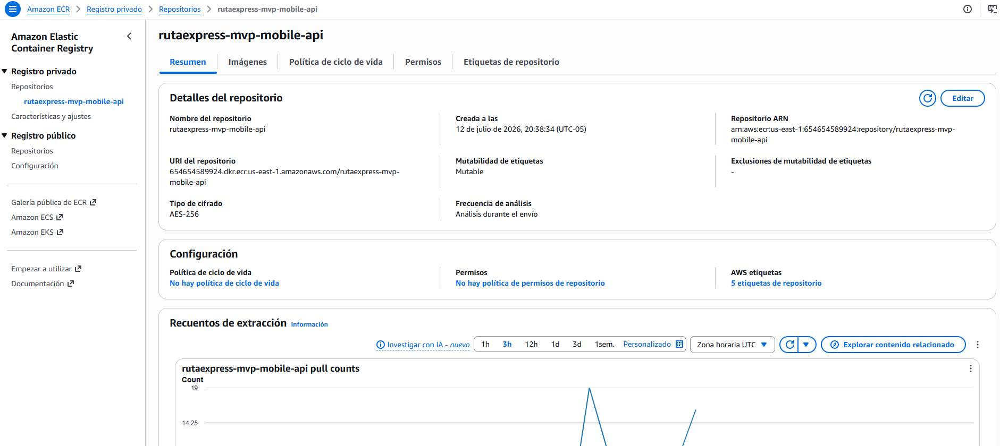

---

## 2. AWS KMS

| | |
|---|---|
| **Servicio** | Key Management Service |
| **Nombre (alias)** | `alias/rutaexpress-mvp-evidence` |
| **Detalle** | Clave para cifrado de evidencias en S3. Descripción: *RutaExpress MVP evidence encryption*. `deletion_window_in_days = 7`, **key rotation** habilitada. |

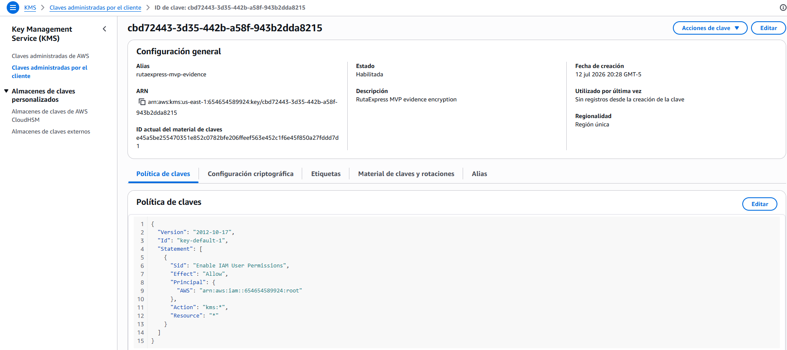

---

## 3. Amazon S3 (evidencias)

| | |
|---|---|
| **Servicio** | Simple Storage Service |
| **Nombre** | `rutaexpress-mvp-evidence-mvp01` |
| **Detalle** | Bucket de evidencias de entrega. SSE-KMS con la clave de evidencias. **Public access block** total (ACLs y políticas públicas bloqueadas). Lifecycle `expire-90d`: expiración a **90 días**. |

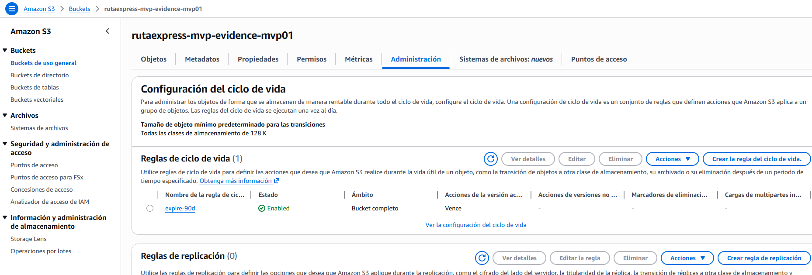

---

## 4. Amazon DynamoDB

| | |
|---|---|
| **Servicio** | DynamoDB |
| **Nombre** | `rutaexpress-mvp-mobile-outbox` |
| **Detalle** | Tabla outbox móvil. Billing **PAY_PER_REQUEST** (on-demand). PK `pk` (S), SK `sk` (S). GSI `gsi-status` (hash `status`, range `sk`, proyección ALL). TTL habilitado en atributo `ttl`. |

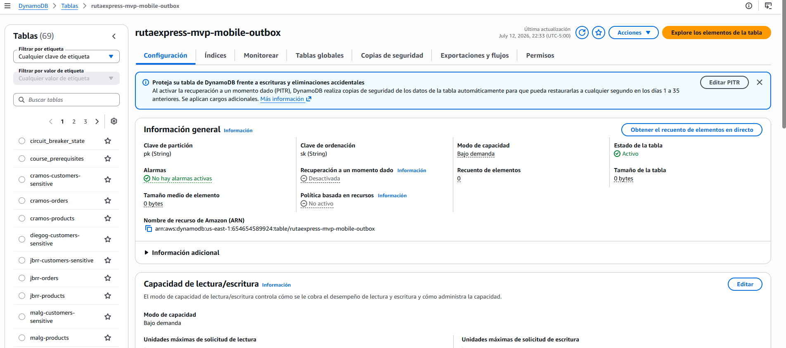

---

## 5. Amazon SQS

### 5.1 Cola principal (puente)

| | |
|---|---|
| **Servicio** | Simple Queue Service |
| **Nombre** | `rutaexpress-mvp-mobile-bridge` |
| **Detalle** | Cola del puente móvil. `visibility_timeout_seconds = 60`. Redrive a DLQ tras **maxReceiveCount = 5**. |

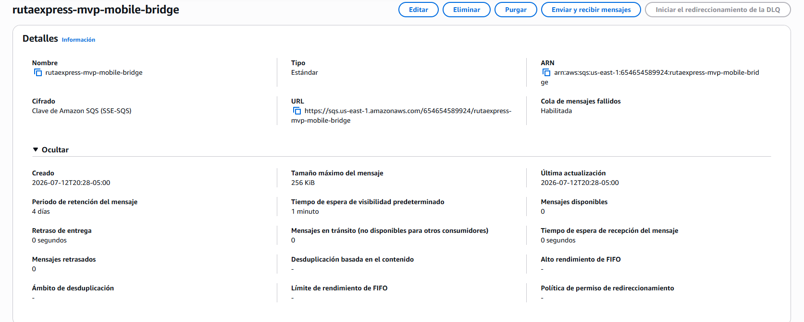

### 5.2 Dead Letter Queue

| | |
|---|---|
| **Servicio** | SQS (DLQ) |
| **Nombre** | `rutaexpress-mvp-mobile-dlq` |
| **Detalle** | Cola de mensajes fallidos. Retención **1 209 600 s** (14 días). |

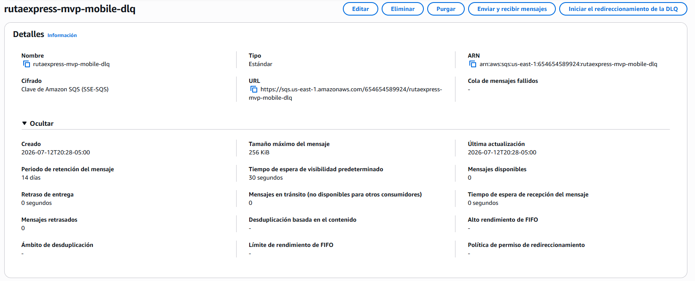

---

## 6. Amazon EventBridge

### 6.1 Event bus

| | |
|---|---|
| **Servicio** | EventBridge custom bus |
| **Nombre** | `rutaexpress-mvp-bridge` |
| **Detalle** | Bus de eventos del puente AWS → Azure (Event Hubs). |

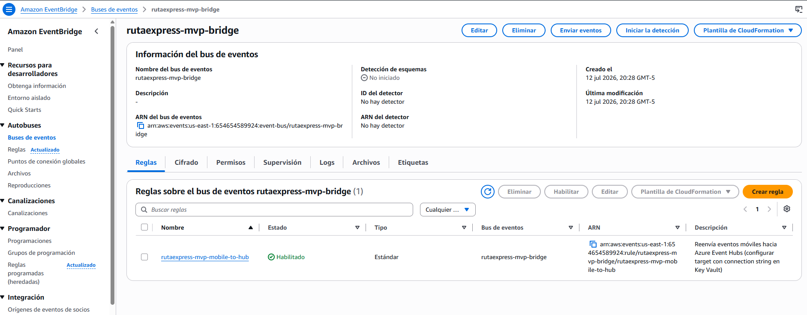

### 6.2 Rule

| | |
|---|---|
| **Servicio** | EventBridge rule |
| **Nombre** | `rutaexpress-mvp-mobile-to-hub` |
| **Detalle** | Pattern: `source = ["rutaexpress.mobile"]`. Descripción: reenvío hacia Azure Event Hubs (target con connection string desde Key Vault). |

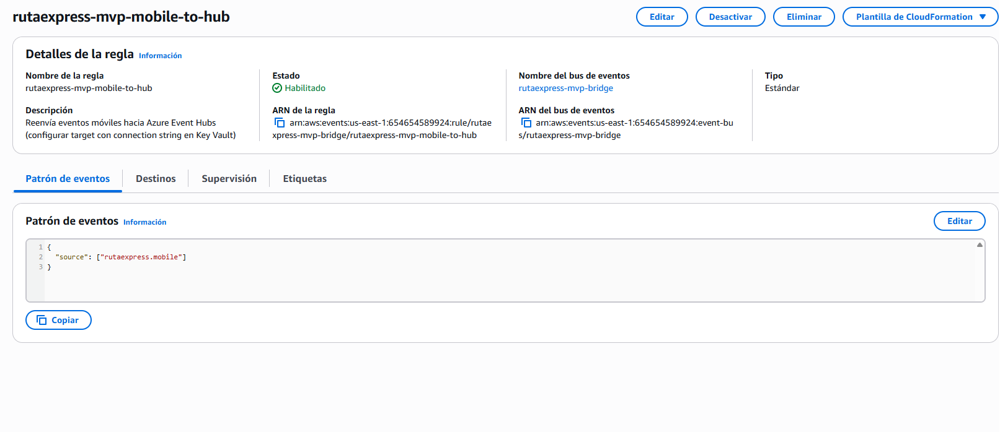

---

## 7. IAM (roles ECS)

| Recurso | Nombre | Detalle |
|---|---|---|
| Execution role | `rutaexpress-mvp-ecs-exec` | Assume `ecs-tasks.amazonaws.com` + policy managed `AmazonECSTaskExecutionRolePolicy` |
| Task role | `rutaexpress-mvp-ecs-task` | Assume `ecs-tasks.amazonaws.com` |
| Task policy | `rutaexpress-mvp-ecs-task-policy` | DynamoDB Get/Put/Update/Query; S3 Put/Get; SQS Receive/Delete/GetAttributes/Send; EventBridge PutEvents; KMS Encrypt/Decrypt/GenerateDataKey |

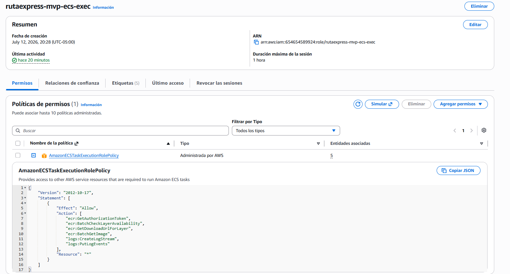

---

## 8. Amazon ECS

### 8.1 Cluster

| | |
|---|---|
| **Servicio** | Elastic Container Service |
| **Nombre** | `ecs-rutaexpress-mvp` |
| **Detalle** | Cluster ECS. **Container Insights** habilitado. |

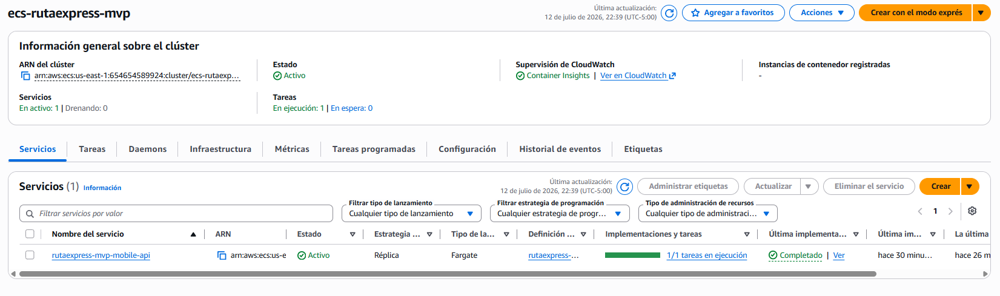

### 8.2 Task definition

| | |
|---|---|
| **Servicio** | ECS Task Definition |
| **Nombre (family)** | `rutaexpress-mvp-mobile-api` |
| **Detalle** | Launch type **FARGATE**, red `awsvpc`, **0.25 vCPU (256)** / **512 MB**. Dos contenedores en el mismo task: |

| Contenedor | Puerto / comando | Env relevantes |
|---|---|---|
| `mobile-api` | 8080/tcp | `DYNAMODB_TABLE`, `S3_BUCKET`, `SQS_QUEUE_URL`, `EVENT_BUS_NAME`, `AWS_REGION` |
| `retry-worker` | `node src/retry-worker.js` | `SQS_QUEUE_URL`, `EVENT_BUS_NAME`, `JITTER_MS=500` |

Logs: CloudWatch group `/ecs/rutaexpress-mvp-mobile-api`, retención **14** días, prefijos `mobile` / `retry`.

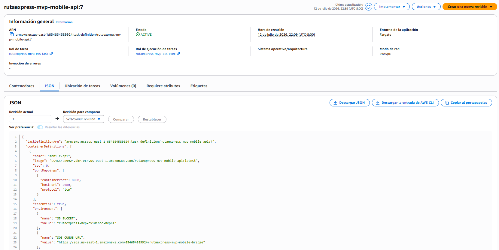

### 8.3 Service

| | |
|---|---|
| **Servicio** | ECS Service |
| **Nombre** | `rutaexpress-mvp-mobile-api` |
| **Detalle** | `desired_count = 1`, Fargate, subnets default AZs `a`/`b`, IP pública, SG ECS. Asociado al target group del ALB (contenedor `mobile-api`, puerto 8080). |

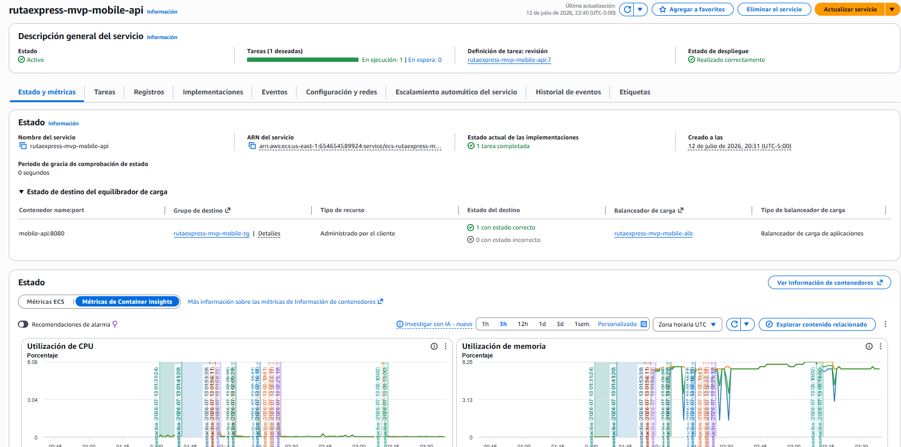

---

## 9. Application Load Balancer

### 9.1 ALB

| | |
|---|---|
| **Servicio** | Application Load Balancer |
| **Nombre** | `rutaexpress-mvp-mobile-alb` |
| **Detalle** | ALB **internet-facing**, tipo application, VPC default, subnets en AZ `a` y `b`. |

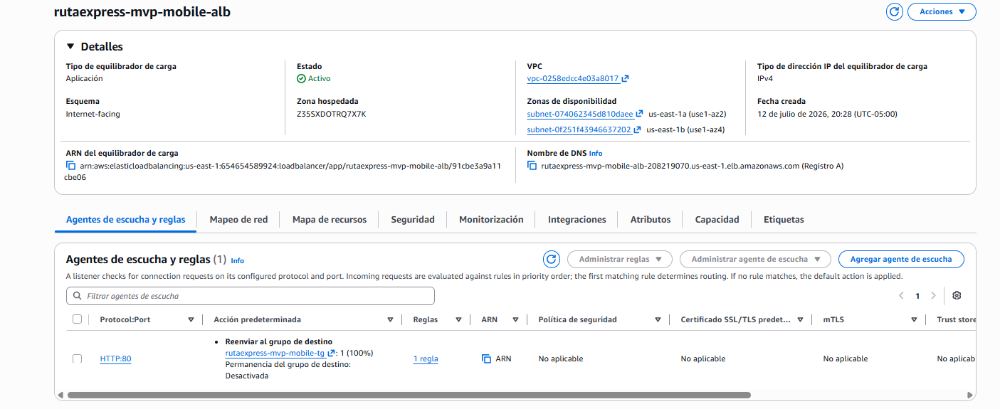

### 9.2 Target group y listener

| Recurso | Nombre | Detalle |
|---|---|---|
| Target group | `rutaexpress-mvp-mobile-tg` | Puerto **8080**, HTTP, `target_type = ip`, health check path **`/health`** |
| Listener | (ALB :80) | HTTP **80** → forward al target group |

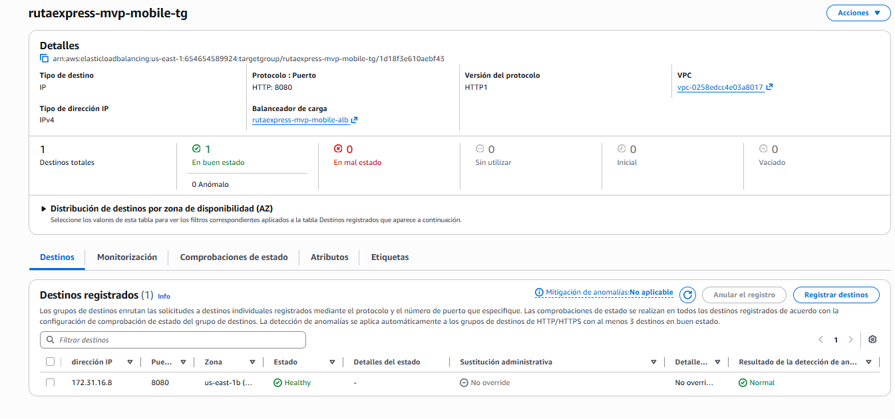

---

## 10. Security Groups

| Nombre | Detalle |
|---|---|
| `rutaexpress-mvp-alb-sg` | Ingress TCP **80** desde `0.0.0.0/0`; egress all |
| `rutaexpress-mvp-ecs-sg` | Ingress TCP **8080** solo desde el SG del ALB; egress all |

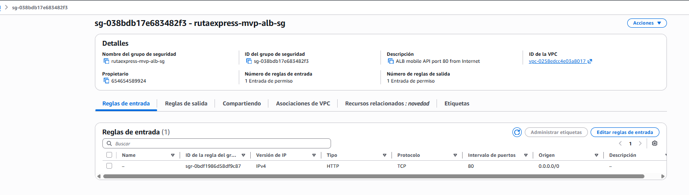

---

## 11. CloudWatch Logs

| | |
|---|---|
| **Servicio** | CloudWatch Log Group |
| **Nombre** | `/ecs/rutaexpress-mvp-mobile-api` |
| **Detalle** | Retención **14** días. Streams con prefijo `mobile` (API) y `retry` (worker). |

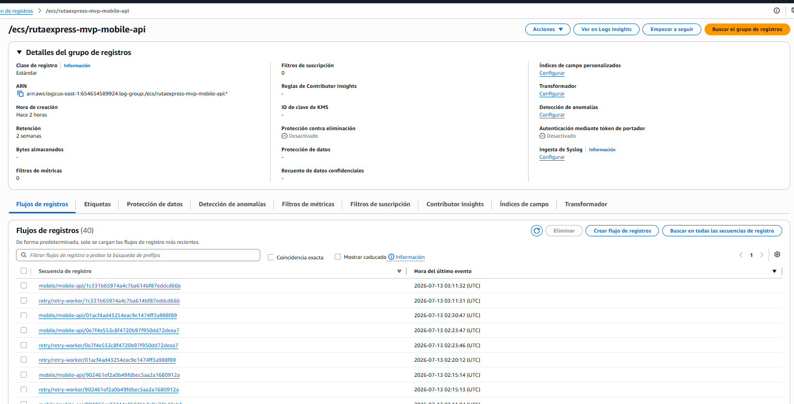

---

## Checklist de capturas

Colocar en `evidencias/aws/imagenes/` estos archivos (mismos nombres):

| Archivo | Componente |
|---|---|
| `01_ecr.png` | ECR `rutaexpress-mvp-mobile-api` |
| `02_kms.png` | KMS alias `rutaexpress-mvp-evidence` |
| `03_s3_evidence.png` | Bucket S3 evidencias |
| `04_dynamodb.png` | Tabla DynamoDB outbox |
| `05_sqs_bridge.png` | SQS bridge |
| `05b_sqs_dlq.png` | SQS DLQ |
| `06_eventbridge_bus.png` | Event bus bridge |
| `06b_eventbridge_rule.png` | Rule mobile-to-hub |
| `07_iam_roles.png` | Roles/policies ECS |
| `08_ecs_cluster.png` | Cluster ECS |
| `08b_ecs_task_definition.png` | Task definition (2 contenedores) |
| `08c_ecs_service.png` | ECS service |
| `09_alb.png` | ALB |
| `09b_alb_target_group.png` | Target group / listener |
| `10_security_groups.png` | SGs ALB y ECS |
| `11_cloudwatch_logs.png` | Log group |

---

## Dónde capturar en consola AWS (guía rápida)

| Evidencia | Consola |
|---|---|
| ECR | Elastic Container Registry → Repositories |
| KMS | KMS → Customer managed keys / Aliases |
| S3 | S3 → Buckets |
| DynamoDB | DynamoDB → Tables |
| SQS | SQS → Queues |
| EventBridge | EventBridge → Event buses / Rules |
| IAM | IAM → Roles |
| ECS | ECS → Clusters → Tasks / Services |
| ALB | EC2 → Load Balancers / Target Groups |
| SG | EC2 → Security Groups |
| Logs | CloudWatch → Log groups |

---

*Código de referencia: `Implementacion/terraform/modules/aws/main.tf`, `Implementacion/terraform/modules/shared/naming/`, `Implementacion/terraform/environments/mvp/` (`enable_aws`).*
