# Evidencias de despliegue — Azure (MVP)

> **Resource Group del despliegue:** todo el stack Azure del MVP vive en **`rg_Diego_Gonzales`**.  
> **Convención de nombres:** `project=rutaexpress`, `environment=mvp` → prefijo `rutaexpress-mvp`.  

| Campo | Valor según repo |
|---|---|
| Región | `eastus` (variable `azure_region`) |
| Resource Group | **`rg_Diego_Gonzales`** (`azure_create_resource_group = false`, `azure_resource_group_name = "rg_Diego_Gonzales"`) |
| Tags FinOps | `project`, `environment`, `cost-center`, `managed-by=terraform`, `package=rutaexpress-mvp` |
| Rol en arquitectura | **Hub operativo** multinube: APIM (APP-01) + Orquestador/Inventario en AKS (APP-02, MS-INI01-02), Event Hubs / Service Bus (PLT-03), SQL/Redis/Key Vault, mocks WMS/ERP/TMS/Portal y puente de eventos hacia AWS/GCP |

---

## 1. Resource Group (contenedor)

| | |
|---|---|
| **Servicio** | Azure Resource Group |
| **Nombre** | `rg_Diego_Gonzales` |
| **Detalle** | Contenedor lógico de **todos** los recursos Azure del MVP. No se crea con Terraform: `azure_create_resource_group = false` y se referencia el RG existente `rg_Diego_Gonzales` vía `data.azurerm_resource_group`. |

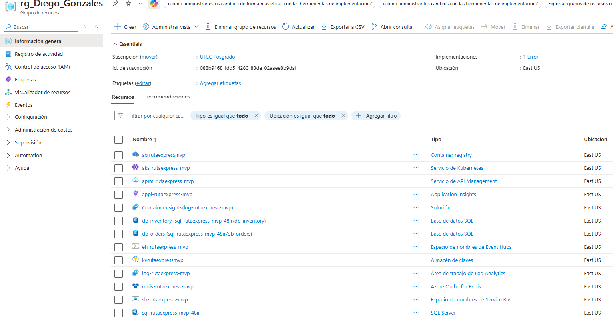

---

## 2. Azure Kubernetes Service (AKS)

| | |
|---|---|
| **Servicio** | Azure Kubernetes Service |
| **Nombre** | `aks-rutaexpress-mvp` |
| **Detalle** | Cluster Kubernetes administrado. Node pool `default`: `aks_node_count` (default **2**), VM `aks_vm_size` (default **Standard_D2s_v3**). Identidad **SystemAssigned**, `oidc_issuer_enabled = true`, agente OMS vinculado a Log Analytics. `dns_prefix` = nombre del cluster. |

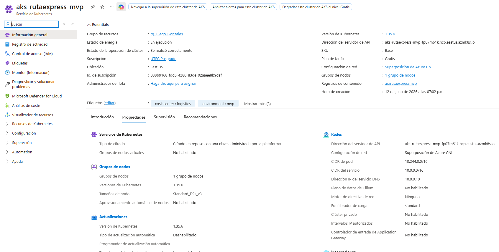

---

## 3. Azure Container Registry (ACR)

| | |
|---|---|
| **Servicio** | Azure Container Registry |
| **Nombre** | `acrrutaexpressmvp` |
| **Detalle** | SKU **Basic**, `admin_enabled = true`. Role assignment **AcrPull** al kubelet identity de AKS para pull de imágenes desde el cluster. |

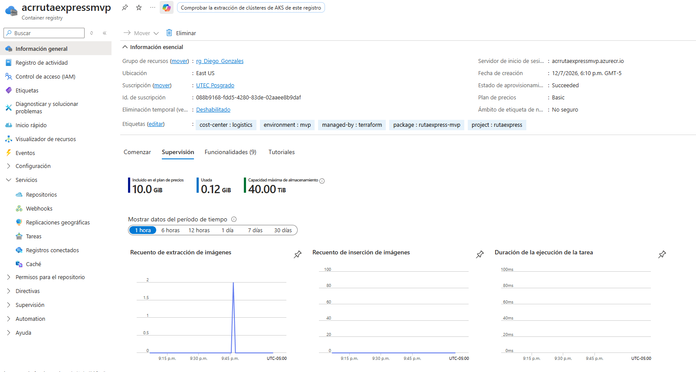

---

## 4. Azure API Management (APIM)

| | |
|---|---|
| **Servicio** | Azure API Management |
| **Nombre** | `apim-rutaexpress-mvp` |
| **Detalle** | SKU `apim_sku` (default **Developer_1**). Publisher: **RutaExpress** + email `apim_publisher_email`. Gateway típico: `https://apim-rutaexpress-mvp.azure-api.net`. |

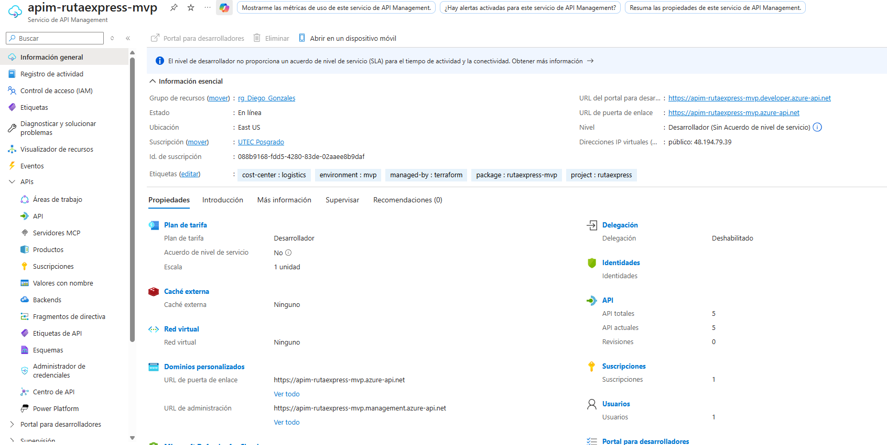

### 4.1 APIs importadas (OpenAPI)

| API (nombre) | Path | Display name | Origen OpenAPI |
|---|---|---|---|
| `mock-wms` | `mock/wms` | Mock WMS Principal (APP-06) | `apis/mock/mock-wms.openapi.yaml` |
| `mock-erp` | `mock/erp` | Mock ERP Financiero (APP-25) | `apis/mock/mock-erp.openapi.yaml` |
| `mock-portal` | `mock/portal` | Mock Portal B2B tracking (APP-18) | `apis/mock/mock-portal.openapi.yaml` |
| `mock-tms` | `mock/tms` | Mock TMS (APP-11) | `apis/mock/mock-tms.openapi.yaml` |
| `orders-api` | `api` | Orders API (APP-02) | `apis/mock/orders.openapi.yaml` |

Protocolo: **HTTPS**. Mocks con `service_url` placeholder; `orders-api` enruta a backend AKS.

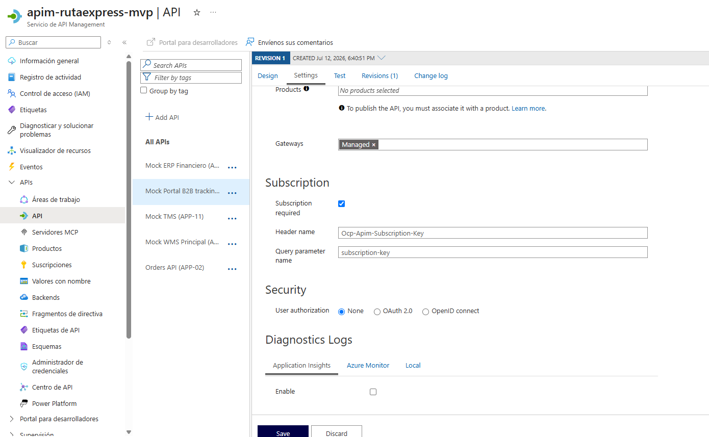

### 4.2 Backend y políticas

| Recurso | Nombre / operación | Detalle |
|---|---|---|
| Backend | `orders-aks-backend` | Protocolo HTTP; URL = `order_api_backend_url` (LoadBalancer de order-service) |
| Política orders | routing a backend | Propaga header `X-Mock-Wms-Status`; `set-backend-service` → `orders-aks-backend` |
| Política mock-wms | `confirmReservation` | Si header `X-Mock-Wms-Status=503` → 503 (escenario E4); si no → 200 mock |
| Política mock-portal | `getTracking` | Stub 200 `IN_TRANSIT` (fase Azure; BigQuery en fase GCP) |

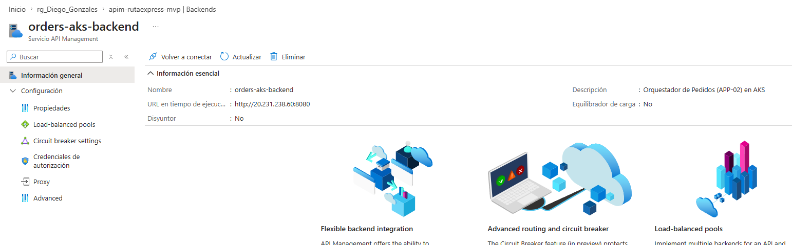

---

## 5. Azure Key Vault

| | |
|---|---|
| **Servicio** | Azure Key Vault |
| **Nombre** | `kvrutaexpressmvp` |
| **Detalle** | SKU **standard**. Soft-delete **7 días**, purge protection **deshabilitado**. Access policy al deployer: secretos Get/List/Set/Delete/Purge/Recover. |

**Secretos creados por Terraform:**

| Secret | Contenido |
|---|---|
| `eventhub-connection-string` | Connection string de la regla `mvp-send-listen` |
| `servicebus-connection-string` | Connection string primaria del namespace Service Bus |

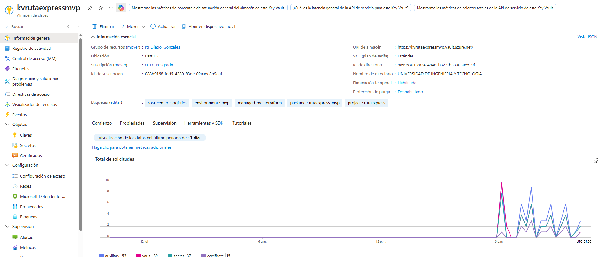

---

## 6. Azure SQL

### 6.1 Servidor

| | |
|---|---|
| **Servicio** | Azure SQL Server |
| **Nombre** | `sql-rutaexpress-mvp-48ir` (sufijo `random_string` de 4 chars) |
| **Detalle** | Versión **12.0**, TLS mínimo **1.2**, login admin `sql_admin_login` / password sensible. Firewall `AllowAzureServices` (`0.0.0.0`–`0.0.0.0`) para acceso desde servicios Azure (p. ej. AKS). |

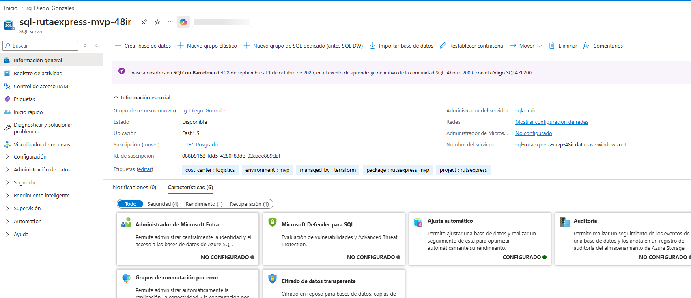

### 6.2 Bases de datos

| Nombre | SKU | Max size | Zone redundant |
|---|---|---|---|
| `db-orders` | **S1** | 2 GB | false |
| `db-inventory` | **S1** | 2 GB | false |

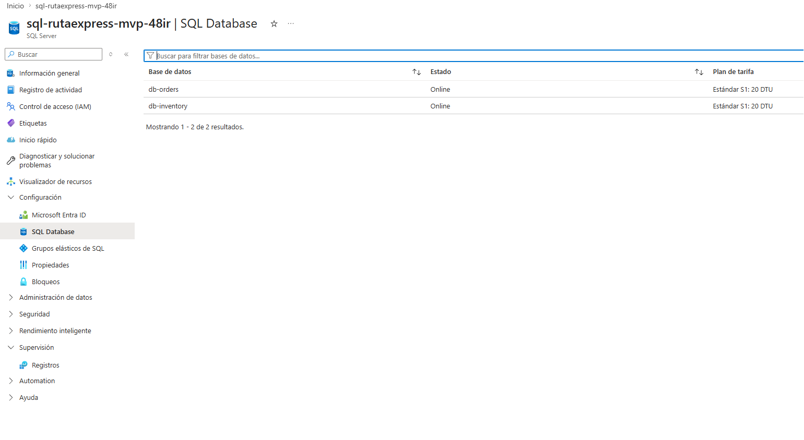

---

## 7. Event Hubs

### 7.1 Namespace

| | |
|---|---|
| **Servicio** | Event Hubs Namespace |
| **Nombre** | `eh-rutaexpress-mvp` |
| **Detalle** | SKU **Standard**, capacity = `eventhub_throughput_units` (default **1** TU). |

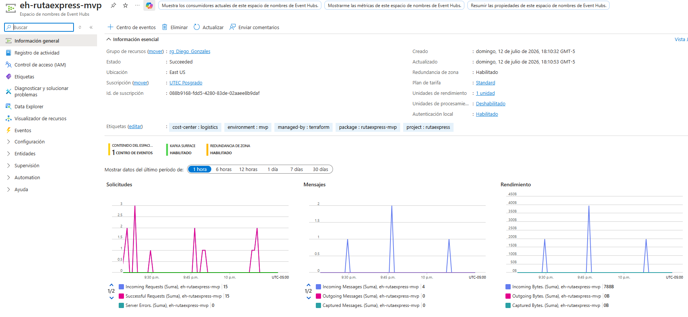

### 7.2 Hub y autorización

| Recurso | Nombre | Detalle |
|---|---|---|
| Event Hub | `eh-canonical` | **2** particiones, retención **1** día |
| Authorization rule | `mvp-send-listen` | listen + send + manage |

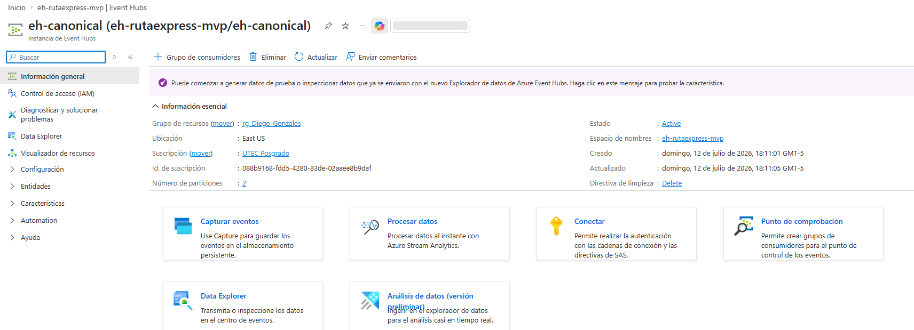

---

## 8. Service Bus

### 8.1 Namespace

| | |
|---|---|
| **Servicio** | Service Bus Namespace |
| **Nombre** | `sb-rutaexpress-mvp` |
| **Detalle** | SKU **Standard**. |

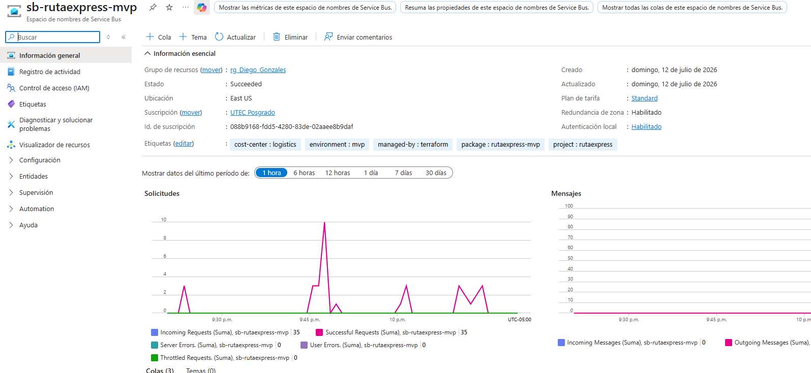

### 8.2 Colas

| Nombre | Detalle |
|---|---|
| `q-inventory` | Dead-lettering on expiration; `max_delivery_count = 10` |
| `q-mock-tms` | Dead-lettering on expiration; `max_delivery_count = 10` |
| `q-dlq` | Cola DLQ del bus |

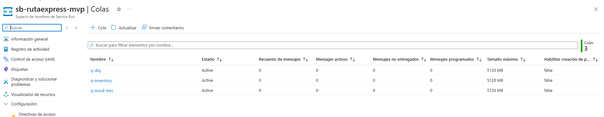

---

## 9. Azure Cache for Redis

| | |
|---|---|
| **Servicio** | Azure Cache for Redis |
| **Nombre** | `redis-rutaexpress-mvp` |
| **Detalle** | SKU **Basic**, family **C**, capacity **0** (C0 / 250 MB). TLS mínimo **1.2**. |

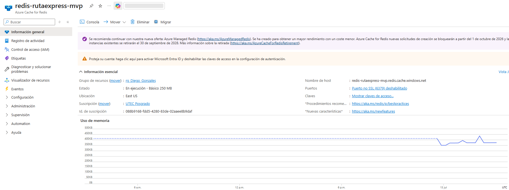

---

## 10. Log Analytics Workspace

| | |
|---|---|
| **Servicio** | Log Analytics |
| **Nombre** | `log-rutaexpress-mvp` |
| **Detalle** | SKU **PerGB2018**, retención **30** días. Destino de OMS agent de AKS y de Application Insights. |

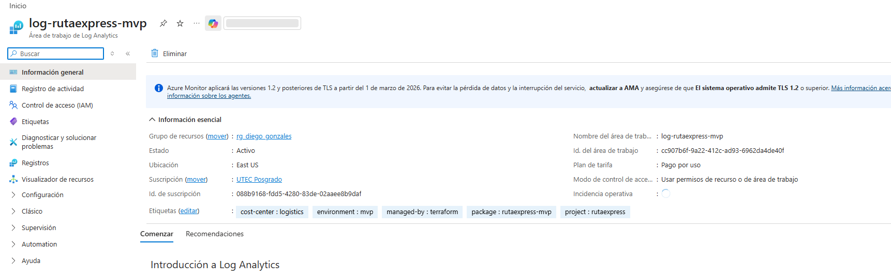

---

## 11. Application Insights

| | |
|---|---|
| **Servicio** | Application Insights |
| **Nombre** | `appi-rutaexpress-mvp` |
| **Detalle** | Tipo **web**, vinculado al workspace `log-rutaexpress-mvp`. |

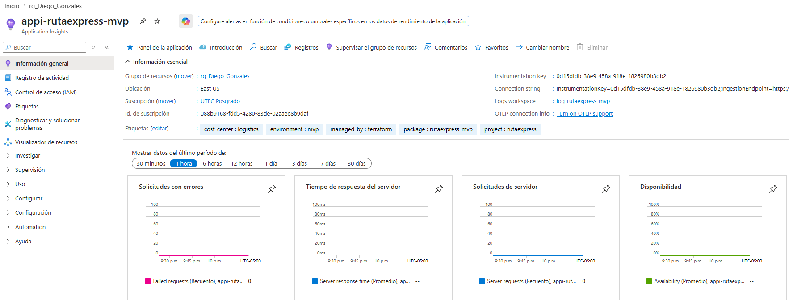

---

*Código de referencia: `Implementacion/terraform/modules/azure/`, `Implementacion/terraform/modules/shared/naming/`, `Implementacion/terraform/environments/mvp/`.*
