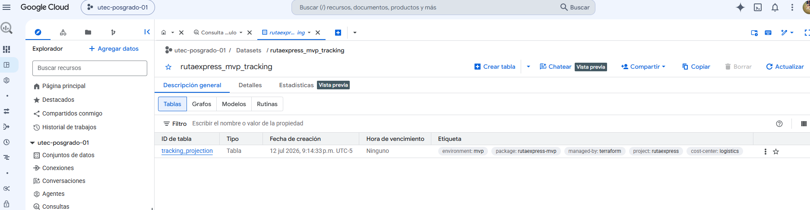
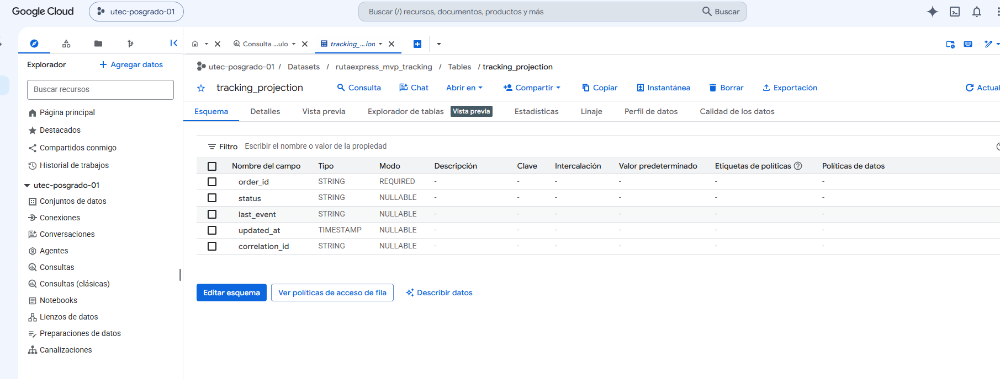
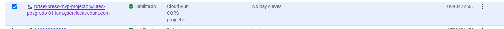
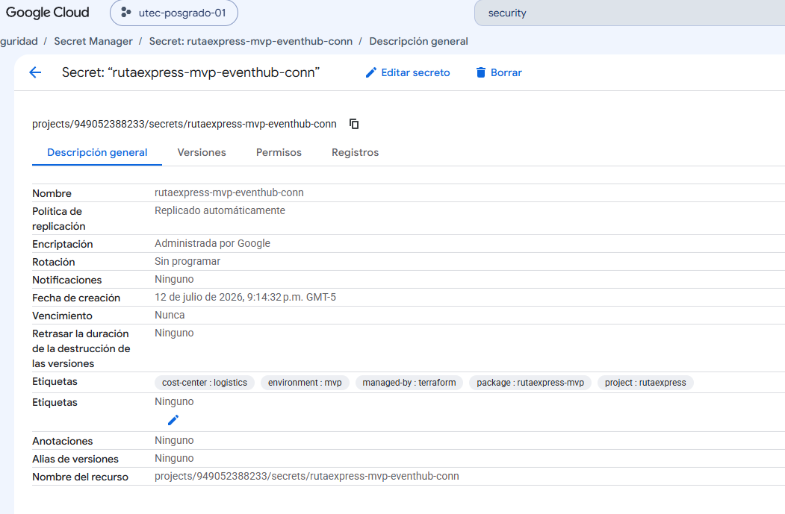
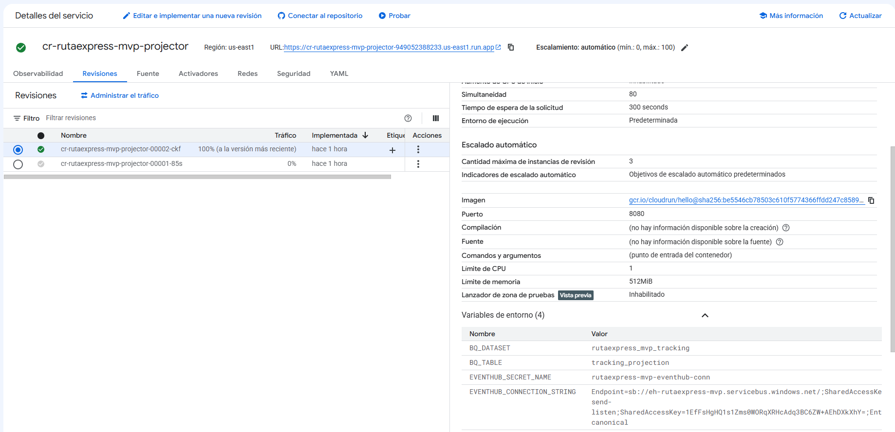

# Evidencias de despliegue — GCP (MVP)

> **Activación:** `enable_gcp = true` en `environments/mvp` (fase 3: Azure + AWS + GCP).  
> **Convención de nombres:** `project=rutaexpress`, `environment=mvp` → prefijo `rutaexpress-mvp`.  

| Campo | Valor según repo |
|---|---|
| Project ID | `utec-posgrado-01` |
| Región | `us-east1` (variable `gcp_region`) |
| Prefijo | `rutaexpress-mvp` |
| Labels FinOps | `project`, `environment`, `cost-center`, `managed-by=terraform`, `package=rutaexpress-mvp` |
| Rol en arquitectura | **CQRS / analítica de lectura (E8):** proyección de tracking en BigQuery + Cloud Run projector alimentado desde Azure Event Hubs; secretos de puente en Secret Manager |

---

## 1. BigQuery — Dataset

| | |
|---|---|
| **Servicio** | BigQuery Dataset |
| **Nombre (`dataset_id`)** | `rutaexpress_mvp_tracking` |
| **Detalle** | Friendly name: *RutaExpress MVP tracking projection*. Descripción: proyección CQRS lectura E8. Location = `gcp_region` (`us-east1`). `delete_contents_on_destroy = true`. Labels FinOps aplicados. |

---

## 2. BigQuery — Tabla

| | |
|---|---|
| **Servicio** | BigQuery Table |
| **Nombre (`table_id`)** | `tracking_projection` |
| **Detalle** | Tabla de proyección de lectura (tracking). Schema: |

| Columna | Tipo | Modo |
|---|---|---|
| `order_id` | STRING | REQUIRED |
| `status` | STRING | NULLABLE |
| `last_event` | STRING | NULLABLE |
| `updated_at` | TIMESTAMP | NULLABLE |
| `correlation_id` | STRING | NULLABLE |

---

## 3. Service Account (projector)

| | |
|---|---|
| **Servicio** | IAM Service Account |
| **Nombre (`account_id`)** | `rutaexpress-mvp-projector` |
| **Detalle** | Display name: *Cloud Run CQRS projector*. Email típico: `rutaexpress-mvp-projector@utec-posgrado-01.iam.gserviceaccount.com`. Rol de proyecto: **`roles/bigquery.dataEditor`** (escritura en BigQuery). |

---

## 4. Secret Manager

| | |
|---|---|
| **Servicio** | Secret Manager |
| **Nombre (`secret_id`)** | `rutaexpress-mvp-eventhub-conn` |
| **Detalle** | Secreto del puente hacia Azure Event Hubs. Replicación **auto**. Labels FinOps. El connection string puede inyectarse además como env `EVENTHUB_CONNECTION_STRING` en Cloud Run cuando Terraform recibe `eventhub_connection_string` desde outputs de Azure. |

---

## 5. Cloud Run (projector)

| | |
|---|---|
| **Servicio** | Cloud Run (v2) |
| **Nombre** | `cr-rutaexpress-mvp-projector` |
| **Detalle** | Servicio projector CQRS. Región `us-east1`. Imagen = `projector_image` (default `gcr.io/cloudrun/hello` hasta imagen real). Service account = projector. Scaling: **min 0**, **max 3** instancias. Resources: **1 vCPU**, **512Mi** memoria. |

**Variables de entorno del contenedor:**

| Env | Valor |
|---|---|
| `BQ_DATASET` | `rutaexpress_mvp_tracking` |
| `BQ_TABLE` | `tracking_projection` |
| `EVENTHUB_SECRET_NAME` | `rutaexpress-mvp-eventhub-conn` |
| `EVENTHUB_CONNECTION_STRING` | (opcional) connection string Event Hubs desde Azure |

**IAM invoker:** `roles/run.invoker` para `allUsers` (invocación pública del endpoint en MVP demo).

---

*Código de referencia: `Implementacion/terraform/modules/gcp/main.tf`, `Implementacion/terraform/modules/shared/naming/`, `Implementacion/terraform/environments/mvp/` (`enable_gcp`).*
