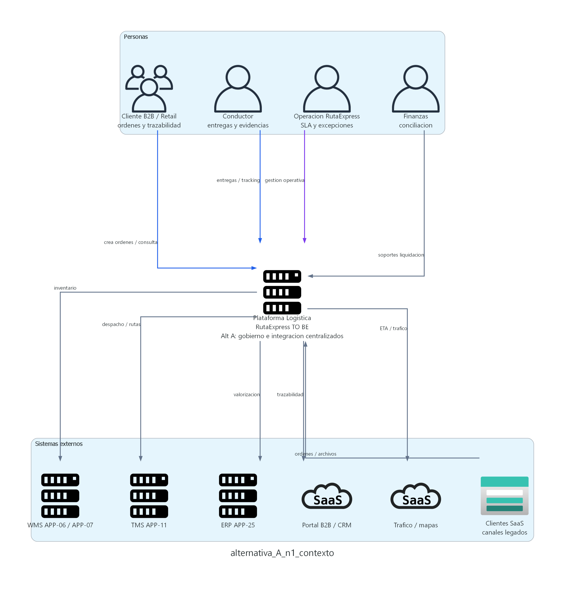

# Alternativa A - Hub Central Azure
## RutaExpress Fulfillment & Transporte - Hito 2

> **Modelo presentado:** Azure como hub central de integracion y gobierno.
> **Diagramas C4:** generados con Graphviz desde `diagramas_c4/imagenes_python_graphviz`.
> **Decision esperada:** validar si este modelo sera la base del primer TO BE/MVP.

---

## 1. Resumen ejecutivo

La **Alternativa A** consolida el gobierno de APIs, OMS, eventos, colas, observabilidad e identidad en **Azure**. APP-02 evoluciona a un **OMS centralizado** desplegado en Azure AKS, mientras PLT-03 opera como hub central de eventos con Azure Event Hubs y Azure Service Bus.

AWS se conserva como dominio de ultima milla, backend movil, sincronizacion offline y evidencias. GCP se conserva como dominio de optimizacion dinamica, analitica y modelos predictivos.

**Ventaja principal:** menor complejidad operativa y menor riesgo de MVP, porque OMS, API Management, eventos, colas y observabilidad quedan en un mismo eje de gobierno.

---

## 2. Lineamientos de arquitectura aplicados

| Lineamiento | Implementacion en Alternativa A |
|---|---|
| **Integracion** | API-first con Azure API Management; Event-Driven Architecture con PLT-03 en Azure; reemplazo progresivo de integraciones punto a punto. |
| **Seguridad** | Entra ID, Key Vault, OAuth/OIDC, minimo privilegio, cifrado en transito/reposo y gestion central de secretos. |
| **Observabilidad** | OpenTelemetry, Azure Monitor, Application Insights, Log Analytics y correlation ID obligatorio para orden, inventario, tracking y SLA. |
| **Resiliencia** | DLQ, retry con backoff, replay controlado, backpressure, circuit breaker y outbox/inbox. |
| **Gobierno / IaC** | Terraform, pipelines, politicas por nube y control de cambios para evitar drift manual. |
| **Datos** | Azure SQL para estado transaccional OMS/Inventario; S3/KMS para evidencias inmutables; BigQuery para analitica. |
| **Multinube** | Modelo hub-and-spoke: Azure como hub operativo; AWS y GCP como dominios especializados conectados por puentes controlados. |

---

## 3. Patrones de arquitectura

| Patron | Uso en Alternativa A |
|---|---|
| **Hub-and-Spoke** | PLT-03 en Azure como hub; OMS, WMS, TMS, mobile backend, portal y GCP como productores/consumidores. |
| **Event-Driven Architecture** | Eventos canonicos de orden, inventario, tracking, evidencia, excepcion y SLA. |
| **Saga** | Coordinacion orden -> reserva -> despacho -> entrega -> liquidacion mediante eventos y compensaciones. |
| **CQRS selectivo** | Modelos de lectura para trazabilidad, SLA, inventario consultivo y tableros. |
| **Outbox/Inbox** | Publicacion confiable de eventos desde OMS, Inventario y backend movil. |
| **DLQ + Replay** | Manejo de mensajes fallidos con reproceso auditado por rol. |
| **Store-and-Forward** | Operacion offline-first de APP-15 con persistencia local cifrada y sincronizacion posterior. |
| **Circuit Breaker / Backpressure** | Proteccion ante WMS, ERP, TMS o consumidores degradados. |

---

## 3.1 Aplicaciones, plataformas y servicios modificados o fuera del foco

### Aplicaciones AS IS impactadas directamente

| Elemento AS IS | Disposicion TO BE en Alternativa A | Motivo |
|---|---|---|
| Orquestador de Pedidos (APP-02) | **Evoluciona a OMS centralizado** | Evita crear una nueva app; concentra ciclo de vida de ordenes, idempotencia y estados. |
| WMS Principal / Satelite (APP-06 / APP-07) | **Integracion gobernada con Inventario y Reservas** | Se mantiene durante transicion, pero se desacopla mediante APIs/eventos. |
| Integraciones punto a punto | **Reemplazo progresivo por PLT-03** | Reduce acoplamiento, reprocesos manuales y trazabilidad fragmentada. |
| App de Conductores (APP-15) | **Fortalecida en AWS** | Offline-first, store-and-forward, acks, retry y taxonomia de excepciones. |
| Evidencias (APP-16) | **Conservada en AWS S3/KMS** | Hash, cifrado, manifest de auditoria y soporte para conciliacion. |

### Plataformas y dominios

| Dominio | En Alternativa A | Motivo |
|---|---|---|
| **Azure** | Hub central de APIs, OMS, eventos, colas, identidad y observabilidad. | Reduce puentes criticos y centraliza gobierno operativo. |
| **AWS** | Ultima milla, backend movil, evidencias y buffer movil. | Aprovecha capacidades existentes de campo sin mover APP-15. |
| **GCP** | Optimizacion dinamica, analitica, BigQuery y modelos predictivos. | Mantiene especializacion analitica sin convertir GCP en hub operativo. |
| **On premises / SaaS** | Sistemas transicionales integrados por APIs/eventos. | Evita corte brusco y permite migracion por fases. |

---

## 4. Diagramas C4

> **Principio de diseno:** mostrar cada nivel C4 como una vista separada. Contexto explica alcance, Contenedores explica topologia y Componentes explica el interior del contenedor critico PLT-03.

### 4.1 Nivel 1 - Contexto



**Lectura:** la caja central representa la Plataforma Logistica RutaExpress TO BE. Las personas y sistemas externos interactuan con la plataforma para crear ordenes, ejecutar entregas, consultar trazabilidad, conciliar inventario y validar soportes financieros.

**Actores:** cliente B2B/Retail, conductor, operacion RutaExpress y finanzas.
**Sistemas externos:** WMS APP-06/APP-07, TMS APP-11, ERP APP-25, Portal B2B/CRM, canales legados y servicios de mapas/trafico.

### 4.2 Nivel 2 - Contenedores


| Contenedor | Plataforma | Tecnologia / responsabilidad |
|---|---|---|
| Gateway y Gobierno API | Azure | Azure API Management; contratos, OAuth/OIDC, cuotas, rate limiting y APIs mock. |
| OMS centralizado APP-02 | Azure | AKS; ciclo de vida de ordenes, validacion, deduplicacion, idempotencia y estados. |
| Inventario y Reservas | Azure | AKS; disponibilidad, reservas, liberaciones, movimientos y conciliacion. |
| Repositorio transaccional | Azure | Azure SQL; ordenes, inventario, outbox, auditoria y estado operacional. |
| Bus de Eventos Central PLT-03 | Azure | Event Hubs; eventos canonicos y particionamiento. |
| Colas, DLQ y Replay | Azure | Service Bus; colas, mensajes fallidos, replay y backpressure. |
| Backend movil | AWS | ECS/Lambda; store-and-forward, acks, tracking y excepciones. |
| Repositorio sync movil | AWS | DynamoDB logico; eventos pendientes y estado offline. |
| Repositorio evidencias | AWS | S3 + KMS; fotos, firmas, hash, cifrado y retencion. |
| Optimizador dinamico | GCP | Cloud Run/GKE; trafico, capacidad, ventanas, cadena de frio, seguridad y SLA. |
| Analitica | GCP | Pub/Sub, Dataflow, BigQuery y Vertex AI. |

**Flujo clave:** Cliente -> API Management -> OMS -> Inventario -> PLT-03 -> colas/DLQ/replay -> TMS, backend movil, portal/CRM y GCP.

### 4.3 Nivel 3 - Componentes de PLT-03


Componentes principales **PLT-03 en Azure**:

- **Event Ingestion API:** recibe eventos canonicos desde OMS, Inventario, backend movil y legados.
- **Schema Validator:** valida contratos, versionado y compatibilidad.
- **Event Router:** enruta eventos por dominio, prioridad, SLA y consumidor.
- **Ordering Guard:** mantiene secuencia por agregado.
- **Retry Scheduler:** aplica reintentos con backoff y jitter.
- **DLQ Manager:** captura mensajes fallidos y registra causa/responsable.
- **Replay Controller:** permite reproceso auditado por rol.
- **Backpressure Controller:** regula velocidad cuando consumidores se degradan.
- **Audit / Event Store:** conserva trazabilidad de intercambio.

---

## 5. Trazabilidad requerimientos - diseno

| Requerimiento / iniciativa | Elemento de diseno Alternativa A |
|---|---|
| INI-01 ordenes e inventario | OMS APP-02, Inventario y Reservas, Azure SQL, idempotencia, deduplicacion y conciliacion WMS/ERP. |
| INI-02 API-first/event-driven | Azure API Management, PLT-03 Event Hubs, Service Bus, DLQ, replay, backpressure y contratos canonicos. |
| INI-03 ultima milla | Backend movil AWS, store-and-forward, DynamoDB logico, S3/KMS, acks y taxonomia de excepciones. |
| INI-04 rutas | Optimizador dinamico GCP integrado por eventos y APIs con TMS. |
| INI-05 observabilidad/seguridad | PLT-01, correlation ID, Entra ID, Key Vault, KMS, IaC y politicas multinube. |
| INI-06 conciliacion | Evidencias, estados, tracking, OMS, TMS, ERP y auditoria de eventos. |

---

## 6. Architectural Decision Records (ADR)

### ADR-A-001 - Hub central en Azure

| Campo | Decision |
|---|---|
| Estado | Aceptado |
| Contexto | Se requiere un bus canonico para eventos de orden, inventario, tracking, evidencias y SLA. |
| Decision | Implementar PLT-03 en Azure con Event Hubs y Service Bus. |
| Consecuencias | Gobierno centralizado y trazabilidad directa; requiere alta resiliencia del hub. |
| Alternativas descartadas | Hub principal AWS para MVP; integraciones punto a punto; Kafka autogestionado. |

### ADR-A-002 - APP-02 evoluciona a OMS

| Campo | Decision |
|---|---|
| Estado | Aceptado |
| Contexto | INI-01 exige OMS centralizado y Hito 1 ya contiene APP-02 como Orquestador de Pedidos. |
| Decision | APP-02 evoluciona a OMS, sin crear un nuevo ID de aplicacion. |
| Consecuencias | Menor impacto en portafolio y mayor ownership de estados de orden. |
| Alternativas descartadas | Crear una nueva app OMS o dejar APP-02 solo como middleware. |

### ADR-A-003 - Ultima milla permanece en AWS

| Campo | Decision |
|---|---|
| Estado | Aceptado |
| Contexto | APP-15 y APP-16 ya se ubican naturalmente en AWS para campo y evidencias. |
| Decision | Mantener backend movil y evidencias en AWS, conectados al hub Azure. |
| Consecuencias | Aprovecha capacidades existentes; requiere puente monitoreado AWS -> Azure. |
| Alternativas descartadas | Migrar APP-15 a Azure en el MVP. |

### ADR-A-004 - Observabilidad end-to-end

| Campo | Decision |
|---|---|
| Estado | Aceptado |
| Contexto | Se requiere diagnostico de orden a entrega y liquidacion en ambiente multinube. |
| Decision | OpenTelemetry, correlation ID obligatorio, Azure Monitor y federacion con AWS/GCP. |
| Consecuencias | Permite tableros y alertas; exige disciplina de logs y proteccion de PII. |

---

## 7. Vista de despliegue por plataforma

```text
Cloud MS Azure (EEUU)          Cloud AWS (EEUU)             Cloud GCP (EEUU)
---------------------          ----------------             ----------------
Azure API Management           Backend movil ECS/Lambda      Pub/Sub analitico
OMS APP-02 en AKS              DynamoDB logico               Cloud Run/GKE rutas
Inventario y Reservas AKS      S3 + KMS evidencias           Dataflow
Azure SQL                      SQS/EventBridge buffer        BigQuery
PLT-03 Event Hubs              CloudWatch                    Vertex AI
Service Bus DLQ/replay
Entra ID + Key Vault
Azure Monitor + App Insights

On premises / SaaS
------------------
WMS APP-06 / APP-07
TMS APP-11
ERP APP-25
Portal B2B / CRM
Canales legados
```

---

## 8. Riesgos y mitigaciones

| Riesgo | Mitigacion |
|---|---|
| Azure queda como punto central critico. | Alta disponibilidad, particiones, pruebas de carga, DR y monitoreo proactivo. |
| Saturacion de eventos en campanas. | Backpressure, particionamiento, colas por consumidor y limites por SLA. |
| Perdida de datos offline. | Store-and-forward cifrado, acks por evento y reintentos automaticos. |
| Inconsistencia OMS/WMS/ERP. | Saga, compensaciones, auditoria y conciliacion automatizada. |
| Costos intercloud no controlados. | FinOps por dominio, medicion de transferencia y presupuestos por ambiente. |

---

## 9. Recomendacion

Se recomienda usar la **Alternativa A** como base del primer TO BE/MVP.

Motivos:

- Menor complejidad de integracion.
- Mejor alineamiento con Hito 1.
- OMS, API governance, eventos y observabilidad quedan en el mismo eje.
- APP-15 y APP-16 no se mueven de AWS.
- GCP conserva su rol analitico sin asumir gobierno operativo.
- Facilita APIs mock, contratos, DLQ, replay y trazabilidad desde el inicio.
