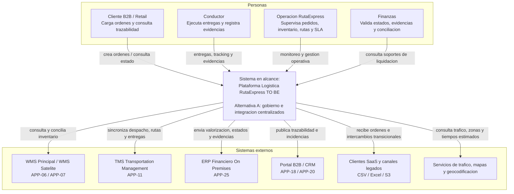
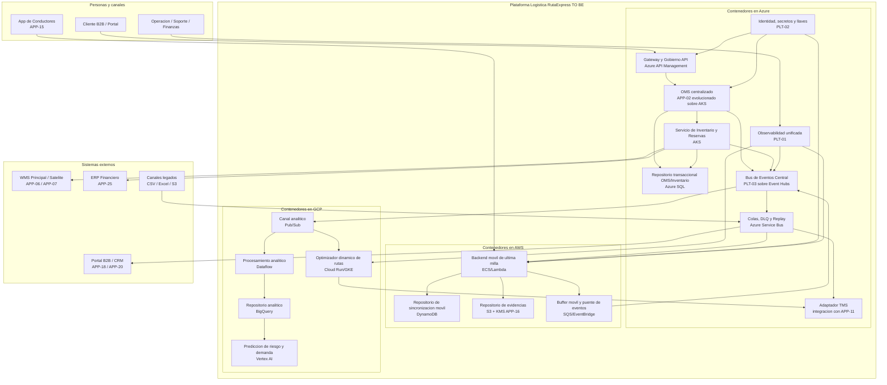
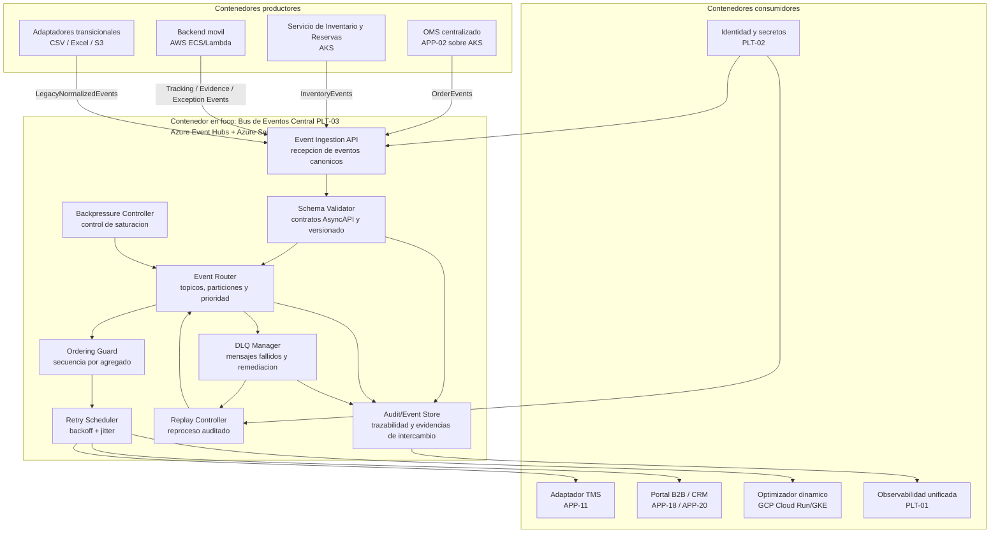

# Alternativa A - Azure como hub central de integracion y gobierno

## Resumen ejecutivo

La Alternativa A usa Azure como centro de gobierno API, OMS, eventos y observabilidad operacional; mantiene AWS como dominio natural de ultima milla, app movil y evidencias; y usa GCP para optimizacion, analitica y modelos predictivos. Esta alternativa conserva la ubicacion tecnologica mas cercana al Hito 1: TMS y capacidades de integracion en Azure, App de Conductores y S3 en AWS, y rutas/analitica en GCP.

## Cobertura del alcance

| Iniciativa | Cobertura principal |
|---|---|
| INI-01 | Orquestador de Pedidos (APP-02) evoluciona a OMS centralizado en Azure AKS; inventario y reservas se integran con WMS Cloud, WMS on premises y ERP mediante APIs/eventos. |
| INI-02 | Azure API Management gobierna APIs; Azure Event Hubs y Azure Service Bus implementan Bus de Eventos Central (PLT-03), DLQ, replay, backpressure y contratos. |
| INI-03 | AWS ECS/Lambda/DynamoDB soporta backend movil offline; S3 conserva evidencias; eventos se conectan al hub Azure y sincronizan TMS, portal y CRM. |

## Distribucion por nube

| Nube | Servicios propuestos | Uso |
|---|---|---|
| Azure | Azure API Management, AKS, Azure SQL, Event Hubs, Service Bus, Key Vault, Monitor, Application Insights, Entra ID | OMS, APIs, gobierno, eventos, colas, trazabilidad y seguridad central. |
| AWS | ECS Fargate, Lambda, DynamoDB, S3, SQS, EventBridge, KMS, CloudWatch | App de Conductores (APP-15), backend movil, evidencias (APP-16), colas locales y sincronizacion offline. |
| GCP | Cloud Run/GKE Autopilot, Pub/Sub, Dataflow, BigQuery, Vertex AI, Cloud Monitoring | Optimizacion dinamica, analitica, prediccion de excepciones y tableros de negocio. |
| On premises | WMS Principal (APP-06), WMS Satelite (APP-07), ERP Financiero (APP-25), conectividad privada | Transicion segura, conciliacion y liquidacion. |

## Diagramas C4 separados

- Nivel 1 Contexto: `diagramas_c4/alternativa_A_n1_contexto.md`.
- Nivel 2 Contenedores: `diagramas_c4/alternativa_A_n2_contenedores.md`.
- Nivel 3 Componentes: `diagramas_c4/alternativa_A_n3_componentes.md`.

Cada archivo separado incluye una seccion de lectura para comite con: significado de cajas, significado de flechas, flujo principal y mensaje clave. En este documento se mantienen los diagramas embebidos como resumen visual.

## Guia de lectura para comite

| Nivel | Que debe observar el comite | Como interpretar cajas y flechas |
|---|---|---|
| Contexto | Alcance del cambio y sistemas externos impactados. | La caja central es la Plataforma Logistica RutaExpress TO BE; las cajas externas son personas o sistemas que interactuan con ella; las flechas son relaciones funcionales. |
| Contenedores | Distribucion de responsabilidades entre Azure, AWS, GCP y sistemas existentes. | Cada caja es una aplicacion, servicio ejecutable, cola, bus o repositorio de datos; las flechas muestran comunicacion principal, no necesariamente llamadas sincronas. |
| Componentes | Funcionamiento interno del contenedor critico PLT-03 en Azure. | Solo las cajas dentro de "Contenedor en foco" son componentes internos; productores y consumidores son contenedores externos que envian o reciben eventos. |

Lectura ejecutiva: la Alternativa A centraliza gobierno, APIs y eventos en Azure, conserva AWS para ultima milla/evidencias y usa GCP para optimizacion/analitica.

## C4 Nivel 1 - Contexto

## C4 Nivel 2 - Contenedores

## C4 Nivel 3 - Componentes principales

## Lineamientos y patrones aplicados

- Arquitectura: ARQ-01 a ARQ-10, especialmente APP-02 evolucionando a OMS sin crear nuevo ID.
- Integracion: APIs versionadas, eventos canonicos, correlation ID, idempotencia, secuencia por agregado y adaptadores transicionales.
- Seguridad: identidad federada, minimo privilegio, cifrado en transito/reposo, WAF, Key Vault, KMS y secretos administrados.
- Observabilidad: OpenTelemetry, logs estructurados, tableros de ordenes, inventario, colas, tracking, evidencias, excepciones y SLA.
- Escalabilidad: particiones por agregado, colas durables, backpressure, circuit breaker y pruebas de carga para 180,000 ordenes en campana.
- Patrones: Microservicios, DDD, EDA, Event Sourcing selectivo para trazabilidad operacional, Outbox/Inbox, Saga, CQRS selectivo, DLQ, replay controlado, store-and-forward y retry con backoff + jitter.

## Evaluacion

- Ventajas: mayor alineamiento con Hito 1, menor cambio sobre APP-15/APP-16, gobierno centralizado, buen soporte para APIs mock de MVP y menor riesgo de migracion.
- Desventajas: Azure queda como punto central de gobierno, por lo que requiere buen diseno de resiliencia y conectividad multinube.
- Nivel de costo relativo: intermedio, al priorizar servicios administrados existentes y evitar plataformas premium innecesarias para el MVP.
