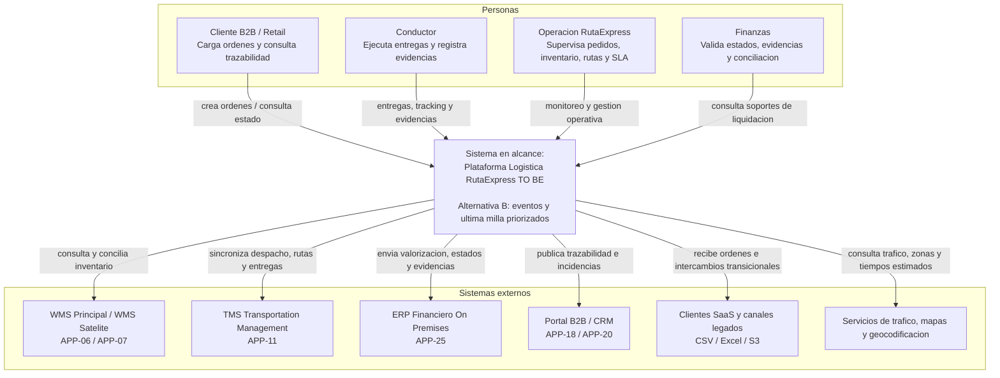
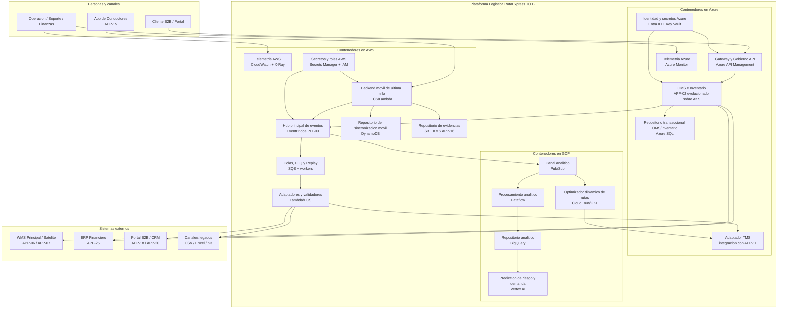
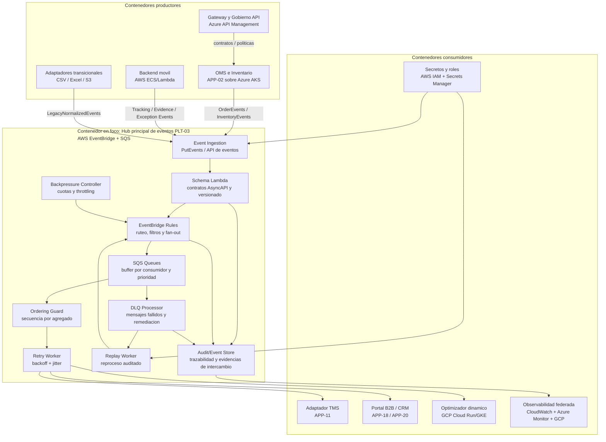

# Alternativa B - AWS como hub principal de eventos y backend movil

## Resumen ejecutivo

La Alternativa B usa AWS como centro principal de eventos, backend movil y resiliencia operativa, mientras Azure conserva APIs, TMS y OMS, y GCP mantiene optimizacion/analitica. Es viable, pero desplaza el hub de mensajeria hacia AWS, aumentando la distancia con el gobierno API y OMS que permanecen en Azure.

## Cobertura del alcance

| Iniciativa | Cobertura principal |
|---|---|
| INI-01 | OMS centralizado en Azure AKS, integrado con WMS/ERP mediante APIs y eventos enviados al hub AWS. |
| INI-02 | AWS EventBridge, SQS y SNS implementan el hub de eventos, DLQ y replay; Azure API Management gobierna APIs. |
| INI-03 | AWS concentra App de Conductores, sincronizacion offline, DynamoDB, S3, SQS y eventos moviles. |

## Distribucion por nube

| Nube | Servicios propuestos | Uso |
|---|---|---|
| AWS | EventBridge, SQS, SNS, Lambda, ECS Fargate, DynamoDB, S3, KMS, CloudWatch, X-Ray, Secrets Manager | Hub de eventos, backend movil, evidencias, colas, DLQ y observabilidad AWS. |
| Azure | API Management, AKS, Azure SQL, Entra ID, Key Vault, Monitor | APIs, OMS, TMS, identidad federada y servicios de orden/inventario. |
| GCP | Cloud Run/GKE, Pub/Sub, Dataflow, BigQuery, Vertex AI | Optimizacion, analitica y modelos predictivos. |
| On premises | WMS/ERP con conectividad privada | Transicion de inventario y conciliacion financiera. |

## Diagramas C4 separados

- Nivel 1 Contexto: `diagramas_c4/alternativa_B_n1_contexto.md`.
- Nivel 2 Contenedores: `diagramas_c4/alternativa_B_n2_contenedores.md`.
- Nivel 3 Componentes: `diagramas_c4/alternativa_B_n3_componentes.md`.

Cada archivo separado incluye una seccion de lectura para comite con: significado de cajas, significado de flechas, flujo principal y mensaje clave. En este documento se mantienen los diagramas embebidos como resumen visual.

## Guia de lectura para comite

| Nivel | Que debe observar el comite | Como interpretar cajas y flechas |
|---|---|---|
| Contexto | Alcance del cambio y sistemas externos impactados. | La caja central es la Plataforma Logistica RutaExpress TO BE; las cajas externas son personas o sistemas que interactuan con ella; las flechas son relaciones funcionales. |
| Contenedores | Distribucion de responsabilidades entre Azure, AWS, GCP y sistemas existentes. | Cada caja es una aplicacion, servicio ejecutable, cola, bus o repositorio de datos; las flechas muestran comunicacion principal, no necesariamente llamadas sincronas. |
| Componentes | Funcionamiento interno del contenedor critico PLT-03 en AWS. | Solo las cajas dentro de "Contenedor en foco" son componentes internos; productores y consumidores son contenedores externos que envian o reciben eventos. |

Lectura ejecutiva: la Alternativa B mueve el centro de eventos y resiliencia a AWS, manteniendo Azure para APIs/OMS/TMS y GCP para optimizacion/analitica.

## C4 Nivel 1 - Contexto

## C4 Nivel 2 - Contenedores

## C4 Nivel 3 - Componentes principales

## Lineamientos y patrones aplicados

- Arquitectura: separacion por dominios, APP-02 evoluciona a OMS y APP-15/APP-16 permanecen en AWS.
- Integracion: EventBridge/SQS como hub, Azure API Management para APIs y puentes seguros entre Azure/AWS/GCP.
- Seguridad: federacion, WAF, IAM por nube, Secrets Manager/Key Vault y cifrado con KMS.
- Observabilidad: OpenTelemetry con consolidacion federada desde CloudWatch, Azure Monitor y GCP Monitoring.
- Patrones: Microservicios, DDD, EDA, Event Sourcing selectivo para auditoria operacional, Outbox/Inbox, Saga, DLQ, replay, backpressure, store-and-forward y retry con jitter.

## Evaluacion

- Ventajas: fortalece el dominio movil/evidencias ya ubicado en AWS y simplifica colas de ultima milla.
- Desventajas: el hub principal queda separado del OMS y API governance, aumentando puentes, latencia operativa, gobierno cruzado y riesgo de doble plano de control.
- Nivel de costo relativo: intermedio-alto por mayor cantidad de bridges, duplicidad parcial de observabilidad y gobierno entre Azure y AWS.
