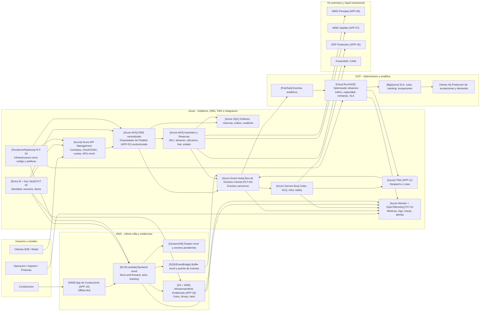

# Diagrama de arquitectura cloud transversal

## Vista representada

Este diagrama representa la arquitectura cloud transversal de la Alternativa A recomendada: Azure como hub central de integracion y gobierno, AWS para ultima milla/evidencias y GCP para optimizacion/analitica.

No reemplaza los diagramas C4. Los diagramas C4 corregidos segun la documentacion oficial estan separados por alternativa y nivel en la tabla siguiente.

## Diagramas C4 por alternativa

| Alternativa | Nivel 1 Contexto | Nivel 2 Contenedores | Nivel 3 Componentes |
|---|---|---|---|
| Alternativa A | `diagramas_c4/alternativa_A_n1_contexto.md` | `diagramas_c4/alternativa_A_n2_contenedores.md` | `diagramas_c4/alternativa_A_n3_componentes.md` |
| Alternativa B | `diagramas_c4/alternativa_B_n1_contexto.md` | `diagramas_c4/alternativa_B_n2_contenedores.md` | `diagramas_c4/alternativa_B_n3_componentes.md` |

## Diagrama cloud transversal

## Como leer este diagrama para el comite

Este diagrama no es C4; es una vista cloud transversal de la Alternativa A recomendada. Sirve para explicar **donde vive cada capacidad tecnologica** y como se conectan los dominios Azure, AWS, GCP y on premises.

| Elemento | Como interpretarlo |
|---|---|
| Subgrafo Azure | Centro de gobierno, OMS, TMS, APIs, eventos, colas, identidad, observabilidad e IaC. |
| Subgrafo AWS | Dominio de ultima milla: App de Conductores, backend movil, DynamoDB, S3, SQS/EventBridge y evidencias. |
| Subgrafo GCP | Dominio de optimizacion, analitica, BigQuery y prediccion. |
| Subgrafo On premises y SaaS | Sistemas existentes que se mantienen durante la transicion: WMS, ERP, Portal/CRM. |
| Flechas | Flujo principal de informacion entre capacidades: APIs, eventos, sincronizacion, persistencia o integraciones. |

Flujo para explicar:

1. Clientes y operadores entran por Azure API Management y observabilidad.
2. OMS centralizado coordina ordenes e inventario; Inventario se integra con WMS y ERP.
3. OMS e Inventario publican eventos al Bus de Eventos Central en Azure.
4. Service Bus maneja colas, DLQ, reintentos y replay para desacoplar consumidores.
5. La App de Conductores opera en AWS con backend movil, DynamoDB y evidencias en S3.
6. El buffer movil AWS envia tracking, evidencias y excepciones hacia el bus central.
7. GCP recibe eventos para optimizacion de rutas, analitica y prediccion.
8. Observabilidad, identidad e IaC atraviesan todos los dominios para mantener trazabilidad, seguridad y gobierno.

Mensaje clave para el comite: **la vista cloud muestra la topologia recomendada; los diagramas C4 explican el alcance, los contenedores y el detalle interno del componente de eventos**.

## Notas de implementacion

- El Bus de Eventos Central (PLT-03) queda en Azure con puentes controlados hacia AWS y GCP.
- La App de Conductores (APP-15) no cambia de dominio tecnologico; se fortalece con backend movil, DynamoDB, SQS y store-and-forward.
- El Almacenamiento Evidencias (S3) (APP-16) se mantiene y se gobierna con hash, KMS, politicas de retencion y eventos de auditoria.
- OMS centralizado es la evolucion de APP-02; no se crea un nuevo ID de aplicacion.
- Los sistemas on premises se integran mediante APIs/eventos, circuit breaker, backpressure y adaptadores transicionales.
