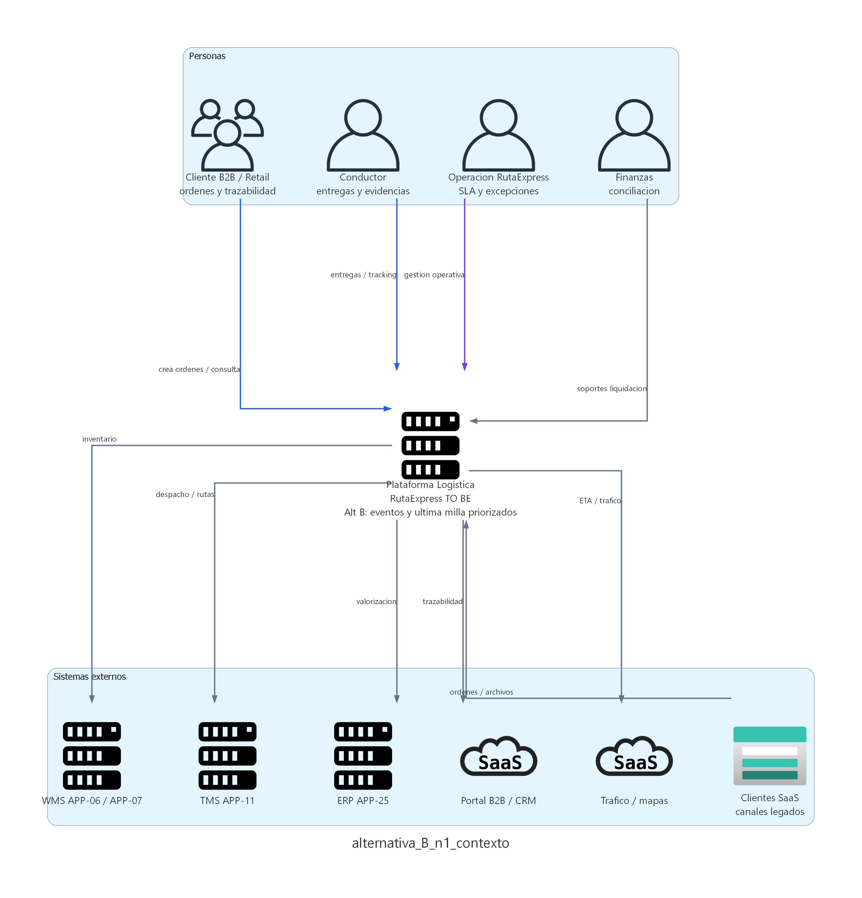
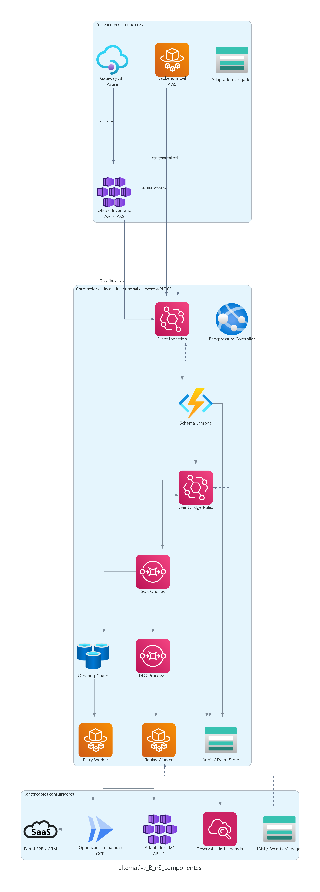

# Modelo B - AWS como hub principal de eventos y ultima milla

## Tesis del modelo

El Modelo B propone que AWS sea el centro principal de eventos, colas, ultima milla y resiliencia operativa. En este modelo, APP-02 tambien evoluciona a OMS centralizado, pero permanece en Azure junto con Azure API Management. La diferencia principal es que los eventos corporativos se publican hacia AWS, donde PLT-03 se implementa con EventBridge, SQS, workers, DLQ y replay.

AWS concentra de forma natural el backend movil, la operacion offline-first, las evidencias y el hub de eventos. Azure conserva el gobierno API, OMS, TMS/adaptadores e identidad corporativa. GCP conserva optimizacion dinamica de rutas, analitica y modelos predictivos.

Mensaje ejecutivo:

> El Modelo B fortalece AWS como centro de ultima milla y eventos, pero exige mayor disciplina de gobierno cruzado porque OMS y API governance permanecen en Azure mientras el hub de eventos se desplaza a AWS.

## Alcance cubierto

| Iniciativa | Como la cubre el Modelo B |
|---|---|
| INI-01 Gestion unificada de ordenes e inventario | APP-02 evoluciona a OMS en Azure AKS; publica eventos de orden e inventario hacia AWS EventBridge/SQS. |
| INI-02 Integracion API-first y event-driven | Azure API Management gobierna APIs; AWS EventBridge/SQS implementa PLT-03, eventos, colas, DLQ, replay y backpressure. |
| INI-03 Modernizacion de ultima milla | AWS concentra backend movil, store-and-forward, DynamoDB logico, S3/KMS y eventos moviles. |
| INI-04 Optimizacion dinamica de rutas | GCP consume eventos desde AWS para optimizacion dinamica, analitica y prediccion. |
| INI-05 Observabilidad, seguridad y gobierno multinube | Observabilidad federada entre CloudWatch/X-Ray, Azure Monitor y GCP; secretos distribuidos entre Secrets Manager y Key Vault. |
| INI-06 Conciliacion financiera | Estados de orden, tracking, evidencias y eventos se auditan en AWS y se integran con ERP desde Azure/adapter. |

## Distribucion tecnologica

| Dominio | Rol en el Modelo B | Servicios representativos |
|---|---|---|
| AWS | Hub principal de eventos, colas, ultima milla, backend movil, evidencias y observabilidad AWS. | EventBridge, SQS, Lambda, ECS/Fargate, DynamoDB, S3, KMS, CloudWatch, X-Ray, Secrets Manager. |
| Azure | APIs, OMS, TMS/adaptadores, repositorio transaccional, identidad y gobierno de contratos. | Azure API Management, AKS, Azure SQL, Entra ID, Key Vault, Azure Monitor. |
| GCP | Optimizacion, analitica, modelos predictivos y tableros avanzados. | Cloud Run/GKE, Pub/Sub, Dataflow, BigQuery, Vertex AI. |
| On premises / SaaS | Sistemas transicionales y externos. | WMS APP-06/APP-07, ERP APP-25, Portal/CRM, canales legados. |

## C4 Nivel 1 - Contexto

### Como leer el diagrama

Este nivel responde a la pregunta: **cual es el sistema en alcance y con quienes interactua**.

| Elemento | Interpretacion |
|---|---|
| Personas | Cliente B2B/Retail, conductor, operacion y finanzas. Representan usuarios y areas que consumen o producen informacion logistica. |
| Sistema en alcance | Plataforma Logistica RutaExpress TO BE bajo el enfoque de eventos y ultima milla priorizados. |
| Sistemas externos | WMS, TMS, ERP, Portal/CRM, legados y servicios de mapas/trafico. |
| Flechas | Relaciones funcionales. En este nivel no se muestra aun que AWS sea el hub de eventos; eso se observa en Nivel 2. |

### Flujo explicado

1. El cliente crea ordenes y consulta trazabilidad.
2. El conductor ejecuta entregas y envia tracking, incidencias y evidencias.
3. Operacion supervisa pedidos, inventario, rutas, SLA y excepciones.
4. Finanzas consulta estados, evidencias y soportes de liquidacion.
5. La plataforma intercambia inventario, rutas, valorizacion y trazabilidad con WMS, TMS, ERP y portal/CRM.
6. La diferencia del modelo aparece en la topologia interna: AWS concentra eventos y ultima milla.

### Mensaje para el comite

El alcance funcional del Modelo B es equivalente al del Modelo A, pero su decision estructural cambia el centro tecnologico de resiliencia e integracion de eventos hacia AWS.

## C4 Nivel 2 - Contenedores

### Como leer el diagrama

Este nivel responde a la pregunta: **como se reparte la plataforma en aplicaciones, servicios ejecutables, buses, colas y repositorios de datos cuando AWS es el hub de eventos**.

| Contenedor / grupo | Responsabilidad |
|---|---|
| Azure API Management | Expone APIs, contratos, seguridad, cuotas, rate limiting y APIs mock. |
| OMS e Inventario APP-02 | Gestiona ordenes, validacion, deduplicacion, reservas, liberaciones y estado operacional en Azure. |
| Azure SQL | Repositorio transaccional de OMS e inventario. |
| AWS EventBridge PLT-03 | Hub principal de eventos, ruteo, fan-out, reglas y distribucion por dominio. |
| AWS SQS + workers | Colas, consumidores, DLQ, retry, replay y backpressure. |
| Backend movil AWS | Soporta app de conductores, store-and-forward, tracking, acks y excepciones. |
| Evidencias AWS S3/KMS | Conserva fotos, firmas, hashes y documentos de entrega con cifrado y auditoria. |
| Observabilidad federada | Consolida CloudWatch/X-Ray, Azure Monitor y GCP Monitoring con correlation ID. |
| GCP optimizacion/analitica | Consume eventos desde AWS para rutas, analitica, BigQuery y prediccion. |

### Flujo principal del Modelo B

1. El cliente ingresa por Azure API Management.
2. API Management valida contrato, seguridad, cuotas y politicas antes de llegar al OMS en Azure.
3. El OMS valida la orden, aplica idempotencia, deduplicacion, reservas y estado operacional.
4. El OMS publica OrderEvents e InventoryEvents hacia AWS EventBridge.
5. EventBridge aplica reglas, filtros, fan-out y ruteo por dominio o consumidor.
6. SQS y workers gestionan colas, prioridades, DLQ, reintentos y replay.
7. El backend movil en AWS publica tracking, evidencias y excepciones de forma nativa al hub AWS.
8. Adaptadores consumen eventos para TMS, portal/CRM, legados y procesos de soporte.
9. GCP consume eventos desde AWS para optimizacion y analitica.
10. Observabilidad se consolida entre AWS, Azure y GCP, manteniendo correlation ID extremo a extremo.

### Decision arquitectonica representada

El hub operativo de eventos queda en AWS. Esto acerca eventos, colas y ultima milla, pero separa el hub de eventos del OMS y del gobierno API, que permanecen en Azure.

## C4 Nivel 3 - Componentes del PLT-03 en AWS

### Como leer el diagrama

Este nivel responde a la pregunta: **como funciona internamente el contenedor critico PLT-03 cuando AWS es el hub principal de eventos**.

| Componente | Objetivo |
|---|---|
| Event Ingestion | Recibe eventos desde OMS/Inventario en Azure, backend movil AWS y adaptadores legados. |
| Schema Lambda | Valida contratos, versiones, estructura y compatibilidad de eventos. |
| EventBridge Rules | Enruta eventos por dominio, consumidor, SLA, criticidad y filtros. |
| SQS Queues | Mantiene buffers por consumidor, prioridad y tipo de evento. |
| Ordering Guard | Controla secuencia por agregado para ordenes, inventario y tracking. |
| Retry Worker | Ejecuta reintentos con backoff y jitter. |
| DLQ Processor | Gestiona mensajes fallidos, causa de error, responsable y remediacion. |
| Replay Worker | Reprocesa eventos con aprobacion, auditoria y proteccion de idempotencia. |
| Backpressure Controller | Aplica cuotas, throttling y priorizacion cuando consumidores se degradan. |
| Audit / Event Store | Conserva evidencia de intercambio, eventos relevantes y trazabilidad. |

### Flujo interno del PLT-03

1. Azure API Management gobierna contratos antes de que OMS publique eventos.
2. OMS/Inventario envia eventos de orden e inventario hacia AWS.
3. Backend movil publica eventos de tracking, evidencia y excepcion de forma nativa.
4. Event Ingestion recibe los eventos y exige correlation ID.
5. Schema Lambda valida contrato y version.
6. EventBridge Rules enruta eventos por dominio, prioridad y consumidor.
7. SQS Queues desacopla consumidores y permite absorcion de picos.
8. Retry Worker y DLQ Processor gestionan errores y mensajes fallidos.
9. Replay Worker reprocesa eventos autorizados.
10. Audit/Event Store y observabilidad federada permiten trazabilidad end-to-end.

## Lineamientos y patrones aplicados

| Lineamiento | Aplicacion en el Modelo B |
|---|---|
| API-first | Azure API Management conserva gobierno de APIs, contratos, versionado, cuotas y mocks. |
| Event-driven | AWS EventBridge/SQS concentra eventos canonicos, fan-out, colas, DLQ, replay y retry. |
| Seguridad | IAM/Secrets Manager/KMS en AWS, Entra ID/Key Vault en Azure y federacion entre nubes. |
| Observabilidad | OpenTelemetry y correlation ID con consolidacion entre CloudWatch/X-Ray, Azure Monitor y GCP. |
| Resiliencia | SQS, DLQ, retry, replay, outbox/inbox, store-and-forward movil y backpressure. |
| Gobierno multinube | Mayor gobierno cruzado Azure-AWS porque API/OMS y eventos viven en planos distintos. |
| FinOps | Requiere control especial de transferencia intercloud, duplicidad parcial de observabilidad y costos de puentes. |

## Fortalezas

| Fortaleza | Impacto |
|---|---|
| Ultima milla muy alineada con AWS | Backend movil, evidencias, colas y eventos moviles quedan en el mismo dominio. |
| Buen soporte de eventos y fan-out | EventBridge/SQS facilita ruteo por consumidor y absorcion de picos. |
| Resiliencia fuerte en eventos moviles | Tracking, excepciones y evidencias entran de forma nativa al hub AWS. |
| Escalabilidad operativa | SQS/workers permiten desacoplar consumidores y manejar campañas de alta demanda. |
| Alternativa viable si AWS es plataforma estrategica | Puede ser conveniente si la organizacion decide concentrar eventos corporativos en AWS. |

## Riesgos y mitigaciones

| Riesgo | Mitigacion |
|---|---|
| OMS y API governance quedan separados del hub de eventos. | Bridge Azure-AWS con contratos versionados, outbox, idempotencia, circuit breaker y monitoreo especifico. |
| Mayor complejidad de gobierno cruzado. | RACI por dominio, politicas comunes, IaC, gestion federada de identidad y secretos. |
| Observabilidad mas distribuida. | OpenTelemetry obligatorio, correlation ID end-to-end y tableros federados. |
| Riesgo de doble plano de control API/eventos. | Gobierno de contratos unificado y decision formal sobre ownership de eventos. |
| Mayor costo relativo por transferencias y puentes. | FinOps por dominio, medicion de trafico intercloud y limites de consumo por SLA. |

## Decision solicitada al comite

Se solicita validar si el Modelo B puede mantenerse como alternativa viable bajo estas condiciones:

- AWS se acepta como hub principal de eventos PLT-03.
- Azure mantiene API Management, OMS, TMS y repositorio transaccional.
- Se aprueba un puente permanente Azure-AWS como componente critico de arquitectura.
- Se exige observabilidad federada con correlation ID y monitoreo de latencia intercloud.
- Se define ownership claro entre gobierno API en Azure y gobierno de eventos en AWS.

## Cierre ejecutivo

El Modelo B es tecnicamente viable y fortalece la ultima milla, pero introduce mayor complejidad de integracion, observabilidad, gobierno y costos intercloud. Es una buena opcion si AWS debe convertirse en el centro estrategico de eventos; de lo contrario, aumenta el riesgo para el primer TO BE/MVP.
