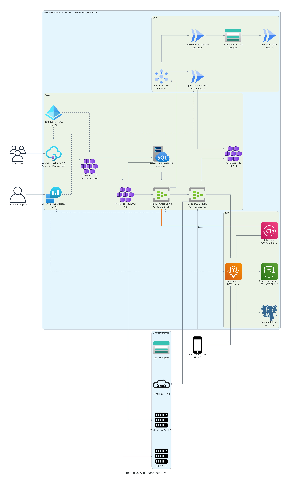

# Comparativo, ADRs y recomendacion para Comite de Arquitectura

## Objetivo del comparativo

Este documento compara el Modelo A y el Modelo B despues de haberlos presentado como arquitecturas completas e independientes. La comparacion no busca demostrar que una alternativa sea inviable, sino identificar cual es mas conveniente para el primer TO BE/MVP de RutaExpress.

## Resumen de los modelos

| Aspecto | Modelo A | Modelo B |
|---|---|---|
| Tesis | Azure como hub central de integracion y gobierno. | AWS como hub principal de eventos y ultima milla. |
| Centro de eventos PLT-03 | Azure Event Hubs + Azure Service Bus. | AWS EventBridge + SQS/workers. |
| OMS APP-02 | Azure AKS, cercano a API Management y PLT-03. | Azure AKS, pero publica eventos hacia AWS. |
| Gobierno API | Azure API Management. | Azure API Management. |
| Ultima milla | AWS con backend movil, DynamoDB logico, S3/KMS y buffer hacia Azure. | AWS con backend movil, DynamoDB logico, S3/KMS y eventos nativos al hub AWS. |
| Optimizacion y analitica | GCP consume eventos desde Azure. | GCP consume eventos desde AWS. |
| Observabilidad | Mas centralizada desde Azure con federacion hacia AWS/GCP. | Mas federada entre AWS, Azure y GCP. |
| Complejidad dominante | Resiliencia del hub Azure y puentes controlados a AWS/GCP. | Gobierno cruzado Azure-AWS y puente permanente entre OMS/API y eventos. |

## Comparativo visual

### Modelo A - Contenedores C4

Lectura ejecutiva:

- OMS, API governance, bus de eventos, colas, observabilidad e identidad se concentran en Azure.
- AWS queda enfocado en ultima milla y evidencias.
- GCP queda enfocado en optimizacion y analitica.
- Los puentes existen, pero no dividen el plano principal de gobierno.

### Modelo B - Contenedores C4

Lectura ejecutiva:

- AWS concentra eventos, colas, backend movil y evidencias.
- Azure conserva OMS y gobierno API.
- El puente Azure-AWS pasa a ser estructural, no accesorio.
- Observabilidad, seguridad y FinOps requieren mayor coordinacion entre planos de control.

## Evaluacion por criterios

Escala: 1 = bajo cumplimiento, 5 = alto cumplimiento.

| Criterio | Modelo A: Azure hub central | Modelo B: AWS hub principal | Lectura para comite |
|---|---:|---:|---|
| Alineamiento con Hito 1 | 5 | 3 | A mantiene OMS/API/TMS/eventos en el eje Azure y conserva AWS/GCP como dominios especializados. |
| Cobertura INI-01 | 5 | 4 | Ambas cubren OMS e inventario, pero A reduce puentes entre OMS, API governance y bus. |
| Cobertura INI-02 | 5 | 4 | A concentra contratos, eventos, DLQ, replay y observabilidad operacional en un mismo plano. |
| Cobertura INI-03 | 5 | 5 | Ambas mantienen AWS para app movil, store-and-forward y evidencias. |
| Cobertura INI-04 | 5 | 5 | Ambas integran GCP para optimizacion dinamica y analitica. |
| Cobertura INI-05 | 5 | 4 | A facilita trazabilidad y seguridad desde un plano central; B requiere mayor federacion. |
| Cobertura INI-06 | 5 | 4 | A simplifica la trazabilidad OMS-eventos-evidencias-ERP; B exige mas control intercloud. |
| Complejidad de integracion | 4 | 3 | B requiere puente permanente Azure OMS/API hacia AWS hub y doble gobierno API/eventos. |
| Seguridad | 5 | 4 | A centraliza mas controles; B reparte secretos, identidad y politicas entre nubes. |
| Observabilidad | 5 | 4 | A facilita trazas end-to-end desde OMS/eventos; B depende mas de federacion. |
| Resiliencia | 5 | 5 | Ambas soportan DLQ, retry, backpressure, outbox/inbox y store-and-forward. |
| Impacto en aplicaciones existentes | 5 | 4 | A evoluciona APP-02 y fortalece APP-15/APP-16 sin mover el centro operativo de eventos hacia AWS. |
| Riesgo de migracion | 4 | 3 | A minimiza cambios de topologia; B cambia el centro operativo de eventos. |
| Facilidad de MVP | 5 | 4 | A permite mocks, contratos, OMS y eventos en el mismo eje de gobierno. |
| Gobierno FinOps | 4 | 3 | A reduce dispersion de costos y transferencia intercloud; B exige mas control de costos cruzados. |

## Puntaje ejecutivo

| Modelo | Puntaje | Resultado |
|---|---:|---|
| Modelo A | 72 / 75 | Recomendado para primer TO BE/MVP |
| Modelo B | 59 / 75 | Viable, no recomendado como primer modelo |

Nota: la escala se amplia respecto del comparativo base para incluir explicitamente INI-04, INI-05 e INI-06, manteniendo el mismo criterio de evaluacion.

## Diferencias clave para decision

| Pregunta de decision | Modelo A | Modelo B |
|---|---|---|
| Donde vive el centro operativo de eventos? | Azure. | AWS. |
| Donde vive el OMS? | Azure, junto al gobierno API y bus. | Azure, separado del hub de eventos AWS. |
| Que puente es mas critico? | AWS/GCP hacia Azure. | Azure hacia AWS. |
| Que modelo simplifica trazabilidad inicial? | A, porque OMS y eventos quedan juntos. | B requiere correlacion mas federada. |
| Que modelo favorece ultima milla? | A la soporta bien con AWS conectado al hub Azure. | B la favorece mas al poner eventos y mobile en AWS. |
| Que modelo reduce riesgo MVP? | A. | B tiene mas dependencias intercloud. |
| Que modelo conviene si AWS es estrategia corporativa dominante? | Puede quedar como segundo paso. | B podria ser preferible. |

## ADRs clave que sustentan la recomendacion

| ADR | Decision | Relacion con la recomendacion |
|---|---|---|
| ADR-001 Hub central de eventos | Usar PLT-03 como hub gobernado de eventos. | En el Modelo A se implementa en Azure, cercano a OMS y API governance. |
| ADR-002 Estrategia OMS | APP-02 evoluciona a OMS centralizado. | Evita crear nueva aplicacion y mantiene trazabilidad con Hito 1. |
| ADR-003 Idempotencia y deduplicacion | Idempotency key, hash logistico y ventana temporal en OMS. | Critico para evitar duplicidad de pedidos y reservas. |
| ADR-004 Vista canonica de inventario | Servicio de Inventario y Reservas por SKU, almacen, ubicacion, lote y estado. | Habilita conciliacion WMS central/local y reservas confiables. |
| ADR-005 Saga orden-inventario-ERP | Sagas con eventos y compensaciones. | Evita transacciones distribuidas fragiles entre OMS, WMS, TMS y ERP. |
| ADR-006 Store-and-forward movil | Outbox local cifrado, acks y reintentos. | Mantiene continuidad de ultima milla en ambos modelos. |
| ADR-007 Evidencias con hash | Evidencias cifradas, hash y manifest auditado. | Reduce perdida/corrupcion de evidencias y soporta conciliacion. |
| ADR-008 DLQ y replay controlado | DLQ con payload/error/responsable y replay aprobado por rol. | Obligatorio para resiliencia event-driven. |
| ADR-009 Backpressure y circuit breaker | Proteccion ante degradacion WMS/ERP/consumidores. | Reduce colapso en campañas y eventos masivos. |
| ADR-010 Observabilidad unificada | OpenTelemetry y correlation ID obligatorio. | Permite trazabilidad de orden a entrega y liquidacion. |
| ADR-011 Seguridad federada y secretos | OAuth/OIDC, minimo privilegio, Key Vault/KMS/Secrets Manager. | Controla datos sensibles y accesos multinube. |
| ADR-012 Gobierno multinube con IaC | Terraform/pipelines y politicas por nube. | Hace gobernable la arquitectura y sus puentes. |

## Recomendacion

Se recomienda aprobar el **Modelo A - Azure como hub central de integracion y gobierno** como arquitectura base del primer TO BE/MVP.

Justificacion:

- Mantiene juntos OMS, API governance, eventos, colas y observabilidad operacional.
- Reduce el puente critico entre OMS y PLT-03.
- Esta mas alineado con Hito 1 y con la evolucion de APP-02 a OMS.
- Conserva AWS donde aporta mayor valor: app movil, store-and-forward y evidencias.
- Conserva GCP donde aporta mayor valor: optimizacion, analitica y prediccion.
- Facilita un MVP con APIs mock, contratos, eventos canonicos y trazabilidad desde el inicio.
- Reduce la probabilidad de duplicar gobierno entre API Management y event governance.

## Condiciones de aprobacion recomendadas

Para aprobar el Modelo A, se recomienda que el comite deje estas condiciones:

| Condicion | Motivo |
|---|---|
| PLT-03 debe tener DLQ, replay, retry, priorizacion y backpressure desde MVP. | Evitar perdida de eventos y reprocesos manuales. |
| APP-02 debe evolucionar formalmente a OMS, no quedar solo como middleware. | Asegurar ownership del ciclo de vida de ordenes. |
| Todo evento debe tener correlation ID. | Trazabilidad end-to-end y soporte operativo. |
| OMS debe implementar idempotencia y deduplicacion. | Reducir duplicidad de pedidos, reservas y entregas. |
| App movil debe operar store-and-forward cifrado. | Evitar perdida de tracking y evidencias offline. |
| Evidencias deben conservar hash, cifrado y manifest de auditoria. | Soportar conciliacion financiera y no repudio operativo. |
| Los puentes AWS/GCP deben tener monitoreo y politicas FinOps. | Controlar latencia, costo y fallas multinube. |
| WMS/ERP deben protegerse con circuit breaker y backpressure. | Evitar colapso ante degradacion o campañas de alto volumen. |

## Cuando elegir el Modelo B

El Modelo B podria ser elegido si se cumple alguna de estas condiciones estrategicas:

- La organizacion decide que AWS sera el estandar corporativo para eventos.
- El mayor dolor operativo esta concentrado en ultima milla y eventos moviles, por encima de OMS/API governance.
- Existe capacidad madura para operar observabilidad, seguridad y FinOps federados.
- El puente Azure-AWS ya existe, esta probado y tiene gobierno formal.
- Se acepta mayor complejidad inicial a cambio de fortalecer la plataforma AWS de eventos.

## Decision solicitada al comite

Se propone solicitar al comite una decision explicita sobre estos puntos:

| Punto | Decision propuesta |
|---|---|
| Modelo base TO BE/MVP | Aprobar Modelo A. |
| Modelo alternativo | Mantener Modelo B como alternativa viable condicionada a estrategia AWS. |
| OMS | Confirmar evolucion de APP-02 a OMS centralizado. |
| PLT-03 | Confirmar hub de eventos central en Azure para el MVP. |
| Ultima milla | Confirmar AWS para backend movil, store-and-forward y evidencias. |
| Optimizacion | Confirmar GCP para rutas dinamicas, analitica y prediccion. |
| Controles minimos | Aprobar idempotencia, DLQ, replay, backpressure, observabilidad, seguridad federada e IaC desde el inicio. |

## Cierre para presentacion

El mensaje final recomendado es:

> "Ambos modelos cubren funcionalmente las iniciativas, pero el Modelo A reduce el riesgo del primer TO BE porque mantiene en el mismo eje el OMS, el gobierno API, el hub de eventos, colas y observabilidad. El Modelo B es viable, especialmente si AWS se vuelve la plataforma estrategica de eventos, pero para el MVP introduce mas gobierno cruzado y dependencia intercloud."
