# Diagrama de Arquitectura - Core Bancario Nativo de Nube

## Proveedor: AWS | Patrón: Microservicios + Event-Driven

```mermaid
graph TB
    subgraph Clientes["Canales de Acceso"]
        APP["📱 App Móvil"]
        WEB["🌐 Web Browser"]
    end

    subgraph Frontend["Frontend - AWS Amplify"]
        AMPLIFY["Amplify Hosting\n(App + Web)"]
        LOCATION["Location Service\n(Geolocalización)"]
    end

    subgraph CDN["Entrega de Contenidos"]
        CF["CloudFront CDN\n(Estáticos + Reportes)"]
        R53["Route 53\n(DNS)"]
    end

    subgraph Seguridad_Perimetral["Seguridad Perimetral"]
        WAF["WAF\n(Rate Limiting + Reglas)"]
        COGNITO["Cognito\n(Auth + OTP + JWT)"]
    end

    subgraph API_Layer["Capa API"]
        APIGW["API Gateway\n(v1 - REST APIs)"]
    end

    subgraph Microservicios["Microservicios Core Bancario - ECS Fargate"]
        MS1["MS-001\nClientes / KYC"]
        MS2["MS-002\nCuentas"]
        MS3["MS-003\nTransacciones"]
        MS4["MS-004\nTransferencias"]
        MS5["MS-005\nCréditos"]
        MS6["MS-006\nTarjetas"]
        MS7["MS-007\nPagos\n(Lambda)"]
        MS8["MS-008\nInversiones\n(Lambda)"]
        MS9["MS-009\nNotificaciones\n(Lambda)"]
        MS10["MS-010\nReportes\n(Lambda + Fargate)"]
    end

    subgraph Orquestacion["Orquestación y Mensajería"]
        SF["Step Functions\n(Créditos + Transferencias\nInterbancarias)"]
        EB["EventBridge\n(Bus de Eventos)"]
        EBS["EventBridge Scheduler\n(Programados + Batch)"]
        SQS["SQS\n(Colas Asíncronas)"]
        SNS["SNS\n(Notificaciones\nEmail + SMS + Push)"]
    end

    subgraph Bases_Datos["Bases de Datos"]
        AURORA_W["Aurora PostgreSQL\n(Escritura)\nCluster Principal"]
        AURORA_R["Aurora PostgreSQL\n(Lectura)\nRéplica Lectura"]
        DYNAMO["DynamoDB\n(Notificaciones\nSesiones)"]
        REDIS["ElastiCache Redis\n(Caché Saldos\nEstado Tarjetas)"]
    end

    subgraph Almacenamiento["Almacenamiento"]
        S3["S3\n(Documentos KYC\nCertificados\nReportes PDF/CSV\nComprobantes)"]
    end

    subgraph ML_AI["Machine Learning / IA"]
        SAGEMAKER["SageMaker AI\n(Scoring Crediticio\nDetección Fraude)"]
        TEXTRACT["Textract\n(OCR Documentos KYC)"]
        REKOGNITION["Rekognition\n(Validación Imágenes)"]
        BEDROCK["Bedrock\n(Agente IA Asistente)"]
    end

    subgraph Integraciones["Integraciones Externas"]
        BURO["Buró de Crédito\n(Externo)"]
        INTERBANK["Red Interbancaria\n(CCE / BCRP)"]
        ENTIDADES["Entidades Receptoras\n(SEDAPAL, SUNAT, etc.)"]
        LISTAS["Listas de Sanciones\n(OFAC, ONU)"]
    end

    subgraph Seguridad_Interna["Seguridad Interna"]
        IAM["IAM\n(Roles y Políticas)"]
        KMS["KMS\n(Cifrado PIN\nDatos Sensibles)"]
        SECRETS["Secrets Manager\n(Credenciales BD\nAPI Keys)"]
        PARAM["Parameter Store\n(Configuración)"]
        TRAIL["CloudTrail\n(Auditoría)"]
    end

    subgraph Observabilidad["Observabilidad"]
        CW["CloudWatch\n(Logs + Métricas\n+ Alertas)"]
        XRAY["X-Ray\n(Trazas Distribuidas)"]
        GRAFANA["Grafana\n(Dashboards Operativos)"]
    end

    subgraph Analisis["Análisis y Datos"]
        KINESIS["Kinesis\n(Streaming Eventos)"]
        GLUE["Glue\n(ETL)"]
        REDSHIFT["Redshift\n(Data Warehouse)"]
        ATHENA["Athena\n(Consultas S3)"]
        OPENSEARCH["OpenSearch\n(Búsqueda Transacciones)"]
        LAKE["Lake Formation\n(Data Lake)"]
    end

    subgraph IaC["Infraestructura como Código"]
        CFN["CloudFormation\n(IaC)"]
        ECR["ECR\n(Repositorio Imágenes Docker)"]
    end

    %% Flujo principal
    APP --> CF
    WEB --> CF
    CF --> AMPLIFY
    R53 --> CF
    AMPLIFY --> WAF
    WAF --> APIGW
    APIGW --> COGNITO
    APIGW --> MS1
    APIGW --> MS2
    APIGW --> MS3
    APIGW --> MS4
    APIGW --> MS5
    APIGW --> MS6
    APIGW --> MS7
    APIGW --> MS8
    APIGW --> MS10

    %% Microservicios a BD
    MS1 --> AURORA_W
    MS2 --> AURORA_W
    MS3 --> AURORA_W
    MS4 --> AURORA_W
    MS5 --> AURORA_W
    MS6 --> AURORA_W
    MS7 --> AURORA_W
    MS8 --> AURORA_W
    MS10 --> AURORA_R
    MS9 --> DYNAMO
    MS2 --> REDIS
    MS3 --> REDIS
    MS6 --> REDIS

    %% Eventos y mensajería
    MS1 --> EB
    MS2 --> EB
    MS3 --> EB
    MS4 --> EB
    MS5 --> EB
    MS6 --> EB
    EB --> MS9
    EB --> SQS
    SQS --> MS7
    SQS --> MS4
    EBS --> MS8
    EBS --> MS7
    EBS --> MS10

    %% Orquestación
    MS4 --> SF
    MS5 --> SF
    SF --> INTERBANK
    SF --> BURO

    %% Notificaciones
    MS9 --> SNS

    %% Almacenamiento
    MS1 --> S3
    MS8 --> S3
    MS10 --> S3
    MS7 --> S3
    S3 --> CF

    %% ML / IA
    MS1 --> TEXTRACT
    MS1 --> REKOGNITION
    MS1 --> LISTAS
    MS5 --> SAGEMAKER
    APIGW --> BEDROCK

    %% Integraciones externas
    MS7 --> ENTIDADES

    %% Seguridad
    MS6 --> KMS
    MS1 --> KMS
    AURORA_W --> KMS
    S3 --> KMS
    MS1 --> SECRETS
    MS2 --> SECRETS
    APIGW --> TRAIL
    MS3 --> TRAIL

    %% Observabilidad
    MS1 --> CW
    MS2 --> CW
    MS3 --> CW
    MS4 --> CW
    MS5 --> CW
    APIGW --> XRAY
    MS3 --> XRAY
    CW --> GRAFANA

    %% Análisis
    EB --> KINESIS
    KINESIS --> GLUE
    GLUE --> REDSHIFT
    GLUE --> LAKE
    S3 --> ATHENA
    AURORA_R --> OPENSEARCH

    %% IaC
    ECR --> MS1
    ECR --> MS2
    ECR --> MS3
    ECR --> MS4
    ECR --> MS5
    ECR --> MS6
```

## Descripción de Capas

| Capa | Componentes | Propósito |
|------|-------------|-----------|
| Canales | App Móvil, Web | Puntos de acceso del cliente |
| Frontend | Amplify, CloudFront, Route 53 | Hosting, CDN y DNS |
| Seguridad Perimetral | WAF, Cognito | Protección y autenticación |
| API | API Gateway | Enrutamiento y control de acceso |
| Microservicios | MS-001 al MS-010 (Fargate + Lambda) | Lógica de negocio |
| Mensajería | EventBridge, SQS, SNS, Step Functions | Integración asíncrona y orquestación |
| Datos | Aurora PostgreSQL, DynamoDB, Redis | Persistencia y caché |
| Almacenamiento | S3 | Documentos, reportes, certificados |
| ML/IA | SageMaker, Textract, Rekognition, Bedrock | Scoring, KYC, asistente IA |
| Seguridad Interna | IAM, KMS, Secrets Manager, CloudTrail | Cifrado, secretos y auditoría |
| Observabilidad | CloudWatch, X-Ray, Grafana | Monitoreo y trazabilidad |
| Análisis | Kinesis, Glue, Redshift, Athena | Datos analíticos y reportes BI |
| IaC | CloudFormation, ECR | Infraestructura como código |
